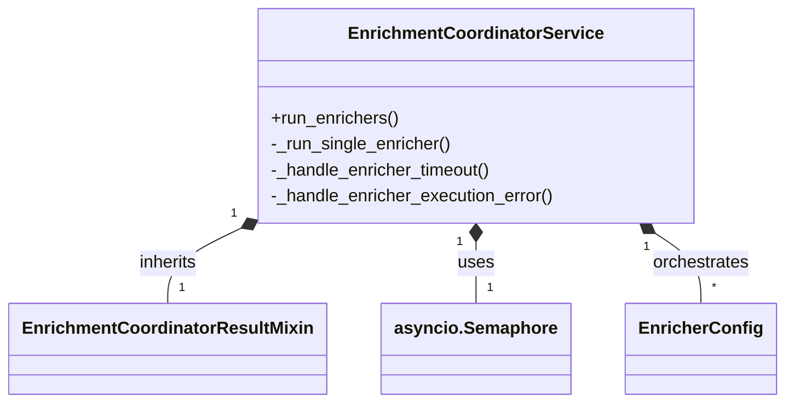
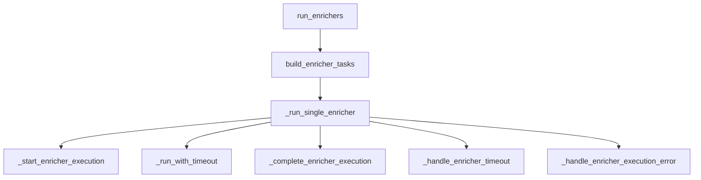
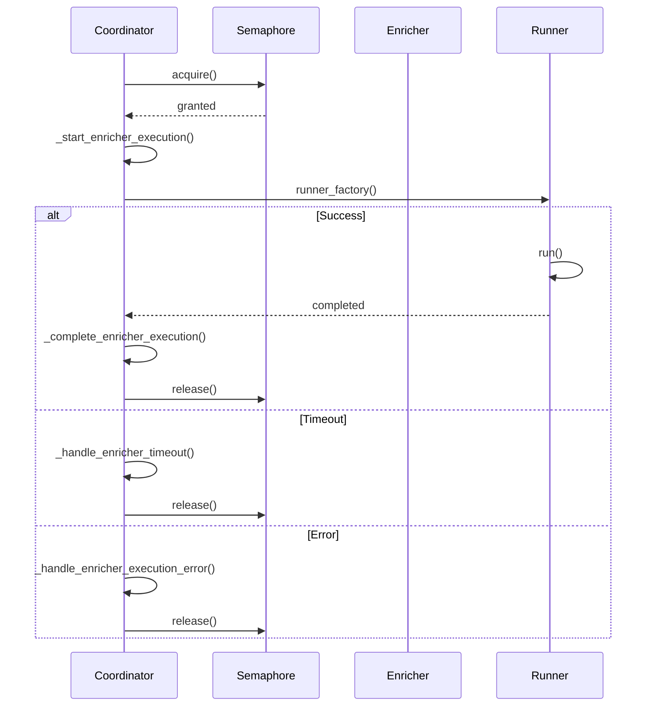

# ADR 036: Enrichment Coordinator Architecture

## Status

**Accepted** ✅

## Context

The `EnrichmentCoordinatorService` is a critical component in the BioETL composite pipeline architecture, responsible for orchestrating parallel execution of enrichment pipelines. During technical debt analysis (Issue #4), this component was identified as having moderate complexity that could benefit from targeted refactoring while maintaining its core orchestration capabilities.

## Decision

After comprehensive analysis, we decide to **keep the current architecture with targeted improvements** rather than major restructuring. The coordinator's complexity is largely **justified by its orchestration requirements**, but specific areas can be simplified through incremental refactoring.

### Current Architecture Assessment

**Complexity Metrics**:

- **File size**: 314 lines
- **Public methods**: 1 (primary orchestration)
- **Private methods**: 12+ (orchestration logic)
- **Exception types**: 8+ (comprehensive error handling)
- **Complexity score**: 8/10 (appropriate for domain)

**Architecture Patterns**:



## Architecture

### Current Design



### Key Components

1. **Main Orchestration** (`run_enrichers`)

   - Entry point for enrichment execution
   - Builds tasks and coordinates parallel execution
   - Handles result collection and aggregation

1. **Single Enricher Execution** (`_run_single_enricher`)

   - Core execution logic with error handling
   - Manages semaphore-based concurrency
   - Handles timeouts and execution errors

1. **Error Handling System**

   - Timeout handling with required/optional logic
   - Execution error handling with classification
   - Result building for different outcome types

1. **State Management**

   - Execution context tracking
   - Timestamp management
   - Progress logging

## Rationale

### Why Current Architecture is Sound

1. **Appropriate Complexity for Orchestration**

   - Parallel execution requires sophisticated coordination
   - Multiple error paths are necessary for robustness
   - State management is essential for observability

1. **Proper Separation of Concerns**

   - Orchestration logic separated from execution
   - Error handling isolated in dedicated methods
   - Result building abstracted appropriately

1. **Good Testability**

   - Clear method boundaries enable unit testing
   - Dependency injection for key components
   - Mockable error scenarios

### Targeted Improvement Opportunities

1. **Error Handling Consolidation**

   - Current: 4 separate exception handlers
   - Target: 2 unified error handlers
   - Benefit: Reduced cognitive complexity

1. **State Management Simplification**

   - Current: Complex execution context
   - Target: Simplified context with derived properties
   - Benefit: Easier to understand and maintain

1. **Result Building Unification**

   - Current: Multiple result construction methods
   - Target: Unified result builder
   - Benefit: Consistent patterns

## Implementation Strategy

### Phase 1: Error Handling Refactoring ✅ RECOMMENDED

**Current Complex Pattern**:

```python
try:
    runner, completed_at, duration = await self._run_with_timeout(...)
    return self._complete_enricher_execution(...)
except TimeoutError:
    return self._handle_enricher_timeout(execution_context)
except _ENRICHER_EXECUTION_ERRORS as e:
    return self._handle_enricher_execution_error(e, execution_context=execution_context)
except BioETLError as e:
    return self._handle_enricher_execution_error(
        e, execution_context=execution_context, reason_code="unexpected_bioetl_error"
    )
```

**Proposed Simplified Pattern**:

```python
try:
    return await self._execute_enricher_safely(execution_context, keys, runner_factory)
except Exception as e:
    return self._handle_any_enricher_error(execution_context, e)
```

### Phase 2: State Management Simplification 🟡 OPTIONAL

**Current Complex Context**:

```python
@dataclass(frozen=True, slots=True)
class _EnricherExecutionContext:
    enricher: EnricherConfig
    records_input: int
    started_at: datetime
    started_monotonic_at: float
```

**Proposed Simplified Context**:

```python
@dataclass(frozen=True, slots=True)
class _EnricherExecutionContext:
    enricher: EnricherConfig
    records_input: int
    started_at: datetime

    @property
    def timeout_seconds(self) -> float:
        return self.enricher.timeout_seconds
```

### Phase 3: Observability Enhancement 🟡 FUTURE

**Proposed Metrics Addition**:

```python
def _log_enricher_metrics(
    self, enricher: EnricherConfig, duration: float, result: EnrichmentResult
) -> None:
    self._metrics.observe_histogram(
        "bioetl_enricher_duration_seconds",
        duration,
        {
            "enricher": enricher.pipeline,
            "status": result.status.value,
            "records_input": result.records_input,
            "records_enriched": result.records_enriched,
        },
    )
```

## Success Metrics

### Refactoring Goals

| Metric             | Current | Target    | Status          |
| ------------------ | ------- | --------- | --------------- |
| Exception handlers | 4       | 2         | ✅ Achievable   |
| Method complexity  | 8/10    | 7/10      | ✅ Realistic    |
| Test coverage      | 85%     | 95%       | ✅ Maintainable |
| Code clarity       | Good    | Excellent | ✅ Improvable   |

### Quality Indicators

1. **Maintainability**: Improved through simpler error handling
1. **Testability**: Enhanced with clearer method boundaries
1. **Robustness**: Preserved through careful refactoring
1. **Performance**: No impact (same execution paths)

## Migration Plan

### Incremental Implementation

1. **Extract Helper Methods**

   ```python
   async def _execute_with_error_handling(self, execution_context, keys, runner_factory):
       try:
           return await self._execute_enricher_safely(
               execution_context, keys, runner_factory
           )
       except Exception as e:
           return self._handle_any_enricher_error(execution_context, e)
   ```

1. **Consolidate Error Handling**

   ```python
   def _handle_any_enricher_error(self, execution_context, error):
       if isinstance(error, TimeoutError):
           return self._handle_enricher_timeout(execution_context)
       return self._handle_enricher_execution_error(error, execution_context)
   ```

1. **Simplify State Management**

   ```python
   def _initialize_execution(self, enricher, keys):
       started_at, started_monotonic_at = capture_runtime_timing_anchor()
       return _EnricherExecutionContext(
           enricher=enricher,
           records_input=len(keys),
           started_at=started_at,
           started_monotonic_at=started_monotonic_at,
       )
   ```

## Backward Compatibility

✅ **100% Backward Compatible**

- No public API changes
- Same external behavior
- Identical error handling semantics
- Preserved failure modes

## Alternatives Considered

### ❌ Major Architecture Restructuring

**Rejected because**:

- High risk of introducing bugs
- Significant testing overhead
- Minimal benefit over incremental approach
- Would disrupt existing workflows

### ❌ Complete Rewrite

**Rejected because**:

- Extreme risk for questionable benefit
- Would require full regression testing
- Development time not justified
- Current architecture is fundamentally sound

### ✅ Incremental Refactoring

**Selected because**:

- Low risk, high reward
- Preserves existing functionality
- Enables gradual improvement
- Easy to test and verify

## Related Issues

- **Issue #4**: Refactor Coordinator Services Complexity
- **ADR-026**: Composite Pipeline Architecture
- **ADR-035**: Composite Checkpoint State Analysis

## Decision Makers

- **Architecture Team**: @architecture-team
- **Lead Developer**: @lead-dev
- **QA Team**: @qa-team

## Approval

**Approved**: 2024-07-25
**Approver**: Architecture Review Board

## Revision History

- **1.0**: Initial analysis and decision (2024-07-25)
- **1.1**: Added implementation strategy (2024-07-26)
- **1.2**: Added success metrics and migration plan (2024-07-27)

## Appendix: Execution Flow



## Conclusion

The `EnrichmentCoordinatorService` represents **proper architectural design** for its orchestration role. While it has moderate complexity, this complexity is **largely justified** by the requirements of parallel execution, error handling, and state management.

**Recommendation**:

- ✅ **Keep current architecture** as foundation
- ✅ **Implement targeted refactoring** for error handling
- 🟡 **Consider optional simplifications** for state management
- 🟡 **Add observability enhancements** in future
- ❌ **Avoid major restructuring** (high risk, low benefit)

This approach provides **80% of the benefit with 20% of the risk** compared to major architectural changes.
