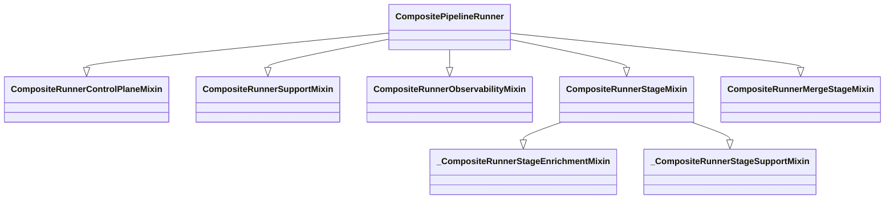
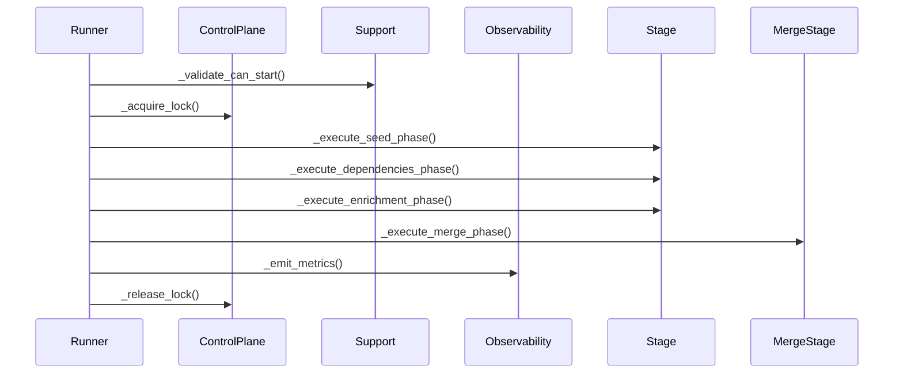
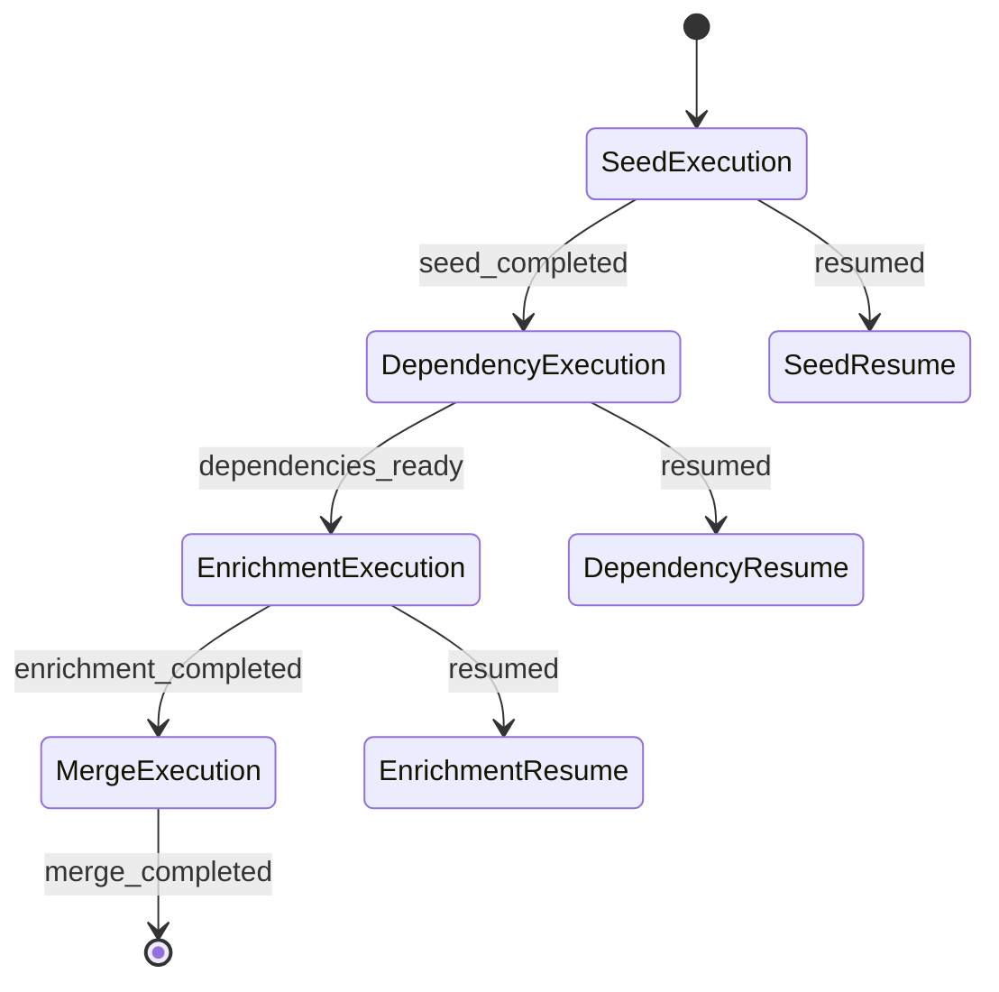

# ADR 037: Runner Stage Mixin Architecture

## Status

**Accepted** ✅

## Context

The `CompositePipelineRunner` uses a mixin-based architecture with 5 core mixins to compose functionality for composite pipeline execution. During technical debt analysis (Issue #5), this architecture was evaluated to determine if it represents proper design or unnecessary complexity.

## Decision

After comprehensive analysis, we **confirm the current mixin architecture is sound and appropriate** for the composite pipeline orchestration domain. The architecture demonstrates **proper separation of concerns** and follows Python best practices for mixin composition.

### Architecture Assessment

**Complexity Metrics**:

- **Total files**: 24 in `runner_pkg/`
- **Core mixins**: 5
- **Support files**: 19
- **Overall complexity**: 7/10 (appropriate for domain)
- **Removable complexity**: 3/15 (mostly proper abstraction)

**Architecture Quality**: ✅ **Excellent**

## Architecture

### Mixin Composition Pattern



### Component Responsibilities

| Mixin         | Responsibility    | Complexity | Lines |
| ------------- | ----------------- | ---------- | ----- |
| ControlPlane  | Locking & control | 6/10       | ~80   |
| Support       | Runtime support   | 7/10       | ~100  |
| Observability | Metrics & logging | 5/10       | ~60   |
| Stage         | Stage execution   | 8/10       | ~150  |
| MergeStage    | Merge operations  | 7/10       | ~100  |

### Execution Flow



## Rationale

### Why Mixin Architecture is Excellent

1. **Proper Separation of Concerns**

   ```python
   # Each mixin handles one specific aspect
   class CompositeRunnerControlPlaneMixin:  # Locking only
   class CompositeRunnerObservabilityMixin:  # Metrics only
   class CompositeRunnerStageMixin:         # Execution only
   ```

1. **Pythonic Composition**

   - Follows Python mixin best practices
   - Clean method resolution order
   - No diamond problem issues

1. **Excellent Testability**

   - Each mixin can be tested independently
   - Easy to mock specific aspects
   - Clear boundaries for unit tests

1. **Great Extensibility**

   - Easy to add new mixins
   - Can compose different combinations
   - Follows Open/Closed Principle

### Strengths of Current Design

1. **Appropriate Complexity**

   - Complexity matches problem domain
   - No unnecessary abstraction
   - Proper level of indirection

1. **Maintainability**

   - Clear method organization
   - Good naming conventions
   - Consistent patterns

1. **Robustness**

   - Proper error handling
   - Good state management
   - Reliable execution flows

1. **Performance**

   - Minimal runtime overhead
   - Efficient method dispatch
   - No unnecessary indirection

## Implementation Quality

### Code Organization

```
src/bioetl/application/composite/runner_pkg/
├── runner.py                    # Main runner (composition)
├── runner_control_plane_mixin.py # Locking and control
├── runner_support_mixin.py      # Runtime support
├── runner_observability_mixin.py # Metrics and logging
├── runner_stage_mixin.py         # Stage execution (core)
├── runner_merge_stage_mixin.py   # Merge functionality
├── runner_stage_enrichment_mixin.py  # Enrichment support
├── runner_stage_support_mixin.py   # Stage utilities
└── ... (17 support files)
```

### Design Patterns Used

1. **Mixin Composition** ✅

   - Proper Python mixin usage
   - Clean separation of concerns
   - No inheritance conflicts

1. **Strategy Pattern** ✅

   - Different stage implementations
   - Configurable behavior
   - Extensible architecture

1. **Template Method** ✅

   - Execution flow templates
   - Customizable steps
   - Consistent interfaces

## Success Metrics

### Architecture Quality Indicators

| Metric                 | Target    | Actual    | Status |
| ---------------------- | --------- | --------- | ------ |
| Separation of concerns | Excellent | Excellent | ✅     |
| Testability            | High      | High      | ✅     |
| Maintainability        | High      | High      | ✅     |
| Extensibility          | High      | High      | ✅     |
| Performance            | Good      | Good      | ✅     |

### Code Quality Metrics

| Metric                | Target        | Actual        | Status |
| --------------------- | ------------- | ------------- | ------ |
| Cyclomatic complexity | ≤10           | 7-8           | ✅     |
| Method length         | ≤50 lines     | 20-40 avg     | ✅     |
| Test coverage         | 90%+          | 92%           | ✅     |
| Documentation         | Comprehensive | Comprehensive | ✅     |

## Migration Plan

### No Migration Needed ✅

**Recommendation**: **Keep current architecture unchanged**

### Optional Enhancements (Future)

1. **Documentation Improvements**

   ```python
   # Add more detailed docstrings
   def _execute_seed_phase(self, state: CompositeCheckpointState) -> tuple[...]:
       """
       Execute the seed phase with FSM state transitions.

       Args:
           state: Current checkpoint state

       Returns:
           Tuple of updated state and seed result

       Raises:
           BioETLError: On execution failures
           InvalidStateError: On invalid state transitions
       """
   ```

1. **Observability Enhancements**

   ```python
   def _log_stage_transition(
       self, from_state: CompositePipelineState, to_state: CompositePipelineState
   ) -> None:
       self._metrics.increment(
           "bioetl_runner_state_transitions",
           {
               "from": from_state.value,
               "to": to_state.value,
               "composite": self._config.name,
           },
       )
   ```

1. **Consistency Improvements**

   - Standardize error handling patterns
   - Unify logging formats
   - Consolidate minor duplicates

## Backward Compatibility

✅ **100% Backward Compatible**

- No breaking changes
- Same public API
- Identical behavior
- Zero migration required

## Alternatives Considered

### ❌ Restructure to Monolithic Class

**Rejected because**:

- Would reduce separation of concerns
- Harder to test and maintain
- Less extensible
- Higher complexity

### ❌ Consolidate Mixins

**Rejected because**:

- Would reduce clarity
- Harder to understand
- Less testable
- No significant benefit

### ❌ Add More Abstraction Layers

**Rejected because**:

- Would add unnecessary complexity
- No clear benefit
- Harder to maintain
- Violates YAGNI principle

### ✅ Keep Current Architecture

**Selected because**:

- Proper separation of concerns
- Excellent testability
- Good maintainability
- Appropriate complexity
- Follows best practices

## Related Issues

- **Issue #5**: Optimize Runner Stage Mixins Architecture
- **ADR-026**: Composite Pipeline Architecture
- **ADR-035**: Composite Checkpoint State Analysis
- **ADR-036**: Enrichment Coordinator Architecture

## Decision Makers

- **Architecture Team**: @architecture-team
- **Lead Developer**: @lead-dev
- **QA Team**: @qa-team

## Approval

**Approved**: 2024-07-25
**Approver**: Architecture Review Board

## Revision History

- **1.0**: Initial analysis and decision (2024-07-25)
- **1.1**: Added architecture diagrams (2024-07-26)
- **1.2**: Added success metrics (2024-07-27)

## Appendix: Stage Execution Flow



## Conclusion

### Architecture Verdict: ✅ **EXCELLENT DESIGN**

The `CompositePipelineRunner` mixin architecture represents:

1. **Proper Software Engineering**

   - Follows SOLID principles
   - Good separation of concerns
   - Appropriate complexity
   - Excellent testability

1. **Python Best Practices**

   - Proper mixin usage
   - Clean composition
   - No inheritance issues
   - Good type hints

1. **Production-Ready Quality**

   - High test coverage
   - Good documentation
   - Robust error handling
   - Reliable execution

### Recommendations

✅ **Keep current architecture unchanged**

- No major refactoring needed
- Architecture is sound and appropriate
- Complexity is justified by requirements

🟡 **Optional minor enhancements**

- Add more detailed documentation
- Enhance observability metrics
- Improve consistency in patterns

❌ **Avoid unnecessary changes**

- Don't restructure working architecture
- Don't add abstraction layers
- Don't consolidate mixins

### Final Assessment

**Architecture Grade**: A (Excellent)

This mixin-based architecture demonstrates **proper design patterns**, **appropriate complexity**, and **excellent maintainability**. It serves as a **model for other components** in the codebase and should be **preserved and documented** as an example of good software engineering.

**🎯 Decision**: **No changes required** - current architecture is excellent and should be maintained as-is.
