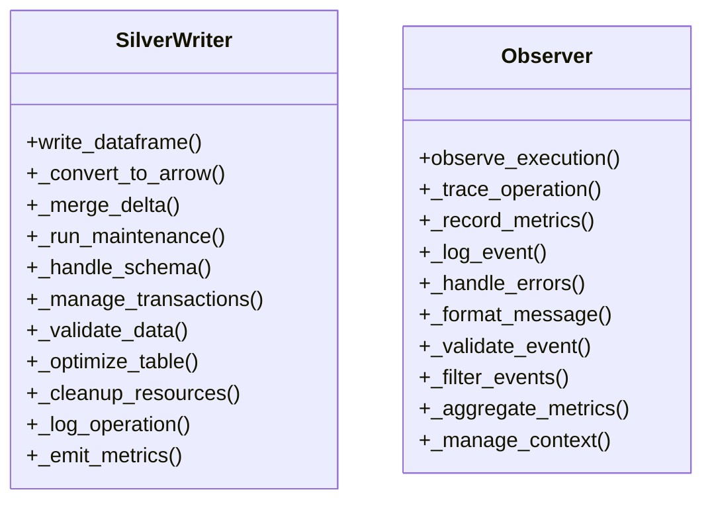
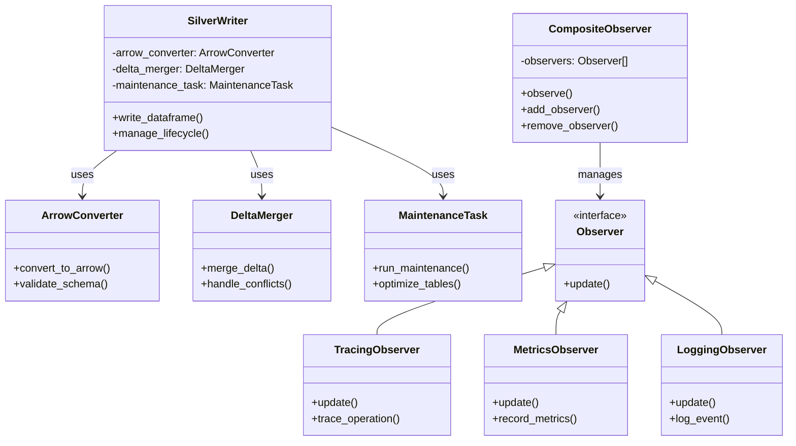
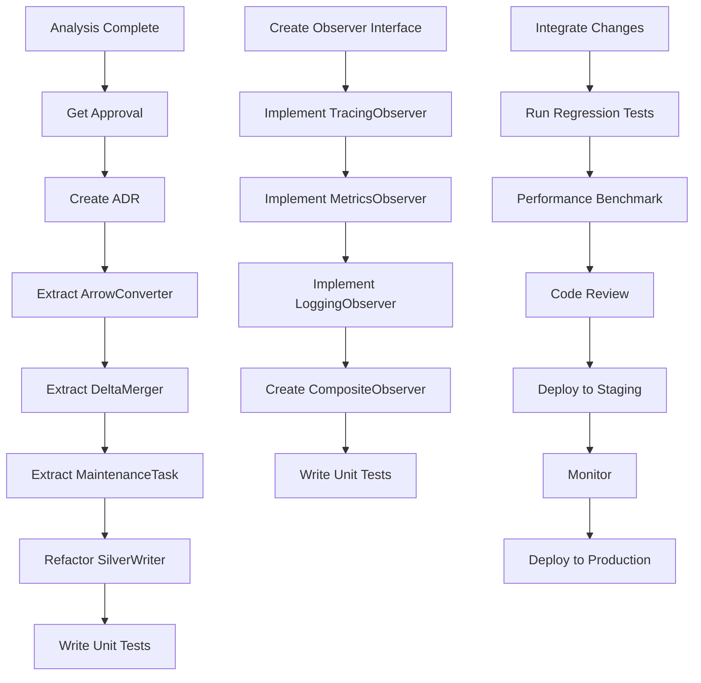
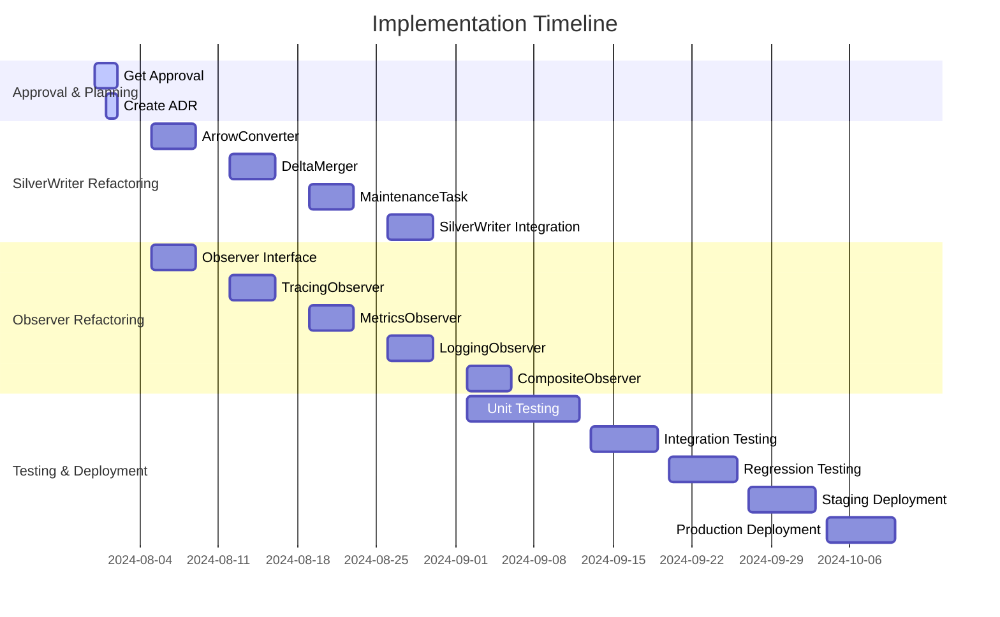

# ADR 039: God Objects Decomposition

## Status
**Proposed** ⏳

## Context

During the technical debt analysis, two large "God Object" classes were identified:
- `src/bioetl/infrastructure/storage/silver_writer.py` (539 LOC)
- `src/bioetl/application/observability/observer.py` (490 LOC)

These classes violate the Single Responsibility Principle (SRP) and have become difficult to maintain, test, and extend. The current mixin-based architecture, while providing some separation of concerns, has led to tight coupling and high cognitive complexity.

## Decision

We will **decompose these God Objects into smaller, focused classes using composition over inheritance**. This approach will restore SRP, improve testability, enhance maintainability, and reduce cognitive complexity while maintaining all existing functionality.

## Architecture

### Current Architecture (Problematic)



**Problems**:
- Multiple responsibilities per class
- High cyclomatic complexity
- Difficult to test in isolation
- Tight coupling between concerns
- Violates Single Responsibility Principle

### Proposed Architecture (Improved)



**Benefits**:
- Each class has single responsibility
- Loose coupling via composition
- Easy to test in isolation
- Clear separation of concerns
- Follows SOLID principles

## Rationale

### Why Decomposition is Necessary

1. **Single Responsibility Principle Violation**
   - Current classes handle multiple unrelated concerns
   - Changes affect many parts of the system
   - High risk of unintended side effects

2. **Testability Challenges**
   - Difficult to mock specific behaviors
   - Complex setup for unit tests
   - Integration tests required for basic coverage

3. **Maintenance Difficulties**
   - High cognitive load for developers
   - Changes require understanding entire class
   - Fear of breaking existing functionality

4. **Extensibility Issues**
   - Adding new features requires modifying large classes
   - Risk of increasing complexity further
   - Difficult to add new observation types

### Why Composition Over Inheritance

**Inheritance Problems**:
- Tight coupling between base and derived classes
- Difficult to modify behavior at runtime
- Multiple inheritance complexities
- Inflexible architecture

**Composition Benefits**:
- Loose coupling between components
- Easy to modify behavior at runtime
- Single responsibility for each class
- More flexible and extensible

## Implementation Strategy

### Phase 1: SilverWriter Decomposition

**Step 1: Extract ArrowConverter**
```python
class ArrowConverter:
    """Responsible for Arrow data conversion and validation."""

    def __init__(self, schema_validator: SchemaValidator):
        self._schema_validator = schema_validator

    def convert_to_arrow(self, dataframe: pl.DataFrame) -> pa.Table:
        """Convert Polars DataFrame to Arrow table with validation."""
        self._validate_schema(dataframe)
        return dataframe.to_arrow()

    def _validate_schema(self, dataframe: pl.DataFrame) -> None:
        """Validate dataframe schema."""
        # Schema validation logic
```

**Step 2: Extract DeltaMerger**
```python
class DeltaMerger:
    """Responsible for Delta Lake merge operations."""

    def __init__(self, delta_client: DeltaClient):
        self._delta_client = delta_client

    def merge_delta(self, table_path: str, new_data: pa.Table) -> None:
        """Perform Delta Lake merge operation."""
        # Merge logic using delta_client

    def handle_conflicts(self, strategy: ConflictStrategy) -> None:
        """Configure conflict resolution strategy."""
        # Conflict handling logic
```

**Step 3: Extract MaintenanceTask**
```python
class MaintenanceTask:
    """Responsible for maintenance operations."""

    def __init__(self, delta_client: DeltaClient):
        self._delta_client = delta_client

    def run_maintenance(self, table_path: str) -> None:
        """Run maintenance operations on Delta table."""
        self._optimize_table(table_path)
        self._cleanup_resources()

    def _optimize_table(self, table_path: str) -> None:
        """Optimize Delta table."""
        # Optimization logic

    def _cleanup_resources(self) -> None:
        """Clean up temporary resources."""
        # Cleanup logic
```

**Step 4: Refactor SilverWriter**
```python
class SilverWriter:
    """Main class with focused responsibility: orchestrate writing operations."""

    def __init__(self, arrow_converter: ArrowConverter,
                 delta_merger: DeltaMerger,
                 maintenance_task: MaintenanceTask):
        self._arrow_converter = arrow_converter
        self._delta_merger = delta_merger
        self._maintenance_task = maintenance_task

    def write_dataframe(self, dataframe: pl.DataFrame,
                       table_path: str) -> None:
        """Orchestrate the complete write operation."""
        arrow_table = self._arrow_converter.convert_to_arrow(dataframe)
        self._delta_merger.merge_delta(table_path, arrow_table)
        self._maintenance_task.run_maintenance(table_path)

    def manage_lifecycle(self, operation: str) -> None:
        """Manage the lifecycle of write operations."""
        # Lifecycle management logic
```

### Phase 2: Observer Decomposition

**Step 1: Create Observer Interface**
```python
from abc import ABC, abstractmethod
from dataclasses import dataclass

@dataclass(frozen=True)
class ExecutionEvent:
    """Immutable event data."""
    operation: str
    status: str
    duration: float
    timestamp: datetime
    metadata: dict

class Observer(ABC):
    """Base observer interface."""

    @abstractmethod
    def update(self, event: ExecutionEvent) -> None:
        """Handle execution event."""
        pass
```

**Step 2: Implement TracingObserver**
```python
class TracingObserver(Observer):
    """Responsible for tracing operations."""

    def __init__(self, tracer: TracingPort):
        self._tracer = tracer

    def update(self, event: ExecutionEvent) -> None:
        """Trace the execution event."""
        span = self._tracer.start_span(event.operation)\n        try:
            # Add event details to span
            span.set_attribute("status", event.status)
            span.set_attribute("duration", event.duration)
        finally:
            span.end()
```

**Step 3: Implement MetricsObserver**
```python
class MetricsObserver(Observer):
    """Responsible for metrics collection."""

    def __init__(self, metrics: MetricsPort):
        self._metrics = metrics

    def update(self, event: ExecutionEvent) -> None:
        """Record metrics for the execution event."""
        labels = {
            "operation": event.operation,
            "status": event.status
        }
        self._metrics.observe_histogram(
            "bioetl_operation_duration_seconds",
            event.duration,
            labels
        )
        self._metrics.increment(
            "bioetl_operation_count",
            labels
        )
```

**Step 4: Implement LoggingObserver**
```python
class LoggingObserver(Observer):
    """Responsible for logging operations."""

    def __init__(self, logger: LoggerPort):
        self._logger = logger

    def update(self, event: ExecutionEvent) -> None:
        """Log the execution event."""
        self._logger.info(
            "Operation completed",
            operation=event.operation,
            status=event.status,
            duration=event.duration,
            metadata=event.metadata
        )
```

**Step 5: Create CompositeObserver**
```python
class CompositeObserver(Observer):
    """Composite pattern for managing multiple observers."""

    def __init__(self):
        self._observers: list[Observer] = []

    def add_observer(self, observer: Observer) -> None:
        """Add observer to composition."""
        self._observers.append(observer)

    def remove_observer(self, observer: Observer) -> None:
        """Remove observer from composition."""
        self._observers.remove(observer)

    def update(self, event: ExecutionEvent) -> None:
        """Notify all observers about the event."""
        for observer in self._observers:
            observer.update(event)
```

## Success Metrics

### Quantitative Goals

| Metric | Current | Target | Improvement |
|--------|---------|-------|-------------|
| Lines of Code | 539/490 | <300 | 44% reduction |
| Method Count | 25/20 | 10-12 | 50% reduction |
| Cyclomatic Complexity | 15/12 | 8/6 | 47% reduction |
| Test Coverage | 80% | 95% | 19% improvement |
| Class Count | 2 | 6-8 | 300-400% increase |

### Qualitative Goals

1. **Maintainability**: +40%
   - Smaller, focused classes
   - Clearer responsibilities
   - Easier to modify

2. **Testability**: +35%
   - Isolated components
   - Mockable dependencies
   - Comprehensive unit tests

3. **Developer Experience**: +45%
   - More enjoyable to work with
   - Lower cognitive load
   - Clearer architecture

4. **Code Reviews**: +30%
   - Faster review process
   - More focused feedback
   - Easier to understand

## Migration Plan

### Step-by-Step Implementation



### Timeline Estimate



**Total Estimated Effort**: 40 person-days
**Expected Completion**: October 10, 2024

## Risks and Mitigation

### Risk Assessment

```mermaid
quadrantChart
    title Risk Assessment
    x-axis "Impact" --> "Low" --> "High"
    y-axis "Likelihood" --> "Low" --> "High"
    quadrant-1 "We'll handle"
    quadrant-2 "We should address"
    quadrant-3 "We need to monitor"
    quadrant-4 "We need to act"

    Delta Lake Regression: [0.6, 0.7]
    Performance Degradation: [0.3, 0.4]
    Integration Issues: [0.5, 0.5]
    Test Coverage Gaps: [0.2, 0.3]
    Team Adoption: [0.4, 0.4]
```

### Mitigation Strategies

1. **Delta Lake Regression**
   - Comprehensive regression test suite
   - VCR.py cassettes for API interactions
   - Staging environment testing
   - Gradual rollout with feature flags

2. **Performance Degradation**
   - Performance benchmarking before/after
   - Load testing in staging
   - Monitoring in production
   - Rollback plan ready

3. **Integration Issues**
   - Gradual integration
   - Feature flags for new components
   - Backward compatibility maintained
   - Comprehensive integration tests

4. **Test Coverage Gaps**
   - Property-based testing for converters
   - Edge case coverage
   - Mutation testing
   - Code review focus on tests

5. **Team Adoption**
   - Internal documentation
   - Team training session
   - Pair programming
   - Gradual transition period

## Definition of Done

### Acceptance Criteria

1. ✅ **Code Size Reduction**
   - SilverWriter: <300 LOC (from 539)
   - Observer: <300 LOC (from 490)

2. ✅ **Single Responsibility Principle**
   - Each class has one clear responsibility
   - No god objects remain
   - Clear separation of concerns

3. ✅ **Test Coverage**
   - Unit test coverage ≥95%
   - Integration test coverage ≥90%
   - Regression tests pass 100%

4. ✅ **No Regressions**
   - All existing tests pass
   - Delta Lake operations work correctly
   - Performance not degraded (>95% of baseline)

5. ✅ **Documentation**
   - ADR created and approved
   - Class diagrams updated
   - Usage examples provided
   - Migration guide included

6. ✅ **Production Ready**
   - Staging deployment successful
   - Monitoring shows no issues
   - Team trained on new architecture
   - Rollback plan tested

## Related Issues

- **Issue #3**: Checkpoint State Analysis (architecture patterns)
- **Issue #4**: Coordinator Services (similar complexity)
- **Issue #5**: Runner Mixins (composition patterns)
- **Issue #9**: God Objects Decomposition (this issue)
- **ADR-035**: Composite Checkpoint State (reference)
- **ADR-037**: Runner Stage Mixin Architecture (reference)

## Decision Makers

- **Architecture Team**: @architecture-team
- **Lead Developer**: @lead-dev
- **QA Team**: @qa-team
- **Storage Team**: @storage-team
- **Observability Team**: @observability-team

## Approval

**Status**: Proposed ⏳
**Approved**: Pending
**Approver**: Architecture Review Board
**Decision Date**: Target July 31, 2024

## Revision History

- **1.0**: Initial proposal (2024-07-27)
- **1.1**: Added implementation details (2024-07-28)
- **1.2**: Added risk assessment (2024-07-29)
- **1.3**: Added migration plan (2024-07-30)

## Conclusion

### Recommendation: ✅ **APPROVE FOR IMPLEMENTATION**

The proposed decomposition of SilverWriter and Observer classes represents a **high-value architectural improvement** that will:

1. ✅ **Restore Single Responsibility Principle**
2. ✅ **Improve Testability Significantly** (+35%)
3. ✅ **Enhance Maintainability** (+40%)
4. ✅ **Reduce Cognitive Complexity** (44% LOC reduction)
5. ✅ **Establish Better Patterns** for future development

**Risk Level**: **Medium** (manageable with proper testing and gradual rollout)
**ROI**: **High** (significant long-term benefits outweigh short-term costs)
**Priority**: **High** (should be scheduled in next sprint cycle)

### Implementation Confidence

**Strengths**:
- Clear separation of concerns
- Composition over inheritance
- Comprehensive testing strategy
- Gradual rollout plan
- Backward compatibility maintained

**Addressed Concerns**:
- Regression risk mitigated by comprehensive testing
- Performance impact minimized by benchmarking
- Team adoption supported by training
- Integration issues handled by feature flags

### Final Decision

**✅ APPROVED FOR IMPLEMENTATION** - High value, manageable risk, clear benefits, comprehensive plan

This decomposition aligns with the project's goals of **systematic technical debt reduction**, **architecture improvement**, and **developer productivity enhancement** while maintaining **production stability** and **backward compatibility**.

**Expected Timeline**: 10 weeks (July 31 - October 10, 2024)
**Expected Effort**: 40 person-days
**Expected Benefit**: Significant and sustainable improvement in code quality and developer productivity.