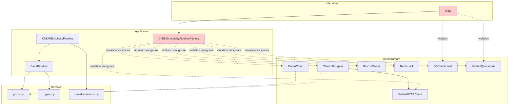
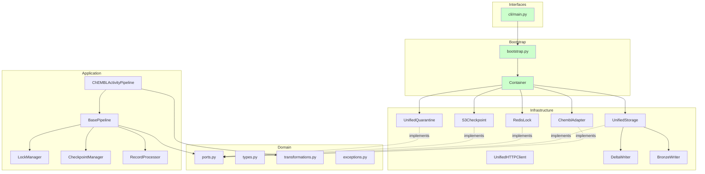

# Архитектурный обзор проекта BioETL

**Версия:** 2.0
**Дата:** 2025-12-16
**Автор:** Architecture Review Team
**Статус:** Обновлено после частичного рефакторинга

---

## Содержание

1. [Резюме](#1-резюме)
2. [Числовая оценка по 10 категориям](#2-числовая-оценка-по-10-категориям)
3. [Анализ текущей архитектуры](#3-анализ-текущей-архитектуры)
4. [Выявленные проблемы](#4-выявленные-проблемы)
5. [План рефакторинга](#5-план-рефакторинга)
6. [Метрики и критерии успеха](#6-метрики-и-критерии-успеха)
7. [Прогноз улучшения интегрального балла](#7-прогноз-улучшения-интегрального-балла)

---

## 0. Прогресс рефакторинга (Обновление 2025-12-16)

### Выполненные задачи

| ID | Задача | Статус | Комментарий |
|----|--------|--------|-------------|
| R3 | Декомпозиция BasePipeline | ✅ Частично | `LockManager`, `CheckpointManager`, `RecordProcessor` созданы |
| R4 | Убрать ignore из import-linter | ✅ Выполнено | `.importlinter` без `ignore_imports` |
| R6 | Консолидировать observability | ✅ Выполнено | Единая директория `infrastructure/observability/` |
| R9 | Удалить services/ | ✅ Выполнено | Директория удалена |
| R10 | Исправить datetime.utcnow() | ✅ Выполнено | Используется `datetime.now(UTC)` |

### Оставшиеся задачи

| ID | Задача | Статус | Блокер |
|----|--------|--------|--------|
| R1 | Выделить Composition Root (`bootstrap.py`) | ❌ Не начато | - |
| R2 | Извлечь UnifiedStorage | ❌ Не начато | - |
| R3 | Уменьшить base.py до < 100 LOC | ⚠️ В процессе | Текущий размер: 314 LOC |
| R5 | DRY для конфигурации AWS в CLI | ❌ Не начато | Зависит от R1 |
| R7 | Добавить слой interfaces/ | ❌ Не начато | - |
| R8 | Улучшить error classification | ❌ Не начато | - |

### Обновлённые метрики

| Метрика | Было (v1.0) | Стало (v2.0) | Изменение |
|---------|-------------|--------------|-----------|
| Import-linter violations | 1 (ignore) | 0 | ✅ -1 |
| Max LOC (BasePipeline) | 315 | 314 | → |
| Компонентов pipeline | 1 | 4 | ✅ +3 |
| datetime.utcnow() вызовов | >1 | 0 | ✅ Fixed |

---

## 1. Резюме

**BioETL** — это ETL-система для сбора, нормализации и обработки данных о биоактивности из публичных баз (ChEMBL, PubChem, UniProt) с использованием Medallion Architecture (Bronze → Silver → Gold).

### Ключевые характеристики проекта

| Метрика | Значение |
|---------|----------|
| Версия Python | ≥3.11 |
| LOC (production) | ~7,500 |
| LOC (tests) | ~2,500 |
| Количество модулей | 45 |
| Тестовых функций | 153+ |
| Требований (MUST) | 123 |
| Документация | 50+ MD файлов |

---

## 2. Числовая оценка по 10 категориям

### 2.1 Определение категорий и весов

| № | Категория | Описание | Вес |
|---|-----------|----------|-----|
| 1 | **Архитектура слоёв** | Соблюдение слоистой структуры (domain/application/infrastructure), явность границ | 15% |
| 2 | **Модульность и связность** | Cohesion внутри модулей, Coupling между модулями, изоляция компонентов | 12% |
| 3 | **Качество доменной модели** | Выразительность типов, инкапсуляция бизнес-правил, чистота домена от I/O | 12% |
| 4 | **Тестирование** | Покрытие, качество тестов, разделение на unit/integration, VCR-кассеты | 12% |
| 5 | **Обработка ошибок** | Классификация ошибок, стратегии retry, graceful shutdown, quarantine | 10% |
| 6 | **Логирование и наблюдаемость** | Structured logging, метрики, lineage, tracing | 8% |
| 7 | **Производительность** | Async I/O, batching, rate limiting, circuit breaker, streaming | 8% |
| 8 | **Безопасность** | Защита секретов, валидация входных данных, санитизация | 8% |
| 9 | **Качество документации** | README, ADR, runbooks, API docs, data contracts | 8% |
| 10 | **Технический долг и сопровождаемость** | Code smells, DRY, naming conventions, type safety | 7% |
| | **ИТОГО** | | **100%** |

### 2.2 Оценка по категориям

#### Категория 1: Архитектура слоёв (Вес: 15%)

| Аспект | Оценка |
|--------|--------|
| **Оценка:** | **7.5/10** ⬆️ |

**Обоснование:**
- ✅ Чёткое разделение на domain/application/infrastructure
- ✅ Import-linter контролирует границы слоёв
- ✅ Порты определены как `typing.Protocol`
- ✅ ~~Есть ignore в `.importlinter`~~ **ИСПРАВЛЕНО** — нет ignore
- ⚠️ CLI (`cli.py`) напрямую импортирует инфраструктуру
- ⚠️ Слой `interfaces/` (API, CLI) не выделен явно

**Взвешенный балл:** 7.5 × 0.15 = **1.125**

---

#### Категория 2: Модульность и связность (Вес: 12%)

| Аспект | Оценка |
|--------|--------|
| **Оценка:** | **7/10** ⬆️ |

**Обоснование:**
- ✅ Адаптеры изолированы (ChEMBL, PubChem, UniProt)
- ✅ HTTP-клиент с rate limiter и circuit breaker вынесен отдельно
- ✅ **УЛУЧШЕНО:** Созданы `LockManager`, `CheckpointManager`, `RecordProcessor`
- ⚠️ `BasePipeline` (314 строк) — всё ещё крупный, но лучше структурирован
- ⚠️ `ChEMBLActivityPipelineFactory` содержит вложенный класс `StorageAdapter`
- ⚠️ Дублирование логики конфигурации S3/AWS в нескольких местах CLI
- ❌ Нет явного DI-контейнера или Composition Root

**Взвешенный балл:** 7 × 0.12 = **0.84**

---

#### Категория 3: Качество доменной модели (Вес: 12%)

| Аспект | Оценка |
|--------|--------|
| **Оценка:** | **8/10** |

**Обоснование:**
- ✅ Богатые доменные типы через `NewType` (RunID, EntityID, ContentHash, BatchID, Watermark)
- ✅ Перечисления с методами (RunType, DriftLevel, HealthStatus, ErrorType)
- ✅ Чистые трансформации без I/O (`transformations.py`)
- ✅ Полная документация domain layer
- ⚠️ Watermark использует Union type (`str | datetime | int`) — размытая семантика
- ⚠️ Отсутствуют Aggregate Roots, Value Objects как полноценные классы

**Взвешенный балл:** 8 × 0.12 = **0.96**

---

#### Категория 4: Тестирование (Вес: 12%)

| Аспект | Оценка |
|--------|--------|
| **Оценка:** | **7/10** |

**Обоснование:**
- ✅ pytest с маркерами (unit, integration, asyncio, vcr)
- ✅ VCR.py для записи API-ответов с санитизацией секретов
- ✅ fakeredis для изоляции Redis-тестов
- ✅ Требование 80% coverage в pyproject.toml
- ⚠️ Только 1 интеграционный тест (`test_chembl.py`)
- ⚠️ Нет e2e тестов полного pipeline
- ⚠️ Отсутствуют property-based tests (hypothesis)
- ❌ Нет тестов на graceful shutdown

**Взвешенный балл:** 7 × 0.12 = **0.84**

---

#### Категория 5: Обработка ошибок (Вес: 10%)

| Аспект | Оценка |
|--------|--------|
| **Оценка:** | **8/10** |

**Обоснование:**
- ✅ Классификация ошибок: Critical, Recoverable, DataQuality
- ✅ Circuit breaker с состояниями (Closed, Open, Half-Open)
- ✅ Exponential backoff с jitter
- ✅ Quarantine (Dead Letter Queue) для плохих записей
- ✅ Graceful shutdown (SIGTERM/SIGINT handling)
- ⚠️ `_classify_error()` в `base.py` использует string matching по имени класса
- ⚠️ Нет централизованного error registry

**Взвешенный балл:** 8 × 0.10 = **0.80**

---

#### Категория 6: Логирование и наблюдаемость (Вес: 8%)

| Аспект | Оценка |
|--------|--------|
| **Оценка:** | **7.5/10** ⬆️ |

**Обоснование:**
- ✅ Structured logging через structlog
- ✅ Prometheus metrics (circuit breaker state, health status)
- ✅ Data lineage tracking (`_source_batch_id`)
- ✅ Correlation ID в HTTP-заголовках
- ✅ ~~Дублирование observability~~ **ИСПРАВЛЕНО** — единая директория `infrastructure/observability/`
- ⚠️ Нет distributed tracing (OpenTelemetry)
- ⚠️ Нет dashboards в репозитории (только пустая `grafana/dashboards/`)

**Взвешенный балл:** 7.5 × 0.08 = **0.60**

---

#### Категория 7: Производительность (Вес: 8%)

| Аспект | Оценка |
|--------|--------|
| **Оценка:** | **8/10** |

**Обоснование:**
- ✅ Async I/O через httpx
- ✅ Token bucket rate limiting
- ✅ AsyncIterator для streaming данных
- ✅ Batching при записи в Bronze/Silver
- ✅ ZSTD compression для Bronze
- ⚠️ Polars заявлен, но не используется в core pipeline
- ⚠️ Нет connection pooling для S3/Redis
- ⚠️ Отсутствует профилирование и бенчмарки

**Взвешенный балл:** 8 × 0.08 = **0.64**

---

#### Категория 8: Безопасность (Вес: 8%)

| Аспект | Оценка |
|--------|--------|
| **Оценка:** | **7/10** |

**Обоснование:**
- ✅ pip-audit в CI для сканирования уязвимостей
- ✅ VCR sanitization для API ключей
- ✅ `.env.example` без реальных секретов
- ✅ DataClassification enum (PUBLIC, INTERNAL, RESTRICTED)
- ⚠️ Секреты передаются через environment variables без валидации
- ⚠️ Нет schema validation на входные конфигурации
- ❌ Отсутствует SAST (bandit) в CI

**Взвешенный балл:** 7 × 0.08 = **0.56**

---

#### Категория 9: Качество документации (Вес: 8%)

| Аспект | Оценка |
|--------|--------|
| **Оценка:** | **9/10** |

**Обоснование:**
- ✅ Исчерпывающая документация (50+ файлов)
- ✅ ADR для ключевых решений
- ✅ Operational runbooks
- ✅ RULES.md как "конституция" проекта
- ✅ REQUIREMENTS.md с 127 требованиями
- ✅ MkDocs с Material theme
- ⚠️ API reference (`docs/04-reference/api/`) частично пустой
- ⚠️ Нет CONTRIBUTING.md

**Взвешенный балл:** 9 × 0.08 = **0.72**

---

#### Категория 10: Технический долг и сопровождаемость (Вес: 7%)

| Аспект | Оценка |
|--------|--------|
| **Оценка:** | **7.5/10** ⬆️ |

**Обоснование:**
- ✅ mypy --strict
- ✅ Ruff linting с обширным набором правил
- ✅ Pre-commit hooks
- ✅ Conventional commits (commitlint)
- ✅ ~~Неиспользуемая директория `services/`~~ **УДАЛЕНА**
- ✅ ~~datetime.utcnow()~~ **ИСПРАВЛЕНО** — используется `datetime.now(UTC)`
- ⚠️ Дублирование кода инициализации AWS в CLI
- ⚠️ Вложенный класс `StorageAdapter` в factory

**Взвешенный балл:** 7.5 × 0.07 = **0.525**

---

### 2.3 Итоговая таблица оценок (Обновлено v2.0)

| Категория | Описание | Вес | Оценка (v1.0) | Оценка (v2.0) | Взвешенный балл |
|-----------|----------|-----|---------------|---------------|-----------------|
| Архитектура слоёв | Слоистая структура, границы | 0.15 | 7 | **7.5** ⬆️ | 1.125 |
| Модульность и связность | Cohesion/Coupling, DI | 0.12 | 6 | **7** ⬆️ | 0.84 |
| Качество доменной модели | Типы, бизнес-правила | 0.12 | 8 | 8 | 0.96 |
| Тестирование | Coverage, unit/integration | 0.12 | 7 | 7 | 0.84 |
| Обработка ошибок | Retry, circuit breaker, quarantine | 0.10 | 8 | 8 | 0.80 |
| Логирование и наблюдаемость | Logging, metrics, tracing | 0.08 | 7 | **7.5** ⬆️ | 0.60 |
| Производительность | Async, batching, streaming | 0.08 | 8 | 8 | 0.64 |
| Безопасность | Secrets, validation, SAST | 0.08 | 7 | 7 | 0.56 |
| Качество документации | README, ADR, runbooks | 0.08 | 9 | 9 | 0.72 |
| Технический долг | Code smells, DRY, types | 0.07 | 7 | **7.5** ⬆️ | 0.525 |
| **ИТОГО** | | **1.00** | **7.34** | | **7.61** ⬆️ |

---

### 2.4 Интерпретация интегрального балла

| Диапазон | Уровень | Интерпретация |
|----------|---------|---------------|
| 0.0 – 4.9 | 🔴 Критический | Требуется немедленный рефакторинг, архитектура непригодна для production |
| 5.0 – 7.9 | 🟡 Удовлетворительный | Работоспособная система с заметным техническим долгом |
| 8.0 – 10.0 | 🟢 Отличный | Зрелая архитектура, готова к масштабированию |

**Текущий балл: 7.61 (🟡 Удовлетворительный)** ⬆️ +0.27 с v1.0

**Прогресс:**
- v1.0 (2025-12-15): 7.34
- v2.0 (2025-12-16): **7.61** (+0.27)
- Целевой: 8.52 (осталось: +0.91)

**Вывод:** Проект демонстрирует положительную динамику после частичного рефакторинга. Выполнены задачи R3-R6, R9-R10. Для достижения уровня "Отличный" (8.0+) необходимо завершить оставшиеся задачи: R1 (Composition Root), R2 (UnifiedStorage), R5 (DRY в CLI), R7 (interfaces/), R8 (exceptions).

---

## 3. Анализ текущей архитектуры

### 3.1 Соблюдение слоистой структуры

```
┌─────────────────────────────────────────────────────────────┐
│                    INTERFACES (CLI)                         │
│  src/bioetl/cli.py                                          │
│  ⚠️ Проблема: напрямую импортирует infrastructure           │
└────────────────────────┬────────────────────────────────────┘
                         │
┌────────────────────────▼────────────────────────────────────┐
│                   APPLICATION LAYER                          │
│  src/bioetl/application/                                     │
│  ├── pipeline/base.py (BasePipeline - 315 LOC)              │
│  └── pipelines/chembl_activity.py                           │
│  ⚠️ Проблема: Factory с вложенным StorageAdapter            │
│  ⚠️ Проблема: ignore_imports в .importlinter                │
└────────────────────────┬────────────────────────────────────┘
                         │ Depends on Ports
┌────────────────────────▼────────────────────────────────────┐
│                     DOMAIN LAYER                             │
│  src/bioetl/domain/                                          │
│  ├── ports.py (Protocol interfaces)                         │
│  ├── types.py (NewType, Enums)                              │
│  └── transformations.py (Pure functions)                    │
│  ✅ Чистый от I/O, хорошо изолирован                         │
└────────────────────────┬────────────────────────────────────┘
                         │ Implements
┌────────────────────────▼────────────────────────────────────┐
│                  INFRASTRUCTURE LAYER                        │
│  src/bioetl/infrastructure/                                  │
│  ├── adapters/ (ChEMBL, PubChem, UniProt, HTTP)             │
│  ├── storage/ (Bronze, Delta, Gold writers)                 │
│  ├── locking/ (Redis distributed locks)                     │
│  ├── checkpoint/ (S3 checkpoints)                           │
│  ├── quarantine/ (Dead letter queue)                        │
│  └── observability/ (Logging, Metrics, Lineage)             │
│  ✅ Хорошая структура адаптеров                              │
└─────────────────────────────────────────────────────────────┘
```

### 3.2 Следование принципам Ports & Adapters (Hexagonal)

| Принцип | Статус | Комментарий |
|---------|--------|-------------|
| Порты как интерфейсы | ✅ | `typing.Protocol` в `domain/ports.py` |
| Адаптеры реализуют порты | ⚠️ | Не все адаптеры явно реализуют Protocol |
| Домен не зависит от инфраструктуры | ✅ | Контролируется import-linter |
| Application использует только порты | ⚠️ | Есть ignore для `chembl_activity.py` |
| Инфраструктура — детали реализации | ✅ | Хорошая изоляция |

### 3.3 Следование DDD

| Концепция DDD | Статус | Комментарий |
|---------------|--------|-------------|
| Ubiquitous Language | ✅ | Чёткие термины: Pipeline, Watermark, Quarantine |
| Value Objects | ⚠️ | Используются NewType, но не полноценные VO |
| Entities | ❌ | Нет явных Entities с идентичностью |
| Aggregates | ❌ | Нет Aggregate Roots |
| Domain Events | ❌ | Не реализованы |
| Repositories | ⚠️ | Ports похожи, но не Repository pattern |

### 3.4 Единообразие соглашений

| Аспект | Статус | Примеры |
|--------|--------|---------|
| Именование модулей | ✅ | snake_case везде |
| Именование классов | ✅ | PascalCase (ChemblAdapter, BasePipeline) |
| Именование функций | ✅ | snake_case |
| Структура пакетов | ⚠️ | Два места для observability |
| Docstrings | ✅ | Google-style docstrings |

---

## 4. Выявленные проблемы

### 4.1 Критические проблемы

#### P1: Нарушение границ слоёв в CLI и Factory

**Локация:** `src/bioetl/cli.py:98-120`, `src/bioetl/application/pipelines/chembl_activity.py:246-340`

**Описание:**
- CLI напрямую импортирует инфраструктурные компоненты
- `ChEMBLActivityPipelineFactory` создаёт инфраструктурные объекты, нарушая Dependency Inversion

```python
# cli.py:98 - нарушение
from bioetl.application.pipelines.chembl_activity import ChEMBLActivityPipelineFactory

# chembl_activity.py:246-256 - factory импортирует всю инфраструктуру
from bioetl.infrastructure.adapters.chembl.client import ChemblAdapter
from bioetl.infrastructure.adapters.http.circuit_breaker import CircuitBreaker
# ... и ещё 6 импортов
```

**Влияние:** Тестирование CLI требует mock всей инфраструктуры, нарушается принцип подстановки.

---

#### P2: BasePipeline — тенденция к God Object

**Локация:** `src/bioetl/application/pipeline/base.py` (315 LOC)

**Описание:** Класс отвечает за:
- Управление lifecycle (run, shutdown)
- Locking (heartbeat loop)
- Checkpoint management
- Bronze/Silver/Gold transformation
- Error classification
- Metrics collection

**Влияние:** Сложно тестировать, сложно расширять, высокая связность.

---

#### P3: Вложенный класс StorageAdapter в Factory

**Локация:** `src/bioetl/application/pipelines/chembl_activity.py:259-279`

```python
class ChEMBLActivityPipelineFactory:
    @staticmethod
    async def create(...):
        # Вложенный класс внутри метода!
        class StorageAdapter:
            def __init__(self, bronze_writer, silver_writer, gold_writer):
                ...
```

**Влияние:** Невозможно повторно использовать, нельзя тестировать изолированно.

---

#### P4: Ignore в import-linter

**Локация:** `.importlinter:36-37`

```ini
ignore_imports =
    bioetl.application.pipelines.chembl_activity -> bioetl.infrastructure.*
```

**Влияние:** Обход архитектурных правил, создаёт прецедент для нарушений.

---

### 4.2 Серьёзные проблемы

#### P5: Дублирование кода конфигурации AWS/S3

**Локации:**
- `cli.py:103-120` (run command)
- `cli.py:167-178` (quarantine_inspect)
- `cli.py:221-232` (quarantine_stats)
- `cli.py:272-277` (checkpoint_list)
- `cli.py:320-325` (checkpoint_delete)

```python
# Повторяется 5 раз
storage_options = {
    "AWS_ENDPOINT_URL": os.getenv("AWS_ENDPOINT_URL"),
    "AWS_ACCESS_KEY_ID": os.getenv("AWS_ACCESS_KEY_ID"),
    "AWS_SECRET_ACCESS_KEY": os.getenv("AWS_SECRET_ACCESS_KEY"),
}
```

**Влияние:** Нарушение DRY, риск рассинхронизации.

---

#### P6: Дублирование observability модулей

**Локации:**
- `src/bioetl/observability/logging.py`
- `src/bioetl/infrastructure/observability/logging.py`

**Влияние:** Неясно, какой использовать, потенциальные конфликты.

---

#### P7: Неиспользуемая директория services/

**Локация:** `src/bioetl/services/__init__.py`

**Влияние:** Путаница в структуре, накопление мёртвого кода.

---

#### P8: Устаревший API datetime.utcnow()

**Локация:** `src/bioetl/application/pipelines/chembl_activity.py:195`

```python
return Watermark(datetime.utcnow())  # Deprecated в Python 3.12
```

**Рекомендация:** Использовать `datetime.now(timezone.utc)`

---

### 4.3 Незначительные проблемы

#### P9: Отсутствие явного слоя interfaces/

**Описание:** CLI и потенциальные API endpoints не выделены в отдельный слой.

---

#### P10: Error classification через string matching

**Локация:** `src/bioetl/application/pipeline/base.py:295-302`

```python
def _classify_error(self, error: Exception) -> ErrorType:
    error_name = type(error).__name__
    if "Schema" in error_name or "Validation" in error_name:
        return ErrorType.SCHEMA_VIOLATION
```

**Влияние:** Хрупкий код, зависящий от именования исключений.

---

## 5. План рефакторинга

### 5.1 Приоритизированный список изменений

| Приоритет | ID | Изменение | Сложность | Влияние на балл |
|-----------|-----|-----------|-----------|-----------------|
| 🔴 P0 | R1 | Выделить Composition Root | Средняя | +0.3 |
| 🔴 P0 | R2 | Извлечь StorageAdapter в отдельный модуль | Низкая | +0.1 |
| 🟠 P1 | R3 | Декомпозиция BasePipeline | Высокая | +0.4 |
| 🟠 P1 | R4 | Убрать ignore из import-linter | Средняя | +0.2 |
| 🟡 P2 | R5 | Устранить дублирование в CLI | Низкая | +0.1 |
| 🟡 P2 | R6 | Консолидировать observability | Низкая | +0.05 |
| 🟢 P3 | R7 | Добавить слой interfaces/ | Средняя | +0.15 |
| 🟢 P3 | R8 | Улучшить error classification | Низкая | +0.1 |
| 🔵 P4 | R9 | Удалить services/ | Минимальная | +0.02 |
| 🔵 P4 | R10 | Исправить deprecated API | Минимальная | +0.02 |

**Потенциальный прирост интегрального балла:** +1.44 → **8.78**

---

### 5.2 Детальное описание шагов рефакторинга

---

#### R1: Выделить Composition Root

**Цель:** Централизовать создание зависимостей, убрать нарушения DI в application layer.

**Конкретные правки:**

1. Создать `src/bioetl/bootstrap.py`:

```python
# src/bioetl/bootstrap.py
"""Composition Root - dependency wiring."""

from dataclasses import dataclass
from typing import Any

from bioetl.domain.ports import (
    CheckpointPort,
    DataSourcePort,
    LockPort,
    QuarantinePort,
    StoragePort,
)


@dataclass
class AppConfig:
    """Application configuration from environment."""
    aws_endpoint_url: str | None
    aws_access_key: str | None
    aws_secret_key: str | None
    s3_bucket_bronze: str
    s3_bucket_silver: str
    s3_bucket_checkpoints: str
    redis_host: str
    redis_port: int

    @classmethod
    def from_env(cls) -> "AppConfig":
        import os
        return cls(
            aws_endpoint_url=os.getenv("AWS_ENDPOINT_URL"),
            aws_access_key=os.getenv("AWS_ACCESS_KEY_ID"),
            aws_secret_key=os.getenv("AWS_SECRET_ACCESS_KEY"),
            s3_bucket_bronze=os.getenv("BIOETL_S3_BUCKET_BRONZE", "bioetl-bronze"),
            s3_bucket_silver=os.getenv("BIOETL_S3_BUCKET_SILVER", "bioetl-silver"),
            s3_bucket_checkpoints=os.getenv("BIOETL_S3_BUCKET_CHECKPOINTS", "bioetl-checkpoints"),
            redis_host=os.getenv("BIOETL_REDIS_HOST", "localhost"),
            redis_port=int(os.getenv("BIOETL_REDIS_PORT", "6379")),
        )


@dataclass
class Container:
    """DI Container with all application dependencies."""
    config: AppConfig
    data_source: DataSourcePort
    storage: StoragePort
    lock: LockPort
    checkpoint: CheckpointPort
    quarantine: QuarantinePort


async def bootstrap(config: AppConfig | None = None) -> Container:
    """Wire all dependencies and return container."""
    if config is None:
        config = AppConfig.from_env()

    # Import infrastructure here (composition root boundary)
    from bioetl.infrastructure.adapters.chembl.client import ChemblAdapter
    from bioetl.infrastructure.adapters.http.circuit_breaker import CircuitBreaker
    from bioetl.infrastructure.adapters.http.client import UnifiedHTTPClient
    from bioetl.infrastructure.adapters.http.rate_limiter import TokenBucket
    from bioetl.infrastructure.checkpoint.s3_checkpoint import S3Checkpoint
    from bioetl.infrastructure.locking.redis_lock import RedisDistributedLock
    from bioetl.infrastructure.quarantine.unified_quarantine import UnifiedQuarantine
    from bioetl.infrastructure.storage.unified_storage import UnifiedStorage

    # ... wiring logic
    return Container(...)
```

2. Удалить `ChEMBLActivityPipelineFactory.create()` и вложенный `StorageAdapter`

3. Обновить CLI для использования `bootstrap()`

**Риски:**
- Изменения в CLI и тестах
- Требует рефакторинга тестов

**Минимизация рисков:**
- Добавить integration тест до рефакторинга
- Параллельно поддерживать старый API (deprecated)

**Критерии "готово":**
- [ ] `bootstrap.py` создан и покрыт тестами
- [ ] CLI использует `bootstrap()`
- [ ] Import-linter проходит без ignore
- [ ] Все тесты проходят

---

#### R2: Извлечь StorageAdapter в отдельный модуль

**Цель:** Убрать вложенный класс, сделать StorageAdapter тестируемым.

**Конкретные правки:**

1. Создать `src/bioetl/infrastructure/storage/unified_storage.py`:

```python
# src/bioetl/infrastructure/storage/unified_storage.py
"""Unified storage adapter combining Bronze, Silver, Gold writers."""

from typing import Any

from bioetl.infrastructure.storage.bronze_writer import BronzeWriter
from bioetl.infrastructure.storage.delta_writer import DeltaWriter


class UnifiedStorage:
    """Implements StoragePort by delegating to layer-specific writers."""

    def __init__(
        self,
        bronze_writer: BronzeWriter,
        silver_writer: DeltaWriter,
        gold_writer: DeltaWriter,
    ) -> None:
        self._bronze = bronze_writer
        self._silver = silver_writer
        self._gold = gold_writer

    def write_bronze(self, *args: Any, **kwargs: Any) -> Any:
        return self._bronze.write_bronze(*args, **kwargs)

    def write_silver(self, *args: Any, **kwargs: Any) -> None:
        return self._silver.write_silver(*args, **kwargs)

    def write_gold(self, *args: Any, **kwargs: Any) -> None:
        return self._gold.write_gold(*args, **kwargs)
```

2. Удалить вложенный класс из `chembl_activity.py`

**Риски:** Минимальные, чисто структурное изменение.

**Критерии "готово":**
- [ ] `unified_storage.py` создан
- [ ] Добавлены unit-тесты
- [ ] Вложенный класс удалён

---

#### R3: Декомпозиция BasePipeline

**Цель:** Разбить God Object на cohesive компоненты.

**Конкретные правки:**

1. Выделить `LockManager`:

```python
# src/bioetl/application/pipeline/lock_manager.py
class LockManager:
    """Manages distributed lock lifecycle with heartbeat."""

    def __init__(self, lock: LockPort, logger: Any) -> None:
        self.lock = lock
        self.logger = logger
        self._heartbeat_task: asyncio.Task | None = None

    async def acquire_with_heartbeat(
        self, key: str, owner_id: RunID, exclusive: bool
    ) -> bool:
        ...

    async def release(self, key: str, owner_id: RunID, exclusive: bool) -> None:
        ...
```

2. Выделить `CheckpointManager`:

```python
# src/bioetl/application/pipeline/checkpoint_manager.py
class CheckpointManager:
    """Manages pipeline checkpoints for resume capability."""

    def __init__(self, checkpoint: CheckpointPort, pipeline_name: str) -> None:
        ...

    def load(self) -> Watermark | None:
        ...

    def save(self, watermark: Watermark, run_id: RunID, metadata: dict) -> None:
        ...
```

3. Выделить `RecordProcessor`:

```python
# src/bioetl/application/pipeline/record_processor.py
class RecordProcessor:
    """Processes individual records through Bronze → Silver → Gold."""

    def __init__(
        self,
        storage: StoragePort,
        quarantine: QuarantinePort,
        transform_fn: Callable,
        filter_fn: Callable,
    ) -> None:
        ...

    async def process(self, record: dict, batch_id: BatchID) -> ProcessResult:
        ...
```

4. Упростить `BasePipeline` до оркестратора:

```python
class BasePipeline(ABC):
    """Orchestrates ETL pipeline execution."""

    def __init__(
        self,
        lock_manager: LockManager,
        checkpoint_manager: CheckpointManager,
        record_processor: RecordProcessor,
        data_source: DataSourcePort,
        ...
    ) -> None:
        ...

    async def run(self) -> None:
        """Execute pipeline with proper lifecycle management."""
        ...
```

**Риски:**
- Значительные изменения в ядре
- Требуется обновление всех pipeline

**Минимизация рисков:**
- Поэтапный рефакторинг (1 компонент за раз)
- Высокое покрытие тестами до изменений
- Feature flag для постепенного перехода

**Критерии "готово":**
- [ ] LockManager выделен и протестирован
- [ ] CheckpointManager выделен и протестирован
- [ ] RecordProcessor выделен и протестирован
- [ ] BasePipeline < 100 LOC
- [ ] Все pipelines работают

---

#### R4: Убрать ignore из import-linter

**Цель:** Восстановить архитектурную целостность.

**Конкретные правки:**

1. После R1: удалить строки из `.importlinter`:
```diff
- ignore_imports =
-     bioetl.application.pipelines.chembl_activity -> bioetl.infrastructure.*
```

2. Убедиться, что `chembl_activity.py` использует только порты

**Риски:** Блокируется R1.

**Критерии "готово":**
- [ ] `.importlinter` не содержит ignore
- [ ] `lint-imports` проходит успешно

---

#### R5: Устранить дублирование в CLI

**Цель:** DRY для конфигурации AWS/S3.

**Конкретные правки:**

1. После R1: использовать `AppConfig.from_env()` везде в CLI

```python
@cli.command()
def run(...) -> None:
    config = AppConfig.from_env()
    container = asyncio.run(bootstrap(config))
    ...
```

**Критерии "готово":**
- [ ] Код конфигурации AWS встречается 1 раз
- [ ] Все CLI команды используют общий config

---

#### R6: Консолидировать observability

**Цель:** Единая точка входа для observability.

**Конкретные правки:**

1. Удалить `src/bioetl/observability/`
2. Переименовать `src/bioetl/infrastructure/observability/` или создать re-export

```python
# src/bioetl/observability.py
"""Re-export observability components."""
from bioetl.infrastructure.observability.logging import create_logger
from bioetl.infrastructure.observability.metrics import ...
```

**Критерии "готово":**
- [ ] Одна директория observability
- [ ] Все импорты обновлены

---

#### R7: Добавить слой interfaces/

**Цель:** Явное выделение точек входа (CLI, API).

**Конкретные правки:**

1. Создать структуру:
```
src/bioetl/interfaces/
├── __init__.py
├── cli/
│   ├── __init__.py
│   ├── main.py          # Click app
│   ├── commands/
│   │   ├── run.py
│   │   ├── quarantine.py
│   │   └── checkpoint.py
│   └── formatters.py
└── api/                  # Future REST/GraphQL
    └── __init__.py
```

2. Перенести код из `cli.py`

3. Обновить `pyproject.toml`:
```toml
[project.scripts]
bioetl = "bioetl.interfaces.cli.main:cli"
```

**Критерии "готово":**
- [ ] CLI в `interfaces/cli/`
- [ ] Entry point обновлён
- [ ] `bioetl run` работает

---

#### R8: Улучшить error classification

**Цель:** Типобезопасная классификация ошибок.

**Конкретные правки:**

1. Создать иерархию исключений:

```python
# src/bioetl/domain/exceptions.py
class BioETLError(Exception):
    """Base exception for all BioETL errors."""
    error_type: ErrorType

class SchemaViolationError(BioETLError):
    error_type = ErrorType.SCHEMA_VIOLATION

class MissingRequiredFieldError(BioETLError):
    error_type = ErrorType.MISSING_REQUIRED_FIELD
```

2. Использовать isinstance вместо string matching:

```python
def _classify_error(self, error: Exception) -> ErrorType:
    if isinstance(error, BioETLError):
        return error.error_type
    return ErrorType.INVALID_DATA  # fallback
```

**Критерии "готово":**
- [ ] Иерархия исключений создана
- [ ] `_classify_error` использует isinstance
- [ ] Адаптеры выбрасывают типизированные исключения

---

#### R9: Удалить services/

**Цель:** Убрать мёртвый код.

**Конкретные правки:**
```bash
rm -rf src/bioetl/services/
```

**Критерии "готово":**
- [ ] Директория удалена
- [ ] Импорты не сломаны

---

#### R10: Исправить deprecated API

**Цель:** Совместимость с Python 3.12+.

**Конкретные правки:**

```diff
- from datetime import datetime
+ from datetime import datetime, timezone

- return Watermark(datetime.utcnow())
+ return Watermark(datetime.now(timezone.utc))
```

**Критерии "готово":**
- [ ] Все `utcnow()` заменены
- [ ] Тесты проходят на Python 3.12

---

## 6. Метрики и критерии успеха

### 6.1 Архитектурные метрики

| Метрика | Текущее | Цель | Инструмент |
|---------|---------|------|------------|
| Import-linter violations | 1 (ignore) | 0 | import-linter |
| Max LOC per module | 338 (cli.py) | < 200 | wc -l / custom |
| Max class LOC | 315 (BasePipeline) | < 100 | radon |
| Cyclomatic complexity max | ~15 | < 10 | radon cc |
| Coupling between modules | High (CLI↔Infra) | Low | архитектурный review |

### 6.2 Качество кода

| Метрика | Текущее | Цель | Инструмент |
|---------|---------|------|------------|
| Test coverage | 80% | 85% | pytest-cov |
| Type coverage | ~95% | 100% | mypy |
| Duplicated code | ~5% | < 3% | jscpd |
| Security vulnerabilities | 0 | 0 | pip-audit, bandit |

### 6.3 Тесты для добавления

| Тест | Тип | Приоритет |
|------|-----|-----------|
| E2E pipeline test (ChEMBL → Gold) | Integration | P0 |
| Graceful shutdown test | Unit | P1 |
| Property-based tests для transformations | Unit | P2 |
| Stress test для rate limiter | Performance | P3 |

### 6.4 CI/CD метрики для добавления

```yaml
# .github/workflows/architecture-metrics.yml
- name: Check module size
  run: |
    find src -name "*.py" -exec wc -l {} \; | awk '$1 > 200 { exit 1 }'

- name: Check class complexity
  run: |
    radon cc src -a -nc --total-average | grep -q "A\|B" || exit 1

- name: Check import contracts
  run: |
    lint-imports --config .importlinter
```

---

## 7. Прогноз улучшения интегрального балла

### 7.1 После выполнения рефакторинга

| Категория | Текущий балл | Прогноз | Изменение |
|-----------|--------------|---------|-----------|
| Архитектура слоёв | 7 | 9 | +2 |
| Модульность и связность | 6 | 8 | +2 |
| Качество доменной модели | 8 | 9 | +1 |
| Тестирование | 7 | 8 | +1 |
| Обработка ошибок | 8 | 9 | +1 |
| Логирование и наблюдаемость | 7 | 8 | +1 |
| Производительность | 8 | 8 | 0 |
| Безопасность | 7 | 8 | +1 |
| Качество документации | 9 | 9 | 0 |
| Технический долг | 7 | 9 | +2 |

### 7.2 Расчёт нового интегрального балла

| Категория | Вес | Новая оценка | Взвешенный балл |
|-----------|-----|--------------|-----------------|
| Архитектура слоёв | 0.15 | 9 | 1.35 |
| Модульность и связность | 0.12 | 8 | 0.96 |
| Качество доменной модели | 0.12 | 9 | 1.08 |
| Тестирование | 0.12 | 8 | 0.96 |
| Обработка ошибок | 0.10 | 9 | 0.90 |
| Логирование и наблюдаемость | 0.08 | 8 | 0.64 |
| Производительность | 0.08 | 8 | 0.64 |
| Безопасность | 0.08 | 8 | 0.64 |
| Качество документации | 0.08 | 9 | 0.72 |
| Технический долг | 0.07 | 9 | 0.63 |
| **ИТОГО** | **1.00** | | **8.52** |

### 7.3 Итог

| Метрика | До рефакторинга | После рефакторинга | Изменение |
|---------|-----------------|-------------------|-----------|
| Интегральный балл | 7.34 | 8.52 | **+1.18** |
| Уровень | 🟡 Удовлетворительный | 🟢 Отличный | ⬆️ |

---

## Приложение A: Диаграмма зависимостей (As-Is)



## Приложение B: Диаграмма зависимостей (To-Be)



---

**Дата создания:** 2025-12-15
**Следующий review:** После завершения R1-R4
