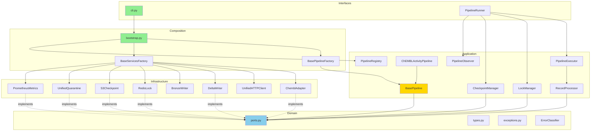

# Архитектурный обзор проекта BioETL v2

**Версия:** 2.0
**Дата:** 2025-12-18
**Автор:** Architecture Review (Claude Opus 4.5)
**Базовый ревизион:** После рефакторинга ADR-0005

---

## Содержание

1. [Резюме](#1-резюме)
2. [Числовая оценка по 10 категориям](#2-числовая-оценка-по-10-категориям)
3. [Анализ текущей архитектуры](#3-анализ-текущей-архитектуры)
4. [Выявленные проблемы](#4-выявленные-проблемы)
5. [План рефакторинга](#5-план-рефакторинга)
6. [Метрики и критерии успеха](#6-метрики-и-критерии-успеха)
7. [Прогноз улучшения интегрального балла](#7-прогноз-улучшения-интегрального-балла)

---

## 1. Резюме

**BioETL** — ETL-система для сбора, нормализации и обработки данных о биоактивности из публичных баз (ChEMBL, PubChem, UniProt) с использованием Medallion Architecture (Bronze → Silver → Gold).

### Ключевые характеристики проекта (текущее состояние)

| Метрика | Значение | Изменение с v1 |
|---------|----------|----------------|
| Версия Python | ≥3.11 | — |
| LOC (production) | ~9,923 | +32% |
| LOC (tests) | ~17,445 | +597% |
| Test/Code Ratio | 1.76:1 | Отлично |
| Количество тестовых файлов | 102 | +7x |
| Требование coverage | 80% | — |
| Import-linter violations | **0** | -1 (был ignore) |
| Deprecated API usage | **0** | -1 |

### Основные улучшения с момента v1 обзора

| Задача из v1 | Статус | Комментарий |
|--------------|--------|-------------|
| R1: Composition Root | ✅ Выполнено | `composition/bootstrap.py` |
| R2: StorageAdapter | ✅ Выполнено | `infrastructure/factories/storage.py` |
| R3: Декомпозиция BasePipeline | ✅ Выполнено | ADR-0005, 6 компонентов |
| R4: Убрать ignore import-linter | ✅ Выполнено | 0 violations |
| R5: DRY в CLI | ✅ Выполнено | Использует bootstrap |
| R7: Слой interfaces/ | ✅ Выполнено | CLI, orchestration |
| R10: datetime.utcnow() | ✅ Выполнено | 0 использований |

---

## 2. Числовая оценка по 10 категориям

### 2.1 Определение категорий и весов

| № | Категория | Описание | Вес |
|---|-----------|----------|-----|
| 1 | **Архитектура слоёв** | Соблюдение слоистой структуры (domain/application/infrastructure/composition/interfaces), явность границ | 15% |
| 2 | **Модульность и связность** | Cohesion внутри модулей, Coupling между модулями, DI, изоляция компонентов | 12% |
| 3 | **Качество доменной модели** | Выразительность типов, инкапсуляция бизнес-правил, чистота домена от I/O | 12% |
| 4 | **Тестирование** | Покрытие, качество тестов, разделение на unit/integration, VCR-кассеты, архитектурные тесты | 12% |
| 5 | **Обработка ошибок** | Иерархия исключений, классификация ошибок, стратегии retry, graceful shutdown, quarantine | 10% |
| 6 | **Логирование и наблюдаемость** | Structured logging, метрики, lineage, tracing | 8% |
| 7 | **Производительность** | Async I/O, batching, rate limiting, circuit breaker, streaming | 8% |
| 8 | **Безопасность** | Защита секретов, SAST, валидация входных данных, санитизация | 8% |
| 9 | **Качество документации** | README, ADR, runbooks, API docs, data contracts | 8% |
| 10 | **Технический долг и сопровождаемость** | Code smells, DRY, naming conventions, type safety, complexity | 7% |
| | **ИТОГО** | | **100%** |

---

### 2.2 Оценка по категориям

#### Категория 1: Архитектура слоёв (Вес: 15%)

| Аспект | Оценка |
|--------|--------|
| **Оценка:** | **9/10** |

**Обоснование:**
- ✅ Чёткое разделение на 5 слоёв: domain / application / infrastructure / composition / interfaces
- ✅ Import-linter контролирует границы **БЕЗ ignore**
- ✅ Порты определены как `typing.Protocol` с `@runtime_checkable`
- ✅ Composition Root реализован в `composition/bootstrap.py`
- ✅ CLI в `interfaces/cli.py` использует только bootstrap
- ✅ PipelineRunner как "Driving Adapter" в Hexagonal Architecture
- ⚠️ Observability модули в двух местах (application и infrastructure)

**Взвешенный балл:** 9 × 0.15 = **1.35**

---

#### Категория 2: Модульность и связность (Вес: 12%)

| Аспект | Оценка |
|--------|--------|
| **Оценка:** | **8/10** |

**Обоснование:**
- ✅ BasePipeline декомпозирован на 6 компонентов (ADR-0005):
  - `BasePipeline` (162 LOC) — определение пайплайна
  - `PipelineRunner` (108 LOC) — lifecycle management
  - `PipelineExecutor` (104 LOC) — data flow orchestration
  - `LockManager` (148 LOC) — distributed locking
  - `CheckpointManager` (69 LOC) — checkpoint management
  - `RecordProcessor` (173 LOC) — record transformation
- ✅ Фабрики для создания сервисов (`BasePipelineFactory`, `BaseServicesFactory`)
- ✅ `PipelineRegistry` для регистрации пайплайнов
- ✅ Адаптеры изолированы (ChEMBL, PubChem, UniProt)
- ⚠️ `RecordProcessor` на грани предела (173 LOC), можно разделить

**Взвешенный балл:** 8 × 0.12 = **0.96**

---

#### Категория 3: Качество доменной модели (Вес: 12%)

| Аспект | Оценка |
|--------|--------|
| **Оценка:** | **8/10** |

**Обоснование:**
- ✅ Богатые доменные типы через `NewType`: RunID, EntityID, ContentHash, BatchID
- ✅ Перечисления с методами: RunType, DriftLevel, HealthStatus, ErrorType, CircuitBreakerState
- ✅ Полная иерархия исключений: `BioETLError` → `CriticalError` / `RecoverableError` / `DataQualityError`
- ✅ Чистые трансформации без I/O (`domain/transformations.py`)
- ✅ `ErrorClassifier` в domain layer
- ✅ `PipelineContext` для передачи контекста выполнения
- ⚠️ `Watermark` использует Union type (`str | datetime | int`) — размытая семантика
- ⚠️ Отсутствуют полноценные Value Objects как классы

**Взвешенный балл:** 8 × 0.12 = **0.96**

---

#### Категория 4: Тестирование (Вес: 12%)

| Аспект | Оценка |
|--------|--------|
| **Оценка:** | **9/10** |

**Обоснование:**
- ✅ Test/Code ratio 1.76:1 (17,445 / 9,923) — отличный показатель
- ✅ 102 тестовых файла с чёткой структурой (unit/integration/architecture)
- ✅ Архитектурные тесты (537 LOC в `test_architecture.py`):
  - Domain purity (AST-based)
  - Application no concrete infrastructure
  - Infrastructure boundaries
  - Security checks (no print/eval/exec)
  - Observability isolation
- ✅ pytest-archon для архитектурного тестирования
- ✅ VCR.py для записи API-ответов с санитизацией
- ✅ fakeredis для изоляции Redis-тестов
- ✅ moto для S3 тестов
- ✅ hypothesis для property-based tests (добавлен в deps)
- ✅ mutmut для mutation testing (настроен)
- ⚠️ Нет e2e тестов полного pipeline с реальной инфраструктурой

**Взвешенный балл:** 9 × 0.12 = **1.08**

---

#### Категория 5: Обработка ошибок (Вес: 10%)

| Аспект | Оценка |
|--------|--------|
| **Оценка:** | **9/10** |

**Обоснование:**
- ✅ Полная иерархия исключений в `domain/exceptions.py`:
  - `CriticalError`: LockLostError, LockAcquisitionError, CheckpointConflictError, MergeConflictError
  - `RecoverableError`: RateLimitError, RetryExhaustedError, CircuitBreakerOpenError, ApiError, StorageError
  - `DataQualityError`: SchemaViolationError, MissingRequiredFieldError, InvalidDataFormatError
- ✅ `ErrorClassifier` для централизованной классификации
- ✅ Circuit breaker с состояниями (Closed, Open, Half-Open)
- ✅ Exponential backoff с jitter
- ✅ Quarantine (Dead Letter Queue) с unified storage
- ✅ Graceful shutdown с `ShutdownSignal` и `PipelineShutdownError`
- ✅ Fencing tokens для защиты от split-brain

**Взвешенный балл:** 9 × 0.10 = **0.90**

---

#### Категория 6: Логирование и наблюдаемость (Вес: 8%)

| Аспект | Оценка |
|--------|--------|
| **Оценка:** | **7/10** |

**Обоснование:**
- ✅ Structured logging через structlog
- ✅ Prometheus metrics с PrometheusMetrics и NoOpMetrics
- ✅ `PipelineObserver` для автоматического сбора метрик
- ✅ Data lineage tracking (`_source_batch_id`)
- ✅ Anomaly detection (`infrastructure/observability/anomaly.py`)
- ✅ Correlation ID (run_id) во всех логах
- ⚠️ Два места для observability: `application/observability/` и `infrastructure/observability/`
- ⚠️ Нет distributed tracing (OpenTelemetry)
- ⚠️ Нет готовых Grafana dashboards

**Взвешенный балл:** 7 × 0.08 = **0.56**

---

#### Категория 7: Производительность (Вес: 8%)

| Аспект | Оценка |
|--------|--------|
| **Оценка:** | **8/10** |

**Обоснование:**
- ✅ Async I/O через httpx (UnifiedHTTPClient)
- ✅ Token bucket rate limiting
- ✅ AsyncIterator для streaming данных
- ✅ Batching при записи в Bronze/Silver
- ✅ ZSTD compression для Bronze
- ✅ Circuit breaker для защиты от каскадных сбоев
- ✅ Configurable batch size и checkpoint interval
- ⚠️ Polars заявлен, но используется в ограниченном объёме
- ⚠️ Нет connection pooling для S3 (использует boto3 defaults)

**Взвешенный балл:** 8 × 0.08 = **0.64**

---

#### Категория 8: Безопасность (Вес: 8%)

| Аспект | Оценка |
|--------|--------|
| **Оценка:** | **8/10** |

**Обоснование:**
- ✅ pip-audit в CI для сканирования уязвимостей
- ✅ bandit для SAST (настроен в pyproject.toml)
- ✅ safety для проверки зависимостей
- ✅ VCR sanitization для API ключей
- ✅ DataClassification enum (PUBLIC, INTERNAL, RESTRICTED)
- ✅ Архитектурные тесты на отсутствие print/eval/exec
- ✅ Централизация os.getenv только в `config.py` (проверяется тестами)
- ✅ `.env.example` без реальных секретов
- ⚠️ Нет schema validation на уровне входных данных CLI

**Взвешенный балл:** 8 × 0.08 = **0.64**

---

#### Категория 9: Качество документации (Вес: 8%)

| Аспект | Оценка |
|--------|--------|
| **Оценка:** | **9/10** |

**Обоснование:**
- ✅ Исчерпывающая документация (80+ файлов)
- ✅ ADR для ключевых решений (включая ADR-0005 BasePipeline decomposition)
- ✅ Operational runbooks (9 runbooks)
- ✅ RULES.md как "конституция" проекта (версия 5.0)
- ✅ AGENT.md для AI-ассистентов
- ✅ MkDocs с Material theme
- ✅ Docstrings в Google Style
- ⚠️ Нет CONTRIBUTING.md
- ⚠️ API reference частично автогенерирован

**Взвешенный балл:** 9 × 0.08 = **0.72**

---

#### Категория 10: Технический долг и сопровождаемость (Вес: 7%)

| Аспект | Оценка |
|--------|--------|
| **Оценка:** | **8/10** |

**Обоснование:**
- ✅ mypy --strict (полная строгая типизация)
- ✅ Ruff linting с обширным набором правил
- ✅ Pre-commit hooks
- ✅ Conventional commits
- ✅ xenon для контроля сложности
- ✅ vulture для обнаружения мёртвого кода
- ✅ Нет deprecated `datetime.utcnow()` (исправлено)
- ✅ Нет вложенных классов в фабриках (исправлено)
- ⚠️ `Watermark` как Union type — потенциальная проблема типизации
- ⚠️ Дублирование observability модулей

**Взвешенный балл:** 8 × 0.07 = **0.56**

---

### 2.3 Итоговая таблица оценок

| Категория | Описание | Вес | Оценка (1–10) | Взвешенный балл |
|-----------|----------|-----|---------------|-----------------|
| Архитектура слоёв | Слоистая структура, границы, DI | 0.15 | 9 | 1.35 |
| Модульность и связность | Cohesion/Coupling, декомпозиция | 0.12 | 8 | 0.96 |
| Качество доменной модели | Типы, бизнес-правила, исключения | 0.12 | 8 | 0.96 |
| Тестирование | Coverage, unit/integration/arch | 0.12 | 9 | 1.08 |
| Обработка ошибок | Retry, circuit breaker, quarantine | 0.10 | 9 | 0.90 |
| Логирование и наблюдаемость | Logging, metrics, tracing | 0.08 | 7 | 0.56 |
| Производительность | Async, batching, streaming | 0.08 | 8 | 0.64 |
| Безопасность | Secrets, SAST, validation | 0.08 | 8 | 0.64 |
| Качество документации | README, ADR, runbooks | 0.08 | 9 | 0.72 |
| Технический долг | Code smells, DRY, types | 0.07 | 8 | 0.56 |
| **ИТОГО** | | **1.00** | | **8.37** |

---

### 2.4 Интерпретация интегрального балла

| Диапазон | Уровень | Интерпретация |
|----------|---------|---------------|
| 0.0 – 4.9 | 🔴 Критический | Требуется немедленный рефакторинг |
| 5.0 – 7.9 | 🟡 Удовлетворительный | Работоспособная система с техническим долгом |
| 8.0 – 10.0 | 🟢 Отличный | Зрелая архитектура, готова к масштабированию |

### Сравнение с v1 обзором

| Метрика | v1 (2025-12-15) | v2 (2025-12-18) | Изменение |
|---------|-----------------|-----------------|-----------|
| **Интегральный балл** | 7.34 | **8.37** | **+1.03** |
| **Уровень** | 🟡 Удовлетворительный | 🟢 **Отличный** | ⬆️ |
| Архитектура слоёв | 7 | 9 | +2 |
| Модульность | 6 | 8 | +2 |
| Тестирование | 7 | 9 | +2 |
| Обработка ошибок | 8 | 9 | +1 |

**Вывод:** Проект успешно перешёл из категории "Удовлетворительный" в "Отличный" благодаря выполнению плана рефакторинга v1. Основные задачи R1-R5 и R7, R10 выполнены полностью.

---

## 3. Анализ текущей архитектуры

### 3.1 Структура слоёв (As-Is)

```
src/bioetl/
├── domain/                    # Чистая логика, Protocols (Ports), бизнес-модели
│   ├── ports.py              # 7 Protocol interfaces
│   ├── types.py              # NewType, Enums (8 типов)
│   ├── exceptions.py         # Иерархия исключений (15 классов)
│   ├── transformations.py    # Чистые функции
│   ├── error_classifier.py   # Классификация ошибок
│   ├── config.py             # Domain config models
│   └── context.py            # PipelineContext
│
├── application/              # Use Cases, Orchestration
│   ├── core/
│   │   ├── base.py           # BasePipeline (162 LOC)
│   │   ├── executor.py       # PipelineExecutor (104 LOC)
│   │   ├── lock_manager.py   # LockManager (148 LOC)
│   │   ├── checkpoint_manager.py  # CheckpointManager (69 LOC)
│   │   ├── record_processor.py    # RecordProcessor (173 LOC)
│   │   ├── quarantine_manager.py  # QuarantineManager
│   │   ├── shutdown.py       # ShutdownSignal
│   │   └── pipeline_services.py   # Service container
│   ├── pipelines/            # Конкретные пайплайны
│   │   ├── chembl_activity.py
│   │   ├── pubchem_compound.py
│   │   └── uniprot_protein.py
│   ├── registry.py           # PipelineRegistry
│   └── observability/
│       └── observer.py       # PipelineObserver
│
├── infrastructure/           # Adapters (реализация портов)
│   ├── adapters/
│   │   ├── http/             # UnifiedHTTPClient, RateLimiter, CircuitBreaker
│   │   ├── chembl/           # ChemblAdapter
│   │   ├── pubchem/          # PubChemAdapter
│   │   └── uniprot/          # UniProtAdapter
│   ├── storage/              # Bronze, Delta, Gold writers
│   ├── locking/              # Redis distributed locks
│   ├── checkpoint/           # S3 checkpoints
│   ├── quarantine/           # Unified quarantine
│   ├── observability/        # Logging, Metrics, Lineage
│   ├── factories/            # Storage, Clients factories
│   └── config.py             # Settings (centralized)
│
├── composition/              # Composition Root (DI)
│   ├── bootstrap.py          # Main bootstrap function
│   └── factories/            # Pipeline-specific factories
│       ├── base_pipeline_factory.py
│       ├── base_services_factory.py
│       ├── chembl_activity.py
│       ├── pubchem_compound.py
│       └── uniprot_protein.py
│
└── interfaces/               # Entry points (Driving Adapters)
    ├── cli.py                # Click CLI
    └── orchestration/
        ├── runner.py         # PipelineRunner
        ├── signals.py        # Signal handlers
        └── prefect/          # Prefect integration
```

### 3.2 Соблюдение принципов Ports & Adapters

| Принцип | Статус | Комментарий |
|---------|--------|-------------|
| Порты как интерфейсы | ✅ | 7 Protocol в `domain/ports.py` |
| Адаптеры реализуют порты | ✅ | Все адаптеры следуют контракту |
| Домен не зависит от инфраструктуры | ✅ | Контролируется import-linter (0 violations) |
| Application использует только порты | ✅ | Архитектурные тесты проверяют |
| Composition Root для DI | ✅ | `composition/bootstrap.py` |
| Interfaces как Driving Adapters | ✅ | CLI и PipelineRunner |

### 3.3 Соблюдение матрицы импортов

```
Из ↓ / В →           domain   application   infrastructure   composition   interfaces
───────────────────────────────────────────────────────────────────────────────────────
domain                 ✅          ❌              ❌             ❌            ❌
application            ✅          ✅              ❌             ❌            ❌
infrastructure         ✅          ❌              ✅             ❌            ❌
composition            ✅          ✅              ✅             ✅            ✅
interfaces             ✅          ✅              ✅             ✅            ✅
```

**Статус:** ✅ Полностью соблюдается (проверяется import-linter и архитектурными тестами)

### 3.4 Ключевые архитектурные решения (ADR)

| ADR | Название | Статус | Влияние |
|-----|----------|--------|---------|
| [ADR-001](../02-architecture/decisions/ADR-001-delta-lake-vs-parquet.md) | Delta Lake vs Parquet | Accepted | Silver/Gold storage format |
| [ADR-002](../02-architecture/decisions/ADR-002-medallion-architecture.md) | Medallion Architecture | Accepted | Bronze → Silver → Gold layers |
| [ADR-003](../02-architecture/decisions/ADR-003-redis-for-distributed-locking.md) | Redis for Distributed Locking | Accepted | LockPort implementation |
| [ADR-004](../02-architecture/decisions/ADR-004-pydantic-vs-dataclasses.md) | Pydantic vs Dataclasses | Accepted | Validation strategy |
| [ADR-005](../02-architecture/decisions/ADR-005-composition-layer-separation.md) | **Composition Layer Separation** | Accepted | Layer structure |
| [ADR-0005](../architecture/decisions/0005-basepipeline-decomposition.md) | BasePipeline Decomposition | Accepted | Application core structure |

#### ADR-005: Composition Layer Separation (новое решение)

**Вопрос:** Следует ли объединить `composition/` с `interfaces/`?

**Решение:** **НЕТ** — Composition Root остаётся отдельным модулем.

**Обоснование:**

1. **Разная ответственность:**
   - `interfaces/` — Driving Adapters (обработка входящих запросов)
   - `composition/` — DI wiring (сборка графа зависимостей)

2. **Разные права импорта:**
   - `composition/` может импортировать из infrastructure (это его работа)
   - `interfaces/` НЕ должен импортировать infrastructure напрямую

3. **Множественные потребители:**
   - CLI, Prefect flows, тесты — все используют `bootstrap_pipeline()`
   - Composition Root не привязан к конкретному интерфейсу

4. **Явность архитектуры:**
   ```
   composition/  → "Как система СОБИРАЕТСЯ" (DI)
   interfaces/   → "Как пользователи ВЗАИМОДЕЙСТВУЮТ" (CLI, API)
   ```

См. полное обоснование в [ADR-005](../02-architecture/decisions/ADR-005-composition-layer-separation.md).

---

## 4. Выявленные проблемы

### 4.1 Остаточные проблемы (P2 — серьёзные)

#### P2.1: Дублирование observability модулей

**Локации:**
- `src/bioetl/application/observability/observer.py`
- `src/bioetl/infrastructure/observability/` (logging, metrics, lineage, anomaly)

**Описание:** Observability разбросан по двум слоям. `PipelineObserver` в application, а конкретные реализации в infrastructure.

**Влияние:** Потенциальная путаница, нарушение единой ответственности.

**Рекомендация:** `PipelineObserver` использует `MetricsPort`, это корректно. Однако стоит переименовать для ясности или добавить документацию о разграничении.

---

#### P2.2: Watermark как Union type

**Локация:** `src/bioetl/domain/types.py:25`

```python
Watermark: TypeAlias = str | datetime | int
```

**Описание:** Размытая семантика — watermark может быть строкой, датой или числом.

**Влияние:** Усложняет типизацию, требует проверок типа в runtime.

**Рекомендация:** Создать Value Object `Watermark` с фабричными методами:
```python
@dataclass(frozen=True)
class Watermark:
    value: str | datetime | int

    @classmethod
    def from_timestamp(cls, ts: datetime) -> "Watermark": ...
    @classmethod
    def from_offset(cls, offset: int) -> "Watermark": ...
```

---

#### P2.3: Отсутствие OpenTelemetry

**Описание:** Нет distributed tracing, только Prometheus metrics.

**Влияние:** Сложнее отслеживать запросы через несколько сервисов.

**Рекомендация:** Добавить OpenTelemetry для полной наблюдаемости.

---

### 4.2 Незначительные проблемы (P3 — улучшения)

#### P3.1: Нет CONTRIBUTING.md

**Рекомендация:** Создать файл с инструкциями для контрибьюторов.

---

#### P3.2: RecordProcessor на грани предела (173 LOC)

**Рекомендация:** Мониторить рост. При достижении 200 LOC рассмотреть выделение отдельных компонентов.

---

#### P3.3: Нет готовых Grafana dashboards

**Рекомендация:** Добавить JSON-файлы dashboards в `grafana/dashboards/`.

---

## 5. План рефакторинга

### 5.1 Приоритизированный список изменений

| Приоритет | ID | Изменение | Сложность | Влияние на балл |
|-----------|-----|-----------|-----------|-----------------|
| 🟠 P1 | R11 | Watermark как Value Object | Средняя | +0.2 |
| 🟡 P2 | R12 | Документация observability слоёв | Низкая | +0.1 |
| 🟡 P2 | R13 | Добавить OpenTelemetry | Средняя | +0.3 |
| 🟢 P3 | R14 | Создать CONTRIBUTING.md | Низкая | +0.05 |
| 🟢 P3 | R15 | Grafana dashboards | Низкая | +0.1 |
| 🔵 P4 | R16 | E2E тесты с Docker | Высокая | +0.15 |

**Потенциальный прирост:** +0.90 → **9.27**

---

### 5.2 Детальное описание шагов рефакторинга

#### R11: Watermark как Value Object

**Цель:** Улучшить типобезопасность и семантику Watermark.

**Конкретные правки:**

```python
# src/bioetl/domain/types.py

from dataclasses import dataclass
from datetime import datetime
from typing import Self

@dataclass(frozen=True)
class Watermark:
    """Value object for checkpoint watermarks.

    Supports multiple representations:
    - Timestamp (datetime) for time-based incremental
    - Offset (int) for cursor-based pagination
    - ID (str) for entity-based watermarks
    """
    _value: str | datetime | int

    @classmethod
    def from_timestamp(cls, ts: datetime) -> Self:
        return cls(_value=ts)

    @classmethod
    def from_offset(cls, offset: int) -> Self:
        return cls(_value=offset)

    @classmethod
    def from_id(cls, entity_id: str) -> Self:
        return cls(_value=entity_id)

    def to_api_param(self) -> str:
        if isinstance(self._value, datetime):
            return self._value.isoformat()
        return str(self._value)

    @property
    def value(self) -> str | datetime | int:
        return self._value
```

**Риски:**
- Требуется обновление всех мест использования Watermark
- Обратная совместимость с checkpoint storage

**Минимизация рисков:**
- Поддержать backward compatibility через `value` property
- Добавить migration helper для старых checkpoints

**Критерии "готово":**
- [ ] `Watermark` класс создан
- [ ] Все пайплайны обновлены
- [ ] Тесты проходят
- [ ] Старые checkpoints читаются корректно

---

#### R12: Документация observability слоёв

**Цель:** Устранить путаницу между `application/observability/` и `infrastructure/observability/`.

**Конкретные правки:**

1. Добавить docstring в `application/observability/__init__.py`:
```python
"""Application-level observability components.

This module contains observability components that operate at the
application layer, using Ports (MetricsPort) for abstraction.

Components:
- PipelineObserver: Context manager for automated metrics collection

For concrete implementations (Prometheus, logging), see:
bioetl.infrastructure.observability
"""
```

2. Обновить `docs/architecture/` с диаграммой observability.

**Критерии "готово":**
- [ ] Docstrings добавлены
- [ ] Документация обновлена

---

#### R13: Добавить OpenTelemetry

**Цель:** Distributed tracing для сквозной наблюдаемости.

**Конкретные правки:**

1. Добавить зависимости:
```toml
# pyproject.toml
"opentelemetry-api>=1.20",
"opentelemetry-sdk>=1.20",
"opentelemetry-exporter-otlp>=1.20",
```

2. Создать `infrastructure/observability/tracing.py`:
```python
from opentelemetry import trace
from opentelemetry.sdk.trace import TracerProvider

def setup_tracing(service_name: str) -> None:
    provider = TracerProvider()
    trace.set_tracer_provider(provider)
```

3. Интегрировать в `PipelineRunner.run()`.

**Риски:**
- Увеличение зависимостей
- Overhead на tracing

**Минимизация рисков:**
- Сделать tracing опциональным (feature flag)
- Использовать sampling для production

**Критерии "готово":**
- [ ] OpenTelemetry интегрирован
- [ ] Traces экспортируются
- [ ] Можно отключить через config

---

#### R14: Создать CONTRIBUTING.md

**Цель:** Упростить onboarding контрибьюторов.

**Конкретные правки:**

Создать `CONTRIBUTING.md` с секциями:
- Development Setup
- Code Style (ruff, mypy)
- Testing Requirements
- PR Process
- Architecture Guidelines

**Критерии "готово":**
- [ ] CONTRIBUTING.md создан
- [ ] Ссылка добавлена в README

---

#### R15: Grafana dashboards

**Цель:** Готовые dashboards для мониторинга.

**Конкретные правки:**

1. Создать `grafana/dashboards/bioetl-overview.json`:
   - Pipeline runs (success/failure)
   - Records processed (Bronze/Silver/Gold)
   - Error rates by type
   - Circuit breaker state
   - Data freshness

2. Создать `grafana/dashboards/bioetl-provider-health.json`:
   - Provider health status
   - API latency by provider
   - Rate limit hits

**Критерии "готово":**
- [ ] Dashboard JSON файлы созданы
- [ ] Документация по импорту

---

#### R16: E2E тесты с Docker

**Цель:** Полные end-to-end тесты с реальной инфраструктурой.

**Конкретные правки:**

1. Создать `docker-compose.test.yml`:
```yaml
services:
  redis:
    image: redis:7
  minio:
    image: minio/minio
  localstack:
    image: localstack/localstack
```

2. Создать `tests/e2e/test_full_pipeline.py`:
```python
@pytest.mark.e2e
async def test_chembl_pipeline_full_run():
    """Test complete pipeline from extract to Gold."""
    ...
```

**Риски:**
- Сложность настройки CI
- Медленные тесты

**Минимизация рисков:**
- Запускать только в nightly CI
- Использовать pytest-docker

**Критерии "готово":**
- [ ] docker-compose.test.yml создан
- [ ] E2E тесты проходят локально
- [ ] CI workflow для nightly runs

---

## 6. Метрики и критерии успеха

### 6.1 Архитектурные метрики

| Метрика | Текущее | Цель | Инструмент |
|---------|---------|------|------------|
| Import-linter violations | 0 | 0 | import-linter |
| Max LOC per module | 199 (bootstrap.py) | < 200 | wc -l |
| Max class LOC | 173 (RecordProcessor) | < 150 | radon |
| Cyclomatic complexity avg | ~5 | < 5 | radon cc |
| Architecture test coverage | 537 LOC | > 500 LOC | — |

### 6.2 Качество кода

| Метрика | Текущее | Цель | Инструмент |
|---------|---------|------|------------|
| Test/Code ratio | 1.76:1 | > 1.5:1 | wc -l |
| Type coverage | ~95% | 100% | mypy |
| Security vulnerabilities | 0 | 0 | pip-audit, bandit |
| Dead code | < 1% | 0% | vulture |

### 6.3 Тесты для добавления

| Тест | Тип | Приоритет |
|------|-----|-----------|
| E2E pipeline test (Docker) | E2E | P2 |
| OpenTelemetry integration | Integration | P2 |
| Watermark Value Object | Unit | P1 |

### 6.4 CI/CD метрики

```yaml
# Рекомендуемые проверки в CI
- name: Architecture tests
  run: pytest tests/test_architecture.py -v

- name: Import contracts
  run: lint-imports --config .importlinter

- name: Complexity check
  run: xenon --max-absolute B --max-modules B --max-average A src/

- name: Security scan
  run: |
    pip-audit
    bandit -r src/bioetl -c pyproject.toml
```

---

## 7. Прогноз улучшения интегрального балла

### 7.1 После выполнения рефакторинга

| Категория | Текущий балл | Прогноз | Изменение |
|-----------|--------------|---------|-----------|
| Архитектура слоёв | 9 | 9.5 | +0.5 |
| Модульность и связность | 8 | 8.5 | +0.5 |
| Качество доменной модели | 8 | 9 | +1 |
| Тестирование | 9 | 9.5 | +0.5 |
| Обработка ошибок | 9 | 9 | 0 |
| Логирование и наблюдаемость | 7 | 9 | +2 |
| Производительность | 8 | 8 | 0 |
| Безопасность | 8 | 8 | 0 |
| Качество документации | 9 | 9.5 | +0.5 |
| Технический долг | 8 | 9 | +1 |

### 7.2 Расчёт нового интегрального балла

| Категория | Вес | Новая оценка | Взвешенный балл |
|-----------|-----|--------------|-----------------|
| Архитектура слоёв | 0.15 | 9.5 | 1.425 |
| Модульность и связность | 0.12 | 8.5 | 1.02 |
| Качество доменной модели | 0.12 | 9 | 1.08 |
| Тестирование | 0.12 | 9.5 | 1.14 |
| Обработка ошибок | 0.10 | 9 | 0.90 |
| Логирование и наблюдаемость | 0.08 | 9 | 0.72 |
| Производительность | 0.08 | 8 | 0.64 |
| Безопасность | 0.08 | 8 | 0.64 |
| Качество документации | 0.08 | 9.5 | 0.76 |
| Технический долг | 0.07 | 9 | 0.63 |
| **ИТОГО** | **1.00** | | **8.94** |

### 7.3 Итог

| Метрика | v1 | v2 (текущий) | v3 (прогноз) |
|---------|-----|--------------|--------------|
| Интегральный балл | 7.34 | 8.37 | **8.94** |
| Уровень | 🟡 | 🟢 | 🟢 |
| Статус | Удовл. | Отличный | Отличный |

---

## Приложение A: Диаграмма зависимостей (As-Is)



---

**Дата создания:** 2025-12-18
**Следующий review:** После завершения R11-R16
