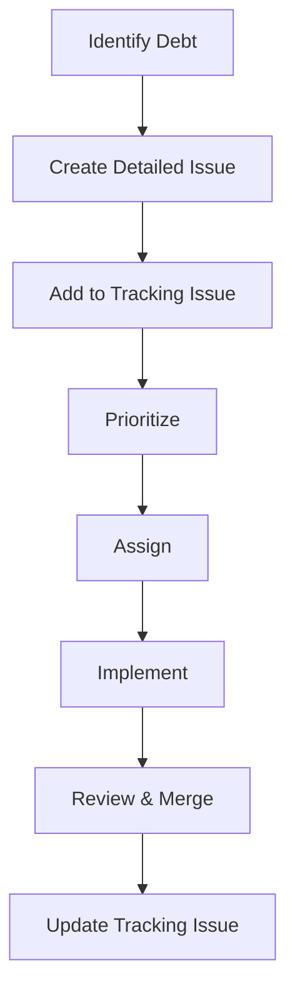

# Technical Debt Issues Index

This directory contains detailed issue descriptions for the 2024Q2 technical debt wave.

## Issue List

### Tracking Issue
- [TRACKING-ISSUE-TD-WAVE-2024Q2.md](issues/TRACKING-ISSUE-TD-WAVE-2024Q2.md) - Main tracking issue

### P0 - Critical Issues
1. [TD-01: Collapse Composite Duplication Cluster 8b680b57b0a1](issues/TD-01-Collapse-Composite-Duplication-Cluster.md)
   - **Goal**: Reduce 78 duplicate instances to ≤5
   - **Impact**: Major maintainability improvement
   - **Estimate**: 9 days

2. [TD-02: Consolidate or Retire Column Ordering Stack](issues/TD-02-Consolidate-Column-Ordering-Stack.md)
   - **Goal**: Reduce column ordering complexity by ≥60%
   - **Impact**: API simplification, reduced cognitive load
   - **Estimate**: 11 days

3. [TD-03: Validate and Trim FSM Helper Module](issues/TD-03-Validate-Trim-FSM-Helper.md)
   - **Goal**: Reduce FSM helper size by ≥40% or validate as false positive
   - **Impact**: State management simplification
   - **Estimate**: 8 days

### P1 - High Priority Issues
4. [TD-04: Simplify Checkpoint State Surface](issues/TD-04-Simplify-Checkpoint-State.md)
   - **Goal**: Reduce checkpoint state complexity by ≥30%
   - **Impact**: Better integration with canonical runtime
   - **Estimate**: 10 days

5. [TD-05: Decompose or Retire Merge Input Mixin Stack](issues/TD-05-Decompose-Merge-Input-Mixin.md)
   - **Goal**: Separate live paths from legacy compatibility
   - **Impact**: Cleaner merge architecture
   - **Estimate**: 8 days

6. [TD-06: Audit Zero-Anchor Composite Services](issues/TD-06-Audit-Zero-Anchor-Services.md)
   - **Goal**: Reduce false positive rate to ≤10%
   - **Impact**: Improved signal accuracy
   - **Estimate**: 7 days

### P2 - Medium Priority Issues
7. [TD-07: Simplify Runner Stage Mixin Concentration](issues/TD-07-Simplify-Runner-Mixin-Concentration.md)
   - **Goal**: Reduce mixin complexity in runner package
   - **Impact**: Future simplification target identified
   - **Estimate**: 6 days

8. [TD-08: Calibrate Composite-Layer Scoring](issues/TD-08-Calibrate-Composite-Scoring.md)
   - **Goal**: Improve retirement/complexity signal accuracy
   - **Impact**: Better technical debt detection
   - **Estimate**: 5 days

## Quick Reference Table

| Issue | Title | Priority | Estimate | Status |
|-------|-------|----------|----------|--------|
| TD-01 | Collapse Composite Duplication Cluster | P0 | 9 days | ⏳ Planned |
| TD-02 | Consolidate Column Ordering Stack | P0 | 11 days | ⏳ Planned |
| TD-03 | Validate and Trim FSM Helper | P0 | 8 days | ⏳ Planned |
| TD-04 | Simplify Checkpoint State | P1 | 10 days | ⏳ Planned |
| TD-05 | Decompose Merge Input Mixin | P1 | 8 days | ⏳ Planned |
| TD-06 | Audit Zero-Anchor Services | P1 | 7 days | ⏳ Planned |
| TD-07 | Simplify Runner Mixin Concentration | P2 | 6 days | ⏳ Planned |
| TD-08 | Calibrate Composite Scoring | P2 | 5 days | ⏳ Planned |

**Total Estimated Effort**: 64 days

## How to Use These Issues

1. **For Contributors**:
   - Pick an unassigned issue from the tracking issue
   - Follow the detailed plan in the individual issue file
   - Create PRs referencing both tracking issue and specific issue

2. **For Reviewers**:
   - Use the success criteria for acceptance
   - Verify using the provided verification commands
   - Check architecture boundaries are maintained

3. **For Project Managers**:
   - Track progress in the tracking issue
   - Monitor risk assessment section
   - Escalate blockers as needed

## Issue Creation Workflow

## Standards Compliance

All issues follow the BioETL technical debt issue template:
- Clear problem statement
- Root cause analysis
- Phased solution plan
- Success criteria
- Verification commands
- Impact assessment
- Time estimates

## Related Documentation

- [Technical Debt Management](README.md)
- [Composition Layer Architecture](../02-architecture/05-composition-layer.md)
- [Import Matrix Rules](../00-project/RULES.md#import-matrix)

## Status Legend

- ⏳ Planned - Not yet started
- 🔄 In Progress - Actively being worked on
- ✅ Completed - Resolved and verified
- ❌ Blocked - Waiting on dependencies
- ⚠️ Needs Review - Ready for review

## Contribution Guidelines

1. Claim issues by commenting on the tracking issue
2. Follow the existing issue format for new issues
3. Update issue status regularly
4. Reference issues in commit messages (`Fixes TD-01`)
5. Create PRs with clear descriptions and verification steps
