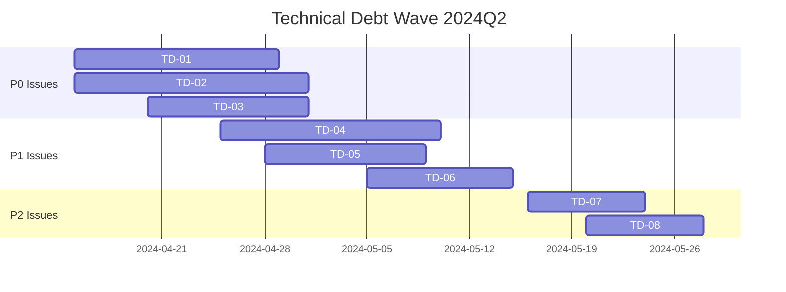

# Technical Debt Management

This directory contains the comprehensive technical debt management system for BioETL.

## 2024Q2 Technical Debt Wave

**Status**: Active  
**Start Date**: 2024-04-13  
**Target Completion**: 2024-06-30

## Structure

```
docs/06-technical-debt/
├── README.md                          # This file
├── ISSUES-INDEX.md                    # Complete issue catalog
├── issues/                            # Individual issue descriptions
│   ├── TRACKING-ISSUE-TD-WAVE-2024Q2.md  # Main tracking issue
│   ├── TD-01-Collapse-Composite-Duplication-Cluster.md
│   ├── TD-02-Consolidate-Column-Ordering-Stack.md
│   ├── TD-03-Validate-Trim-FSM-Helper.md
│   ├── TD-04-Simplify-Checkpoint-State.md
│   ├── TD-05-Decompose-Merge-Input-Mixin.md
│   ├── TD-06-Audit-Zero-Anchor-Services.md
│   ├── TD-07-Simplify-Runner-Mixin-Concentration.md
│   └── TD-08-Calibrate-Composite-Scoring.md
└── reports/                           # Analysis reports (created during work)
```

## Current Wave Summary

### Issues Created: 8
- **P0 (Critical)**: 3 issues - 37 days total
- **P1 (High)**: 3 issues - 25 days total  
- **P2 (Medium)**: 2 issues - 11 days total

**Total Estimated Effort**: 73 days

### Priority Breakdown

| Priority | Count | Total Days | % of Total |
|----------|-------|------------|------------|
| P0       | 3     | 37         | 50.7%      |
| P1       | 3     | 25         | 34.2%      |
| P2       | 2     | 11         | 15.1%      |

## Issue Standards

All issues follow the BioETL technical debt issue template:

### Required Sections
- **Problem Statement**: Clear description of the issue
- **Root Cause**: Analysis of how the debt accumulated
- **Scope**: Affected files and impact analysis
- **Solution Plan**: Phased approach with timelines
- **Success Criteria**: Measurable outcomes
- **Verification Commands**: Test and validation scripts
- **Impact Assessment**: Risks and benefits
- **Time Estimate**: Detailed breakdown

### Quality Standards
- ✅ RFC 2119 compliance (MUST/SHOULD/MAY)
- ✅ Executable verification commands
- ✅ Architecture boundary awareness
- ✅ Test coverage requirements
- ✅ Documentation updates

## Workflow


## Getting Started

### For Contributors
1. Read the [Tracking Issue](issues/TRACKING-ISSUE-TD-WAVE-2024Q2.md)
2. Pick an unassigned issue from the index
3. Comment on the tracking issue to claim it
4. Follow the detailed plan in the issue
5. Create PRs with proper references

### For Reviewers
1. Use the success criteria for acceptance
2. Run the verification commands
3. Check architecture boundaries
4. Validate test coverage

### For Project Managers
1. Monitor the [Tracking Issue](issues/TRACKING-ISSUE-TD-WAVE-2024Q2.md)
2. Track progress in the index
3. Escalate blockers as needed
4. Update timelines as work progresses

## Key Metrics

### Target Improvements
- **Duplication**: 78 → ≤5 instances (-93%)
- **Column Complexity**: ≥60% reduction
- **FSM Helper Size**: ≥40% reduction
- **Checkpoint Complexity**: ≥30% reduction
- **False Positive Rate**: → ≤10%
- **Overall Composite Score**: ≥25% improvement

### Current Status
- **Issues Created**: 8/8 ✅
- **Issues Assigned**: 0/8
- **Issues Completed**: 0/8
- **Days Completed**: 0/73

## Related Documentation

- [Technical Debt Management](#technical-debt-management)
- [Composition Layer Architecture](../02-architecture/05-composition-layer.md)
- [Import Matrix Rules](../00-project/RULES.md#import-matrix)
- [Architecture Decision Records](../02-architecture/decisions/README.md)

## Tools and Commands

### Analysis Tools
```bash
# Duplication detection
jscpd --format python --output reports/duplication/ src/bioetl/application/composite/

# Complexity analysis
radon cc src/bioetl/application/composite/ -a

# Dependency graph
pydeps src/bioetl/application/services/ --show-dot | dot -Tsvg > reports/service_dependencies.svg

# Test coverage
pytest --cov=src/bioetl/application/composite/ --cov-report=html
```

### Verification Tools
```bash
# Architecture tests
pytest tests/architecture/ -v

# Type checking
mypy src/bioetl/application/composite/ --strict

# Import boundary verification
grep -rn "^from bioetl.infrastructure" src/bioetl/domain/ --include="*.py"
```

## Success Criteria for This Wave

- [ ] All P0 issues resolved
- [ ] All P1 issues resolved
- [ ] All P2 issues resolved
- [ ] Overall composite layer complexity improved by ≥25%
- [ ] False positive rate reduced to ≤10%
- [ ] No critical architecture boundary violations
- [ ] Documentation updated for all changes
- [ ] Test coverage maintained or improved

## Communication

- **Tracking Issue**: [TRACKING-ISSUE-TD-WAVE-2024Q2.md](issues/TRACKING-ISSUE-TD-WAVE-2024Q2.md)
- **Weekly Sync**: #architecture channel
- **Blockers**: Escalate to @bioetl-architects
- **Questions**: #help-technical-debt channel

## Timeline



## How This Fits Into BioETL

The technical debt management system integrates with:

1. **Development Workflow**: Issues created from debt analysis
2. **Architecture Governance**: Ensures boundaries are maintained
3. **Quality Gates**: Verification commands in CI/CD
4. **Documentation**: Automatic updates from issue resolution
5. **Metrics**: Feeds into project health dashboards

## Future Improvements

- Automated debt detection in CI/CD
- Machine learning-based signal improvement
- Integration with project management tools
- Automated issue creation from analysis

## License

All technical debt documentation and issue templates are licensed under the same terms as the BioETL project.

## Contributing

See [CONTRIBUTING.md](../../.github/CONTRIBUTING.md) for guidelines on contributing to technical debt resolution.
