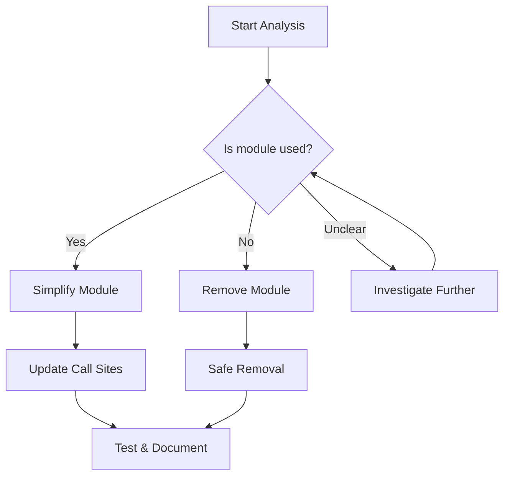

# TD-03: Validate and Trim FSM Helper Module

**Status**: Open  
**Priority**: P0  
**Labels**: `technical-debt`, `refactoring`, `fsm`, `investigation`  
**Epic**: Technical Debt Wave 2024Q2

## Problem

The `fsm_helper.py` module contains `FSMStateHelperService` and `ResumePhaseInfo` classes that have been flagged as:
- Top retirement candidates
- Top complexity contributors

This suggests they may be either:
1. Dead code that can be removed
2. Overly complex implementations that need simplification
3. False positives from recent refactoring

## Root Cause

Unclear ownership and usage patterns have led to:
- Accumulation of unused or rarely used functionality
- Complex state management that may no longer be needed
- Potential dead code paths

## Scope

**Primary File:**
- `src/bioetl/application/services/fsm_helper.py`

**Impact Analysis:**
```bash
# Find all usages
grep -rn "FSMStateHelperService\|ResumePhaseInfo\|from.*fsm_helper" src/ --include="*.py"

# Check test coverage
pytest --cov=src/bioetl/application/services/fsm_helper.py --cov-report=term --dry-run
```

## Solution Plan

### Phase 1: Investigation (3 days)
1. **Code Usage Analysis**
   ```bash
   # Create detailed usage report
   grep -rn "FSMStateHelperService\|ResumePhaseInfo" src/ > reports/fsm_usage_analysis.txt
   ```

2. **Test Coverage Analysis**
   - Run coverage report
   - Identify untested code paths
   - Determine if untouched code is dead or just untested

3. **Git History Analysis**
   ```bash
   # Check recent changes
   git log --oneline -20 -- src/bioetl/application/services/fsm_helper.py
   
   # Find when classes were last modified
   git log -p -- src/bioetl/application/services/fsm_helper.py | grep -A5 -B5 "FSMStateHelperService\|ResumePhaseInfo"
   ```

### Phase 2: Decision (2 days)
1. **Consult with Domain Experts**
   - Determine if FSM functionality is still needed
   - Understand current usage patterns
   - Identify potential replacement patterns

2. **Create Decision Document**
   - Document findings in `reports/technical-debt/fsm-analysis.md`
   - Recommend action: remove, simplify, or keep
   - Include cost/benefit analysis

3. **Create ADR if needed**
   - If removal: `ADR-045-fsm-helper-removal.md`
   - If simplification: `ADR-045-fsm-helper-simplification.md`

### Phase 3: Implementation (3 days - if simplification needed)
1. **Simplify Module**
   ```python
   # Example simplified structure
   class FSMStateHelper:
       """Simplified FSM state helper."""
       
       def __init__(self, initial_state: FSMState):
           self._state = initial_state
           
       def transition(self, event: FSMEvent) -> FSMState:
           """Handle state transition."""
           # Simplified logic
           return self._state_machine.transition(self._state, event)
   ```

2. **Update Call Sites**
   - Replace complex usage with simplified API
   - Ensure backward compatibility where possible
   - Add deprecation warnings for removed functionality

3. **Improve Testing**
   - Add missing test cases
   - Achieve ≥90% coverage
   - Add property-based tests for state transitions

### Phase 4: Removal (1 day - if full removal decided)
1. **Safe Removal**
   - Confirm no live usage
   - Update imports
   - Remove file

2. **Update Documentation**
   - Remove references
   - Update architecture diagrams
   - Add migration notes if needed

## Success Criteria

- [ ] FSM helper module size reduced by ≥40%
- [ ] Clear decision documented (keep/simplify/remove)
- [ ] All live functionality preserved
- [ ] Test coverage ≥90%
- [ ] No regressions in FSM-related functionality

## Verification Commands

```bash
# Check for remaining usage after changes
grep -rn "FSMStateHelperService\|ResumePhaseInfo" src/ --include="*.py" | grep -v "fsm_helper.py"

# Run FSM-related tests
pytest tests/application/services/ -k "fsm" -v

# Type checking
mypy src/bioetl/application/services/fsm_helper.py --strict

# Coverage
pytest --cov=src/bioetl/application/services/fsm_helper.py --cov-report=term
```

## Impact Assessment

**Positive Impacts:**
- Reduced complexity in state management
- Clearer FSM implementation
- Easier testing and maintenance
- Potential performance improvements

**Potential Risks:**
- Breaking changes if functionality is still used
- State management bugs
- Incorrect removal of live code

**Mitigation:**
- Thorough usage analysis
- Consultation with domain experts
- Comprehensive testing
- Gradual deprecation if needed

## Related Issues

- Related: TD-06 (false positive audit) - may help validate signals
- Blocks: TD-08 (scoring calibration) - improve signal accuracy

## Checklist

- [ ] Usage analysis complete
- [ ] Decision document created
- [ ] ADR created (if needed)
- [ ] Implementation complete
- [ ] Tests updated and passing
- [ ] Documentation updated

## Time Estimate

**Total**: 8 days (investigation + decision + implementation)  
**Start**: 2024-04-20  
**Target Completion**: 2024-05-01

## Assignee

(TBD - comment on tracking issue to claim)

## Decision Tree



## Notes

This issue is critical for understanding the accuracy of our technical debt detection. If this turns out to be a false positive, we need to improve our signal calibration (TD-08). If it's real debt, removing or simplifying this module will significantly reduce complexity in the FSM layer.
