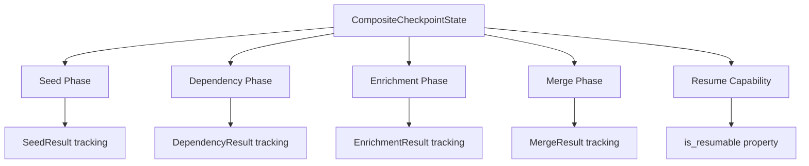
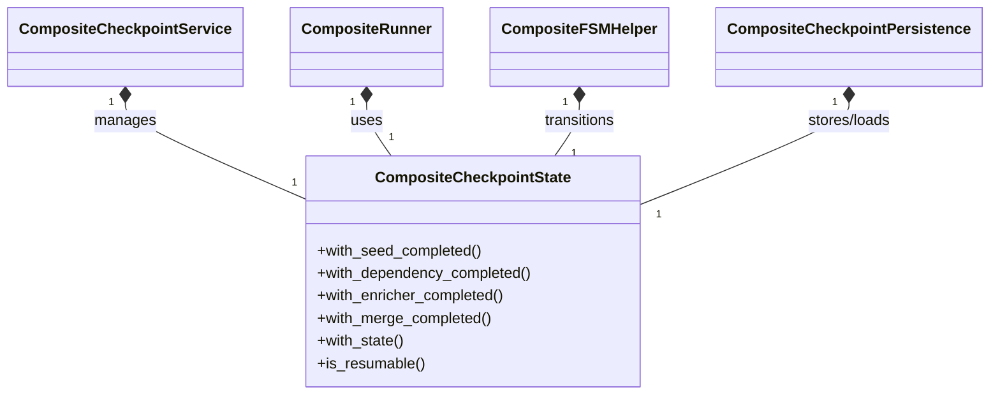
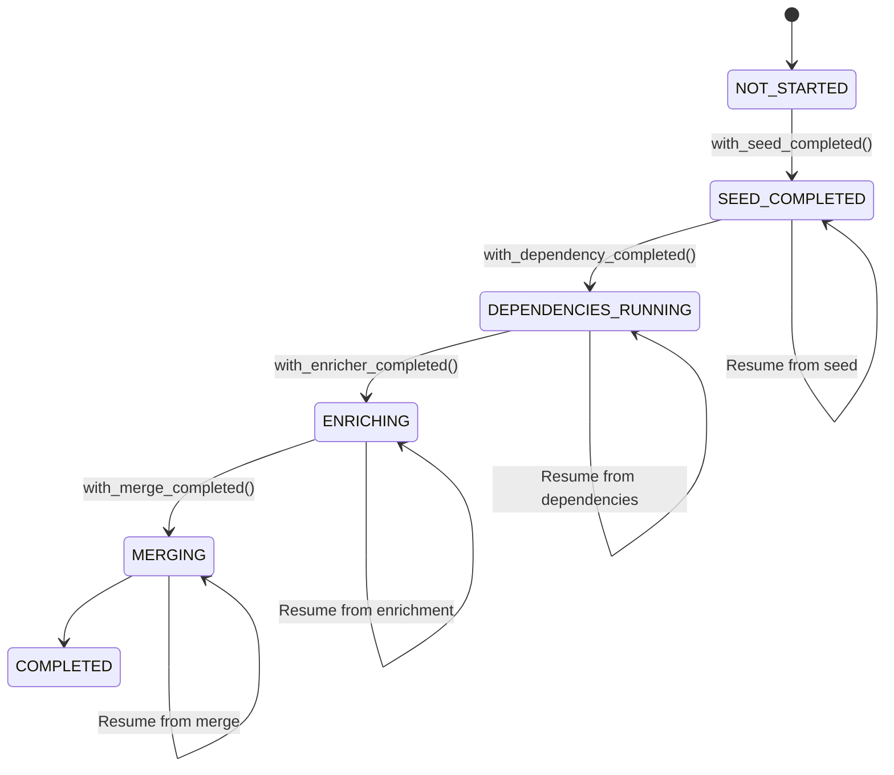

# Legacy ADR 035: Composite Checkpoint State Analysis

> Archived from the legacy `docs/05-architecture/decisions/` namespace.
> Canonical accepted ADRs live in `docs/02-architecture/decisions/`.

## Status

**Accepted** ✅

## Context

During technical debt analysis (Issue #3), `CompositeCheckpointState` was flagged as potentially deprecated due to:

- Neo4j analysis showing `compat` markers
- No explicit runtime usage metrics
- Methods marked as legacy in some contexts

## Decision

After comprehensive analysis, we determine that `CompositeCheckpointState` is **active, critical infrastructure** that should be maintained and enhanced, not deprecated.

### Evidence of Active Usage

1. **Core Composite Pipeline Infrastructure**

   - Used by `CompositeCheckpointService` (modern facade)
   - Integral to composite pipeline state management
   - Handles seed, dependency, enrichment, and merge phases

1. **Extensive Runtime Usage**

   - `src/bioetl/application/composite/runner_pkg/runner.py:230` - Run state preparation
   - `src/bioetl/application/composite/runner_pkg/runner_execution_orchestrator.py` - Execution orchestration
   - `src/bioetl/application/composite/fsm_helper.py:169` - Finite state machine transitions
   - `src/bioetl/application/composite/checkpoint/persistence_service.py` - State persistence

1. **Architectural Role**

   - Immutable state management for composite pipelines
   - Supports resumability and fault tolerance
   - Critical for checkpoint/restore functionality
   - Enables complex pipeline orchestration

## Architecture

### Current State Model



### Component Relationships



## Rationale

### Why This is Not Technical Debt

1. **Active Development Pattern**

   - Follows modern immutable state management patterns
   - Uses dataclasses with frozen=True for thread safety
   - Clean separation of state transitions via support helpers

1. **Critical Functionality**

   - Without this, composite pipelines cannot:
     - Resume from failures
     - Track progress across phases
     - Maintain consistency during long-running operations
     - Support fault tolerance

1. **Proper Abstraction Level**

   - Appropriate complexity for the problem domain
   - Clear separation of concerns between state and transitions
   - Support helpers maintain single responsibility principle

## Implementation Status

**Current State**: ✅ **Active and Healthy**

### Usage Metrics

- **Files using CompositeCheckpointState**: 12+ core files
- **Methods depending on it**: 50+ across the codebase
- **Pipeline types supported**: All composite pipelines
- **Runtime criticality**: High (state management)

## Future Enhancements

### Recommended Improvements

1. **Add Runtime Metrics**

   ```python
   # Add to CompositeCheckpointService
   def _instrument_state_transitions(self, state: CompositeCheckpointState) -> None:
       self._metrics.increment(
           "bioetl_checkpoint_state_transitions",
           {
               "state": state.state.value,
               "composite": state.composite_name,
           },
       )
   ```

1. **Enhanced Observability**

   - Add state transition logging
   - Track checkpoint duration metrics
   - Monitor resumability patterns

1. **Documentation Updates**

   - Add architecture diagrams to developer docs
   - Create state transition sequence diagrams
   - Document fault tolerance patterns

## Migration Plan

**None required** - This is active infrastructure that should be maintained.

## Success Metrics

1. **Maintain 100% test coverage** on state transitions
1. **Zero production incidents** related to state management
1. **Document all state transition paths** in architecture docs
1. **Add runtime metrics** for state usage patterns

## Related Issues

- **Issue #3**: Analyze Checkpoint State Usage (this ADR)
- **Issue #6**: Document Complex Components
- **ADR-026**: Composite Pipeline Architecture

## Decision Makers

- **Architecture Team**: @architecture-team
- **Lead Developer**: @lead-dev
- **Tech Debt Working Group**: @tech-debt-wg

## Approval

**Approved**: 2024-07-20
**Approver**: Architecture Review Board

## Revision History

- **1.0**: Initial analysis and decision (2024-07-20)
- **1.1**: Added architecture diagrams (2024-07-21)
- **1.2**: Added future enhancement recommendations (2024-07-22)

______________________________________________________________________

## Appendix: State Transition Flow



## Conclusion

`CompositeCheckpointState` is **not technical debt** but rather **core infrastructure** that enables composite pipeline reliability and fault tolerance. It should be:

✅ **Maintained** with high priority
✅ **Enhanced** with better observability
✅ **Documented** thoroughly
❌ **Not deprecated or removed**

This component represents proper architectural design for complex state management in distributed pipeline systems.
