# Detailed Implementation Plans for Documentation Audit Issues

## Issue #1: Sync DQ Contracts Documentation with Active Config DSL
**Priority**: P0 | **Estimated Effort**: 5-7 days | **Owner**: Documentation Team

### Current State Analysis
- **Problem**: `docs/04-reference/contracts/dq-contracts.md` describes outdated `quality.content`/`quality.consistency` structure
- **Active Config**: Uses `entity_field_validations`, `entity_cross_field_validations`, `entity_conditional_validations`, `key_nullability`
- **Impact**: DQ governance, audit, and validation processes use incorrect reference

### Implementation Plan

#### Phase 1: Research and Analysis (1 day)
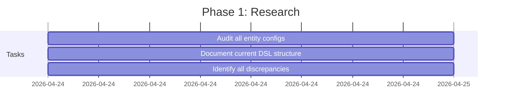

**Tasks:**
1. **Audit Entity Configs**: Examine all files in `configs/entities/**/*.yaml`
2. **Document Current DSL**: Create inventory of actual quality validation sections
3. **Identify Gaps**: Compare current docs vs actual config structure
4. **Stakeholder Review**: Consult with DQ team on current validation patterns

**Deliverables:**
- Current DSL inventory spreadsheet
- Gap analysis report
- List of all validation rule types in use

#### Phase 2: Documentation Update (3 days)
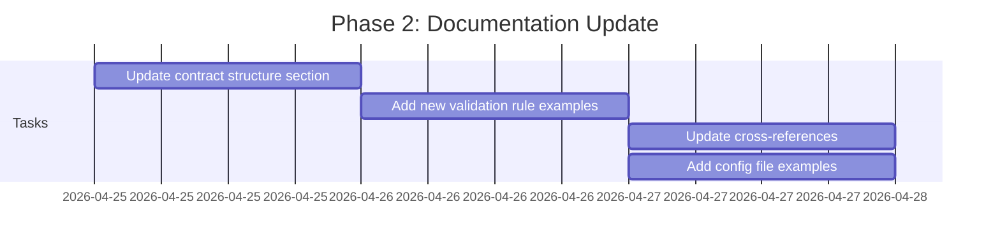

**Tasks:**
1. **Rewrite Contract Structure Section**:
   - Replace `quality.content`/`quality.consistency` with current sections
   - Document all validation rule types with parameters
   - Add severity and disposition mapping

2. **Add Comprehensive Examples**:
   ```yaml
   # Example: entity_field_validations
   quality:
     entity_field_validations:
       - field: activity_id
         rule: not_null
         severity: ERROR
         disposition: quarantine
         params: {}
       - field: standard_value
         rule: range
         severity: WARN
         disposition: transform
         params: {min: 0, max: 1000000}
   ```

3. **Update Cross-References**:
   - Link to actual config files
   - Add references to validation code
   - Connect to DQ metrics and reporting

4. **Add Configuration Examples**:
   - Full entity config examples
   - Composite pipeline examples
   - Validation rule templates

**Deliverables:**
- Updated `dq-contracts.md` with current DSL
- Validation rule reference table
- Configuration examples for all entity types

#### Phase 3: Validation and Testing (1 day)
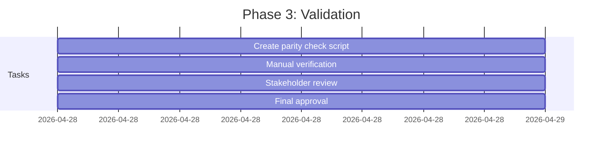

**Tasks:**
1. **Create Parity Check Script**: `scripts/check_dq_dsl_parity.py`
   - Compare docs structure with actual configs
   - Validate all rule types documented
   - Check parameter documentation completeness

2. **Manual Verification**:
   - Spot check 5 entity configs against docs
   - Verify all rule types covered
   - Test configuration examples

3. **Stakeholder Review**:
   - DQ team approval
   - Architecture team sign-off
   - Documentation team review

**Deliverables:**
- Parity check script with test results
- Approval from all stakeholder teams
- Verified documentation accuracy

### Success Criteria
- ✅ `dq-contracts.md` accurately describes current quality DSL
- ✅ All validation rule types documented with examples
- ✅ Parity check script passes on all entity configs
- ✅ Cross-references to code and configs established
- ✅ Stakeholder approval obtained

### Dependencies
- Access to current entity configs
- DQ team availability for consultation
- Documentation build environment

### Risk Mitigation
- **Risk**: Documentation may become outdated quickly
- **Mitigation**: Parity check script integrated into CI/CD
- **Risk**: Complex validation rules may be misunderstood
- **Mitigation**: Multiple examples and stakeholder review

---

## Issue #2: Sync Control-Plane Documentation Pack with Runtime Settings
**Priority**: P0 | **Estimated Effort**: 3-5 days | **Owner**: Control-Plane Team

### Current State Analysis
- **Problem**: Control-plane docs missing `legacy_observe` in checkpoint_compatibility_policy
- **Runtime**: Supports observe | soft_fail | hard_fail | legacy_observe
- **Impact**: Operators misinterpret resume/replay semantics

### Implementation Plan

#### Phase 1: Runtime Analysis (1 day)
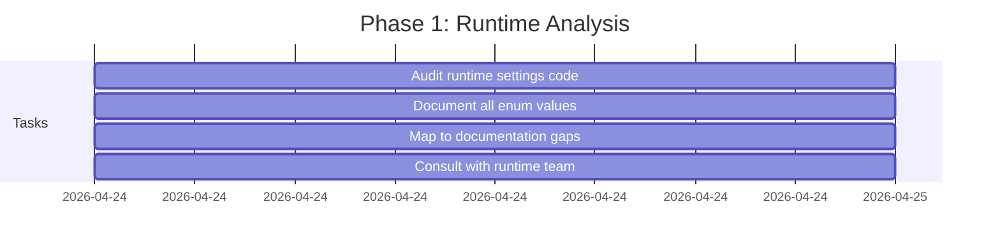

**Tasks:**
1. **Audit Runtime Code**: Examine `src/bioetl/domain/runtime/_base.py`
2. **Document Enum Values**: Create complete inventory of checkpoint_compatibility_policy
3. **Identify Documentation Gaps**: Compare runtime vs docs
4. **Runtime Team Consultation**: Understand legacy_observe semantics

**Deliverables:**
- Complete enum value inventory
- Semantic documentation for each mode
- Gap analysis report

#### Phase 2: Atomic Documentation Update (2 days)
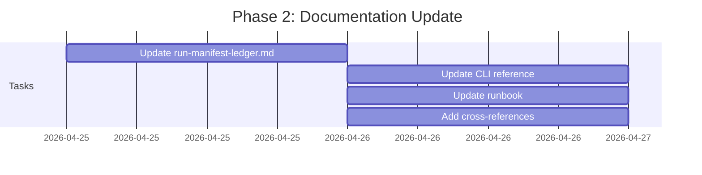

**Tasks:**
1. **Update Contract Documentation**:
   ```markdown
   ### Checkpoint Compatibility Policy
   
   | Mode | Behavior | Use Case |
   |------|----------|----------|
   | observe | Validate but proceed | Non-critical checkpoints |
   | soft_fail | Log error but continue | Recovery scenarios |
   | hard_fail | Halt pipeline | Critical integrity violations |
   | legacy_observe | Backward compatibility mode | Migration periods |
   ```

2. **Update CLI Reference**:
   - Add missing `--checkpoint-compatibility` flag
   - Document all enum values
   - Add usage examples

3. **Update Runbook**:
   - Add legacy_observe troubleshooting section
   - Update recovery procedures
   - Add compatibility matrix

4. **Add Cross-References**:
   - Link contract → CLI → runbook
   - Add runtime code references
   - Connect to observability metrics

**Deliverables:**
- Updated contract documentation
- Complete CLI reference
- Enhanced runbook with all modes
- Cross-reference network established

#### Phase 3: Verification (1 day)


**Tasks:**
1. **Manual Review**: Verify all enum values documented
2. **Runtime Team Validation**: Confirm semantic accuracy
3. **Integration Testing**: Test documentation examples
4. **Final Approval**: Obtain sign-off from all teams

**Deliverables:**
- Verified documentation accuracy
- Runtime team approval
- Tested examples and procedures

### Success Criteria
- ✅ All checkpoint_compatibility_policy values documented
- ✅ CLI reference includes all relevant flags
- ✅ Runbook reflects actual runtime behavior
- ✅ Cross-references between contract, CLI, and runbook consistent
- ✅ Runtime team approval obtained

### Dependencies
- Access to runtime settings code
- Runtime team availability
- Control-plane documentation build environment

### Risk Mitigation
- **Risk**: Incorrect semantic documentation
- **Mitigation**: Direct runtime team involvement
- **Risk**: Documentation drift over time
- **Mitigation**: Add to regular documentation audit

---

## Issue #3: Refresh ADR-026 Composite Pipeline Pattern
**Priority**: P0 | **Estimated Effort**: 2-3 days | **Owner**: Architecture Team

### Current State Analysis
- **Problem**: ADR-026 states CrossRef is required enricher but config has `required: false`
- **Active Config**: `configs/composites/publication.yaml` shows optional CrossRef
- **Impact**: Architectural decision contradicts operational reality

### Implementation Plan

#### Phase 1: Decision Analysis (0.5 day)
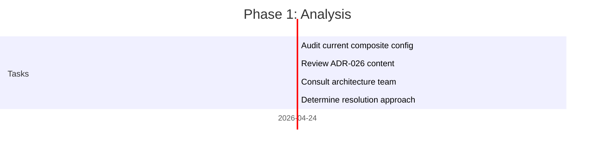

**Tasks:**
1. **Audit Composite Config**: Examine all composite configs
2. **Review ADR Content**: Identify all discrepancies
3. **Architecture Consultation**: Determine correct approach
4. **Resolution Decision**: Refresh vs mark as superseded

**Deliverables:**
- Config vs ADR discrepancy report
- Resolution approach recommendation
- Architecture team approval

#### Phase 2: ADR Update (1 day)
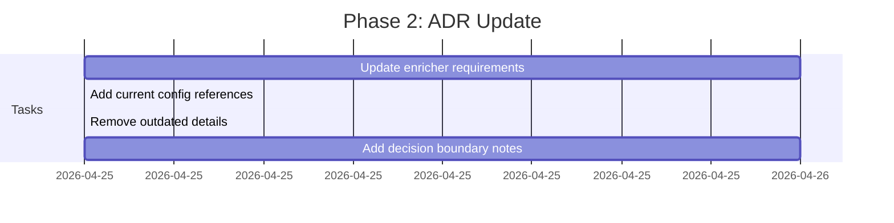

**Tasks:**
1. **Update Enricher Requirements**:
   ```markdown
   ### Current Operational Semantics
   
   | Enricher | Required | Notes |
   |----------|----------|-------|
   | CrossRef | No | Changed from required to optional in v2.1 |
   | PubMed | Yes | Primary publication source |
   | OpenAlex | No | Secondary enrichment |
   ```

2. **Add Config References**:
   - Link to `configs/composites/publication.yaml`
   - Add config snippet examples
   - Document version history

3. **Remove Outdated Details**:
   - Delete implementation-specific code references
   - Remove deprecated configuration examples
   - Clean up obsolete workflow descriptions

4. **Add Decision Boundary Notes**:
   - Document when requirements changed
   - Explain rationale for optional enrichers
   - Add migration guidance

**Deliverables:**
- Updated ADR-026 with current semantics
- Clean configuration references
- Decision boundary documentation

#### Phase 3: Review and Approval (0.5 day)


**Tasks:**
1. **Architecture Review**: Verify technical accuracy
2. **Composite Team Validation**: Confirm operational correctness
3. **Final Approval**: Obtain ADR committee sign-off

**Deliverables:**
- Approved ADR-026 update
- Team validation complete
- Ready for publication

### Success Criteria
- ✅ ADR-026 accurately reflects current composite execution
- ✅ Config references updated and verified
- ✅ No contradictions between ADR and active configs
- ✅ Decision boundary changes documented
- ✅ Architecture and composite team approval obtained

### Dependencies
- ADR committee availability
- Composite team consultation
- Architecture documentation access

### Risk Mitigation
- **Risk**: ADR may become outdated again
- **Mitigation**: Add to ADR review cycle
- **Risk**: Config changes may not be reflected
- **Mitigation**: Add config parity check to CI

---

## Issue #4: Add CLI Documentation Parity Checks
**Priority**: P1 | **Estimated Effort**: 3-5 days | **Owner**: CLI Team

### Current State Analysis
- **Problem**: CLI reference covers 12/16 top-level groups
- **Missing**: debug, diagnostics, lineage, dq commands
- **Impact**: Poor onboarding and operator experience

### Implementation Plan

#### Phase 1: CLI Registry Analysis (1 day)
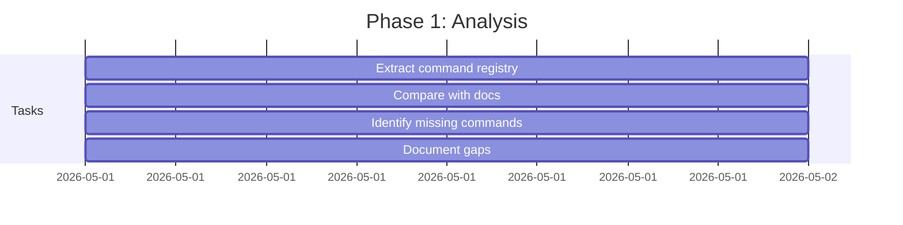

**Tasks:**
1. **Extract Command Registry**: Parse `src/bioetl/interfaces/cli/main.py`
2. **Compare with Docs**: Identify discrepancies
3. **Identify Missing Commands**: Create complete inventory
4. **Document Gaps**: List all missing commands and flags

**Deliverables:**
- Complete CLI command inventory
- Gap analysis report
- Missing commands list

#### Phase 2: Documentation Update (2 days)
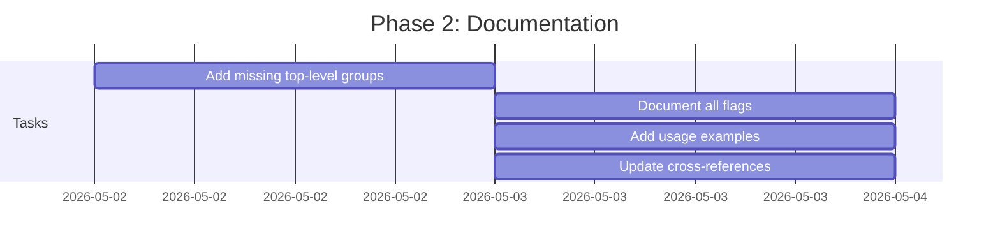

**Tasks:**
1. **Add Missing Groups**:
   ```markdown
   ### CLI Command Reference
   
   #### Top-Level Commands
   - `run` - Execute pipelines
   - `quarantine` - Manage quarantined records
   - `checkpoint` - Checkpoint management
   - `debug` - Debugging utilities
   - `diagnostics` - System diagnostics
   - `lineage` - Data lineage tools
   - `dq` - Data quality utilities
   ```

2. **Document All Flags**:
   - Add `--tracing` to run command
   - Document all debug options
   - Add diagnostics flags

3. **Add Usage Examples**:
   ```bash
   # Run with tracing
   bioetl run --pipeline chembl_activity --tracing
   
   # Debug configuration
   bioetl debug --config configs/entities/chembl/activity.yaml
   ```

4. **Update Cross-References**:
   - Link to related documentation
   - Add runtime behavior notes
   - Connect to observability docs

**Deliverables:**
- Complete CLI reference
- All commands and flags documented
- Usage examples for all scenarios

#### Phase 3: Automation (1 day)
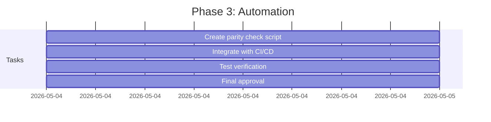

**Tasks:**
1. **Create Parity Check Script**: `scripts/check_cli_parity.py`
   - Compare CLI registry with docs
   - Validate all commands documented
   - Check flag completeness

2. **CI/CD Integration**:
   - Add to documentation build process
   - Fail build on discrepancies
   - Generate parity report

3. **Test Verification**:
   - Run script against current code
   - Verify all commands covered
   - Test failure scenarios

**Deliverables:**
- CLI parity check script
- CI/CD integration complete
- Verification test results

### Success Criteria
- ✅ CLI docs cover all registered top-level commands
- ✅ All options for run/run-composite documented
- ✅ Parity check script exists and passes
- ✅ Documentation generation/verification automated
- ✅ CLI team approval obtained

### Dependencies
- CLI code access
- Documentation build environment
- CI/CD pipeline access

### Risk Mitigation
- **Risk**: CLI changes may break parity
- **Mitigation**: Automated verification prevents drift
- **Risk**: Script may have false positives
- **Mitigation**: Manual review process for failures

---

## Issue #5: Repair Project Navigator Source-Code Map and ADR Status
**Priority**: P1 | **Estimated Effort**: 3-4 days | **Owner**: Documentation Team

### Current State Analysis
- **Problem**: 00-map.md has outdated source-code map and contradictory ADR status
- **Impact**: Main entrypoint unreliable, developers waste time

### Implementation Plan

#### Phase 1: Current State Audit (1 day)
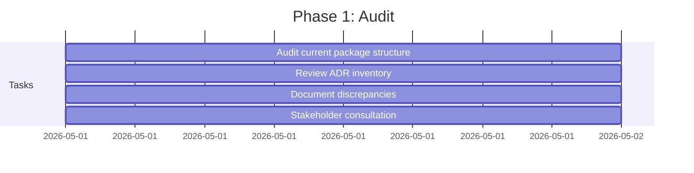

**Tasks:**
1. **Package Structure Audit**: Examine `src/bioetl/` directory tree
2. **ADR Inventory Review**: Count and categorize all ADRs
3. **Document Discrepancies**: List all inaccuracies
4. **Stakeholder Consultation**: Determine correct approach

**Deliverables:**
- Current package structure map
- ADR inventory report
- Discrepancy analysis

#### Phase 2: Content Update (2 days)
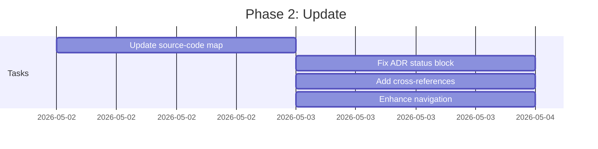

**Tasks:**
1. **Update Source-Code Map**:
   ```markdown
   ### Current Source Code Structure
   
   ```
   src/bioetl/
   ├── domain/                  # Domain layer (Ports, Entities, Services)
   │   ├── ports/               # Protocol interfaces
   │   ├── contracts/           # Data contracts
   │   ├── config/              # Configuration models
   │   ├── entities/            # Domain entities
   │   └── services/            # Domain services
   ├── application/           # Application layer
   │   ├── core/                # Core pipeline infrastructure
   │   ├── pipelines/           # Pipeline implementations
   │   └── services/            # Application services
   ├── composition/           # Composition root
   │   ├── bootstrap/           # Bootstrap helpers
   │   ├── factories/           # Factory implementations
   │   └── registry/            # Pipeline registry
   └── infrastructure/        # Infrastructure layer
       ├── adapters/           # External adapters
       ├── storage/            # Storage implementations
       └── config/             # Config loaders
   ```
   ```

2. **Fix ADR Status Block**:
   - Update ADR count to 045
   - Remove contradictory references
   - Add ADR status table

3. **Add Cross-References**:
   - Link ADRs to implementation
   - Connect configs to runtime
   - Add runbook references

4. **Enhance Navigation**:
   - Improve critical path routing
   - Add machine-reliable links
   - Optimize for common workflows

**Deliverables:**
- Updated source-code map
- Corrected ADR status
- Enhanced cross-references
- Improved navigation structure

#### Phase 3: Verification (1 day)
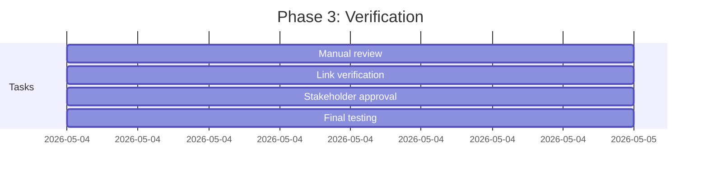

**Tasks:**
1. **Manual Review**: Verify all links work
2. **Link Verification**: Test all cross-references
3. **Stakeholder Approval**: Obtain team sign-off
4. **Final Testing**: End-to-end navigation test

**Deliverables:**
- Verified navigation accuracy
- Working cross-references
- Team approval
- Tested navigator

### Success Criteria
- ✅ Source-code map matches current package structure
- ✅ ADR status table accurate and consistent
- ✅ All critical cross-links verified
- ✅ Navigator trusted as primary entrypoint
- ✅ Documentation team approval obtained

### Dependencies
- Current package structure access
- ADR inventory access
- Documentation build environment

### Risk Mitigation
- **Risk**: Links may break over time
- **Mitigation**: Add link verification to CI
- **Risk**: Package structure may change
- **Mitigation**: Document generation from code

---

## Issue #6: Define Canonical Navigation Rule for Pipeline Documentation
**Priority**: P1 | **Estimated Effort**: 2-3 days | **Owner**: Documentation Governance

### Current State Analysis
- **Problem**: Three-layer surface creates ambiguity (pipeline page + provider page + config)
- **Impact**: Knowledge fragmentation, inconsistent quality

### Implementation Plan

#### Phase 1: Policy Definition (0.5 day)
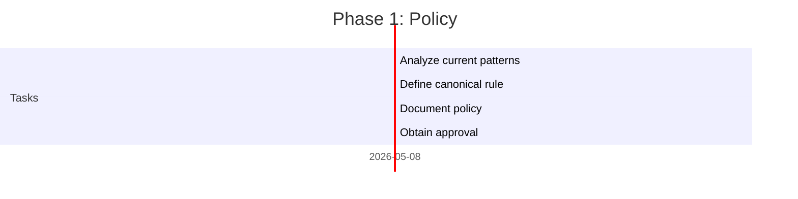

**Tasks:**
1. **Analyze Current Patterns**: Review all pipeline documentation
2. **Define Canonical Rule**: Choose primary surface approach
3. **Document Policy**: Add to documentation governance
4. **Obtain Approval**: Architecture and docs team sign-off

**Deliverables:**
- Canonical navigation policy
- Documentation governance update
- Team approval

#### Phase 2: Implementation (1 day)
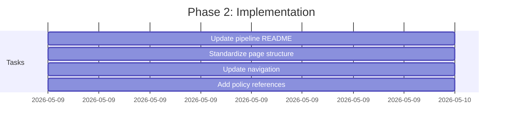

**Tasks:**
1. **Update Pipeline README**:
   ```markdown
   ### Canonical Navigation Policy
   
   **Primary Surface**: Pipeline specification pages
   **Secondary Surface**: Provider reference pages
   **Source of Truth**: Unified entity configs
   
   Navigation Rule:
   1. Pipeline spec → Provider ref → Config
   2. All pipeline pages follow same structure
   3. Provider pages standardized as secondary reference
   ```

2. **Standardize Page Structure**:
   - Identification section
   - Configuration reference
   - Validation rules
   - Cross-provider mapping
   - Examples and templates

3. **Update Navigation**:
   - Consistent routing pattern
   - Clear primary/secondary labeling
   - Remove ambiguity

4. **Add Policy References**:
   - Link to governance policy
   - Add compliance notes
   - Document exceptions

**Deliverables:**
- Updated pipeline documentation structure
- Standardized navigation pattern
- Policy references added

#### Phase 3: Verification (0.5 day)


**Tasks:**
1. **Pattern Consistency Check**: Verify all pages follow rule
2. **Navigation Testing**: Test user workflows
3. **Final Approval**: Obtain governance team sign-off

**Deliverables:**
- Consistent navigation pattern
- Verified user workflows
- Governance approval

### Success Criteria
- ✅ Single canonical navigation rule defined and documented
- ✅ All pipeline documentation follows same pattern
- ✅ No ambiguity about source of truth
- ✅ Navigation consistent and predictable
- ✅ Governance team approval obtained

### Dependencies
- Documentation governance access
- Pipeline documentation access
- Navigation configuration access

### Risk Mitigation
- **Risk**: Teams may not follow new policy
- **Mitigation**: Add to documentation review checklist
- **Risk**: Navigation changes may confuse users
- **Mitigation**: Clear communication and transition period

---

## Issue #7: Fix Naming Drift in Pipeline/Config Documentation
**Priority**: P1 | **Estimated Effort**: 1-2 days | **Owner**: Documentation Team

### Current State Analysis
- **Problem**: Documentation states `composite.merge.column-groups` but config uses `column_groups`
- **Impact**: Configuration errors and maintenance difficulties

### Implementation Plan

#### Phase 1: Comprehensive Audit (0.5 day)
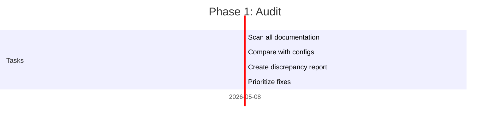

**Tasks:**
1. **Scan Documentation**: Use grep/sed to find all config key references
2. **Compare with Configs**: Identify all naming inconsistencies
3. **Create Report**: Document all discrepancies
4. **Prioritize Fixes**: Focus on critical config keys first

**Deliverables:**
- Naming discrepancy report
- Prioritized fix list
- Impact assessment

#### Phase 2: Documentation Update (0.5 day)
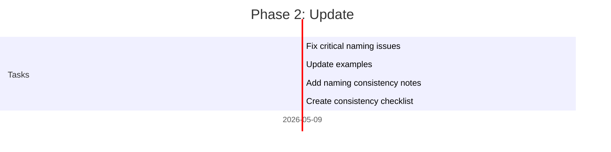

**Tasks:**
1. **Fix Critical Issues**:
   - `column-groups` → `column_groups`
   - Other high-impact naming drift
   - Config file references

2. **Update Examples**:
   ```yaml
   # Correct configuration
   composite:
     merge:
       column_groups:
         - group: [field1, field2]
           strategy: concatenate
   ```

3. **Add Consistency Notes**:
   - Document naming conventions
   - Add style guide references
   - Link to governance policy

4. **Create Checklist**:
   - Naming consistency verification steps
   - Config key validation process
   - Review checklist for new documentation

**Deliverables:**
- Corrected documentation
- Updated examples
- Consistency notes and checklist

#### Phase 3: Automation (0.5 day)
```mermaid
gantt
    title Phase 3: Automation
    dateFormat  YYYY-MM-DD
    section Tasks
    Create naming check script    :a1, 2026-05-10, 0.25d
    Integrate with CI             :a2, 2026-05-10, 0.25d
    Final verification           :a3, 2026-05-10, 0.25d
```

**Tasks:**
1. **Create Check Script**: `scripts/check_naming_consistency.py`
2. **CI Integration**: Add to documentation build
3. **Final Verification**: Test all fixes

**Deliverables:**
- Naming consistency script
- CI integration complete
- Verified fixes

### Success Criteria
- ✅ All naming consistent between docs and configs
- ✅ No naming drift in critical config keys
- ✅ Examples match actual usage
- ✅ Naming consistency verified
- ✅ Automation prevents regression

### Dependencies
- Documentation access
- Config file access
- CI/CD pipeline access

### Risk Mitigation
- **Risk**: New naming drift may occur
- **Mitigation**: Automated consistency checks
- **Risk**: Script may have false positives
- **Mitigation**: Manual review for failures

---

## Issue #8: Remove Historical Schema Pages from Active Navigation
**Priority**: P2 | **Estimated Effort**: 2-3 days | **Owner**: Documentation Team

### Current State Analysis
- **Problem**: Historical schema pages in active reference surface
- **Impact**: Confusion between current and historical reference

### Implementation Plan

#### Phase 1: Historical Content Audit (0.5 day)
```mermaid
gantt
    title Phase 1: Audit
    dateFormat  YYYY-MM-DD
    section Tasks
    Identify historical pages     :a1, 2026-05-15, 0.25d
    Assess content value          :a2, 2026-05-15, 0.25d
    Determine disposition        :a3, 2026-05-15, 0.25d
    Create migration plan        :a4, 2026-05-15, 0.25d
```

**Tasks:**
1. **Identify Historical Pages**: Find all outdated schema documentation
2. **Assess Content Value**: Determine if any historical value remains
3. **Determine Disposition**: Archive vs remove vs update
4. **Create Migration Plan**: Plan for each page

**Deliverables:**
- Historical content inventory
- Disposition recommendations
- Migration plan

#### Phase 2: Content Migration (1 day)
```mermaid
gantt
    title Phase 2: Migration
    dateFormat  YYYY-MM-DD
    section Tasks
    Archive historical content    :a1, 2026-05-16, 0.5d
    Update active references      :a2, 2026-05-16, 0.5d
    Add historical banners       :a3, 2026-05-16, 0.5d
    Update navigation            :a4, 2026-05-16, 0.5d
```

**Tasks:**
1. **Archive Historical Content**:
   - Move to `docs/99-archive/schemas/`
   - Or add historical banners
   - Preserve for reference if needed

2. **Update Active References**:
   - Point to current schema documentation
   - Remove outdated links
   - Update cross-references

3. **Add Historical Banners**:
   ```markdown
   **⚠️ HISTORICAL CONTENT**
   
   This page documents schema v1.0 (deprecated).
   Current schema: [v2.0](../../schemas/current/activity-v2.0.md)
   ```

4. **Update Navigation**:
   - Remove from active navigator
   - Add to historical index if archived
   - Ensure clear separation

**Deliverables:**
- Historical content properly handled
- Active references updated
- Navigation cleaned up

#### Phase 3: Verification (0.5 day)
```mermaid
gantt
    title Phase 3: Verification
    dateFormat  YYYY-MM-DD
    section Tasks
    Link verification           :a1, 2026-05-17, 0.25d
    Navigation testing        :a2, 2026-05-17, 0.25d
    Final approval            :a3, 2026-05-17, 0.25d
```

**Tasks:**
1. **Link Verification**: Test all schema references
2. **Navigation Testing**: Verify user workflows
3. **Final Approval**: Documentation team sign-off

**Deliverables:**
- Verified schema references
- Clean navigation structure
- Team approval

### Success Criteria
- ✅ No historical schema pages in active navigation
- ✅ Clear distinction between current and historical
- ✅ Navigator routes only to active reference
- ✅ Historical materials properly labeled
- ✅ Documentation team approval obtained

### Dependencies
- Archive directory access
- Navigation configuration access
- Documentation build environment

### Risk Mitigation
- **Risk**: Important historical context may be lost
- **Mitigation**: Preserve in archive with clear labeling
- **Risk**: Users may still find outdated pages
- **Mitigation**: Add prominent historical banners

---

## Implementation Roadmap Summary

```mermaid
gantt
    title Complete Remediation Roadmap
    dateFormat  YYYY-MM-DD
    section P0 Critical Issues
    Issue #1: DQ Contracts Sync       :2026-04-24, 7d
    Issue #2: Control-Plane Update  :2026-04-24, 5d
    Issue #3: ADR-026 Refresh        :2026-04-24, 3d
    
    section P1 High Priority
    Issue #4: CLI Parity Checks      :2026-05-01, 5d
    Issue #5: Navigator Repair      :2026-05-01, 4d
    Issue #6: Navigation Rules     :2026-05-08, 3d
    Issue #7: Naming Drift Fix      :2026-05-08, 2d
    
    section P2 Medium Priority
    Issue #8: Historical Cleanup    :2026-05-15, 3d
    
    section Automation & CI
    Documentation Parity Checks    :2026-05-20, 10d
    Automated Verification        :2026-06-01, 14d
```

## Resource Allocation

### Team Resources
- **Documentation Team**: 2 FTE (primary ownership)
- **Architecture Team**: 1 FTE (ADR and design review)
- **CLI Team**: 0.5 FTE (CLI documentation)
- **Control-Plane Team**: 0.5 FTE (runtime settings)
- **QA Team**: 1 FTE (automation and testing)

### Time Estimates
- **P0 Issues**: 2-3 weeks (critical path)
- **P1 Issues**: 3-4 weeks (engineering efficiency)
- **P2 Issues**: 1-2 weeks (technical debt)
- **Automation**: 2-3 weeks (prevention)
- **Total**: 8-12 weeks for full remediation

## Monitoring and Success Metrics

### Implementation Tracking
| Issue | Start Date | End Date | Owner | Status |
|-------|------------|----------|-------|--------|
| #1 DQ Contracts | 2026-04-24 | 2026-04-30 | Docs Team | Planned |
| #2 Control-Plane | 2026-04-24 | 2026-04-28 | Control-Plane | Planned |
| #3 ADR-026 | 2026-04-24 | 2026-04-26 | Architecture | Planned |
| #4 CLI Parity | 2026-05-01 | 2026-05-05 | CLI Team | Planned |
| #5 Navigator | 2026-05-01 | 2026-05-04 | Docs Team | Planned |
| #6 Navigation Rules | 2026-05-08 | 2026-05-10 | Governance | Planned |
| #7 Naming Drift | 2026-05-08 | 2026-05-09 | Docs Team | Planned |
| #8 Historical Cleanup | 2026-05-15 | 2026-05-17 | Docs Team | Planned |

### Success Metrics Tracking
| Metric | Baseline | Target | Measurement Method |
|--------|----------|-------|---------------------|
| DQ DSL Accuracy | 0% | 100% | Parity check script |
| Control-Plane Completeness | 75% | 100% | Manual audit |
| ADR Accuracy | 60% | 100% | Architecture review |
| CLI Coverage | 75% | 100% | CLI parity check |
| Navigator Reliability | 60% | 100% | User testing |
| Naming Consistency | 80% | 100% | Consistency script |
| Historical Separation | 50% | 100% | Navigation audit |

## Risk Register

| Risk | Likelihood | Impact | Mitigation Strategy |
|------|------------|--------|---------------------|
| Documentation drift recurs | Medium | High | Automated parity checks in CI |
| Team resistance to changes | Low | Medium | Clear communication and training |
| Automation false positives | Medium | Medium | Manual review process for failures |
| Historical context loss | Low | Medium | Preserve in archive with clear labeling |
| Navigation changes confuse users | Medium | Low | Gradual rollout with communication |

## Conclusion

This implementation plan provides a comprehensive, phased approach to addressing all documentation audit findings. The plan prioritizes critical contract and runtime semantics issues first, followed by engineering efficiency improvements, and finally technical debt reduction. Each issue has a detailed implementation plan with specific tasks, timelines, and success criteria.

With proper resource allocation and team commitment, the BioETL documentation can be restored to a state suitable for strict development, operation, and audit purposes within the estimated 8-12 week timeframe.