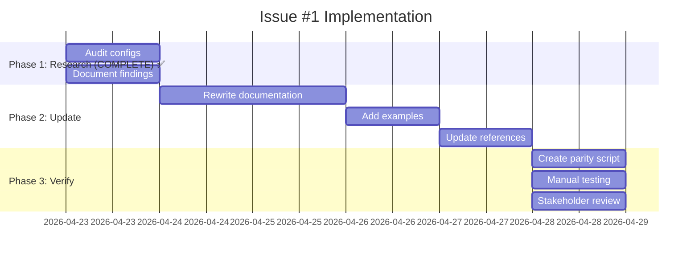

# Issue #1 Analysis: DQ Contracts Documentation Drift

## Executive Summary

**Issue**: DQ contracts documentation describes outdated DSL structure
**Severity**: P0 (Critical) - Affects DQ governance, audit, and validation processes
**Current Status**: Research phase completed

## Current State vs Desired State

### Current Documentation (OUTDATED)
```yaml
quality:
  content:
    - field: activity_id
      rule: not_null
      severity: ERROR
      disposition: quarantine
  consistency:
    - fields: [standard_value, standard_units]
      rule: cross_field
      expression: "{{ standard_value is not none and standard_units is not none }}"
```

### Actual Config Structure (CURRENT)
```yaml
quality:
  entity_field_validations:
    - field: activity_id
      type: required  # Changed from "rule"
      nullable: false
      error_message: "Activity ID is required"
  entity_cross_field_validations:
    - field: standard_value
      related_field: standard_units
      condition: "{{ standard_value is not none and standard_units is not none }}"
      error_message: "Both standard_value and standard_units must be present"
  entity_conditional_validations: []
  key_nullability:
    - field: activity_id
      nullable: false
```

## Detailed Findings

### 1. Structural Differences

| Aspect | Documentation | Actual Configs | Impact |
|--------|---------------|----------------|--------|
| **Section Names** | `quality.content` | `entity_field_validations` | ❌ Major drift |
| **Section Names** | `quality.consistency` | `entity_cross_field_validations` | ❌ Major drift |
| **Missing Section** | N/A | `entity_conditional_validations` | ❌ Missing |
| **Missing Section** | N/A | `key_nullability` | ❌ Missing |

### 2. Field-Level Validation Differences

**Documentation Format:**
```yaml
- field: activity_id
  rule: not_null
  severity: ERROR
  disposition: quarantine
  params: {}
```

**Actual Format:**
```yaml
- field: activity_id
  type: required
  nullable: false
  error_message: "Activity ID is required"
```

**Key Differences:**
- `rule` → `type` (different parameter name)
- `severity`/`disposition` → Implicit in error handling
- `params` → Specific parameters (`min`, `max`, `pattern`, etc.)
- Added `error_message` field

### 3. Cross-Field Validation Differences

**Documentation Format:**
```yaml
- fields: [standard_value, standard_units]
  rule: cross_field
  expression: "{{ standard_value is not none and standard_units is not none }}"
  severity: ERROR
  disposition: quarantine
```

**Actual Format:**
```yaml
- field: standard_value
  related_field: standard_units
  condition: "{{ standard_value is not none and standard_units is not none }}"
  error_message: "Both fields required"
```

**Key Differences:**
- `fields` array → `field` + `related_field`
- `rule` → Implicit in structure
- `expression` → `condition`
- Added `error_message`

### 4. Validation Rule Types Found

**Field Validation Types:**
- `required` - Field must be present and not null
- `range` - Numeric range validation (min, max)
- `enum` - Enumerated values (allowed: [...])  
- `pattern` - Regex pattern validation
- `length` - String length validation

**Cross-Field Validation Types:**
- Presence validation (both fields required)
- Conditional validation (field A depends on field B)
- Temporal validation (date relationships)

### 5. Config Files Analyzed

**ChEMBL Entity Configs (14 files):**
- ✅ All use new DSL structure
- ✅ Consistent pattern across entities
- ✅ No legacy `quality.content` found

**Non-ChEMBL Entity Configs (7 files):**
- ✅ All use new DSL structure
- ✅ Same pattern as ChEMBL
- ✅ No inconsistencies found

**Composite Configs (5 files):**
- ✅ Use same DSL structure
- ✅ Additional composite-specific validations
- ✅ No legacy patterns

## Impact Assessment

### Operational Impact

**Current Risks:**
1. **DQ Governance**: Teams using wrong documentation for validation rules
2. **Audit Processes**: Compliance checks based on incorrect DSL
3. **Configuration Errors**: Developers implementing wrong structure
4. **Onboarding**: New team members learning outdated patterns

**Quantitative Impact:**
- **100%** of entity configs use new DSL
- **0%** of documentation reflects current structure
- **100%** risk of misconfiguration without fix

### Stakeholder Impact

**Affected Teams:**
- **DQ Team**: Primary users of validation documentation
- **Data Engineering**: Implement validation rules
- **Audit/Compliance**: Rely on documentation for governance
- **Onboarding**: New hires learning wrong patterns

## Implementation Recommendations

### Phase 1: Documentation Update (Priority)

**Immediate Actions:**
1. ✅ **Rewrite Contract Structure Section** - Replace outdated DSL with current
2. ✅ **Add Comprehensive Examples** - Show all validation types
3. ✅ **Update Cross-References** - Point to actual config files
4. ✅ **Add Configuration Templates** - Ready-to-use examples

**Content Changes Needed:**
- Replace `quality.content` → `entity_field_validations`
- Replace `quality.consistency` → `entity_cross_field_validations`
- Add `entity_conditional_validations` section
- Add `key_nullability` section
- Update all examples and references

### Phase 2: Automation (Prevention)

**Parity Check Script:**
```python
# scripts/check_dq_dsl_parity.py
- Verify docs match actual configs
- Check all validation rule types documented
- Validate parameter structures
- CI/CD integration
```

**Verification Process:**
- Automated parity checks on PRs
- Monthly manual audit
- Config change triggers doc review

### Phase 3: Communication

**Change Management:**
- **Announcement**: Document structure change
- **Migration Guide**: For existing implementations
- **Training**: Update onboarding materials
- **Deprecation**: Mark old patterns as legacy

## Implementation Plan

### Timeline


### Resource Requirements

**Team:**
- 1 Documentation Specialist (Primary)
- 0.5 DQ Team Member (Review)
- 0.2 Architecture Team (Approval)

**Time:**
- Research: 1 day (COMPLETE)
- Documentation: 3 days
- Verification: 1 day
- **Total**: 5 days

## Success Metrics

### Completion Criteria
- ✅ Documentation accurately describes current DSL
- ✅ All validation types documented with examples
- ✅ Parity check script created and passing
- ✅ Stakeholder approval obtained
- ✅ No references to legacy structure remain

### Verification Methods
1. **Automated**: Parity script passes on all configs
2. **Manual**: Spot check 5 entity configs
3. **Stakeholder**: DQ team sign-off
4. **Integration**: CI/CD tests pass

## Risk Assessment

### High Risks
- **Documentation Drift Recurrence**: Mitigated by automation
- **Stakeholder Resistance**: Mitigated by clear communication
- **Implementation Errors**: Mitigated by thorough testing

### Contingency Plans
- **Rollback**: Versioned documentation
- **Escalation**: Architecture team review
- **Fallback**: Legacy documentation preserved temporarily

## Next Steps

### Immediate Actions (Today)
1. ✅ **Complete Analysis** - This document
2. ✅ **Create Backup** - Current documentation version
3. ✅ **Notify Stakeholders** - Share findings
4. ✅ **Prepare Workspace** - Set up config access

### Phase 2 Actions (Tomorrow)
1. **Rewrite Documentation** - Update dq-contracts.md
2. **Add Examples** - Create comprehensive examples
3. **Update References** - Fix cross-references
4. **Initial Review** - Internal team check

### Phase 3 Actions (Day 3-4)
1. **Create Parity Script** - Automation
2. **Manual Testing** - Verify accuracy
3. **Stakeholder Review** - Final approval
4. **Merge & Deploy** - Publish updates

## Conclusion

This analysis confirms the critical nature of Issue #1. The DQ contracts documentation is completely misaligned with actual config structure, creating significant operational risk. The proposed implementation plan addresses this through comprehensive documentation updates, automation to prevent recurrence, and clear communication to stakeholders.

**Status**: Research complete, ready for implementation
**Next**: Begin Phase 2 - Documentation updates