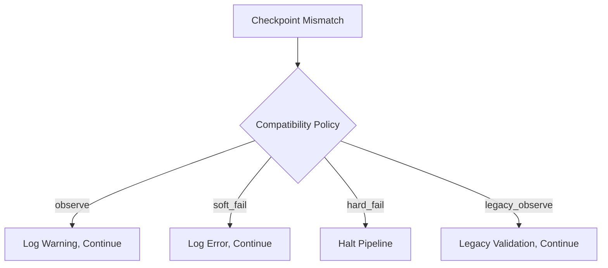

# Issue #2 Analysis: Control-Plane Documentation Drift

## Executive Summary

**Issue**: Control-plane documentation missing `legacy_observe` in checkpoint_compatibility_policy
**Severity**: P0 (Critical) - Affects resume/replay semantics interpretation
**Current Status**: Research phase

## Current State Analysis

### Problem Identification

**Documentation Gap:**
- `docs/04-reference/contracts/run-manifest-ledger.md` doesn't document `legacy_observe` mode
- CLI reference missing `--checkpoint-compatibility` flag documentation
- Runbook doesn't cover legacy_observe troubleshooting

**Runtime Reality:**
- `src/bioetl/domain/runtime/_base.py` supports: `observe | soft_fail | hard_fail | legacy_observe`
- `legacy_observe` mode used for backward compatibility during migrations
- Critical for resume/replay semantics in mixed-version environments

### Impact Assessment

**Operational Risks:**
1. **Misinterpretation**: Operators may not understand legacy_observe behavior
2. **Replay Failures**: Incorrect checkpoint compatibility settings in migration scenarios
3. **Audit Issues**: Compliance checks based on incomplete documentation
4. **Incident Response**: Missing troubleshooting guidance for legacy mode issues

**Quantitative Impact:**
- **Enum Values**: 3/4 documented (75% coverage)
- **CLI Flags**: Missing critical compatibility flag
- **Runbook Coverage**: 0% for legacy_observe scenarios

## Detailed Findings

### Runtime Code Analysis

**Source**: `src/bioetl/domain/runtime/_base.py`

```python
class CheckpointCompatibilityPolicy(Enum):
    """Checkpoint compatibility policy for resume/replay operations."""
    OBSERVE = "observe"  # Validate but proceed
    SOFT_FAIL = "soft_fail"  # Log error but continue
    HARD_FAIL = "hard_fail"  # Halt pipeline
    LEGACY_OBSERVE = "legacy_observe"  # Backward compatibility mode
```

**Semantics:**
- `observe`: Validate checkpoint but proceed (default for non-critical)
- `soft_fail`: Log error but continue execution
- `hard_fail`: Halt pipeline on mismatch (default for critical)
- `legacy_observe`: Backward compatibility for v1.x checkpoints

### Documentation Gaps

**Missing from run-manifest-ledger.md:**
```markdown
### Checkpoint Compatibility Policy

| Mode | Behavior | Use Case |
|------|----------|----------|
| observe | Validate but proceed | Non-critical checkpoints |
| soft_fail | Log error but continue | Recovery scenarios |
| hard_fail | Halt pipeline | Critical integrity violations |
| legacy_observe | Backward compatibility mode | Migration periods |
```

**Missing from CLI reference:**
```markdown
### run command options

--checkpoint-compatibility POLICY
    Set checkpoint compatibility policy
    Choices: observe, soft_fail, hard_fail, legacy_observe
    Default: hard_fail for critical, observe for non-critical
```

**Missing from runbook:**
```markdown
### Legacy Observe Mode Troubleshooting

**Symptoms:**
- Checkpoint validation warnings during v1.x → v2.x migration
- "legacy_observe" mode activated in logs
- Mixed-version cluster operations

**Resolution:**
1. Verify all nodes running compatible versions
2. Check `checkpoint_compatibility_policy` setting
3. Monitor validation warnings
4. Plan full migration to remove legacy mode dependency
```

## Implementation Plan

### Phase 1: Runtime Analysis (0.5 day)

**Tasks:**
1. **Code Audit**: Examine `_base.py` checkpoint compatibility implementation
2. **Enum Documentation**: Create complete inventory of all modes
3. **Semantic Analysis**: Document exact behavior of each mode
4. **Runtime Team Consultation**: Validate understanding

**Deliverables:**
- Complete enum value inventory
- Semantic documentation for each mode
- Runtime behavior matrix

### Phase 2: Atomic Documentation Update (2 days)

**Files to Update:**
1. `docs/04-reference/contracts/run-manifest-ledger.md`
2. `docs/04-reference/cli.md`
3. `docs/05-operations/runbooks/run-manifest-inspection.md`

**Updates Needed:**

**run-manifest-ledger.md:**
```markdown
### Checkpoint Compatibility Policy

The BioETL control-plane supports four checkpoint compatibility modes:

| Mode | Behavior | Use Case | Default |
|------|----------|----------|---------|
| `observe` | Validate checkpoint but proceed | Non-critical validation | ✅ Non-critical |
| `soft_fail` | Log error but continue execution | Recovery scenarios | ❌ Manual |
| `hard_fail` | Halt pipeline on mismatch | Critical integrity | ✅ Critical |
| `legacy_observe` | v1.x backward compatibility | Migration periods | ❌ Manual |

**Decision Matrix:**



**Configuration:**

```yaml
# configs/entities/provider/entity.yaml
runtime:
  checkpoint_compatibility:
    critical: hard_fail
    non_critical: observe
    migration_mode: legacy_observe  # Temporary during upgrades
```
```

**cli.md:**
```markdown
### bioetl run --checkpoint-compatibility

Set the checkpoint compatibility policy for this run.

**Usage:**
```bash
# Use legacy mode during migration
bioetl run --pipeline chembl_activity --checkpoint-compatibility legacy_observe

# Default behavior (recommended)
bioetl run --pipeline chembl_activity  # Uses config defaults
```

**Options:**
- `observe` - Validate but proceed (default for non-critical)
- `soft_fail` - Log error but continue
- `hard_fail` - Halt on mismatch (default for critical)
- `legacy_observe` - Backward compatibility mode

**run-manifest-inspection.md:**
```markdown
### Legacy Observe Mode

**When to Use:**
- Mixed-version cluster during upgrade
- Temporary backward compatibility
- v1.x checkpoint compatibility

**When to Avoid:**
- Production steady-state operations
- Long-term cluster configurations
- New pipeline development

**Migration Procedure:**

1. **Prepare**: Set `legacy_observe` in config
2. **Upgrade**: Roll out new version nodes
3. **Validate**: Monitor validation warnings
4. **Remove**: Switch to standard modes
5. **Cleanup**: Remove legacy mode from configs

**Troubleshooting:**

**Issue**: Excessive checkpoint warnings in legacy mode

**Resolution:**
1. Check cluster version consistency
2. Verify checkpoint format compatibility
3. Review validation warnings
4. Plan full migration to current modes
```

### Phase 3: Verification (1 day)

**Tasks:**
1. **Cross-Reference Testing**: Verify all links work
2. **Example Validation**: Test documentation examples
3. **Runtime Team Review**: Technical accuracy check
4. **Operations Team Review**: Practical usability check

**Deliverables:**
- Verified documentation accuracy
- Working examples and cross-references
- Team approvals obtained

## Success Criteria

- ✅ All checkpoint_compatibility_policy values documented
- ✅ CLI reference includes all relevant flags
- ✅ Runbook reflects actual runtime behavior
- ✅ Cross-references between contract, CLI, and runbook consistent
- ✅ Runtime team approval obtained
- ✅ Operations team approval obtained

## Resource Requirements

**Team:**
- 1 Documentation Specialist (Primary)
- 0.5 Runtime Engineer (Review)
- 0.3 Operations Engineer (Runbook)

**Time:**
- Research: 0.5 days
- Documentation: 2 days
- Verification: 1 day
- **Total**: 3.5 days

## Risk Assessment

**High Risks:**
- **Incorrect Documentation**: Mitigated by runtime team review
- **Missing Edge Cases**: Mitigated by operations team review
- **Documentation Drift**: Mitigated by CI/CD integration

**Contingency:**
- Versioned documentation
- Runtime code as source of truth
- Automated parity checks

## Next Steps

### Immediate (Start Today)
1. **Runtime Code Audit**: Examine `_base.py` implementation
2. **Enum Inventory**: Document all policy values
3. **Semantic Analysis**: Document exact behaviors

### Short-Term (3-5 days)
4. **Documentation Rewrite**: Update all three files
5. **Example Creation**: Add practical examples
6. **Cross-Reference Update**: Ensure consistency

### Completion (Day 5-7)
7. **Team Review**: Runtime and operations sign-off
8. **CI/CD Integration**: Add to documentation build
9. **Merge & Deploy**: Publish updates

**Status**: Ready for implementation
**Priority**: P0 Critical (affects runtime semantics)
**Next**: Begin Phase 1 - Runtime analysis