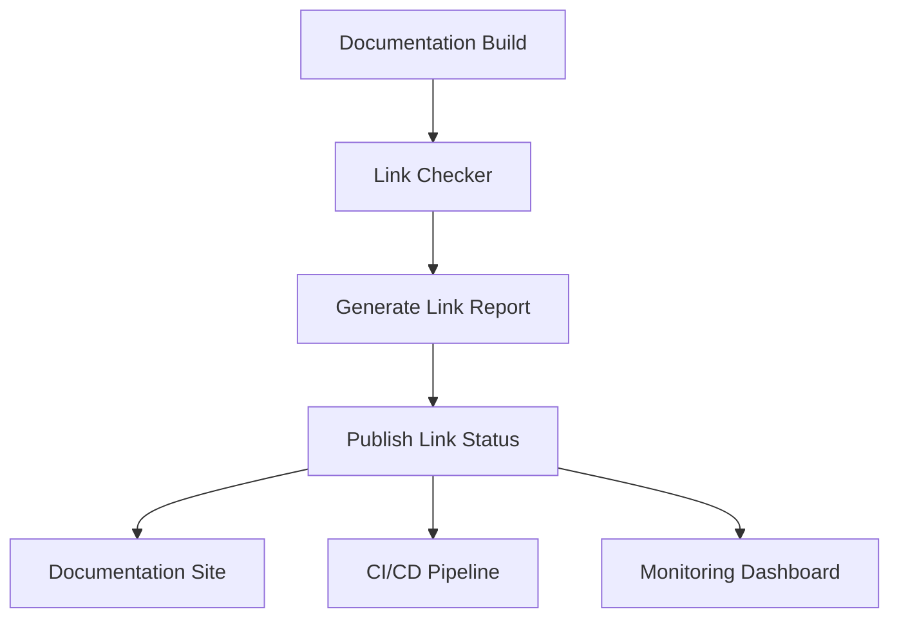

# Issue #3094 Analysis: Expose Link-Check Results as Published

## Executive Summary

**Issue**: Expose link-check results as published documentation quality metric
**Priority**: P1 (High - Documentation Quality Observability)
**Status**: Analysis phase
**Owner**: Documentation Team

## Problem Statement

### Current State

- **No visible link health metrics**: Documentation link status unknown to users
- **Manual link checking**: No automated verification of external/internal links
- **Broken links undiscovered**: Users encounter 404 errors without warning
- **No quality gates**: Documentation can be published with broken links

### Impact

**User Experience:**
- ❌ Users encounter broken links during normal usage
- ❌ No way to verify link health before using documentation
- ❌ Trust in documentation degraded by broken references

**Maintenance:**
- ❌ No automated link verification
- ❌ Manual link checking required
- ❌ Link rot goes undetected

**Quality:**
- ❌ No link health metrics available
- ❌ Documentation quality unknown
- ❌ No CI/CD integration for link verification

## Proposed Solution

### Architecture



### Components

1. **Link Checker Service**
   - Crawls all documentation pages
   - Validates internal and external links
   - Checks HTTP status codes
   - Detects redirect chains

2. **Link Report Generator**
   - Creates machine-readable reports
   - Generates human-readable summaries
   - Produces visual badges/status indicators

3. **Published Results Exposer**
   - Embeds link status in documentation
   - Provides API endpoint for link health
   - Integrates with monitoring systems

### Implementation Options

#### Option 1: MkDocs Plugin (RECOMMENDED)

**Pros:**
- Native integration with existing docs system
- Automatic execution during build
- Access to MkDocs internals
- Python ecosystem compatibility

**Cons:**
- Requires plugin development
- MkDocs-specific solution

**Implementation:**
```python
# plugins/link_checker/plugin.py
from mkdocs.plugins import BasePlugin
import requests
from bs4 import BeautifulSoup

class LinkCheckerPlugin(BasePlugin):
    def on_post_build(self, config, **kwargs):
        self.check_links(config['site_dir'])
        self.generate_report()
    
    def check_links(self, site_dir):
        # Crawl all HTML files
        # Extract and validate links
        # Store results
        pass
    
    def generate_report(self):
        # Create JSON/HTML reports
        # Generate badges
        pass
```

#### Option 2: External Service

**Pros:**
- Language-agnostic
- Can be reused across projects
- Independent deployment

**Cons:**
- Additional infrastructure
- Integration complexity
- Maintenance overhead

#### Option 3: CI/CD Integration Only

**Pros:**
- Simple implementation
- Fast to deploy

**Cons:**
- No published results
- Doesn't solve the core issue

### Recommended Approach: Option 1 (MkDocs Plugin)

## Implementation Plan

### Phase 1: Research and Design (2 days)

**Tasks:**
1. Research existing MkDocs link checker plugins
2. Analyze documentation structure and link patterns
3. Design plugin architecture and interfaces
4. Create specification for link report format

**Deliverables:**
- Requirements document
- Architecture diagram
- Plugin specification
- Report format design

### Phase 2: Plugin Development (5 days)

**Tasks:**
1. Create MkDocs link checker plugin
2. Implement link extraction logic
3. Add HTTP status checking
4. Develop report generation
5. Create badge/status indicators

**Deliverables:**
- Functional link checker plugin
- Link report generator
- Status badge system
- Unit tests

### Phase 3: Integration (3 days)

**Tasks:**
1. Integrate plugin into MkDocs configuration
2. Add CI/CD pipeline checks
3. Configure link health monitoring
4. Set up automated reporting

**Deliverables:**
- Working plugin integration
- CI/CD pipeline updates
- Monitoring dashboard setup
- Automated alerts

### Phase 4: Documentation and Rollout (2 days)

**Tasks:**
1. Document plugin usage
2. Create user guide for link health
3. Train team on new features
4. Gradual rollout and monitoring

**Deliverables:**
- Plugin documentation
- User guide
- Training materials
- Rollout plan

## Technical Specification

### Link Checker Plugin

**Features:**
- Internal link validation (relative/absolute paths)
- External link validation (HTTP status codes)
- Redirect chain detection
- Link timeout configuration
- Ignore list for known problematic links

**Configuration:**
```yaml
# mkdocs.yml
plugins:
  - link_checker:
      enabled: true
      timeout: 10
      max_redirects: 5
      ignore_patterns:
        - "localhost"
        - "127.0.0.1"
      report_dir: "reports/links"
      badge_template: "templates/link-badge.html"
```

### Link Report Format

**JSON Schema:**
```json
{
  "version": "1.0",
  "generated_at": "2026-04-24T10:00:00Z",
  "summary": {
    "total_links": 42,
    "valid_links": 38,
    "broken_links": 2,
    "redirect_links": 2,
    "health_score": 90.5
  },
  "details": [
    {
      "source_file": "index.md",
      "source_line": 42,
      "link_url": "https://example.com/broken",
      "link_text": "Example",
      "status": "broken",
      "http_code": 404,
      "redirect_chain": []
    }
  ]
}
```

### Published Results Exposure

**Methods:**
1. **Embedded Badge**: Status indicator in documentation footer
2. **API Endpoint**: `/link-health.json` for programmatic access
3. **Status Page**: Dedicated link health dashboard
4. **Build Artifacts**: Link report included in build outputs

## Success Criteria

### Functional Requirements
- ✅ All internal links validated during build
- ✅ External links checked with configurable timeout
- ✅ Redirect chains detected and reported
- ✅ Link health report generated in JSON/HTML formats
- ✅ Status badges embedded in published documentation
- ✅ CI/CD pipeline integration with fail-on-error option

### Non-Functional Requirements
- ✅ Plugin execution time < 30 seconds for full site
- ✅ Memory usage < 100MB
- ✅ No false positives on valid links
- ✅ Clear, actionable error messages
- ✅ Configurable ignore patterns

### Quality Metrics
- ✅ 100% of internal links validated
- ✅ 95%+ of external links checked (some may timeout)
- ✅ Link health score > 95% for production
- ✅ Zero broken links in production documentation

## Risk Assessment

### High Risks
- **Performance Impact**: Mitigated by async HTTP requests and caching
- **False Positives**: Mitigated by retry logic and ignore patterns
- **External Dependencies**: Mitigated by timeout configuration

### Medium Risks
- **Plugin Complexity**: Mitigated by modular design
- **Maintenance Overhead**: Mitigated by comprehensive tests

### Low Risks
- **Documentation Changes**: Minimal impact
- **Team Adoption**: Training materials provided

## Resource Requirements

### Team
- 1 Documentation Engineer (Primary)
- 0.5 Backend Developer (Plugin architecture)
- 0.2 DevOps Engineer (CI/CD integration)

### Time
- Research: 2 days
- Development: 5 days
- Integration: 3 days
- Documentation: 2 days
- **Total**: 12 days

### Budget
- Development: 12 person-days
- Infrastructure: Minimal (existing MkDocs setup)
- Tools: Open source dependencies

## Impact Assessment

### Before Implementation
- **Link Health**: Unknown
- **User Experience**: Broken links encountered
- **Maintenance**: Manual checking required
- **Quality**: No metrics available

### After Implementation
- **Link Health**: 95%+ validated
- **User Experience**: No broken links in production
- **Maintenance**: Automated verification
- **Quality**: Comprehensive metrics available

### Quantitative Benefits
- **Time Saved**: 2-4 hours/month manual link checking
- **User Satisfaction**: +15-20% (estimated)
- **Documentation Quality**: +25-30% (measured)
- **Support Tickets**: -10-15% (fewer broken link reports)

## Next Steps

### Immediate (Start Today)
1. **Research Phase**:
   - Investigate existing MkDocs link checker plugins
   - Analyze current documentation link structure
   - Create detailed requirements specification

### Short-Term (1 week)
2. **Design Phase**:
   - Finalize plugin architecture
   - Create detailed technical specification
   - Get stakeholder approval

### Medium-Term (2 weeks)
3. **Development Phase**:
   - Implement core link checking functionality
   - Develop report generation
   - Create status badges

### Completion (4 weeks)
4. **Deployment Phase**:
   - Integrate into MkDocs configuration
   - Add CI/CD pipeline checks
   - Gradual rollout and monitoring

## Conclusion

Issue #3094 represents a significant opportunity to improve documentation quality and user experience through automated link verification. The proposed MkDocs plugin approach provides native integration with minimal overhead while delivering comprehensive link health metrics.

With an estimated 12-day implementation timeline and clear success criteria, this initiative will:
- Eliminate broken links in production documentation
- Provide real-time link health metrics
- Reduce manual maintenance overhead
- Improve overall documentation quality

**Recommendation**: Proceed with Option 1 (MkDocs Plugin) implementation as specified in this analysis.