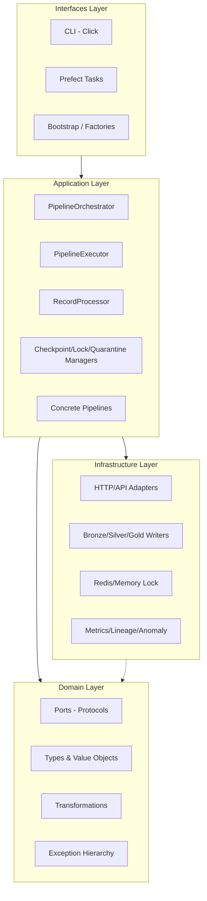
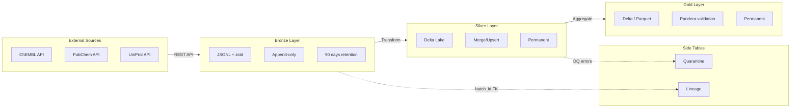
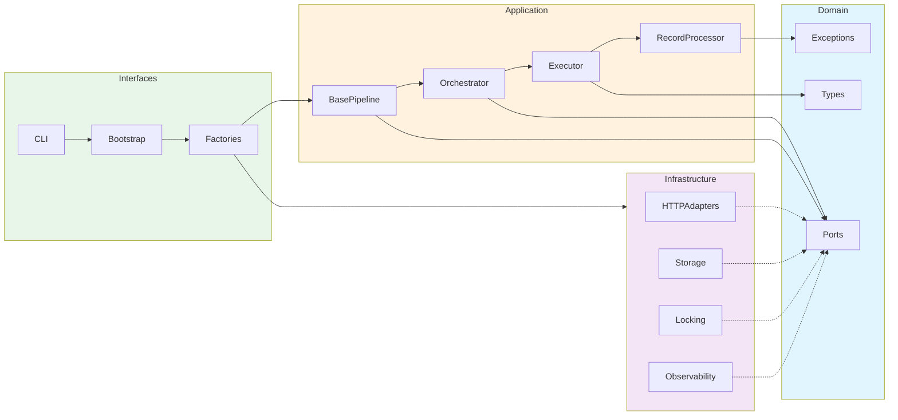

# BioETL Architecture / Архитектура проекта

*Updated: 2025-12-17*

## Overview / Обзор

BioETL is an ETL (Extract-Transform-Load) system for bioactivity data acquisition from public databases (ChEMBL, PubChem, UniProt). Built using **Hexagonal Architecture (Ports & Adapters)** with **Medallion Data Lake** pattern.

## Layer Overview / Обзор слоёв

## Medallion Architecture / Медальонная архитектура

## Module Index / Индекс модулей

### Domain Layer

| Module | Type | Diagram | Description |
|--------|------|---------|-------------|
| `domain/ports.py` | port | [ports.mmd](./diagrams/domain/ports.mmd) | Abstract port interfaces (Protocol) |
| `domain/types.py` | value_object | [types.mmd](./diagrams/domain/types.mmd) | Core types: RunID, EntityID, Enums |
| `domain/transformations.py` | util | [transformations.mmd](./diagrams/domain/transformations.mmd) | Hash generation, schema drift detection |
| `domain/exceptions.py` | exception | [exceptions.mmd](./diagrams/domain/exceptions.mmd) | Error hierarchy: Critical/Recoverable/DQ |
| `domain/error_classifier.py` | util | [error_classifier.mmd](./diagrams/domain/error_classifier.mmd) | Exception → ErrorType mapping |
| `domain/context.py` | value_object | [context.mmd](./diagrams/domain/context.mmd) | PipelineContext (immutable) |

### Application Layer

| Module | Type | Diagram | Description |
|--------|------|---------|-------------|
| `application/core/base.py` | service | [base.mmd](./diagrams/application/core/base.mmd) | BasePipeline abstract class |
| `application/core/orchestrator.py` | service | [orchestrator.mmd](./diagrams/application/core/orchestrator.mmd) | Pipeline lifecycle, signals, locking |
| `application/core/executor.py` | service | [executor.mmd](./diagrams/application/core/executor.mmd) | Data flow execution |
| `application/core/record_processor.py` | service | [record_processor.mmd](./diagrams/application/core/record_processor.mmd) | Bronze→Silver→Gold processing |
| `application/core/lock_manager.py` | service | [lock_manager.mmd](./diagrams/application/core/lock_manager.mmd) | Distributed lock with heartbeat |
| `application/core/shutdown.py` | util | [shutdown.mmd](./diagrams/application/core/shutdown.mmd) | Graceful shutdown signal |
| `application/core/*_manager.py` | service | [managers.mmd](./diagrams/application/core/managers.mmd) | Checkpoint/Quarantine managers |
| `application/pipelines/chembl_activity.py` | pipeline | [chembl_activity.mmd](./diagrams/application/pipelines/chembl_activity.mmd) | ChEMBL activity pipeline |

### Infrastructure Layer

| Module | Type | Diagram | Description |
|--------|------|---------|-------------|
| `infrastructure/adapters/http/client.py` | adapter | [client.mmd](./diagrams/infrastructure/adapters/http/client.mmd) | UnifiedHTTPClient |
| `infrastructure/adapters/http/circuit_breaker.py` | adapter | [circuit_breaker.mmd](./diagrams/infrastructure/adapters/http/circuit_breaker.mmd) | Circuit breaker state machine |
| `infrastructure/adapters/http/rate_limiter.py` | adapter | [rate_limiter.mmd](./diagrams/infrastructure/adapters/http/rate_limiter.mmd) | Token bucket rate limiter |
| `infrastructure/adapters/chembl/client.py` | adapter | [chembl/client.mmd](./diagrams/infrastructure/adapters/chembl/client.mmd) | ChEMBL API adapter |
| `infrastructure/adapters/pubchem/client.py` | adapter | [pubchem/client.mmd](./diagrams/infrastructure/adapters/pubchem/client.mmd) | PubChem API adapter |
| `infrastructure/adapters/uniprot/client.py` | adapter | [uniprot/client.mmd](./diagrams/infrastructure/adapters/uniprot/client.mmd) | UniProt API adapter |
| `infrastructure/storage/*.py` | adapter | [medallion.mmd](./diagrams/infrastructure/storage/medallion.mmd) | Bronze/Silver/Gold writers |
| `infrastructure/locking/*.py` | adapter | [distributed_lock.mmd](./diagrams/infrastructure/locking/distributed_lock.mmd) | Redis/Memory lock |
| `infrastructure/checkpoint/*.py` | adapter | [s3_checkpoint.mmd](./diagrams/infrastructure/checkpoint/s3_checkpoint.mmd) | S3 checkpoint |
| `infrastructure/quarantine/*.py` | adapter | [unified_quarantine.mmd](./diagrams/infrastructure/quarantine/unified_quarantine.mmd) | Unified quarantine table |
| `infrastructure/observability/*.py` | adapter | [overview.mmd](./diagrams/infrastructure/observability/overview.mmd) | Metrics, lineage, anomaly |

### Interfaces Layer

| Module | Type | Diagram | Description |
|--------|------|---------|-------------|
| `interfaces/cli.py` | handler | [overview.mmd](./diagrams/interfaces/overview.mmd) | CLI entry point |
| `interfaces/bootstrap.py` | factory | [bootstrap.mmd](./diagrams/interfaces/bootstrap.mmd) | Composition root |
| `interfaces/factories/*.py` | factory | [overview.mmd](./diagrams/interfaces/overview.mmd) | Pipeline factories |
| `interfaces/orchestration/*.py` | handler | [overview.mmd](./diagrams/interfaces/overview.mmd) | Runner, signals, Prefect |

## Dependency Graph / Граф зависимостей

## Architectural Patterns / Архитектурные паттерны

| Pattern | Implementation | Location |
|---------|---------------|----------|
| **Ports & Adapters** | Protocol-based ports | `domain/ports.py` |
| **Dependency Injection** | PipelineServices container | `application/core/pipeline_services.py` |
| **Composition Root** | Bootstrap/Factories | `interfaces/bootstrap.py` |
| **Circuit Breaker** | State machine | `infrastructure/adapters/http/circuit_breaker.py` |
| **Token Bucket** | Rate limiting | `infrastructure/adapters/http/rate_limiter.py` |
| **Medallion Architecture** | Bronze/Silver/Gold | `infrastructure/storage/*.py` |
| **Error Classification** | Critical/Recoverable/DQ | `domain/exceptions.py` |

## Related Documents

- [FILE_REGISTRY.md](./FILE_REGISTRY.md) - Complete file registry
- [02-architecture/diagrams/](./02-architecture/diagrams/) - High-level diagrams
- [diagrams/](./diagrams/) - Module-level diagrams
- [RULES.md](./RULES.md) - Project rules
