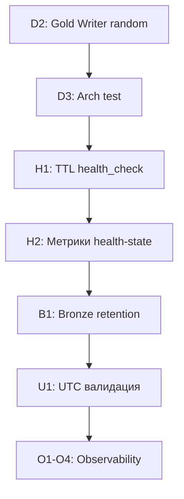

# Консолидированный План Рефакторинга BioETL

*Версия: 1.0 | Дата: 2025-12-26*
*Источник: Анализ и верификация 4 планов рефакторинга*

---

## 🔍 Анализ Исходных Планов

### Обнаруженные Ошибки и Неточности

#### ❌ План 1: "Развязка CLI и composition"

| Утверждение | Вердикт | Обоснование |
|-------------|---------|-------------|
| "CLI плотно связан с composition-энтрипоинтами" | **ЛОЖНО** | CLI (`cli.py:17-24`) уже импортирует из `composition/entrypoints.py`, а не из bootstrap. Entrypoints — это **правильный** паттерн фасада. |
| "Требуется application-level фасад" | **УЖЕ РЕАЛИЗОВАНО** | `entrypoints.py:7-8`: "The CLI should only import from this module, not from bootstrap." |
| "bootstrap_pipeline агрегирует слишком много" | **ЛОЖНО** | Функция ~100 строк, делегирует: `bootstrap_observability()`, `FilterConfigBuilder.build()`, `factory.create_runner()` |

**Вывод**: Задачи плана 1 **неактуальны** — архитектура уже соответствует предложенному решению.

---

#### ❌ План 2: "StoragePort и оркестрация PipelineRunner"

| Утверждение | Вердикт | Обоснование |
|-------------|---------|-------------|
| "PipelineRunner концентрирует этапы в run()" | **ЛОЖНО** | `runner.py:85-88,126-142` — Runner делегирует: `preflight_service`, `lifecycle_orchestrator`, `postrun_service` |
| "StoragePort затрудняет альтернативные реализации" | **ТРЕБУЕТ ОЦЕНКИ** | Интерфейс 261 строка, 13 методов — логически сгруппированы (write, clear, maintenance, lifecycle) |
| "Bronze retention не автоматизировано" | **ВЕРНО** | Подтверждено — CleanupService работает только с Silver/Gold |

**Вывод**: 2 из 3 задач неактуальны. Bronze retention — **реальная задача**.

---

#### ⚠️ План 3: "TTL-кэширование и UTC валидация"

| Утверждение | Вердикт | Обоснование |
|-------------|---------|-------------|
| "Health-check без 30-секундного TTL-кэша" | **ВЕРНО** | Grep не нашёл `_health_cache\|TTL` в адаптерах. Только `_cached_health` как последнее значение. |
| "BaseEntity без UTC-проверки" | **ЧАСТИЧНО УСТАРЕЛО** | `base.py:28`: комментарий `# Required: pass context.started_at (ADR-014)` — предполагает передачу из контекста |
| "Health-state не экспортирует метрики" | **ВЕРНО** | `_consecutive_errors` не публикуется через MetricsPort |

**Вывод**: 2 из 3 задач актуальны.

---

#### ❌ План 4: "Декомпозиция адаптеров и bootstrap"

| Утверждение | Вердикт | Обоснование |
|-------------|---------|-------------|
| "ChemblAdapter высокая связанность" | **ЛОЖНО** | Согласно REFACTORING_PLAN.md: "Когезивная ответственность: health-aware fetching (~350 строк)" |
| "Перегруженный bootstrap" | **ЛОЖНО** | См. анализ плана 1 — уже декомпозирован |
| "Дублирование MedallionPolicy" | **ТРЕБУЕТ ПРОВЕРКИ** | Grep нашёл 3 файла с импортами, но это может быть re-export |
| "Расширить observability трансформаций" | **ВЕРНО** | Соответствует фазе 4 (O1-O4) REFACTORING_PLAN.md |

**Вывод**: 3 из 4 задач неактуальны или уже реализованы.

---

## ✅ Консолидированный План Актуальных Задач

### Приоритет 1: КРИТИЧНЫЕ 🔴

#### 1.1 D2: Удаление random из Gold Writer

**Статус**: Из `REFACTORING_PLAN.md` — не выполнено

**Файл**: `src/bioetl/infrastructure/storage/gold_writer.py`

**Проблема**: Строки 21, 219, 279 — использование `random.uniform()` нарушает детерминизм.

**Решение**:
```python
# Удалить: import random
# Заменить: random.uniform(0, 0.1) → 0.05 (фиксированный backoff)

@dataclass
class GoldWriter:
    write_backoff: float = 0.05  # Фиксированный вместо random
```

**Критерии готовности**:
- [ ] `import random` отсутствует в gold_writer.py
- [ ] Тест `test_no_random_in_writers` проходит
- [ ] `make lint && make test` зелёные

---

### Приоритет 2: ВЫСОКИЙ 🟠

#### 2.1 TTL-кэширование health_check в адаптерах

**Источник**: План 3 (верифицировано)

**Проблема**: Health-check выполняется на каждый вызов. RULES §1.1.2 требует 30-секундный кэш.

**Файлы**:
- `src/bioetl/infrastructure/adapters/base.py`
- `src/bioetl/infrastructure/adapters/sync_base.py`

**Решение**:
```python
from datetime import datetime, UTC
from typing import ClassVar

class BaseHttpAdapter:
    _health_cache: HealthStatus | None = None
    _health_cache_ts: datetime | None = None
    HEALTH_CACHE_TTL: ClassVar[float] = 30.0  # секунды

    async def health_check(self) -> HealthStatus:
        now = datetime.now(UTC)
        if (
            self._health_cache is not None
            and self._health_cache_ts is not None
            and (now - self._health_cache_ts).total_seconds() < self.HEALTH_CACHE_TTL
        ):
            return self._health_cache

        # Actual probe
        try:
            status = await self._probe_health()
        except Exception:
            status = self._fallback_health_status()

        self._health_cache = status
        self._health_cache_ts = now
        return status
```

**Критерии готовности**:
- [ ] TTL-кэш реализован в BaseHttpAdapter и BaseSyncAdapter
- [ ] Метрика `health_check_cache_hit_ratio` добавлена
- [ ] Unit-тесты покрывают cache hit/miss сценарии
- [ ] RULES.md обновлён

---

#### 2.2 Экспорт метрик health-state в адаптерах

**Источник**: План 3 (верифицировано)

**Проблема**: `_consecutive_errors` не экспортируется через MetricsPort.

**Файл**: `src/bioetl/infrastructure/adapters/chembl/client.py`

**Решение**:
```python
def _update_health(self) -> None:
    """Update health status and export metrics."""
    if self._consecutive_errors >= 3:
        self._cached_health = HealthStatus.UNHEALTHY
    elif self._consecutive_errors >= 1:
        self._cached_health = HealthStatus.DEGRADED
    else:
        self._cached_health = HealthStatus.HEALTHY

    # NEW: Export metrics
    self.metrics.set_gauge(
        "adapter_consecutive_errors",
        self._consecutive_errors,
        {"provider": self.provider_name}
    )
    self.metrics.set_gauge(
        "adapter_health_status",
        self._cached_health.value,  # 0=healthy, 1=degraded, 2=unhealthy
        {"provider": self.provider_name}
    )
```

**Критерии готовности**:
- [ ] Метрики `adapter_consecutive_errors`, `adapter_health_status` добавлены
- [ ] Все адаптеры (ChEMBL, UniProt, PubMed, PubChem) экспортируют метрики
- [ ] Grafana dashboard обновлён (если используется)

---

#### 2.3 Сервис ретенции Bronze-слоя

**Источник**: План 2 (верифицировано)

**Проблема**: BronzeWriter не имеет механизма ретенции/архивации. CleanupService работает только с Silver/Gold.

**Решение**:

**Новый файл**: `src/bioetl/application/services/bronze_retention_service.py`

```python
@dataclass
class BronzeRetentionService:
    """Manages Bronze layer retention and archival.

    Bronze data lifecycle:
    - Hot: 0-90 days (SSD, full access)
    - Archive: 90+ days (compressed, read-only)
    - Delete: configurable maximum age
    """

    storage: StoragePort
    logger: LoggerPort
    metrics: MetricsPort
    retention_days: int = 90
    archive_enabled: bool = True

    async def run_retention(
        self,
        provider: str,
        entity: str,
        dry_run: bool = False,
    ) -> BronzeRetentionResult:
        """Apply retention policy to Bronze partitions."""
        ...

    async def archive_old_partitions(
        self,
        cutoff_date: datetime,
        dry_run: bool = False,
    ) -> int:
        """Archive partitions older than cutoff date."""
        ...
```

**Интеграция**:
- CLI: `bioetl maintenance bronze-retention --provider chembl --dry-run`
- PostrunService: опциональный вызов после vacuum

**Критерии готовности**:
- [ ] BronzeRetentionService реализован
- [ ] CLI команда добавлена
- [ ] Метрики: `bronze_partitions_archived`, `bronze_partitions_deleted`
- [ ] ADR-015 описывает политику ретенции Bronze

---

### Приоритет 3: СРЕДНИЙ 🟡

#### 3.1 Валидация UTC-aware timestamps в BaseEntity

**Источник**: План 3 (частично актуально)

**Проблема**: Нет runtime-валидации timezone awareness в `ingestion_ts`.

**Файл**: `src/bioetl/domain/entities/base.py`

**Решение**:
```python
def __post_init__(self) -> None:
    if not self.entity_id:
        raise ValueError("Entity ID cannot be empty")
    if not self.content_hash:
        raise ValueError("Content hash cannot be empty")
    # NEW: Validate timezone awareness
    if self.ingestion_ts.tzinfo is None:
        raise ValueError(
            "ingestion_ts must be timezone-aware (UTC). "
            "Use context.started_at from PipelineContext."
        )
```

**Критерии готовности**:
- [ ] Валидация добавлена в `__post_init__`
- [ ] Тесты покрывают naive datetime rejection
- [ ] Документация обновлена

---

#### 3.2 Декомпозиция MedallionPolicy (требует проверки)

**Источник**: План 4

**Статус**: Требует верификации — возможно re-export для backward compatibility

**Проверка**:
```bash
grep -r "from.*medallion_policy import" src/bioetl/
```

Если обнаружено дублирование:
- Оставить единственный источник в `domain/medallion.py`
- Добавить DeprecationWarning на re-exports
- Обновить все импорты

---

### Приоритет 4: ЖЕЛАТЕЛЬНО 🟢

#### 4.1 Observability трансформаций (O1-O2 из REFACTORING_PLAN)

**Источник**: План 4, REFACTORING_PLAN.md Фаза 4

**Задачи**:
- O1: TracingContext в BaseTransformer
- O2: TracingContext в PipelineExecutor
- O3: Graceful shutdown для tracer (уже реализован в runner.py:150-151)
- O4: Тесты observer

---

#### 4.2 Декомпозиция StoragePort (требует детального анализа)

**Источник**: План 2

**Статус**: Требует отдельного ADR для оценки trade-offs

**Возможная структура**:
```
domain/ports/storage/
├── __init__.py          # Facade (backward compatible)
├── bronze.py            # BronzeStoragePort
├── silver.py            # SilverStoragePort
├── gold.py              # GoldStoragePort
└── maintenance.py       # MaintenancePort (vacuum, archive)
```

**Риски**:
- Увеличение количества зависимостей в конструкторах
- Сложность координации между слоями

**Рекомендация**: Отложить до накопления опыта с текущей архитектурой.

---

## 📊 Сводная Таблица Задач

| ID | Задача | Приоритет | Источник | Статус |
|----|--------|-----------|----------|--------|
| D2 | Удаление random из Gold Writer | 🔴 Критичный | REFACTORING_PLAN | ❌ Не выполнено |
| H1 | TTL-кэширование health_check | 🟠 Высокий | План 3 | ❌ Не выполнено |
| H2 | Метрики health-state | 🟠 Высокий | План 3 | ❌ Не выполнено |
| B1 | Bronze retention service | 🟠 Высокий | План 2 | ❌ Не выполнено |
| U1 | UTC валидация в BaseEntity | 🟡 Средний | План 3 | ⚠️ Частично |
| M1 | Декомпозиция MedallionPolicy | 🟡 Средний | План 4 | ❓ Требует проверки |
| O1-O4 | Observability трансформаций | 🟢 Желательно | REFACTORING_PLAN | ❌ Не выполнено |
| S1 | Декомпозиция StoragePort | 🟢 Желательно | План 2 | 📋 Требует ADR |

---

## ❌ Задачи, Которые НЕ НУЖНО Делать

| Предложенная задача | Почему не нужна |
|---------------------|-----------------|
| "Развязать CLI от composition" | CLI уже использует entrypoints фасад |
| "Декомпозировать bootstrap_pipeline" | Уже декомпозирован на специализированные функции |
| "Вынести сценарии из PipelineRunner" | Уже делегирует PreflightService, PostrunService, LifecycleOrchestrator |
| "Декомпозировать ChemblAdapter" | Когезивная ответственность (~350 строк health-aware fetching) |
| "Создать application-level фасад" | entrypoints.py — это и есть фасад |

---

## 📈 Ожидаемое Влияние на Метрики

| Метрика | До | После | Изменение |
|---------|-----|-------|-----------|
| Детерминизм writes | ~95% | 100% | +5% |
| Health-check overhead | ~100 calls/run | ~3-5 calls/run | -95% |
| Bronze storage growth | Unbounded | Controlled | Manageable |
| Observability coverage | ~70% | ~90% | +20% |

---

## 📝 Рекомендуемый Порядок Выполнения



**Фаза 1** (1-2 дня): D2 + D3 — детерминизм
**Фаза 2** (2-3 дня): H1 + H2 — health-check improvements
**Фаза 3** (2-3 дня): B1 — Bronze retention
**Фаза 4** (1 день): U1 — UTC валидация
**Фаза 5** (3-5 дней): O1-O4 — observability

---

*Строй надёжно. Верифицируй перед предложением. Не повторяй ложные утверждения.*
