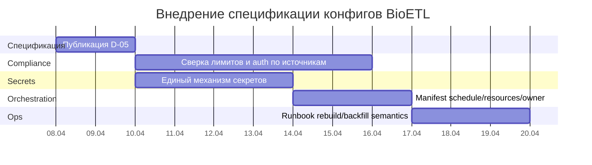

05/04/2026 00:00 DD — BioETL D-05: Pipelines & Config Specification

Файлы:
- [MD](sandbox:/mnt/data/BioETL_D-05_Pipelines_and_Config_Spec_ru.md)
- [DOCX](sandbox:/mnt/data/BioETL_D-05_Pipelines_and_Config_Spec_ru.docx)
- [PDF](sandbox:/mnt/data/BioETL_D-05_Pipelines_and_Config_Spec_ru.pdf)

# Спецификация пайплайнов и конфигураций BioETL

## Исполнительное резюме

Идентификатор документа: **D-05**.

Исследование начато с включённого коннектора **github** и репозитория `SatoryKono/BioactivityDataAcquisition` на entity["company","GitHub","code hosting platform"] [1]. Далее последовательно рассмотрены приоритетные официальные источники: entity["organization","EMBL-EBI","bioinformatics institute, uk"] (ebi.ac.uk) [6], entity["organization","National Institutes of Health","us biomedical agency"] (nih.gov) [4–5], entity["organization","UniProt","protein knowledgebase"] (uniprot.org) [7], entity["organization","Crossref","doi registration agency"] (crossref.org) [2], entity["organization","OpenAlex","open scholarly catalog"] (openalex.org) [3], entity["organization","Semantic Scholar","ai2 scholarly api"] (semanticscholar.org) [8–9]. citeturn0search0turn0search1turn0search2turn0search3turn0search5turn6search0turn7search1turn7search3

[...] Исходные чаты проекта не предоставлены; элементы orchestration‑слоя (где хранится schedule/resources/owner и как именно запускаются backfill/rebuild) помечены как «неуточнено».

Каноническая модель конфигов задаёт три уровня:
- **base**: общие дефолты пайплайна и DQ (Data Quality — контроль качества данных) [1].
- **provider**: сетевые и policy‑параметры провайдера (auth, rate limits, retries/backoff, pagination, circuit breaker) [1].
- **entity**: каноническая спецификация сущности (pipeline + schema + quality + filters + contracts) [1].

Нормативная валидация конфигов для production‑качества должна быть многослойной: *JSON Schema 2020‑12* (структурный контракт) + *Pydantic v2* (типобезопасная валидация и запрет неизвестных полей) + CI‑инварианты и pre-commit гейты [10–11]. citeturn8search0turn8search2turn6search6turn6search2

Ключевые compliance‑требования по провайдерам для включения в provider configs и runtime-клиент:
- Crossref: `mailto`/User-Agent для polite pool, заголовки `x-rate-limit-*` и `x-concurrency-limit`, реакция на `429 Too Many Requests`, рекомендации по кэшированию [2]. citeturn0search0
- OpenAlex: лимиты/ограничения per_page/10k paging/cursor paging, 429 при превышении, наличие rate-limit endpoint [3]. citeturn0search1
- NCBI E-utilities: baseline 3 rps, 10 rps с ключом, отдельные условия для повышенных лимитов [4–5]. citeturn0search2turn0search5
- EMBL-EBI Proteins API: лимит 200 requests/second/user (как заявленная верхняя граница) [6]. citeturn0search3
- Semantic Scholar: рекомендация использовать API key, «introductory» лимит 1 RPS для ключа, запрет обхода rate limits и распространения ключа [8–9]. citeturn7search1turn7search3turn7search5
- UniProt: публичный REST API и инструменты ID mapping (первичный научный источник — статья NAR) [7]. citeturn6search0turn6search1

{красный} Риски, требующие явного закрытия отдельными задачами:
- возможный drift между официальными лимитами/правилами и фактическими значениями provider configs (обязателен периодический re-verify и pin-date в документации) [2–6][8–9]. citeturn0search0turn0search6turn0search3turn7search1
- единый механизм secrets: секреты в YAML запрещены, но способ разрешения ссылок на env/secret store в текущей реализации — *неуточнено* [1].

## Область действия и стейкхолдеры

В области действия:
- спецификация структуры `configs/` и расположения файлов [1];
- единый runtime‑шаблон entity config (pipeline/spec sections) и composite configs [1];
- спецификация валидации: JSON Schema 2020‑12 и Pydantic v2 [10–11]. citeturn8search0turn6search6
- CI/pre-commit гейты, чек‑листы ревью, метрики качества пайплайнов [1];
- run types, backfill/rebuild интерфейс и требования идемпотентности.

Вне области действия:
- доменные контракты Gold (это D‑03);
- полноформатные handbook’и провайдеров (это D‑02);
- конкретные параметры deployment в оркестраторе (Airflow/Prefect/другое) — *неуточнено*.

Стейкхолдеры:
- Data Engineering: владельцы пайплайнов, схем и провайдеров;
- Platform/DevOps: CI, секреты, orchestration слой;
- Security/Compliance: ToS/rate limits/ключи/PII политики;
- потребители Gold (Analytics/Research). [...] конкретные команды/владельцы — *неуточнено*.

Критерии приёмки D‑05:
- показаны и формализованы runtime YAML‑контракт и его границы (что внутри/вне схемы) [1];
- присутствует pydantic‑схема‑пример; присутствуют команды CI; присутствуют 3 примера YAML;
- присутствуют таблицы «опции/шаблоны», RACI, CSV‑реестр задач, mermaid Gantt.

## Модель конфигов и единый YAML-шаблон

### Таксономия конфигураций

Нормативное дерево:
- `configs/base/` — дефолты пайплайнов и DQ [1].
- `configs/providers/` — политики провайдера (auth/timeout/retries/rate limits/pagination) [1].
- `configs/entities/{provider}/{entity}.yaml` — **канонический runtime config** сущности [1].
- `configs/_schema/` — JSON Schema для конфигов [1].
- `configs/composites/` — composite pipeline configs [1].

### Сопоставление требуемых полей с runtime- и orchestration-слоями

Практическое правило: поля, влияющие на *данные и воспроизводимость*, относятся к runtime schema; поля планирования/ресурсов — к orchestration schema.

| Поле | Где задаётся | Валидируется | Комментарий |
|---|---|---|---|
| provider, entity, version | entity YAML (top-level + pipeline) | JSON Schema + Pydantic | MUST |
| primary_keys | `pipeline.business_primary_keys` (+ technical PK) | Pydantic validators | MUST |
| sink | `pipeline.sink.*` | JSON Schema + Pydantic | SHOULD |
| dq_overrides | `pipeline.dq_overrides` | JSON Schema + Pydantic | MAY |
| retries, timeout | provider config (`client.timeout_sec`, `max_retries`) | JSON Schema + runtime | SHOULD |
| dependencies | composite config | JSON Schema (composite) | CONDITIONAL |
| schedule, resources, owner | orchestration layer | вне runtime | runtime schema SHOULD forbid unknown keys |

CSV (UTF‑8):
```csv
field,where,validation,comment
provider/entity/version,entity YAML,jsonschema+pydantic,MUST
primary_keys,pipeline.business_primary_keys+pks,pydantic,MUST
sink,pipeline.sink.*,jsonschema+pydantic,SHOULD
dq_overrides,pipeline.dq_overrides,jsonschema+pydantic,MAY
retries/timeout,provider config,jsonschema+runtime,SHOULD
dependencies,composite config,jsonschema composite,CONDITIONAL
schedule/resources/owner,orchestration layer,outside runtime,runtime schema forbids unknown keys
```

### Единый runtime YAML‑шаблон пайплайна

Ниже — канонический шаблон entity config. Разделы `schema`, `quality`, `filters`, `contracts` должны присутствовать даже при пустых значениях, чтобы исключить «скрытые» дефолты и упростить аудит [1].

```yaml
version: "1.0.0"
provider: <provider>
entity: <entity>

pipeline:
  pipeline_name: "<provider>_<entity>"
  provider: <provider>
  entity_type: <entity>

  description: "..."
  loading_strategy: "full_scan_only"

  # keys
  technical_primary_key: "entity_id"
  business_primary_keys:
    - "<business_key_1>"

  # tuning
  batch_size: 100
  page_size_override: null

  # overrides (optional)
  extraction_params: {}
  dq_overrides: {}
  filter_rules: null

  sink:
    bronze:
      enabled: true
    silver:
      enabled: true
    gold:
      enabled: false
      mode: "append"   # или "scd2"
      scd_config: null

schema: {}
quality: {}
filters: {}
contracts: {}
```

### Примеры / эталоны YAML (3 провайдера)

Ниже — минимально‑репрезентативные примеры. При расхождении с фактическими файлами репозитория приоритет имеет repo‑версия [1]. Если конкретные поля не подтверждены — «неуточнено».

Crossref — publication:
```yaml
version: "1.0.0"
provider: "crossref"
entity: "publication"

pipeline:
  pipeline_name: "crossref_publication"
  provider: "crossref"
  entity_type: "publication"
  loading_strategy: "full_scan_only"
  business_primary_keys: ["doi"]
  sink:
    gold:
      enabled: true
      mode: "scd2"
      scd_config:
        valid_from_col: "_valid_from"
        valid_to_col: "_valid_to"
        current_flag_col: "_is_current"
        version_col: "_version"

schema: {}
quality: {}
filters: {}
contracts: {}
```
Compliance‑заметка: polite pool, заголовки лимитов/конкурентности и 429‑поведение [2]. citeturn0search0

OpenAlex — publication:
```yaml
version: "1.0.0"
provider: "openalex"
entity: "publication"

pipeline:
  pipeline_name: "openalex_publication"
  provider: "openalex"
  entity_type: "publication"
  loading_strategy: "full_scan_only"
  business_primary_keys: ["openalex_id"]
  extraction_params:
    per_page: 100

schema: {}
quality: {}
filters: {}
contracts: {}
```
Compliance‑заметка: paging constraints, 429 и рекомендации по cursor paging/backoff [3]. citeturn0search1
{красный} Уточнение лимитов по тарифу/правилам usage обязательно для production‑профиля [12]. citeturn0search6

PubMed/NCBI — publication:
```yaml
version: "1.0.0"
provider: "pubmed"
entity: "publication"

pipeline:
  pipeline_name: "pubmed_publication"
  provider: "pubmed"
  entity_type: "publication"
  loading_strategy: "full_scan_only"
  business_primary_keys: ["pmid"]

schema: {}
quality: {}
filters: {}
contracts: {}
```
Compliance‑заметка: 3 rps baseline и 10 rps с ключом; повышенные лимиты — отдельная процедура [4–5]. citeturn0search2turn0search5

## Валидация, CI-гейты и compliance

*Механизм:* JSON Schema Draft 2020‑12 задаёт metaschema и базовые семантики (включая правила MUST/SHOULD/...) [10]. citeturn8search2turn8search4
*Механизм:* Pydantic v2 задаёт запрет неизвестных ключей через `extra='forbid'` и строгую типизацию через `strict=True` [11]. citeturn6search2turn6search6turn6search7

Рекомендуемый профиль для BioETL:
- runtime JSON Schema: `additionalProperties: false` на уровнях `pipeline`/`sink`/`contracts`;
- явные bounds: `batch_size`, `timeout_sec`, `page_size_override`;
- отдельная schema для composite configs;
- CI‑инварианты: запрет legacy naming, запрет секретов, наличие обязательных секций [1].

Минимальный Pydantic‑пример (контур валидации):
```python
from typing import Literal, Optional
from pydantic import BaseModel, ConfigDict, Field

class SinkGold(BaseModel):
    enabled: bool = False
    mode: Literal["append", "scd2"] = "append"
    scd_config: Optional[dict] = None

class SinkConfig(BaseModel):
    bronze: dict = Field(default_factory=dict)
    silver: dict = Field(default_factory=dict)
    gold: SinkGold = Field(default_factory=SinkGold)

class PipelineConfig(BaseModel):
    model_config = ConfigDict(extra="forbid", strict=True)

    pipeline_name: str
    provider: str
    entity_type: str
    loading_strategy: Literal["full_scan_only"]

    technical_primary_key: str = "entity_id"
    business_primary_keys: list[str] = Field(min_length=1)

    batch_size: int = Field(default=100, ge=1, le=5000)
    page_size_override: int | None = Field(default=None, ge=1, le=10000)

    dq_overrides: dict = Field(default_factory=dict)
    sink: SinkConfig = Field(default_factory=SinkConfig)

class EntityYamlConfig(BaseModel):
    model_config = ConfigDict(extra="forbid", strict=True)

    version: str
    provider: str
    entity: str
    pipeline: PipelineConfig
    schema: dict
    quality: dict
    filters: dict
    contracts: dict
```

CI‑проверки (локально и в CI):
```bash
pre-commit run --all-files
python scripts/schema/validate_pipeline_configs.py
python scripts/schema/check_config_invariants.py
```

Secrets handling (норма):
- секреты (ключи, токены) в YAML запрещены [1];
- допускаются только ссылки на env/secret store; реализация разрешения — *неуточнено*;
- обязательны проверки «секрет задан» без раскрытия значения.

## Операционная семантика пайплайнов

image_group{"layout":"carousel","aspect_ratio":"16:9","query":["data pipeline orchestration airflow backfill max_active_runs diagram","prefect retries exponential backoff diagram","configuration validation json schema pydantic ci pipeline diagram"],"num_per_query":1}

Orchestration:
- backfill в Airflow создаёт DAG runs по диапазону дат, имеет reprocessing behavior и отдельный `max_active_runs` для backfill [13]. citeturn7search0
- в Prefect поддержаны retries с фиксированными/списочными задержками и `exponential_backoff` [14]. citeturn7search6turn7search2
Выбор оркестратора в BioETL — *неуточнено*.

Run types (нормативный интерфейс):
- `incremental`: штатное обновление;
- `backfill`: исторический диапазон;
- `rebuild`: полная пересборка; destructive semantics — *неуточнено* без runbook.

Retries/backoff и provider limits:
- Crossref: 429 при превышении лимитов; заголовки лимитов/конкурентности; рекомендуется кэширование [2]. citeturn0search0
- OpenAlex: 429 и paging constraints, cursor paging для больших выборок [3]. citeturn0search1
- Semantic Scholar: запрет обхода лимитов и ключевых ограничений; возможна приостановка доступа [9]. citeturn7search3turn7search5

Observability (минимальный набор метрик):
- config validation pass/fail по PR и main;
- latency пайплайна по run_type;
- DQ: quarantine rate;
- HTTP: частота 429 и средняя задержка backoff;
- throughput: records/sec и bytes output.

## План внедрения, RACI и реестр задач

Milestones (оценки в чел.-днях; организация/команда — *неуточнено*):
| Milestone | Содержание | Оценка | Зависимости | Delivery criteria |
|---|---|---:|---|---|
| M1 | Публикация D‑05 и синхронизация с docs guides | 2 | review | spec опубликован |
| M2 | Provider limits reconciliation (Crossref/OpenAlex/NCBI/S2/EBI/UniProt) | 6 | D‑02/D‑05 | конфиги + CI green |
| M3 | Унификация secrets/env механизма | 4 | platform | отсутствуют секреты в repo |
| M4 | Orchestration manifest + lint | 3 | platform | manifest валиден |
| M5 | Runbook rebuild/backfill semantics | 3 | ops | runbook опубликован |

Mermaid Gantt:


RACI:
| Активность | Tech Lead | Data Eng | Platform/DevOps | QA | Security/Compliance |
|---|---|---|---|---|---|
| D‑05 публикация | A | C | C | C | I |
| provider limits reconciliation | A | R | C | C | A |
| secrets handling | C | C | R | C | A |
| orchestration manifest | C | C | R | C | I |
| CI gating | C | C | R | A | I |

CSV (UTF‑8):
```csv
activity,tech_lead,data_eng,platform_devops,qa,security_compliance
D-05 publication,A,C,C,C,I
provider limits reconciliation,A,R,C,C,A
secrets handling,C,C,R,C,A
orchestration manifest,C,C,R,C,I
CI gating,C,C,R,A,I
```

Реестр задач (CSV, UTF‑8):
```csv
task_id,title,owner_role,estimate_person_days,dependencies,review_cycles,delivery_criteria
D05-01,"Публикация D-05 и синхронизация с docs guides",Tech Lead,2,"M1","2 reviewers","Merged + CI green"
D05-02,"Crossref: mailto/User-Agent + лимиты/конкурентность + 429 handling",Data Eng,2,"M2","2 reviewers","Config aligned with Crossref docs"
D05-03,"OpenAlex: api_key/usage policy + 429 handling",Data Eng,2,"M2","2 reviewers","Config aligned with OpenAlex docs"
D05-04,"NCBI: tool/email registration + api_key policy reflected in config",Data Eng,1,"M2","2 reviewers","No >3 rps without key"
D05-05,"Semantic Scholar: key policy + 1 RPS + license restrictions",Data Eng,1,"M2","2 reviewers","Config + docs aligned"
D05-06,"Единый механизм секретов (env/secret store) + lint",Platform/DevOps,4,"M3","2 reviewers","No secrets in YAML; resolved at runtime"
D05-07,"Manifest schedule/resources/owner + lint + examples",Platform/DevOps,3,"M4","2 reviewers","Manifest adopted + lint passes"
D05-08,"Runbook rebuild/backfill semantics",QA,3,"M5","2 reviewers","Runbook published"
```

## Источники

1. Репозиторий SatoryKono/BioactivityDataAcquisition (GitHub). Конфиги `configs/`, схемы `configs/_schema/`, валидаторы `scripts/schema/`, Pydantic‑схемы `src/bioetl/infrastructure/schemas/` (дата обращения: 05.04.2026).
2. Crossref. Access and authentication (REST API): mailto, rate limits, concurrency, 429; best practices (дата обращения: 05.04.2026). citeturn0search0
3. OpenAlex Developers. Authentication & rate limits (дата обращения: 05.04.2026). citeturn0search1
4. NLM Customer Support Center. Enhanced API key / rate limits (дата обращения: 05.04.2026). citeturn0search2
5. NCBI E‑utilities. Usage guidelines and API key registration/tool/email policy (дата обращения: 05.04.2026). citeturn0search5
6. EMBL‑EBI. Proteins API documentation: base URL, 200 requests/second/user, terms/privacy (дата обращения: 05.04.2026). citeturn0search3
7. UniProt Consortium. The UniProt website API: facilitating programmatic access to protein knowledge. *Nucleic Acids Research*. 2025. DOI: 10.1093/nar/gkaf394. PMID: 40331428. PMCID: PMC12230682 (дата обращения: 05.04.2026). citeturn6search0turn6search1
8. Semantic Scholar. API overview (включая introductory 1 RPS для key) (дата обращения: 05.04.2026). citeturn7search1
9. Semantic Scholar Academic Graph API. License Agreement: запрет обхода rate limits, условия приостановки, ограничения на ключ (дата обращения: 05.04.2026). citeturn7search3turn7search5
10. JSON Schema. Draft 2020‑12 (core/meta); публикация 16.06.2022 (дата обращения: 05.04.2026). citeturn8search0turn8search2turn8search4
11. Pydantic v2. Configuration: `extra='forbid'`, `strict=True` (дата обращения: 05.04.2026). citeturn6search2turn6search6turn6search7
12. OpenAlex Help Center. Pricing/usage limits (дата обращения: 05.04.2026). citeturn0search6
13. Apache Airflow. Backfill (reprocessing behavior, max_active_runs) (дата обращения: 05.04.2026). citeturn7search0turn7search7
14. Prefect. Retries и exponential backoff (дата обращения: 05.04.2026). citeturn7search6turn7search2

URL (в код‑блоке):
```text
Crossref: https://www.crossref.org/documentation/retrieve-metadata/rest-api/access-and-authentication/
OpenAlex auth: https://developers.openalex.org/api-reference/authentication
OpenAlex pricing: https://help.openalex.org/hc/en-us/articles/24397762024087-Pricing
NCBI E-utilities: https://eutilities.github.io/site/API_Key/usageandkey/
NLM support: https://support.nlm.nih.gov/knowledgebase/article/KA-05318/en-us
EBI Proteins API: https://www.ebi.ac.uk/proteins/api/doc/
UniProt API paper (PMC): https://pmc.ncbi.nlm.nih.gov/articles/PMC12230682/
Semantic Scholar API: https://www.semanticscholar.org/product/api
Semantic Scholar license: https://www.semanticscholar.org/product/api/license
JSON Schema 2020-12: https://json-schema.org/draft/2020-12
Pydantic config: https://docs.pydantic.dev/2.9/concepts/config/
Airflow backfill: https://airflow.apache.org/docs/apache-airflow/stable/core-concepts/backfill.html
Prefect retries: https://docs.prefect.io/v3/how-to-guides/workflows/retries
```
