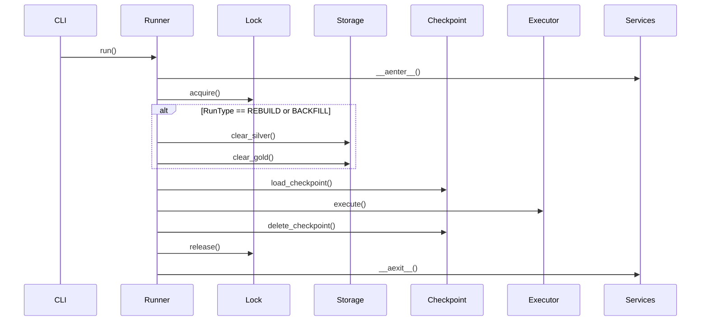

# План Рефакторинга BioETL

*Версия: 3.0 | Дата: 2024-12-24*

---

## Обзор

Этот документ описывает план рефакторинга для улучшения архитектурной чистоты, наблюдаемости и тестируемости BioETL. Каждая задача включает конкретные изменения файлов, критерии приёмки и оценку рисков.

**ВАЖНО:** Секция "КРИТИЧЕСКИЕ ЗАДАЧИ" (K1-K4) в конце документа содержит блокирующие задачи, которые MUST быть выполнены в первую очередь.

### Порядок выполнения

```
┌─────────────────────────────────────────────────────────────┐
│                  КРИТИЧЕСКИЕ (БЛОКЕРЫ)                      │
├─────────────────────────────────────────────────────────────┤
│  K1: Синтаксическая ошибка _clear_exports  ──────────────┐  │
│      (runner.py:121 — await в sync функции)              │  │
│                                                          │  │
│  K2: Видимость сбоев метрик ──────────────────────────┐  │  │
│      (server.py — fail_fast + structured logs)        │  │  │
│                                                       │  │  │
│  K3: Тесты жизненного цикла ──────────────────────────┴──┘  │
│      (CallRecorder для проверки порядка вызовов)            │
│                                                             │
│  K4: Документация ────────────────────────────────────────┘ │
│      (ADR-013, pipeline-lifecycle.md)                       │
└─────────────────────────────────────────────────────────────┘
                           │
                           ▼
┌─────────────────────────────────────────────────────────────┐
│                    ОСНОВНЫЕ ЗАДАЧИ                          │
├─────────────────────────────────────────────────────────────┤
│  Задача 2: Классификация ошибок ─────┐                      │
│                                      ├──▶ Задача 4: Метрики │
│  Задача 3: Lifecycle портов ─────────┘                      │
│                                                             │
│  Задача 1: CLI/Storage ──────────────────▶ Задача 5: Тесты  │
└─────────────────────────────────────────────────────────────┘
```

---

## Задача 1: Разделить обязанности CLI/Storage

### Проблема

CLI (`src/bioetl/interfaces/cli.py:30-76`) использует прямой обход файловой системы через `Path.rglob("*")` для preview режима, что:
- Нарушает Ports & Adapters архитектуру (CLI знает о структуре хранилища)
- Дублирует логику подсчёта файлов, уже реализованную в `StorageAdapter`
- Создаёт риск рассинхронизации путей между CLI и реальным хранилищем

### Целевое состояние

CLI делегирует все операции с хранилищем через `StoragePort`, включая preview.

### Конкретные изменения

#### 1.1 Расширить StoragePort (`src/bioetl/domain/ports.py`)

```python
# Добавить метод в class StoragePort(Protocol):

def preview_cleanup(
    self,
    silver_table: str,
    gold_table: str | None = None,
) -> dict[str, Any]:
    """Preview what would be cleared without actual deletion.

    Args:
        silver_table: Silver table name (e.g., 'chembl.activity')
        gold_table: Optional Gold table name

    Returns:
        Dict with structure:
        {
            "silver": {"path": str, "file_count": int, "exists": bool},
            "gold": {"path": str, "file_count": int, "exists": bool} | None,
            "total_files": int
        }
    """
    ...
```

#### 1.2 Реализовать в StorageAdapter (`src/bioetl/composition/factories/storage_factory.py`)

```python
def preview_cleanup(
    self,
    silver_table: str,
    gold_table: str | None = None,
) -> dict[str, Any]:
    """Implementation that reuses existing path logic from clear_* methods."""
    result = {
        "silver": self._preview_layer(self._silver, silver_table),
        "gold": None,
        "total_files": 0,
    }

    if gold_table and self._gold:
        result["gold"] = self._preview_layer(self._gold, gold_table)

    result["total_files"] = (
        result["silver"]["file_count"]
        + (result["gold"]["file_count"] if result["gold"] else 0)
    )
    return result

def _preview_layer(self, writer, table_name: str) -> dict[str, Any]:
    """Count files in a layer without deletion."""
    path = writer.get_table_path(table_name)
    file_count = 0
    if path.exists():
        file_count = sum(1 for f in path.rglob("*") if f.is_file())
    return {"path": str(path), "file_count": file_count, "exists": path.exists()}
```

#### 1.3 Обновить DeltaWriter/GoldWriter

Добавить метод `get_table_path(table_name: str) -> Path` в:
- `src/bioetl/infrastructure/storage/delta_writer.py`
- `src/bioetl/infrastructure/storage/gold_writer.py`

#### 1.4 Рефакторить CLI (`src/bioetl/interfaces/cli.py`)

Заменить функцию `_preview_cleanup()`:

```python
def _preview_cleanup(pipeline: str, run_type: str) -> None:
    """Preview what data would be cleared in dry-run mode."""
    try:
        config = load_pipeline_config(pipeline)
        storage = bootstrap_storage()  # Новая фабрика для read-only storage

        preview = storage.preview_cleanup(
            silver_table=config.silver_table,
            gold_table=config.gold_table,
        )

        click.echo("\nFiles/directories that would be cleared:")

        silver_info = preview["silver"]
        if silver_info["exists"]:
            click.echo(f"  Silver: {silver_info['path']} ({silver_info['file_count']} files)")
        else:
            click.echo(f"  Silver: {silver_info['path']} (does not exist)")

        if preview["gold"]:
            gold_info = preview["gold"]
            if gold_info["exists"]:
                click.echo(f"  Gold: {gold_info['path']} ({gold_info['file_count']} files)")
            else:
                click.echo(f"  Gold: {gold_info['path']} (does not exist)")

        click.echo(f"\nTotal items that would be cleared: ~{preview['total_files']}")
        click.echo("\nNo changes were made (dry-run mode).")
    except Exception as e:
        click.echo(f"Error previewing cleanup: {e}", err=True)
```

#### 1.5 Добавить bootstrap_storage() (`src/bioetl/composition/bootstrap.py`)

```python
def bootstrap_storage() -> StoragePort:
    """Bootstrap storage adapter for CLI operations (read-only context)."""
    settings = get_settings()
    return create_storage_adapter(settings, csv_export_enabled=False)
```

### Тесты

| Файл | Тест |
|------|------|
| `tests/unit/interfaces/test_cli.py` | `test_preview_cleanup_delegates_to_storage_port` |
| `tests/unit/composition/test_storage_factory.py` | `test_preview_cleanup_returns_correct_structure` |
| `tests/unit/composition/test_storage_factory.py` | `test_preview_cleanup_handles_missing_gold` |
| `tests/integration/test_cli_storage.py` | `test_dry_run_uses_storage_port` |

### Критерии приёмки

- [ ] Нет `Path.rglob` в `src/bioetl/interfaces/`
- [ ] `preview_cleanup()` определён в `StoragePort` и реализован в `StorageAdapter`
- [ ] CLI использует только порты для работы с хранилищем
- [ ] Тесты покрывают preview для Silver+Gold и только Silver
- [ ] `make lint && make test` проходят

### Риски и митигация

| Риск | Вероятность | Митигация |
|------|-------------|-----------|
| Рассинхронизация путей | Низкая | Единая реализация в адаптере, e2e тесты |
| Регрессия preview | Низкая | Сравнение output до/после в интеграционных тестах |

---

## Задача 2: Детерминизировать классификацию ошибок

### Проблема

Текущий `ErrorClassifier` (`src/bioetl/domain/error_classifier.py:47-59`) использует keyword matching по имени исключения:
- `any(kw in error_name for kw in keywords)` — эвристика, зависящая от именования
- Fallback на `ErrorType.INVALID_DATA` скрывает новые типы ошибок
- Нет явной связи между исключениями и `ErrorType`

### Целевое состояние

Каждое исключение явно маппится на `ErrorType` через декоратор или атрибут класса.

### Конкретные изменения

#### 2.1 Добавить атрибут error_type в BioETLError (`src/bioetl/domain/exceptions.py`)

```python
from bioetl.domain.types import ErrorType

class BioETLError(Exception):
    """Base exception for all BioETL errors."""
    error_type: ErrorType = ErrorType.INVALID_DATA  # Default fallback

    def __init__(self, message: str, *args, **kwargs):
        super().__init__(message, *args, **kwargs)


class CriticalError(BioETLError):
    """Base for non-recoverable errors."""
    error_type = ErrorType.DB_UNAVAILABLE


class LockLostError(CriticalError):
    """Lock was lost during operation."""
    error_type = ErrorType.LOCK_LOST

    def __init__(self, lock_key: str, run_id: str):
        super().__init__(f"Lock '{lock_key}' lost for run {run_id}")
        self.lock_key = lock_key
        self.run_id = run_id


class AuthFailureError(CriticalError):
    """Authentication failed."""
    error_type = ErrorType.AUTH_FAILURE


class RecoverableError(BioETLError):
    """Base for errors that can be retried."""
    error_type = ErrorType.NETWORK_ERROR


class RateLimitError(RecoverableError):
    """API rate limit exceeded."""
    error_type = ErrorType.RATE_LIMIT


class TimeoutError(RecoverableError):
    """Operation timed out."""
    error_type = ErrorType.TIMEOUT


class DataQualityError(BioETLError):
    """Base for data quality issues."""
    error_type = ErrorType.DATA_QUALITY


class SchemaViolationError(DataQualityError):
    """Schema validation failed."""
    error_type = ErrorType.SCHEMA_VIOLATION


class MissingRequiredFieldError(DataQualityError):
    """Required field is missing."""
    error_type = ErrorType.MISSING_REQUIRED_FIELD


class InvalidDataError(DataQualityError):
    """Data is invalid."""
    error_type = ErrorType.INVALID_DATA
```

#### 2.2 Упростить ErrorClassifier (`src/bioetl/domain/error_classifier.py`)

```python
class ErrorClassifier:
    """Classifies exceptions into ErrorType categories.

    Primary classification uses the error_type attribute on BioETLError subclasses.
    Falls back to keyword matching ONLY for non-domain exceptions with deprecation warning.
    """

    def __init__(self, strict_mode: bool = False):
        """Initialize classifier.

        Args:
            strict_mode: If True, raise ValueError for unknown exceptions
                        instead of using fallback. Enable in tests.
        """
        self._strict_mode = strict_mode
        self._fallback_count = 0  # Track for observability

    def classify(self, error: Exception) -> ErrorType:
        """Classify an exception into ErrorType.

        Classification strategy:
        1. Use error_type attribute if BioETLError subclass (deterministic)
        2. Fall back to keyword matching for legacy/external exceptions (with warning)

        Args:
            error: The exception to classify

        Returns:
            ErrorType category

        Raises:
            ValueError: In strict_mode if exception has no explicit mapping
        """
        # Primary: Use explicit error_type attribute
        if isinstance(error, BioETLError):
            return error.error_type

        # Fallback: keyword matching for non-domain exceptions
        self._fallback_count += 1
        result = _match_error_type(type(error).__name__)

        if self._strict_mode and result == ErrorType.INVALID_DATA:
            raise ValueError(
                f"Unknown exception type: {type(error).__name__}. "
                f"Wrap in BioETLError subclass with explicit error_type."
            )

        # Log warning for observability (in production)
        import warnings
        warnings.warn(
            f"Using keyword fallback for {type(error).__name__} -> {result}. "
            f"Consider wrapping in BioETLError subclass.",
            DeprecationWarning,
            stacklevel=2,
        )

        return result

    @property
    def fallback_usage_count(self) -> int:
        """Number of times keyword fallback was used (for metrics)."""
        return self._fallback_count
```

#### 2.3 Обновить адаптеры

Убедиться, что все адаптеры выбрасывают доменные исключения вместо голых Exception:

| Адаптер | Файл | Изменение |
|---------|------|-----------|
| ChEMBL | `infrastructure/adapters/chembl/client.py` | Обернуть `httpx.HTTPStatusError` в `RateLimitError`/`NetworkError` |
| PubChem | `infrastructure/adapters/pubchem/client.py` | Обернуть `pubchempy` ошибки |
| UniProt | `infrastructure/adapters/uniprot/client.py` | Обернуть `unipressed` ошибки |

Пример для ChEMBL:

```python
async def _handle_response(self, response: httpx.Response) -> dict:
    try:
        response.raise_for_status()
    except httpx.HTTPStatusError as e:
        if e.response.status_code == 429:
            raise RateLimitError(
                provider="chembl",
                retry_after=int(e.response.headers.get("Retry-After", 60)),
            ) from e
        if e.response.status_code in (502, 503, 504):
            raise TimeoutError(f"ChEMBL gateway error: {e.response.status_code}") from e
        if e.response.status_code in (401, 403):
            raise AuthFailureError(f"ChEMBL auth failed: {e.response.status_code}") from e
        raise NetworkError(f"ChEMBL HTTP error: {e}") from e
```

### Тесты

| Файл | Тест |
|------|------|
| `tests/unit/domain/test_error_classifier.py` | `test_classify_uses_error_type_attribute` |
| `tests/unit/domain/test_error_classifier.py` | `test_classify_fallback_emits_deprecation_warning` |
| `tests/unit/domain/test_error_classifier.py` | `test_strict_mode_raises_for_unknown` |
| `tests/unit/domain/test_error_classifier.py` | `test_each_exception_has_correct_error_type` (parametrized) |
| `tests/unit/infrastructure/adapters/test_chembl_errors.py` | `test_429_raises_rate_limit_error` |

### Критерии приёмки

- [ ] Все `BioETLError` подклассы имеют явный `error_type` атрибут
- [ ] `ErrorClassifier.classify()` для доменных ошибок не использует keyword matching
- [ ] Fallback логирует deprecation warning
- [ ] Тесты покрывают каждый `ErrorType` через конкретное исключение
- [ ] `make lint && make test` проходят

### Риски и митигация

| Риск | Вероятность | Митигация |
|------|-------------|-----------|
| Пропущенные адаптеры | Средняя | Grep по `raise Exception` и `raise ValueError` в adapters/ |
| Regression в retry логике | Низкая | Существующие integration тесты с VCR |
| Breaking change API | Низкая | Fallback сохраняет обратную совместимость |

---

## Задача 3: Управление жизненным циклом метрик/трейсинга

### Проблема

- `MetricsPort` и `TracingPort` не имеют методов закрытия
- `PrometheusMetrics` использует глобальный registry без cleanup
- При тестировании могут накапливаться orphan метрики
- OpenTelemetry tracer может не flush'ить spans при graceful shutdown

### Целевое состояние

Все observability порты имеют `close()` метод, вызываемый при завершении пайплайна.

### Конкретные изменения

#### 3.1 Расширить порты (`src/bioetl/domain/ports.py`)

```python
@runtime_checkable
class MetricsPort(Protocol):
    """Port for metrics collection."""

    def observe_histogram(self, name: str, value: float, labels: dict[str, str]) -> None:
        ...

    def increment_counter(self, name: str, value: int, labels: dict[str, str]) -> None:
        ...

    def close(self) -> None:
        """Cleanup metrics resources. Idempotent."""
        ...


@runtime_checkable
class TracingPort(Protocol):
    """Port for distributed tracing."""

    def get_tracer(self, name: str) -> Any:
        ...

    def close(self) -> None:
        """Flush pending spans and cleanup. Idempotent."""
        ...
```

#### 3.2 Реализовать close() в адаптерах

**PrometheusMetrics** (`src/bioetl/infrastructure/observability/prometheus_metrics.py`):

```python
class PrometheusMetrics(MetricsPort):
    def __init__(self, registry: CollectorRegistry | None = None):
        self._registry = registry or REGISTRY
        self._closed = False

    def close(self) -> None:
        """Cleanup Prometheus metrics. Idempotent."""
        if self._closed:
            return
        # For custom registry: unregister collectors
        # For default REGISTRY: no-op (shared across tests)
        self._closed = True
```

**OpenTelemetryTracer** (`src/bioetl/infrastructure/observability/tracing.py`):

```python
class OpenTelemetryTracer(TracingPort):
    def __init__(self, service_name: str):
        self._provider = TracerProvider(...)
        self._closed = False

    def close(self) -> None:
        """Flush spans and shutdown provider. Idempotent."""
        if self._closed:
            return
        try:
            self._provider.force_flush(timeout_millis=5000)
            self._provider.shutdown()
        except Exception:
            pass  # Best effort
        self._closed = True
```

**NoOp implementations**:

```python
class NoOpMetrics(MetricsPort):
    def observe_histogram(self, name, value, labels): pass
    def increment_counter(self, name, value, labels): pass
    def close(self) -> None: pass  # No-op

class NoOpTracer(TracingPort):
    def get_tracer(self, name): return NoOpTracerInstance()
    def close(self) -> None: pass  # No-op
```

#### 3.3 Вызывать close() в PipelineRunner (`src/bioetl/application/core/runner.py`)

```python
class PipelineRunner:
    async def run(self) -> None:
        try:
            await self._execute_pipeline()
        finally:
            await self._cleanup()

    async def _cleanup(self) -> None:
        """Cleanup all resources including observability."""
        # Existing cleanup...
        await self._services.aclose()

        # New: Close observability
        if hasattr(self._services, 'metrics'):
            self._services.metrics.close()
        if hasattr(self._services, 'tracer'):
            self._services.tracer.close()
```

#### 3.4 Обновить PipelineServices (`src/bioetl/application/core/pipeline_services.py`)

Добавить metrics и tracer как optional поля:

```python
@dataclass
class PipelineServices:
    data_source: DataSourcePort
    storage: StoragePort
    lock: LockPort
    checkpoint: CheckpointPort
    quarantine: QuarantinePort
    logger: LoggerPort
    metrics: MetricsPort | None = None
    tracer: TracingPort | None = None

    async def aclose(self) -> None:
        """Close all service connections."""
        await self.data_source.aclose()
        await self.storage.aclose()
        await self.lock.aclose()
        await self.checkpoint.aclose()
        await self.quarantine.aclose()

        # Close observability (sync, best-effort)
        if self.metrics:
            self.metrics.close()
        if self.tracer:
            self.tracer.close()
```

### Тесты

| Файл | Тест |
|------|------|
| `tests/unit/infrastructure/observability/test_prometheus_metrics.py` | `test_close_is_idempotent` |
| `tests/unit/infrastructure/observability/test_tracing.py` | `test_close_flushes_spans` |
| `tests/integration/test_pipeline_cleanup.py` | `test_runner_closes_observability_on_success` |
| `tests/integration/test_pipeline_cleanup.py` | `test_runner_closes_observability_on_failure` |

### Критерии приёмки

- [ ] `MetricsPort.close()` и `TracingPort.close()` определены в портах
- [ ] Все реализации (Prometheus, OTEL, NoOp) имеют idempotent `close()`
- [ ] `PipelineRunner` вызывает `close()` в finally блоке
- [ ] Интеграционные тесты подтверждают отсутствие pending spans/orphan collectors
- [ ] `make lint && make test` проходят

### Риски и митигация

| Риск | Вероятность | Митигация |
|------|-------------|-----------|
| Breaking existing no-op mocks | Средняя | close() с default pass implementation |
| Timeout при flush | Низкая | Timeout 5s + best-effort в try/except |
| Double close | Низкая | Idempotent flag `_closed` |

---

## Задача 4: Усилить наблюдаемость пайплайна

### Проблема

Текущие метрики (`src/bioetl/infrastructure/observability/metrics.py`) не покрывают:
- Детализацию по medallion слоям (bronze_write_seconds, silver_merge_seconds, gold_transform_seconds)
- Quarantine метрики по error_type
- Checkpoint операции (save_seconds, load_seconds)
- Circuit breaker состояния

### Целевое состояние

Полная observability для каждого этапа пайплайна с Prometheus метриками и Grafana dashboard.

### Конкретные изменения

#### 4.1 Добавить новые метрики (`src/bioetl/infrastructure/observability/metrics.py`)

```python
# Medallion layer timing
BRONZE_WRITE_SECONDS = Histogram(
    "bioetl_bronze_write_seconds",
    "Time to write batch to Bronze layer",
    ["pipeline", "provider", "entity"],
    buckets=[0.1, 0.5, 1.0, 2.0, 5.0, 10.0],
)

SILVER_MERGE_SECONDS = Histogram(
    "bioetl_silver_merge_seconds",
    "Time to merge batch into Silver Delta table",
    ["pipeline", "table", "mode"],  # mode: merge, append
    buckets=[0.5, 1.0, 2.0, 5.0, 10.0, 30.0],
)

GOLD_TRANSFORM_SECONDS = Histogram(
    "bioetl_gold_transform_seconds",
    "Time to transform and write Gold records",
    ["pipeline", "table"],
    buckets=[0.1, 0.5, 1.0, 2.0, 5.0],
)

# Quarantine detailed metrics
QUARANTINE_RECORDS_BY_ERROR = Counter(
    "bioetl_quarantine_records_total",
    "Quarantined records by error type",
    ["pipeline", "error_type", "error_code"],
)

# Checkpoint metrics
CHECKPOINT_OPERATIONS = Histogram(
    "bioetl_checkpoint_operation_seconds",
    "Time for checkpoint operations",
    ["pipeline", "operation"],  # operation: save, load
    buckets=[0.01, 0.05, 0.1, 0.5, 1.0],
)

# Circuit breaker metrics
CIRCUIT_BREAKER_STATE = Gauge(
    "bioetl_circuit_breaker_state",
    "Current circuit breaker state (0=closed, 1=half_open, 2=open)",
    ["pipeline", "provider"],
)

CIRCUIT_BREAKER_TRIPS = Counter(
    "bioetl_circuit_breaker_trips_total",
    "Total circuit breaker trips to open state",
    ["pipeline", "provider"],
)
```

#### 4.2 Инструментировать RecordProcessor (`src/bioetl/application/core/record_processor.py`)

```python
import time

async def process_batch(self, records: list[dict], batch_id: BatchID) -> BatchResult:
    # Bronze write with timing
    bronze_start = time.perf_counter()
    await self._write_bronze(records, batch_id)
    self._metrics.observe_histogram(
        "bronze_write_seconds",
        time.perf_counter() - bronze_start,
        {"pipeline": self._pipeline, "provider": self._provider, "entity": self._entity},
    )

    # Silver merge with timing
    silver_start = time.perf_counter()
    silver_records, quarantined = await self._transform_and_validate(records)
    await self._write_silver(silver_records)
    self._metrics.observe_histogram(
        "silver_merge_seconds",
        time.perf_counter() - silver_start,
        {"pipeline": self._pipeline, "table": self._silver_table, "mode": "merge"},
    )

    # Track quarantine by error type
    for q in quarantined:
        self._metrics.increment_counter(
            "quarantine_records_total",
            1,
            {"pipeline": self._pipeline, "error_type": q.error_type.value, "error_code": q.error_code},
        )

    # Gold transform with timing (if enabled)
    if self._gold_enabled:
        gold_start = time.perf_counter()
        await self._write_gold(silver_records)
        self._metrics.observe_histogram(
            "gold_transform_seconds",
            time.perf_counter() - gold_start,
            {"pipeline": self._pipeline, "table": self._gold_table},
        )

    return BatchResult(...)
```

#### 4.3 Инструментировать CheckpointManager (`src/bioetl/application/core/checkpoint_manager.py`)

```python
async def save_checkpoint(self, offset: int) -> None:
    start = time.perf_counter()
    await self._checkpoint_port.save(self._pipeline, self._run_id, {"offset": offset})
    self._metrics.observe_histogram(
        "checkpoint_operation_seconds",
        time.perf_counter() - start,
        {"pipeline": self._pipeline, "operation": "save"},
    )

async def load_checkpoint(self) -> dict | None:
    start = time.perf_counter()
    result = await self._checkpoint_port.load(self._pipeline)
    self._metrics.observe_histogram(
        "checkpoint_operation_seconds",
        time.perf_counter() - start,
        {"pipeline": self._pipeline, "operation": "load"},
    )
    return result
```

#### 4.4 Добавить метрики в PrometheusMetrics

Обновить `HISTOGRAMS` и `COUNTERS` в `prometheus_metrics.py`:

```python
HISTOGRAMS = {
    "pipeline_duration_seconds": PIPELINE_DURATION_SECONDS,
    "batch_size_records": BATCH_SIZE_RECORDS,
    "bronze_write_seconds": BRONZE_WRITE_SECONDS,
    "silver_merge_seconds": SILVER_MERGE_SECONDS,
    "gold_transform_seconds": GOLD_TRANSFORM_SECONDS,
    "checkpoint_operation_seconds": CHECKPOINT_OPERATIONS,
}

COUNTERS = {
    "records_processed_total": RECORDS_PROCESSED_TOTAL,
    "errors_total": ERRORS_TOTAL,
    "quarantine_records_total": QUARANTINE_RECORDS_BY_ERROR,
    "circuit_breaker_trips_total": CIRCUIT_BREAKER_TRIPS,
    # ... existing
}

GAUGES = {
    "circuit_breaker_state": CIRCUIT_BREAKER_STATE,
}
```

#### 4.5 Создать Grafana dashboard (опционально)

Файл: `monitoring/dashboards/bioetl-pipeline.json`

Панели:
- Pipeline throughput (records/sec by layer)
- Layer latencies (p50, p95, p99)
- Error rate by type
- Quarantine trend
- Circuit breaker status

### Тесты

| Файл | Тест |
|------|------|
| `tests/unit/application/core/test_record_processor_metrics.py` | `test_bronze_write_emits_histogram` |
| `tests/unit/application/core/test_record_processor_metrics.py` | `test_quarantine_increments_counter_with_error_type` |
| `tests/e2e/test_observability.py` | `test_full_pipeline_emits_all_layer_metrics` |

### Критерии приёмки

- [ ] Метрики bronze/silver/gold timing определены и эмитятся
- [ ] Quarantine метрики включают error_type label
- [ ] Checkpoint операции имеют timing метрики
- [ ] Circuit breaker state доступен как gauge
- [ ] E2E тест проверяет наличие всех метрик после run
- [ ] `make lint && make test` проходят

### Риски и митигация

| Риск | Вероятность | Митигация |
|------|-------------|-----------|
| Performance overhead | Низкая | time.perf_counter() ~100ns, negligible |
| Cardinality explosion | Средняя | Ограничить labels, избегать high-cardinality (run_id) |
| Missing metrics in tests | Средняя | NoOpMetrics в unit tests, real metrics в e2e |

---

## Задача 5: Актуализировать архитектурные тесты

### Проблема

Текущие тесты (`tests/architecture/test_layer_dependencies.py`) не покрывают:
- Новые порты (если добавлены в задаче 1, 3)
- Проверку наличия `error_type` атрибута в исключениях
- Проверку `close()` методов в observability портах
- Полное соответствие import-linter конфигурации

### Целевое состояние

Архитектурные тесты автоматически ловят нарушения при CI.

### Конкретные изменения

#### 5.1 Добавить проверку error_type атрибута

```python
# tests/architecture/test_layer_dependencies.py

def test_all_bioetl_exceptions_have_error_type(src_dir: Path) -> None:
    """All BioETLError subclasses must have explicit error_type attribute.

    REQ-ARCH-020: Deterministic error classification requires explicit mapping.
    """
    exceptions_file = src_dir / "bioetl" / "domain" / "exceptions.py"

    import ast
    with exceptions_file.open() as f:
        tree = ast.parse(f.read())

    errors = []
    for node in ast.walk(tree):
        if isinstance(node, ast.ClassDef):
            # Check if inherits from BioETLError or its subclasses
            bases = [b.id for b in node.bases if isinstance(b, ast.Name)]
            if any(b in ("BioETLError", "CriticalError", "RecoverableError", "DataQualityError")
                   for b in bases):
                # Check for error_type class attribute
                has_error_type = any(
                    isinstance(stmt, ast.AnnAssign)
                    and isinstance(stmt.target, ast.Name)
                    and stmt.target.id == "error_type"
                    for stmt in node.body
                )
                if not has_error_type:
                    errors.append(f"{node.name} missing error_type attribute")

    assert not errors, "\n".join(errors)
```

#### 5.2 Добавить проверку close() в observability портах

```python
def test_observability_ports_have_close_method(src_dir: Path) -> None:
    """MetricsPort and TracingPort must define close() method.

    REQ-ARCH-021: Proper lifecycle management for observability.
    """
    ports_file = src_dir / "bioetl" / "domain" / "ports.py"

    with ports_file.open() as f:
        content = f.read()

    import ast
    tree = ast.parse(content)

    required_ports = {"MetricsPort", "TracingPort"}
    found_close = set()

    for node in ast.walk(tree):
        if isinstance(node, ast.ClassDef) and node.name in required_ports:
            for item in node.body:
                if isinstance(item, ast.FunctionDef) and item.name == "close":
                    found_close.add(node.name)

    missing = required_ports - found_close
    assert not missing, f"Ports missing close() method: {missing}"
```

#### 5.3 Добавить проверку preview_cleanup в StoragePort

```python
def test_storage_port_has_preview_cleanup(src_dir: Path) -> None:
    """StoragePort must define preview_cleanup() for CLI dry-run.

    REQ-ARCH-022: CLI delegates all storage operations to port.
    """
    ports_file = src_dir / "bioetl" / "domain" / "ports.py"

    with ports_file.open() as f:
        content = f.read()

    assert "def preview_cleanup(" in content, (
        "StoragePort must define preview_cleanup() method"
    )
```

#### 5.4 Проверка отсутствия Path.rglob в interfaces

```python
def test_interfaces_no_direct_filesystem_traversal(src_dir: Path) -> None:
    """Interfaces layer must not use direct filesystem traversal.

    REQ-ARCH-023: CLI delegates to StoragePort, not Path.rglob.
    """
    interfaces_path = src_dir / "bioetl" / "interfaces"

    forbidden_patterns = [
        r"\.rglob\(",
        r"\.glob\(",
        r"os\.walk\(",
        r"os\.listdir\(",
    ]

    errors = []
    for py_file in interfaces_path.rglob("*.py"):
        with py_file.open() as f:
            content = f.read()
        for pattern in forbidden_patterns:
            if re.search(pattern, content):
                errors.append(f"Forbidden pattern '{pattern}' in {py_file}")

    assert not errors, "\n".join(errors)
```

#### 5.5 Обновить Makefile

```makefile
# В Makefile добавить/обновить:

.PHONY: arch-test
arch-test:
	@echo "Running architecture tests..."
	pytest tests/architecture/ -v --tb=short

.PHONY: arch-lint
arch-lint:
	@echo "Running import-linter..."
	lint-imports

.PHONY: arch-all
arch-all: arch-lint arch-test
	@echo "All architecture checks passed"
```

#### 5.6 Обновить .importlinter

Добавить контракт для composition:

```ini
[importlinter:contract:composition-root]
name = Composition Root Boundary
type = forbidden
source_modules =
    bioetl.domain
    bioetl.application
forbidden_modules =
    bioetl.composition
```

### Тесты

| Файл | Тест |
|------|------|
| `tests/architecture/test_layer_dependencies.py` | `test_all_bioetl_exceptions_have_error_type` |
| `tests/architecture/test_layer_dependencies.py` | `test_observability_ports_have_close_method` |
| `tests/architecture/test_layer_dependencies.py` | `test_storage_port_has_preview_cleanup` |
| `tests/architecture/test_layer_dependencies.py` | `test_interfaces_no_direct_filesystem_traversal` |

### Критерии приёмки

- [ ] `make arch-test` падает при нарушении новых правил
- [ ] `make arch-lint` (import-linter) проходит
- [ ] Все новые порты/методы проверяются тестами
- [ ] CI workflow включает `make arch-all`
- [ ] `make lint && make test` проходят

### Риски и митигация

| Риск | Вероятность | Митигация |
|------|-------------|-----------|
| Ложные срабатывания | Средняя | Baseline исключений, whitelist |
| Slow AST parsing | Низкая | Кэширование в conftest.py |
| Missing edge cases | Средняя | Итеративное добавление проверок |

---

## Порядок выполнения

```
Задача 2 (Errors) ──────┐
                        ├──▶ Задача 4 (Observability)
Задача 3 (Lifecycle) ───┘
        │
        └──▶ Задача 1 (CLI/Storage) ──▶ Задача 5 (Arch Tests)
```

**Обоснование:**
1. **Задача 2** (Errors) и **Задача 3** (Lifecycle) независимы, можно параллелить
2. **Задача 4** (Observability) зависит от lifecycle (close()) и errors (error_type в метриках)
3. **Задача 1** (CLI/Storage) требует стабильных портов
4. **Задача 5** (Arch Tests) финализирует все изменения

---

## Оценка сложности

| Задача | Файлов | Новых тестов | Сложность |
|--------|--------|--------------|-----------|
| 1. CLI/Storage | 4-5 | 4 | Средняя |
| 2. Error Classification | 5-8 | 5 | Высокая |
| 3. Lifecycle | 4-6 | 4 | Средняя |
| 4. Observability | 3-4 | 3 | Средняя |
| 5. Arch Tests | 2-3 | 4 | Низкая |

---

## КРИТИЧЕСКИЕ ЗАДАЧИ (Блокеры запуска пайплайнов)

Эти задачи MUST быть выполнены в первую очередь, так как они блокируют работу системы.

### Сводная таблица

| ID | Задача | Файлы | Статус | Зависимости |
|----|--------|-------|--------|-------------|
| K1 | Синтаксис _clear_exports | `runner.py`, `test_runner.py` | 🔴 БЛОКЕР | — |
| K2 | fail_fast метрики | `server.py`, `bootstrap.py` | 🟡 ВАЖНО | — |
| K3 | Тесты жизненного цикла | `test_runner_lifecycle.py` (новый) | 🟡 ВАЖНО | K1 |
| K4 | Документация | `ADR-013`, `pipeline-lifecycle.md` | 🟢 ОБЫЧНЫЙ | K1, K2 |

### Зависимости между задачами

```
K1 ──────────────────────┬──▶ K3 ──▶ K4
                         │
K2 ──────────────────────┴──────────▶ K4
```

**K1 блокирует K3**: Тесты порядка вызовов используют async _clear_exports.
**K1, K2 блокируют K4**: Документация описывает исправленное поведение.

---

### Задача K1: Исправить синтаксическую ошибку в _clear_exports

**Статус:** 🔴 БЛОКЕР

**Проблема:**

Метод `_clear_exports()` в `src/bioetl/application/core/runner.py:121-182` определён как синхронный (`def`), но использует `await` для вызова асинхронных методов `StoragePort`:

```python
# runner.py:121 — синхронный метод
def _clear_exports(self) -> None:
    ...
    # runner.py:151-156 — await в синхронной функции = SyntaxError
    silver_cleared = await storage.clear_silver(...)
    gold_cleared = await storage.clear_gold(...)
```

При этом вызов на строке 105 без `await`:
```python
self._clear_exports()  # Должно быть: await self._clear_exports()
```

**Целевое состояние:**

Модуль парсится без ошибок. Асинхронная очистка корректно интегрирована в жизненный цикл runner.

**Конкретные изменения:**

#### K1.1 Сделать _clear_exports асинхронным (`runner.py:121`)

```python
# ДО:
def _clear_exports(self) -> None:

# ПОСЛЕ:
async def _clear_exports(self) -> None:
```

#### K1.2 Вызывать с await (`runner.py:105`)

```python
# ДО:
self._clear_exports()

# ПОСЛЕ:
await self._clear_exports()
```

#### K1.3 Обновить тесты (`tests/unit/application/core/test_runner.py`)

Тесты класса `TestPipelineRunnerClearExports` (строки 350-520) вызывают `_clear_exports()` напрямую:

**Изменить все тесты:**

```python
# ДО (строки 387, 425, 465, 512):
runner._clear_exports()

# ПОСЛЕ:
await runner._clear_exports()
```

**Изменить декоратор класса:**

```python
# ДО (строка 350):
@pytest.mark.unit
class TestPipelineRunnerClearExports:

# ПОСЛЕ:
@pytest.mark.unit
@pytest.mark.asyncio
class TestPipelineRunnerClearExports:
```

**Изменить каждый тест:**

```python
# ДО:
def test_clear_exports_calls_storage_methods(...):

# ПОСЛЕ:
async def test_clear_exports_calls_storage_methods(...):
```

**Обновить моки storage:**

```python
# ДО (строки 373-374, и аналогично в других тестах):
services.storage.clear_silver = MagicMock(return_value=5)
services.storage.clear_gold = MagicMock(return_value=1)

# ПОСЛЕ:
services.storage.clear_silver = AsyncMock(return_value=5)
services.storage.clear_gold = AsyncMock(return_value=1)
```

**Тесты:**

| Файл | Тест | Проверяемое поведение |
|------|------|----------------------|
| `tests/unit/application/core/test_runner.py` | `test_clear_exports_skips_for_incremental` | Incremental run НЕ вызывает clear_* |
| `tests/unit/application/core/test_runner.py` | `test_clear_exports_clears_for_rebuild` | Rebuild run вызывает clear_silver + clear_gold |
| `tests/unit/application/core/test_runner.py` | `test_clear_exports_dry_run_mode` | dry_run=True передаётся в storage методы |
| `tests/unit/application/core/test_runner.py` | `test_run_awaits_clear_exports` | run() корректно ожидает _clear_exports |

**Критерии приёмки:**

- [ ] `python -c "import bioetl.application.core.runner"` проходит без ошибок
- [ ] Все тесты `test_clear_exports_*` являются async и используют AsyncMock
- [ ] `make test-unit` проходит для модуля runner
- [ ] Тест покрывает incremental (skip) и rebuild (cleanup) сценарии

**Риски и митигация:**

| Риск | Вероятность | Митигация |
|------|-------------|-----------|
| Пропущенные вызовы в тестах | Средняя | Grep по `runner._clear_exports` |
| Регрессия в integration тестах | Низкая | VCR кассеты сохраняют поведение |

---

### Задача K2: Гарантировать видимость сбоев наблюдаемости

**Статус:** 🟡 ВАЖНО

**Проблема:**

`start_metrics_server()` в `src/bioetl/infrastructure/observability/server.py:38-51` имеет две проблемы:

1. **Маскирование ошибки при занятом порте** (строки 40-46):
   ```python
   if e.errno == errno.EADDRINUSE:
       logger.warning(...)
       _SERVER_STARTED = True  # ← Ложный успех!
   ```
   Другой процесс уже занял порт, но мы помечаем сервер как запущенный. Метрики не будут экспортироваться, но пайплайн об этом не узнает.

2. **Недостаточный контекст в логах** (строки 47-51):
   ```python
   logger.error(f"Failed to start metrics server on port {port}: {e}")
   ```
   Нет информации о run_id, pipeline_name, hostname для диагностики в production.

**Целевое состояние:**

Сбои при запуске метрик-сервера явно видны. Настройка `fail_fast` позволяет контролировать поведение.

**Конкретные изменения:**

#### K2.1 Добавить fail_fast параметр (`server.py`)

```python
from dataclasses import dataclass
from typing import Callable

@dataclass
class MetricsServerConfig:
    """Configuration for Prometheus metrics server."""
    port: int = 8000
    fail_fast: bool = False
    on_port_conflict: Callable[[int], None] | None = None


class MetricsServerError(Exception):
    """Raised when metrics server fails to start with fail_fast=True."""
    def __init__(self, port: int, reason: str, original_error: Exception | None = None):
        super().__init__(f"Metrics server failed on port {port}: {reason}")
        self.port = port
        self.reason = reason
        self.original_error = original_error


def start_metrics_server(
    port: int = 8000,
    *,
    fail_fast: bool = False,
    retry_count: int = 3,
    retry_delay: float = 1.0,
) -> bool:
    """Start Prometheus metrics HTTP server.

    Args:
        port: Port to bind the HTTP server (default: 8000)
        fail_fast: If True, raise MetricsServerError on failure
        retry_count: Number of retries for transient errors (default: 3)
        retry_delay: Delay between retries in seconds (default: 1.0)

    Returns:
        True if server started successfully, False otherwise

    Raises:
        MetricsServerError: If fail_fast=True and server cannot start
    """
    global _SERVER_STARTED

    if _SERVER_STARTED:
        logger.debug("Metrics server already started")
        return True

    with _SERVER_LOCK:
        if _SERVER_STARTED:
            return True

        last_error: Exception | None = None
        for attempt in range(retry_count):
            try:
                start_http_server(port)
                _SERVER_STARTED = True
                logger.info(
                    "Prometheus metrics server started",
                    extra={
                        "port": port,
                        "attempt": attempt + 1,
                    },
                )
                return True
            except OSError as e:
                last_error = e
                if e.errno == errno.EADDRINUSE:
                    # Port conflict — no retry will help
                    logger.warning(
                        "Metrics port already in use",
                        extra={
                            "port": port,
                            "errno": e.errno,
                            "action": "metrics_disabled" if not fail_fast else "failing",
                        },
                    )
                    if fail_fast:
                        raise MetricsServerError(
                            port=port,
                            reason="port_in_use",
                            original_error=e,
                        ) from e
                    # Mark as "attempted" to prevent retries, but don't pretend success
                    _SERVER_STARTED = True
                    return False
                else:
                    # Transient error — retry with backoff
                    if attempt < retry_count - 1:
                        import time
                        time.sleep(retry_delay * (2 ** attempt))
                        continue
                    logger.error(
                        "Failed to start metrics server",
                        extra={
                            "port": port,
                            "errno": e.errno,
                            "attempts": retry_count,
                        },
                    )
                    if fail_fast:
                        raise MetricsServerError(
                            port=port,
                            reason="os_error",
                            original_error=e,
                        ) from e
                    return False
            except Exception as e:
                last_error = e
                logger.error(
                    "Unexpected error starting metrics server",
                    extra={
                        "port": port,
                        "error_type": type(e).__name__,
                    },
                    exc_info=True,
                )
                if fail_fast:
                    raise MetricsServerError(
                        port=port,
                        reason="unexpected",
                        original_error=e,
                    ) from e
                return False

        return False  # All retries exhausted
```

#### K2.2 Интеграция с bootstrap (`composition/bootstrap.py`)

```python
def bootstrap_observability(
    settings: Settings,
    *,
    fail_fast_metrics: bool | None = None,
) -> tuple[MetricsPort, TracingPort]:
    """Bootstrap observability components.

    Args:
        settings: Application settings
        fail_fast_metrics: Override settings.fail_fast_metrics

    Returns:
        Tuple of (metrics, tracer) ports
    """
    from bioetl.infrastructure.observability.server import (
        start_metrics_server,
        MetricsServerError,
    )

    fail_fast = fail_fast_metrics if fail_fast_metrics is not None else settings.fail_fast_metrics

    try:
        server_started = start_metrics_server(
            port=settings.metrics_port,
            fail_fast=fail_fast,
        )
        if not server_started:
            logger.warning(
                "Metrics server not running — metrics will be no-op",
                extra={"port": settings.metrics_port},
            )
    except MetricsServerError as e:
        # fail_fast=True and server failed
        raise

    # Continue with metrics/tracer setup...
```

#### K2.3 Добавить настройку в Settings

```python
# src/bioetl/domain/config.py или settings.py
class Settings:
    ...
    metrics_port: int = 8000
    fail_fast_metrics: bool = False  # Default: lenient, set True for strict environments
```

**Тесты:**

| Файл | Тест | Проверяемое поведение |
|------|------|----------------------|
| `tests/unit/infrastructure/observability/test_server.py` | `test_fail_fast_raises_on_port_conflict` | fail_fast=True поднимает MetricsServerError |
| `tests/unit/infrastructure/observability/test_server.py` | `test_lenient_mode_returns_false_on_conflict` | fail_fast=False возвращает False, не исключение |
| `tests/unit/infrastructure/observability/test_server.py` | `test_retry_on_transient_error` | OSError (не EADDRINUSE) ретраится 3 раза |
| `tests/unit/infrastructure/observability/test_server.py` | `test_logs_contain_diagnostic_context` | extra содержит port, errno, attempt |

**Критерии приёмки:**

- [ ] `start_metrics_server()` возвращает `bool`, а не `None`
- [ ] `MetricsServerError` определён и экспортируется
- [ ] fail_fast=True вызывает исключение при ошибке
- [ ] Логи содержат structured extra (port, errno, attempt)
- [ ] `make lint && make test` проходят

**Риски и митигация:**

| Риск | Вероятность | Митигация |
|------|-------------|-----------|
| Pipeline fails при занятом порте в CI | Средняя | fail_fast=False по умолчанию |
| Нестабильные тесты из-за портов | Низкая | Использовать random port в тестах |

---

### Задача K3: Усилить покрытие жизненного цикла пайплайна

**Статус:** 🟡 ВАЖНО

**Проблема:**

Текущие тесты `PipelineRunner.run()` не проверяют **порядок** вызовов и инварианты:

1. Lock MUST быть захвачен ДО любых операций с данными
2. Checkpoint load MUST быть ДО execute
3. Clear MUST быть ДО execute (для rebuild/backfill)
4. Checkpoint delete MUST быть ПОСЛЕ успешного execute
5. Lock MUST быть освобождён в finally (даже при ошибке)

**Целевое состояние:**

Интеграционный тест фиксирует ожидаемую последовательность вызовов.

**Конкретные изменения:**

#### K3.1 Создать тест порядка вызовов (`tests/integration/test_runner_lifecycle.py`)

```python
"""Integration tests for PipelineRunner lifecycle invariants."""

import pytest
from collections import deque
from dataclasses import dataclass, field
from unittest.mock import AsyncMock, MagicMock, patch
from uuid import uuid4

from bioetl.application.core.runner import PipelineRunner
from bioetl.domain.config import PipelineConfig, RuntimeConfig
from bioetl.domain.context import PipelineContext
from bioetl.domain.types import RunType


@dataclass
class CallRecorder:
    """Records the order of method calls for verification."""
    calls: deque = field(default_factory=deque)

    def record(self, method: str) -> None:
        self.calls.append(method)

    def assert_order(self, *expected: str) -> None:
        """Assert calls happened in the specified order."""
        actual = list(self.calls)
        for i, method in enumerate(expected):
            assert method in actual, f"Expected call '{method}' not found in {actual}"
            idx = actual.index(method)
            # Ensure this call comes after all previous expected calls
            for prev in expected[:i]:
                prev_idx = actual.index(prev)
                assert prev_idx < idx, (
                    f"'{prev}' (idx {prev_idx}) should come before '{method}' (idx {idx})"
                )


@pytest.fixture
def call_recorder():
    return CallRecorder()


@pytest.fixture
def mock_services_with_recorder(call_recorder):
    """Create services that record all calls."""
    services = MagicMock()

    # Lock methods
    services.lock = AsyncMock()
    services.lock.acquire = AsyncMock(
        side_effect=lambda *a, **kw: call_recorder.record("lock.acquire")
    )
    services.lock.release = AsyncMock(
        side_effect=lambda *a, **kw: call_recorder.record("lock.release")
    )

    # Storage methods
    services.storage = MagicMock()
    services.storage.clear_silver = AsyncMock(
        side_effect=lambda *a, **kw: (call_recorder.record("storage.clear_silver"), 0)[1]
    )
    services.storage.clear_gold = AsyncMock(
        side_effect=lambda *a, **kw: (call_recorder.record("storage.clear_gold"), 0)[1]
    )

    # Context manager support
    async def services_aenter():
        call_recorder.record("services.__aenter__")
        return services

    async def services_aexit(*args):
        call_recorder.record("services.__aexit__")

    services.__aenter__ = services_aenter
    services.__aexit__ = services_aexit

    services.metrics = MagicMock()
    return services


@pytest.fixture
def mock_checkpoint_manager_with_recorder(call_recorder):
    """Create checkpoint manager that records calls."""
    manager = AsyncMock()

    async def load_checkpoint():
        call_recorder.record("checkpoint.load")
        return None

    async def delete_checkpoint():
        call_recorder.record("checkpoint.delete")

    manager.load_checkpoint = load_checkpoint
    manager.delete_checkpoint = delete_checkpoint
    return manager


@pytest.fixture
def mock_executor_with_recorder(call_recorder):
    """Create executor that records calls."""
    executor = AsyncMock()

    async def execute(*args, **kwargs):
        call_recorder.record("executor.execute")

    executor.execute = execute
    executor.records_fetched = 100
    return executor


class TestPipelineRunnerLifecycle:
    """Tests for PipelineRunner lifecycle invariants."""

    @pytest.mark.asyncio
    async def test_rebuild_lifecycle_order(
        self,
        call_recorder,
        mock_services_with_recorder,
        mock_checkpoint_manager_with_recorder,
        mock_executor_with_recorder,
    ):
        """Verify call order for REBUILD run type.

        Expected order:
        1. services.__aenter__ (context manager entry)
        2. lock.acquire (implicit in lock manager)
        3. storage.clear_silver
        4. storage.clear_gold
        5. checkpoint.load
        6. executor.execute
        7. checkpoint.delete
        8. lock.release
        9. services.__aexit__
        """
        config = PipelineConfig(
            pipeline_name="test_lifecycle",
            provider="test",
            entity_type="entity",
            primary_keys=["id"],
            silver_table="test.silver",
        )
        runtime = RuntimeConfig(run_type=RunType.REBUILD, limit=None)
        context = PipelineContext(
            run_id=uuid4(),
            run_type=RunType.REBUILD,
            logger=MagicMock(),
        )

        with patch("bioetl.application.core.runner.LockManager") as mock_lm:
            lock_manager = MagicMock()

            async def lm_aenter():
                call_recorder.record("lock_manager.__aenter__")
                return lock_manager

            async def lm_aexit(*args):
                call_recorder.record("lock_manager.__aexit__")

            lock_manager.__aenter__ = lm_aenter
            lock_manager.__aexit__ = lm_aexit
            mock_lm.create.return_value = lock_manager

            runner = PipelineRunner(
                config=config,
                runtime=runtime,
                services=mock_services_with_recorder,
                context=context,
                executor=mock_executor_with_recorder,
                checkpoint_manager=mock_checkpoint_manager_with_recorder,
                shutdown_signal=MagicMock(),
                logger=MagicMock(),
            )

            await runner.run()

        # Verify invariants
        call_recorder.assert_order(
            "services.__aenter__",
            "lock_manager.__aenter__",
            "storage.clear_silver",
            "storage.clear_gold",
            "checkpoint.load",
            "executor.execute",
            "checkpoint.delete",
            "lock_manager.__aexit__",
            "services.__aexit__",
        )

    @pytest.mark.asyncio
    async def test_incremental_skips_clear(
        self,
        call_recorder,
        mock_services_with_recorder,
        mock_checkpoint_manager_with_recorder,
        mock_executor_with_recorder,
    ):
        """Verify INCREMENTAL run does NOT clear storage."""
        config = PipelineConfig(
            pipeline_name="test_incremental",
            provider="test",
            entity_type="entity",
            primary_keys=["id"],
            silver_table="test.silver",
        )
        runtime = RuntimeConfig(run_type=RunType.INCREMENTAL, limit=None)
        context = PipelineContext(
            run_id=uuid4(),
            run_type=RunType.INCREMENTAL,
            logger=MagicMock(),
        )

        with patch("bioetl.application.core.runner.LockManager") as mock_lm:
            lock_manager = MagicMock()
            lock_manager.__aenter__ = AsyncMock(return_value=lock_manager)
            lock_manager.__aexit__ = AsyncMock()
            mock_lm.create.return_value = lock_manager

            runner = PipelineRunner(
                config=config,
                runtime=runtime,
                services=mock_services_with_recorder,
                context=context,
                executor=mock_executor_with_recorder,
                checkpoint_manager=mock_checkpoint_manager_with_recorder,
                shutdown_signal=MagicMock(),
                logger=MagicMock(),
            )

            await runner.run()

        # Verify clear was NOT called
        calls = list(call_recorder.calls)
        assert "storage.clear_silver" not in calls
        assert "storage.clear_gold" not in calls
        # But execute was called
        assert "executor.execute" in calls

    @pytest.mark.asyncio
    async def test_lock_released_on_error(
        self,
        call_recorder,
        mock_services_with_recorder,
        mock_checkpoint_manager_with_recorder,
    ):
        """Verify lock is released even when executor raises."""
        config = PipelineConfig(
            pipeline_name="test_error",
            provider="test",
            entity_type="entity",
            primary_keys=["id"],
            silver_table="test.silver",
        )
        runtime = RuntimeConfig(run_type=RunType.INCREMENTAL, limit=None)
        context = PipelineContext(
            run_id=uuid4(),
            run_type=RunType.INCREMENTAL,
            logger=MagicMock(),
        )

        # Executor that raises
        failing_executor = AsyncMock()
        failing_executor.execute = AsyncMock(side_effect=RuntimeError("Test error"))
        failing_executor.records_fetched = 0

        with patch("bioetl.application.core.runner.LockManager") as mock_lm:
            lock_manager = MagicMock()

            async def lm_aenter():
                call_recorder.record("lock_manager.__aenter__")
                return lock_manager

            async def lm_aexit(*args):
                call_recorder.record("lock_manager.__aexit__")

            lock_manager.__aenter__ = lm_aenter
            lock_manager.__aexit__ = lm_aexit
            mock_lm.create.return_value = lock_manager

            runner = PipelineRunner(
                config=config,
                runtime=runtime,
                services=mock_services_with_recorder,
                context=context,
                executor=failing_executor,
                checkpoint_manager=mock_checkpoint_manager_with_recorder,
                shutdown_signal=MagicMock(),
                logger=MagicMock(),
            )

            with pytest.raises(RuntimeError, match="Test error"):
                await runner.run()

        # Verify lock was released despite error
        calls = list(call_recorder.calls)
        assert "lock_manager.__aenter__" in calls
        assert "lock_manager.__aexit__" in calls
        # __aexit__ should come after __aenter__
        assert calls.index("lock_manager.__aenter__") < calls.index("lock_manager.__aexit__")
```

**Критерии приёмки:**

- [ ] Тест `test_rebuild_lifecycle_order` проходит
- [ ] Тест `test_incremental_skips_clear` проходит
- [ ] Тест `test_lock_released_on_error` проходит
- [ ] Тесты не требуют сетевых вызовов или файловой системы
- [ ] `make test-integration` проходит

**Риски и митигация:**

| Риск | Вероятность | Митигация |
|------|-------------|-----------|
| Сложность фикстур | Средняя | CallRecorder упрощает проверку |
| Хрупкость при рефакторинге | Средняя | Проверяем инварианты, не точный порядок |

---

### Задача K4: Документировать обновлённый жизненный цикл

**Статус:** 🟢 ОБЫЧНЫЙ

**Проблема:**

Документация не описывает:
- Асинхронную очистку слоёв
- Политику fail_fast для метрик
- Порядок операций в PipelineRunner

**Целевое состояние:**

Обновлённая документация синхронизирована с реализацией.

**Конкретные изменения:**

#### K4.1 Создать ADR-013 для асинхронной очистки

Файл: `docs/02-architecture/decisions/ADR-013-async-storage-cleanup.md`

```markdown
# ADR-013: Асинхронная очистка хранилища в PipelineRunner

## Status

Accepted

## Date

2024-12-24

## Context

Метод `_clear_exports()` в `PipelineRunner` вызывает асинхронные методы `StoragePort.clear_silver()` и `StoragePort.clear_gold()`. Изначально метод был определён как синхронный, что приводило к синтаксической ошибке при использовании `await`.

## Decision

1. `_clear_exports()` объявляется как `async def`
2. Вызов из `run()` использует `await self._clear_exports()`
3. Очистка происходит ТОЛЬКО для `RunType.REBUILD` и `RunType.BACKFILL`
4. Для `RunType.INCREMENTAL` метод возвращает сразу (early return)

### Порядок операций в run()

```
1. services.__aenter__()
2. lock_manager.__aenter__()
3. await _clear_exports()      # Только для REBUILD/BACKFILL
4. await checkpoint_manager.load_checkpoint()
5. await executor.execute()
6. await checkpoint_manager.delete_checkpoint()
7. lock_manager.__aexit__()
8. services.__aexit__()
```

## Consequences

### Positive

- Корректная работа с асинхронным StoragePort
- Явная документация порядка операций
- Тестируемость через CallRecorder pattern

### Negative

- Breaking change для тестов, вызывающих `_clear_exports()` напрямую
- Требуется AsyncMock для storage методов в тестах
```

#### K4.2 Обновить docs/03-guides/pipeline-lifecycle.md

```markdown
# Жизненный цикл пайплайна

## Порядок выполнения PipelineRunner.run()



## Очистка слоёв по типу запуска

| RunType | clear_silver | clear_gold | Обоснование |
|---------|--------------|------------|-------------|
| `incremental` | ❌ | ❌ | Merge/upsert сохраняет существующие данные |
| `backfill` | ✅ | ✅ | Заполнение исторических данных |
| `rebuild` | ✅ | ✅ | Полная перестройка таблицы |

## Политика метрик (fail_fast)

Параметр `BIOETL_FAIL_FAST_METRICS` управляет поведением при ошибках запуска Prometheus сервера:

| Значение | Поведение |
|----------|-----------|
| `false` (default) | Warning в лог, метрики отключаются, пайплайн продолжает работу |
| `true` | Исключение `MetricsServerError`, пайплайн не запускается |

Рекомендации:
- **Development/CI**: `false` — не блокировать из-за портов
- **Production с мониторингом**: `true` — гарантировать наличие метрик
```

**Критерии приёмки:**

- [ ] ADR-013 создан и описывает async _clear_exports
- [ ] pipeline-lifecycle.md содержит mermaid диаграмму
- [ ] Таблица RunType ↔ cleanup актуальна
- [ ] Документация по fail_fast метрик добавлена

---

## Чек-лист перед началом

- [ ] `make lint && make test` проходят на текущем коде
- [ ] Git branch создан: `refactor/architecture-cleanup`
- [ ] Прочитаны `docs/RULES.md` и `.claude/PROJECT_CONTEXT.md`
- [ ] Понятны критерии приёмки каждой задачи
