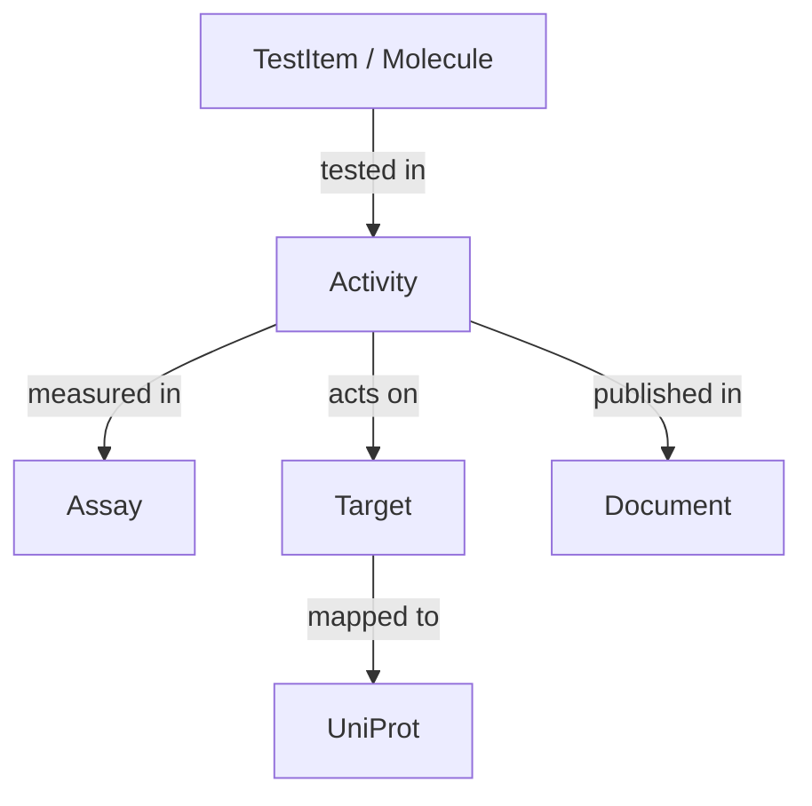

# Domain Objects

Проект оперирует четырьмя основными ABC-сущностями, которые моделируют предметную область фармакологии и биоактивности.

## 1. Assay (Биологический эксперимент)

**Assay** представляет собой описание методики и условий проведения эксперимента.

### Ключевые поля
| Поле | Тип | Описание | Пример |
|------|-----|----------|--------|
| `assay_chembl_id` | `str` | Уникальный ID ассая (PK). Формат: `^CHEMBL\d+$`. | `CHEMBL123456` |
| `assay_type` | `str` | Тип ассая: `B` (binding), `F` (functional), `A` (ADMET), `T` (toxicity). | `B` |
| `assay_organism` | `str` | Организм, на котором проводился тест. | `Homo sapiens` |
| `assay_tissue` | `str` | Ткань (если применимо). | `Liver` |
| `assay_cell_type` | `str` | Тип клеток (если применимо). | `HeLa` |
| `description` | `str` | Текстовое описание эксперимента. | `Inhibition of...` |

### Схема
Описывается классом `AssaySchema` (Pandera), который валидирует типы и допустимые значения (например, enum для `assay_type`).

---

## 2. Activity (Активность)

**Activity** описывает результат измерения воздействия вещества (`TestItem`) на мишень (`Target`) в рамках эксперимента (`Assay`).

### Ключевые поля
| Поле | Тип | Описание | Пример |
|------|-----|----------|--------|
| `activity_id` | `int` | Уникальный ID измерения (PK). | `12345678` |
| `molecule_chembl_id` | `str` | Ссылка на тестируемое вещество (FK). | `CHEMBL25` |
| `assay_chembl_id` | `str` | Ссылка на ассай (FK). | `CHEMBL123456` |
| `target_chembl_id` | `str` | Ссылка на мишень (FK, опционально). | `CHEMBL204` |
| `document_chembl_id` | `str` | Ссылка на публикацию (FK, опционально). | `CHEMBL112233` |
| `standard_type` | `str` | Тип активности (IC50, Ki, EC50). | `IC50` |
| `standard_value` | `float` | Нормализованное значение. | `10.5` |
| `standard_units` | `str` | Единицы измерения (nM, uM). | `nM` |
| `pchembl_value` | `float` | Отрицательный логарифм: `-log10(M)`. | `7.5` |

### Бизнес-ключ
Используется для дедупликации.
```python
business_key = (
    assay_chembl_id,
    molecule_chembl_id,
    standard_type,
    standard_relation,
    standard_value,
    standard_units
)
```

### Хеш-колонки
Для каждой строки вычисляются:
- `hash_row`: SHA256 всех полей строки (для версионирования).
- `hash_business_key`: SHA256 полей бизнес-ключа (для поиска дубликатов).

---

## 3. Target (Мишень)

**Target** — биологическая макромолекула (обычно белок), с которой взаимодействует вещество.

### Ключевые поля
| Поле | Тип | Описание | Пример |
|------|-----|----------|--------|
| `target_chembl_id` | `str` | Уникальный ID мишени (PK). | `CHEMBL204` |
| `target_type` | `str` | Тип: `SINGLE PROTEIN`, `PROTEIN COMPLEX`. | `SINGLE PROTEIN` |
| `pref_name` | `str` | Предпочтительное название. | `Adenosine A1 receptor` |
| `organism` | `str` | Организм. | `Homo sapiens` |
| `uniprot_id` | `str` | Ссылка на UniProt Accession. | `P30542` |

---

## 4. TestItem (Тестируемый объект)

**TestItem** — химическое соединение, лекарственное вещество или биологический агент.

### Ключевые поля
| Поле | Тип | Описание | Пример |
|------|-----|----------|--------|
| `molecule_chembl_id` | `str` | Уникальный ID молекулы (PK). | `CHEMBL25` |
| `molecule_type` | `str` | Тип: `Small molecule`, `Antibody`. | `Small molecule` |
| `pref_name` | `str` | Название (например, МНН). | `Aspirin` |
| `canonical_smiles` | `str` | Химическая структура (SMILES). | `CC(=O)Oc1ccccc1C(=O)O` |
| `standard_inchi_key` | `str` | Хеш структуры (InChIKey). | `BSYNRYMUTXBXSQ-UHFFFAOYSA-N` |
| `max_phase` | `int` | Максимальная фаза клиниспытаний. | `4` |

---

## Взаимосвязи ABC-объектов



