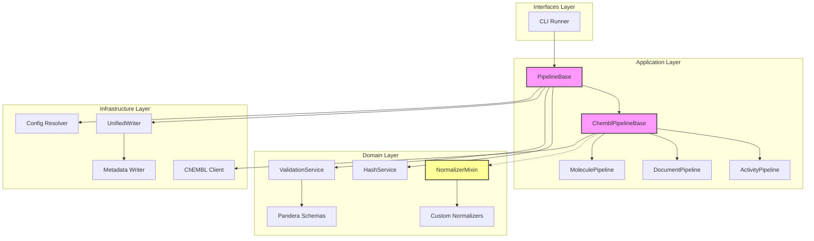
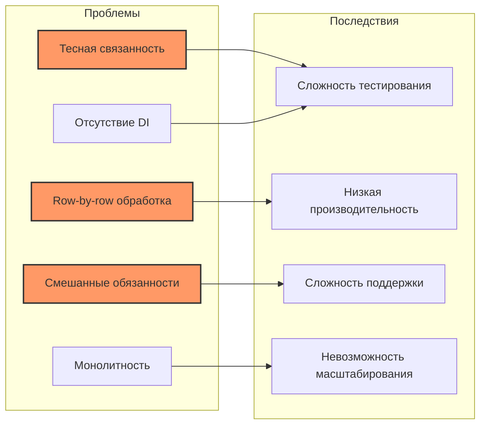
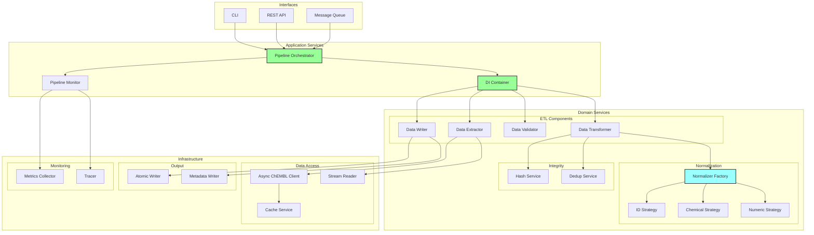
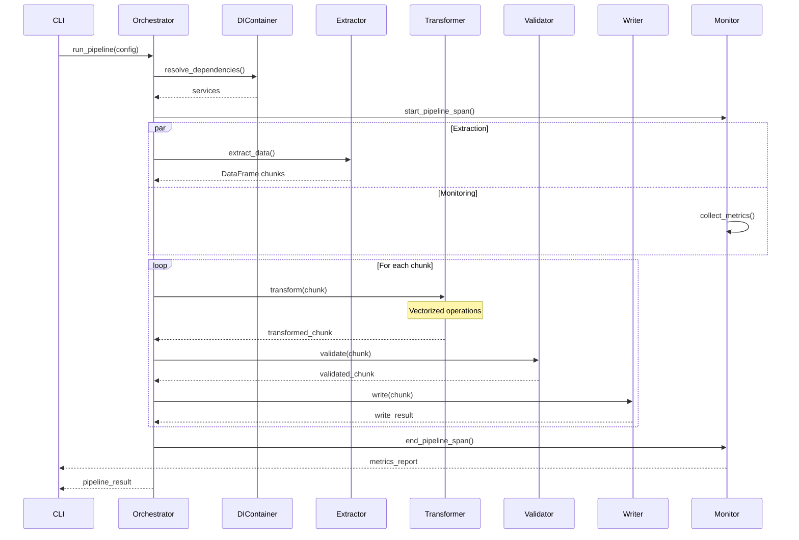
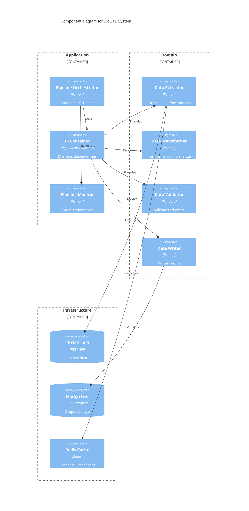
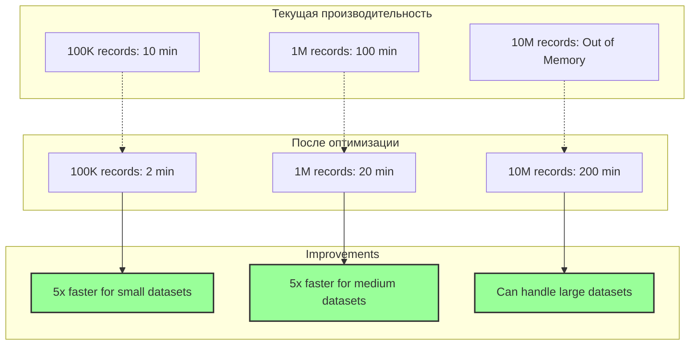

# Архитектурные диаграммы BioETL

## Текущая архитектура

## Проблемы текущей архитектуры

## Предлагаемая архитектура

## Поток данных в новой архитектуре

## Стратегия миграции

```mermaid
graph LR
    subgraph "Фаза 1"
        A1[Текущая архитектура]
        A2[Выделение стратегий]
        A3[Разделение PipelineBase]
    end
    
    subgraph "Фаза 2"
        B1[Векторизация]
        B2[Стриминг]
        B3[Кеширование]
    end
    
    subgraph "Фаза 3"
        C1[DI Container]
        C2[Async I/O]
        C3[Параллелизация]
    end
    
    subgraph "Фаза 4"
        D1[Message Queue]
        D2[Мониторинг]
        D3[Целевая архитектура]
    end
    
    A1 --> A2
    A2 --> A3
    A3 --> B1
    B1 --> B2
    B2 --> B3
    B3 --> C1
    C1 --> C2
    C2 --> C3
    C3 --> D1
    D1 --> D2
    D2 --> D3
    
    style A1 fill:#f96,stroke:#333,stroke-width:2px
    style D3 fill:#9f9,stroke:#333,stroke-width:2px
```

## Компонентная диаграмма новой архитектуры

## Сравнение производительности

