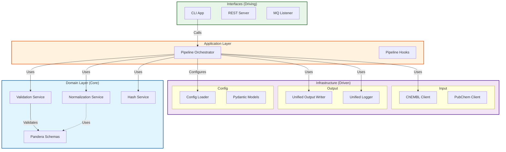
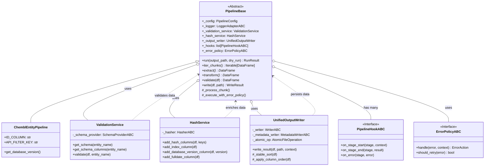
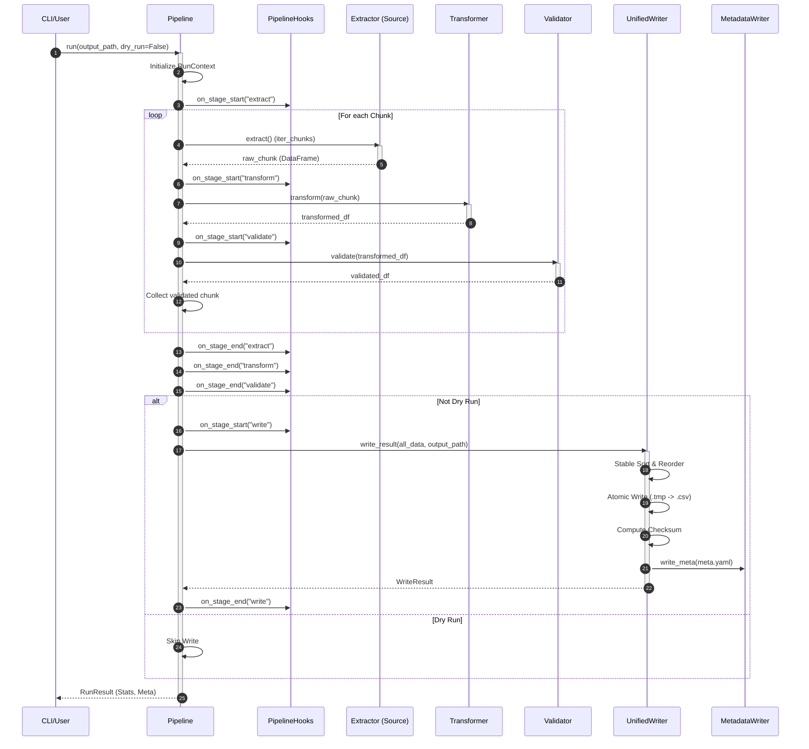
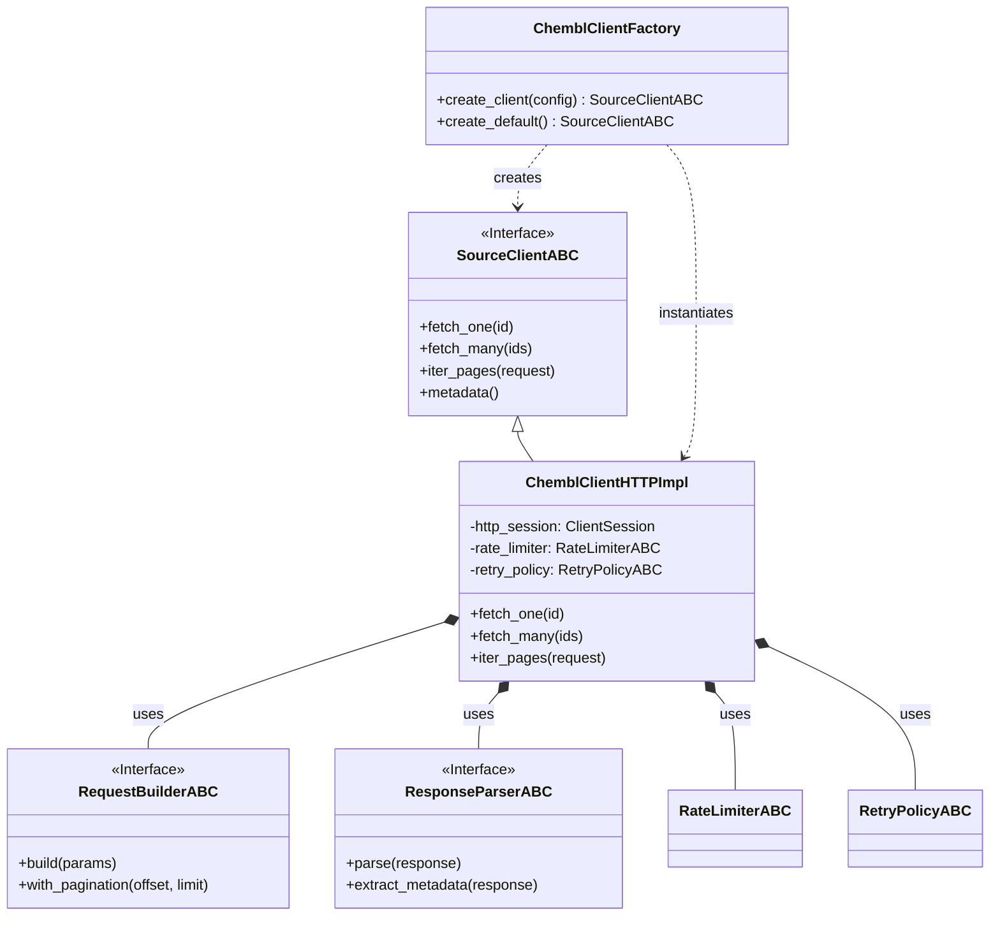
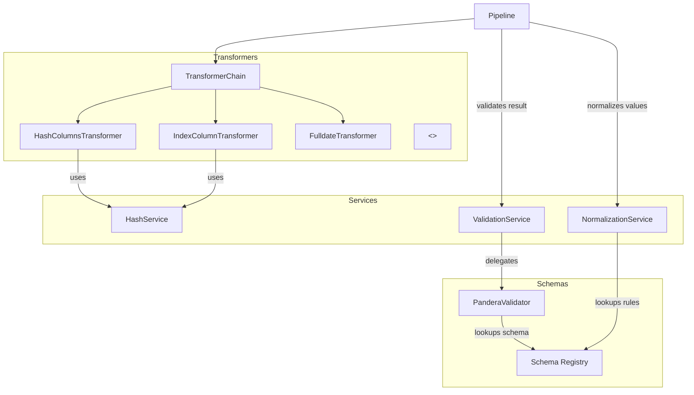
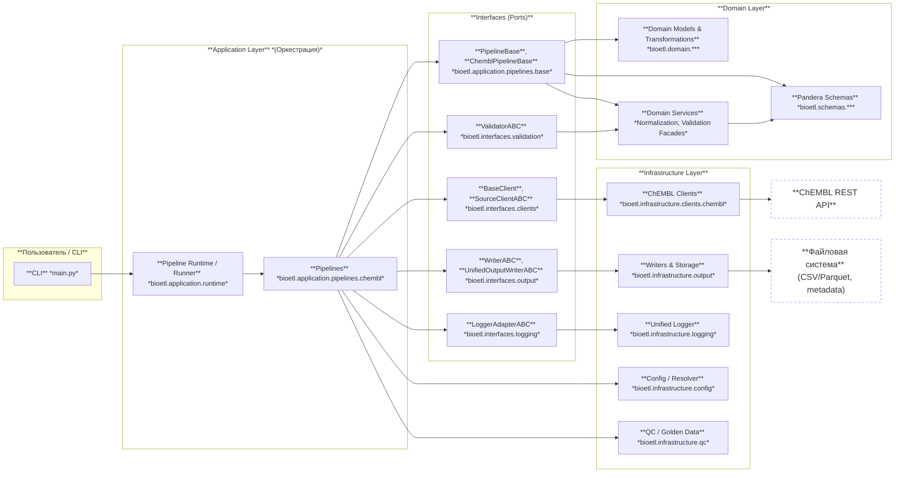

# Архитектурные диаграммы

Устаревшие inline-блоки удалены. Актуальные диаграммы хранятся в текстовых источниках согласно политике:

- `docs/architecture/diagrams/flow/high-level-architecture.mmd`
- `docs/architecture/diagrams/class/pipeline-class-structure.mmd`
- `docs/architecture/diagrams/sequence/pipeline-run-sequence.mmd`
- `docs/architecture/diagrams/flow/pipeline-error-flowchart.mmd`
- `docs/architecture/diagrams/class/client-architecture-three-layer.mmd`
- `docs/architecture/diagrams/flow/domain-services-transform.mmd`
- `docs/architecture/diagrams/flow/project-package-structure.mmd`

Полные правила и стиль: `docs/architecture/diagrams/00-diagramming-policy.md`.

## 1. High-Level Architecture (Hexagonal)

Диаграмма отображает архитектуру Ports & Adapters, где доменная логика (Core) изолирована от внешнего мира (Infrastructure/Interfaces).



## 2. Pipeline Class Structure

Детальная диаграмма классов пайплайна и связанных сервисов.



## 3. Pipeline Execution Flow (Sequence)

Диаграмма последовательности выполнения метода `Pipeline.run()`.



## 4. Execution Logic & Error Handling (Flowchart)

Логика управления потоком выполнения и обработки ошибок.

```mermaid
---
id: 3b5cfac9-48da-4eae-befc-028c206888ef
<!-- [MermaidChart: e717271c-e2a8-4f0e-870e-ee541bd17788] -->
---
flowchart TD
    Start([Start Run]) --> Init[Init Context & Reset Services]
    Init --> ExtractStart[Notify Extract Start]
    ExtractStart --> ChunkLoop{Has Next Chunk?}
    
    %% Extraction Loop
    ChunkLoop -- Yes --> ExtractExec[Execute extract()]
    ExtractExec -- Success --> TransformStart[Notify Transform Start]
    ExtractExec -- Error --> ErrHandler{Error Policy}
    
    ErrHandler -- Retry --> RetryChk{Retries Left?}
    RetryChk -- Yes --> ExtractExec
    RetryChk -- No --> FailAction
    
    ErrHandler -- Skip --> LogSkip[Log Skip]
    LogSkip --> ChunkLoop
    
    ErrHandler -- Fail --> FailAction[Raise PipelineStageError]
    FailAction --> EndFail([Run Failed])

    %% Transformation
    TransformStart --> TransExec[Execute transform()]
    TransExec -- Success --> ValidateStart[Notify Validate Start]
    TransExec -- Error --> ErrHandler
    
    %% Validation
    ValidateStart --> ValExec[Execute validate()]
    ValExec -- Success --> Accumulate[Accumulate Chunk]
    ValExec -- Error --> ErrHandler
    
    Accumulate --> ChunkLoop
    
    %% Post-Loop
    ChunkLoop -- No --> NotifyEnds[Notify Stages End]
    NotifyEnds --> DryRunChk{Dry Run?}
    
    %% Write Stage
    DryRunChk -- No --> WriteStart[Notify Write Start]
    WriteStart --> WriteExec[Execute write()]
    WriteExec --> MetaGen[Generate Metadata]
    MetaGen --> NotifyWriteEnd[Notify Write End]
    NotifyWriteEnd --> SuccessResult
    
    DryRunChk -- Yes --> DryRunMeta[Generate DryRun Metadata]
    DryRunMeta --> SuccessResult
    
    SuccessResult([Run Success])
```

## 5. Client Architecture (Three-Layer Pattern)

Реализация паттерна Contract -> Factory -> Implementation для внешних интеграций.



## 6. Domain Services & Transform

Взаимодействие сервисов трансформации и валидации данных.



## 7. Project Component Structure (Package Diagram)

Структура пакетов проекта и их зависимости, отражающие Clean Architecture.


