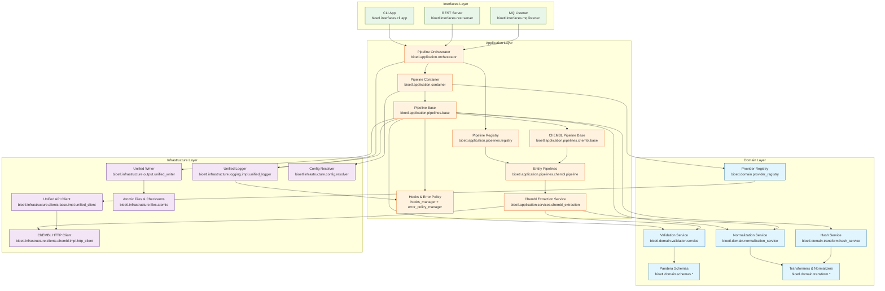

# Component Diagram

Диаграмма компонентов системы BioETL, показывающая основные компоненты и их взаимодействие.

```mermaid
---
id: 0ce2be98-2cd9-4f25-8f51-bebf2d4ccad1
---
graph TB
    subgraph "Interfaces Layer"
        CLI[CLI App<br/>bioetl.interfaces.cli.app]
        REST[REST Server<br/>bioetl.interfaces.rest.server]
        MQ[MQ Listener<br/>bioetl.interfaces.mq.listener]
    end

    subgraph "Application Layer"
        ORCH[Pipeline Orchestrator<br/>bioetl.application.orchestrator]
        CONT[Pipeline Container<br/>bioetl.application.container]
        REG[Pipeline Registry<br/>bioetl.application.pipelines.registry]
        PBASE[Pipeline Base<br/>bioetl.application.pipelines.base]
        CPBASE[ChEMBL Pipeline Base<br/>bioetl.application.pipelines.chembl.base]
        ENTITY[Entity Pipelines<br/>bioetl.application.pipelines.chembl.pipeline]
        EXTRACT[Chembl Extraction Service<br/>bioetl.application.services.chembl_extraction]
        HOOKS[Hooks & Error Policy<br/>hooks_manager + error_policy_manager]
    end

    subgraph "Domain Layer"
        VALID[Validation Service<br/>bioetl.domain.validation.service]
        SCHEMAS[Pandera Schemas<br/>bioetl.domain.schemas.*]
        NORM[Normalization Service<br/>bioetl.domain.normalization_service]
        HASH[Hash Service<br/>bioetl.domain.transform.hash_service]
        TRANS[Transformers & Normalizers<br/>bioetl.domain.transform.*]
        PREG[Provider Registry<br/>bioetl.domain.provider_registry]
    end

    subgraph "Infrastructure Layer"
        UCLIENT[Unified API Client<br/>bioetl.infrastructure.clients.base.impl.unified_client]
        CCLIENT[ChEMBL HTTP Client<br/>bioetl.infrastructure.clients.chembl.impl.http_client]
        LOGGER[Unified Logger<br/>bioetl.infrastructure.logging.impl.unified_logger]
        WRITER[Unified Writer<br/>bioetl.infrastructure.output.unified_writer]
        CONFIG[Config Resolver<br/>bioetl.infrastructure.config.resolver]
        FILES[Atomic Files & Checksums<br/>bioetl.infrastructure.files.atomic]
    end

    CLI --> ORCH
    REST --> ORCH
    MQ --> ORCH

    ORCH --> REG
    ORCH --> CONT
    REG --> ENTITY
    CONT --> PBASE
    PBASE --> CPBASE
    CPBASE --> ENTITY

    PBASE --> HOOKS
    PBASE --> VALID
    PBASE --> NORM
    PBASE --> HASH
    PBASE --> WRITER

    ENTITY --> EXTRACT
    EXTRACT --> NORM
    EXTRACT --> VALID
    EXTRACT --> CCLIENT

    VALID --> SCHEMAS
    NORM --> TRANS
    HASH --> TRANS

    CONT --> PREG
    PREG --> UCLIENT
    UCLIENT --> CCLIENT

    WRITER --> FILES
    ORCH --> LOGGER
    PBASE --> LOGGER
    LOGGER --> HOOKS
    CONT --> CONFIG

    style CLI fill:#e8f5e9,stroke:#1b5e20
    style REST fill:#e8f5e9,stroke:#1b5e20
    style MQ fill:#e8f5e9,stroke:#1b5e20

    style ORCH fill:#fff3e0,stroke:#e65100
    style CONT fill:#fff3e0,stroke:#e65100
    style REG fill:#fff3e0,stroke:#e65100
    style PBASE fill:#fff3e0,stroke:#e65100
    style CPBASE fill:#fff3e0,stroke:#e65100
    style ENTITY fill:#fff3e0,stroke:#e65100
    style EXTRACT fill:#fff3e0,stroke:#e65100
    style HOOKS fill:#fff3e0,stroke:#e65100

    style VALID fill:#e1f5fe,stroke:#01579b
    style SCHEMAS fill:#e1f5fe,stroke:#01579b
    style NORM fill:#e1f5fe,stroke:#01579b
    style HASH fill:#e1f5fe,stroke:#01579b
    style TRANS fill:#e1f5fe,stroke:#01579b
    style PREG fill:#e1f5fe,stroke:#01579b

    style UCLIENT fill:#f3e5f5,stroke:#4a148c
    style CCLIENT fill:#f3e5f5,stroke:#4a148c
    style WRITER fill:#f3e5f5,stroke:#4a148c
    style LOGGER fill:#f3e5f5,stroke:#4a148c
    style CONFIG fill:#f3e5f5,stroke:#4a148c
    style FILES fill:#f3e5f5,stroke:#4a148c
```
