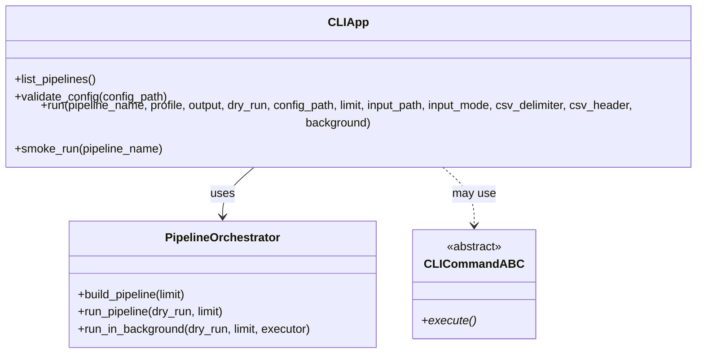
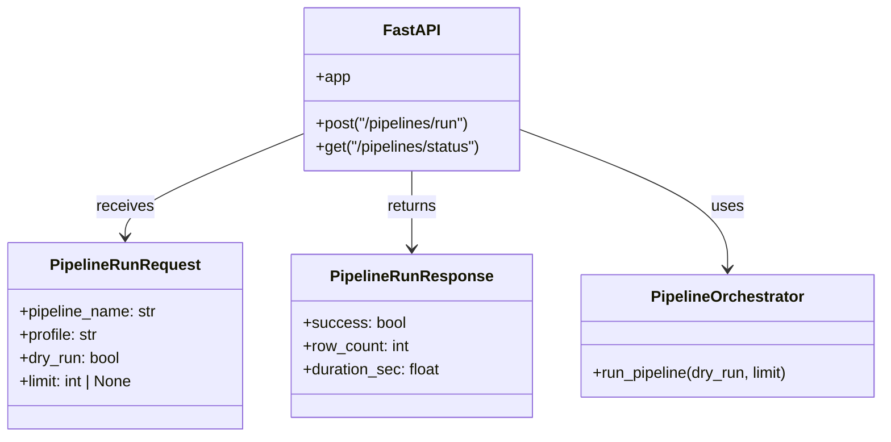
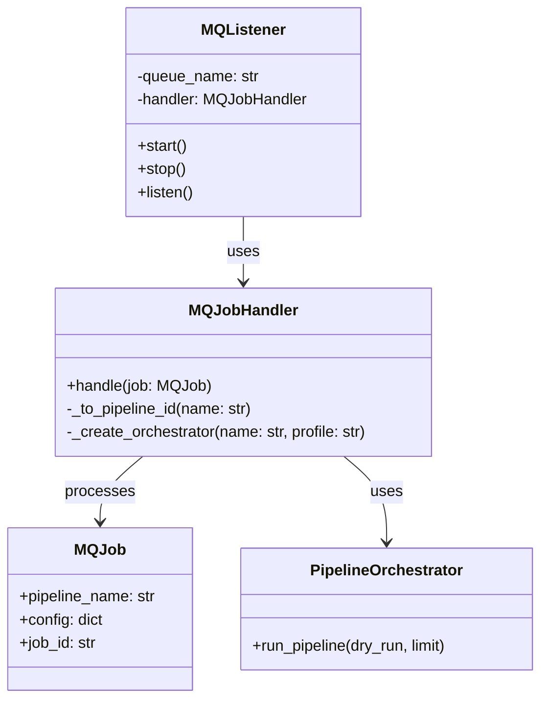
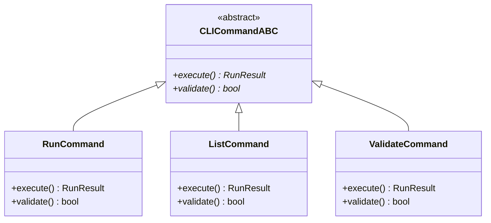
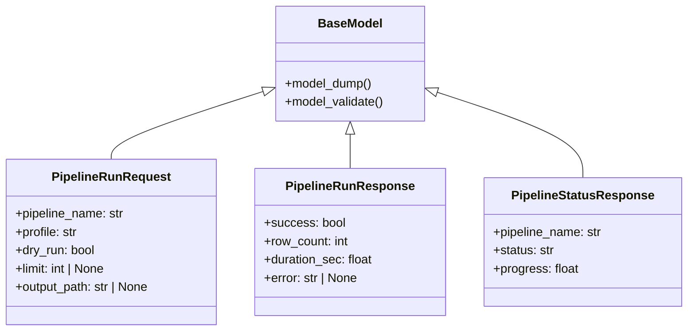
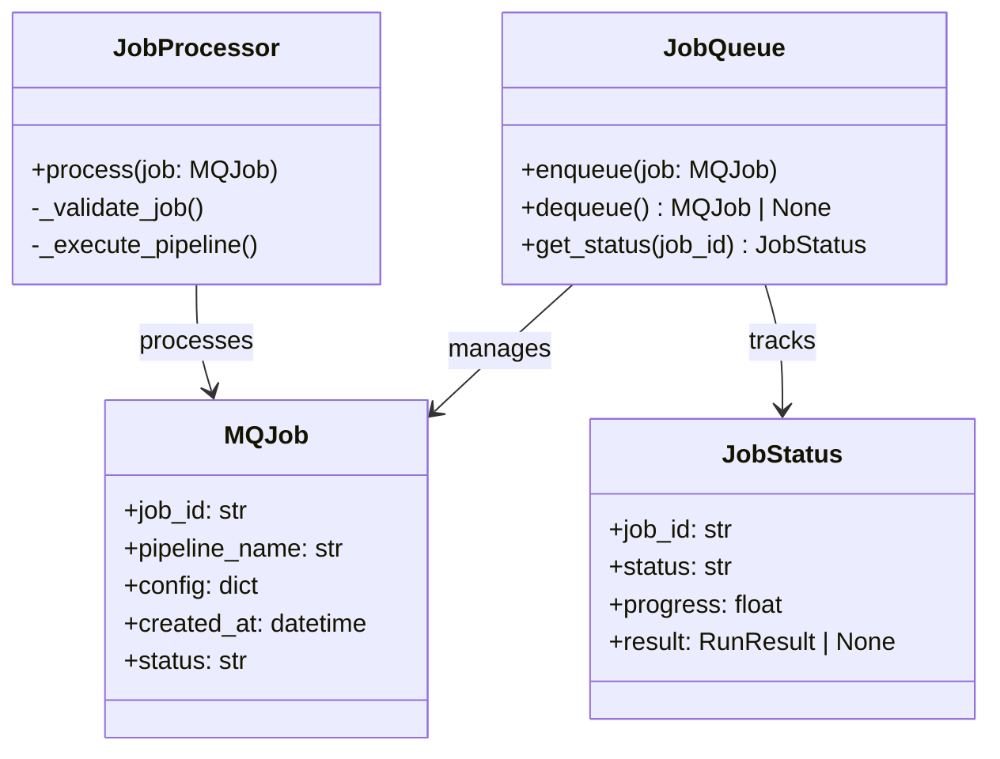
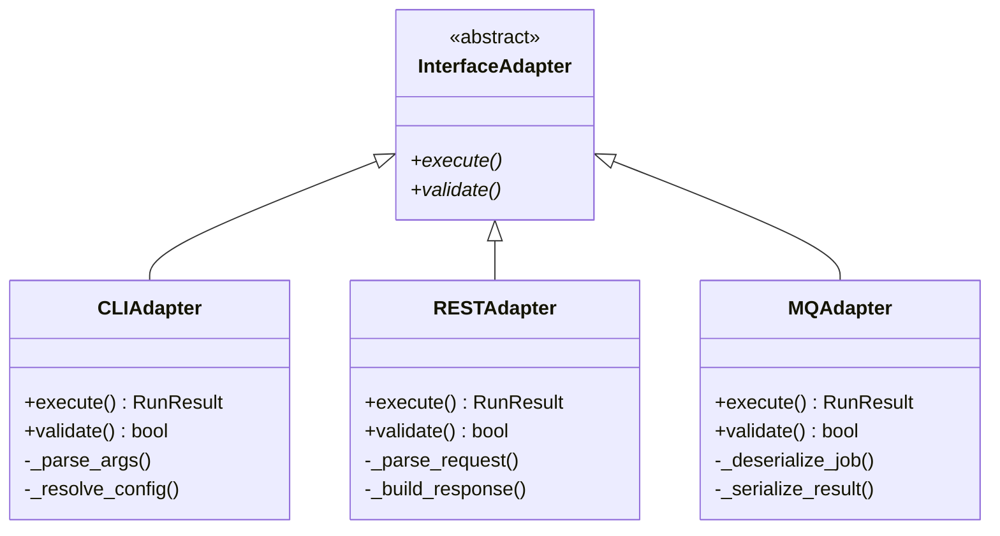
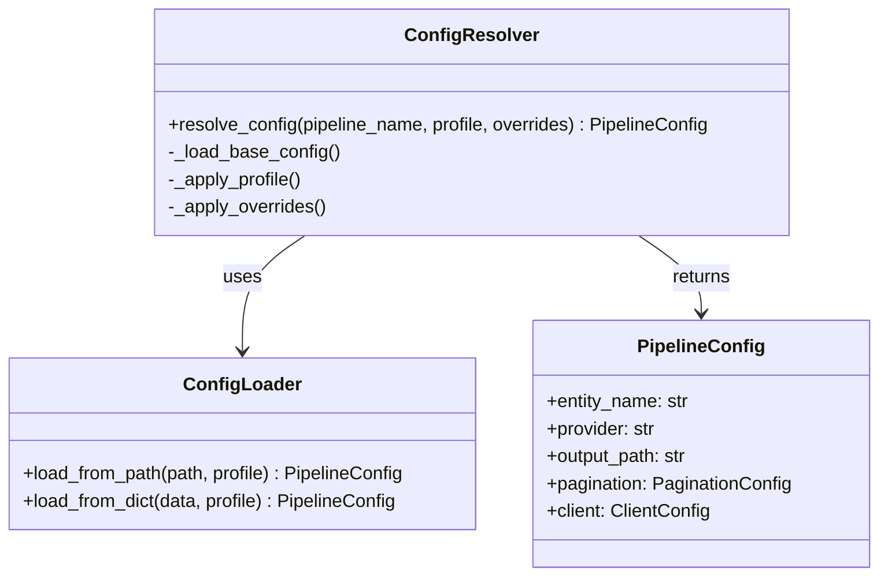
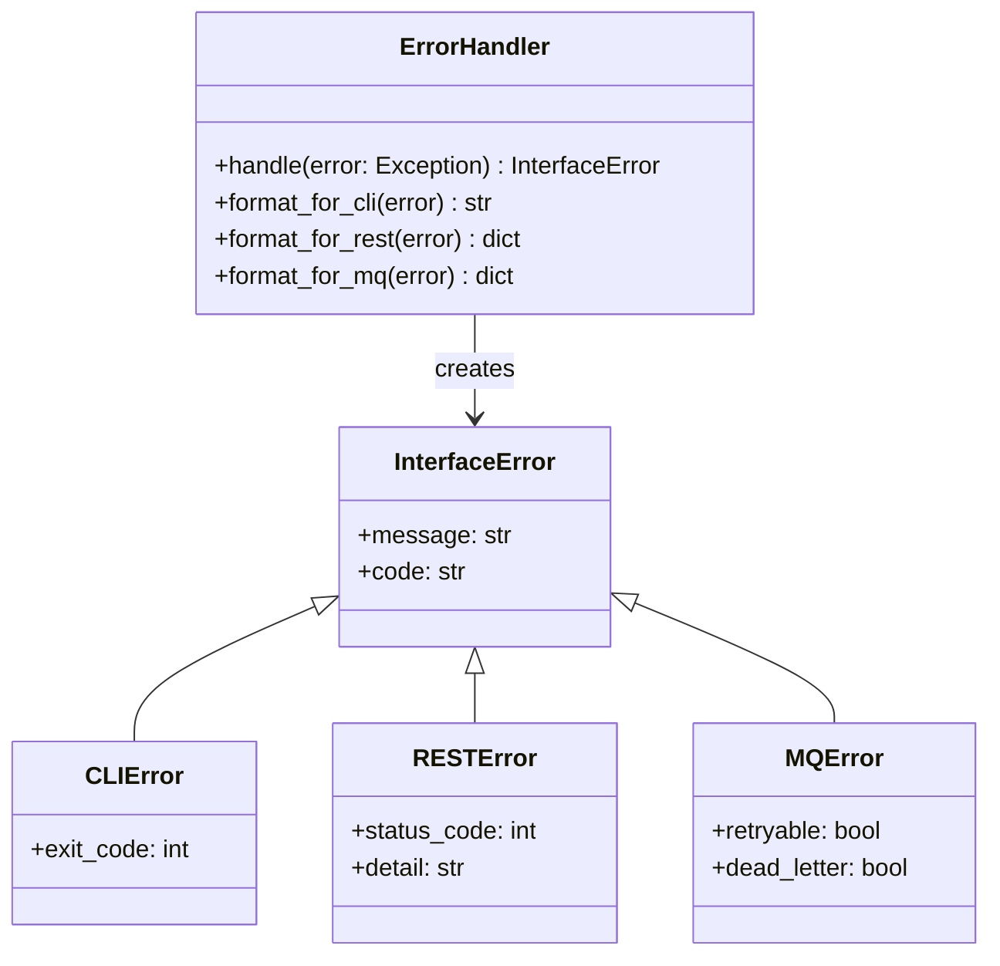
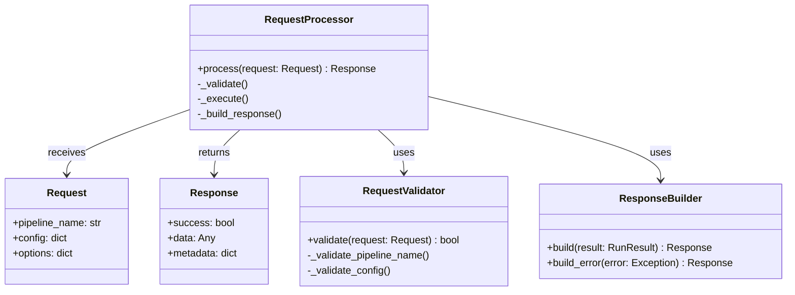

# Class Diagrams - Interfaces Layer

Диаграммы классов для слоя Interfaces (bioetl.interfaces).

## 1. CLI Application Structure

## 2. REST API Structure

## 3. MQ Listener Structure

## 4. CLI Contracts

## 5. REST API Models

## 6. MQ Job Processing

## 7. Interface Adapters

## 8. Configuration Resolution

## 9. Error Handling in Interfaces

## 10. Request/Response Flow

