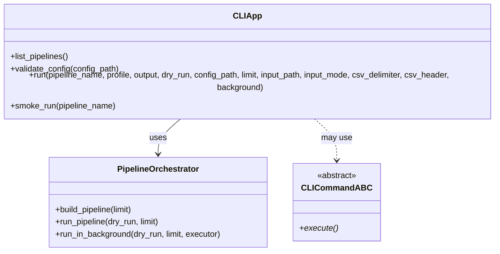
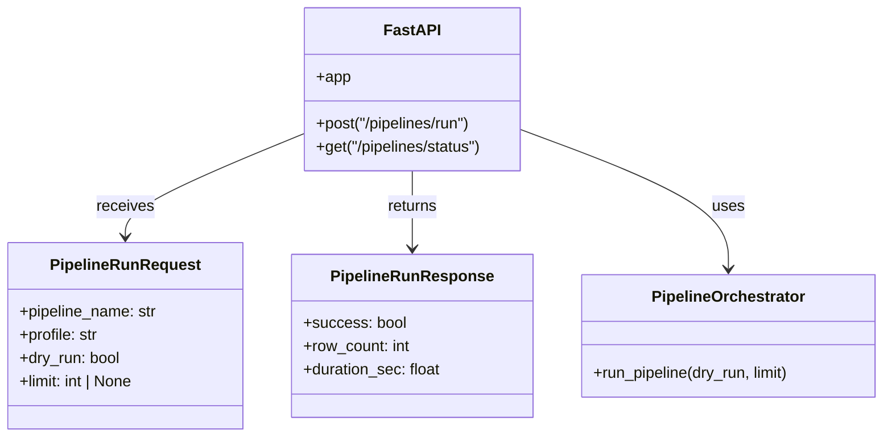
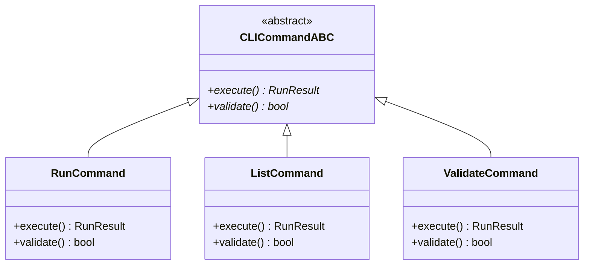
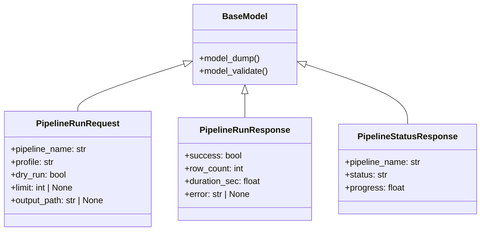
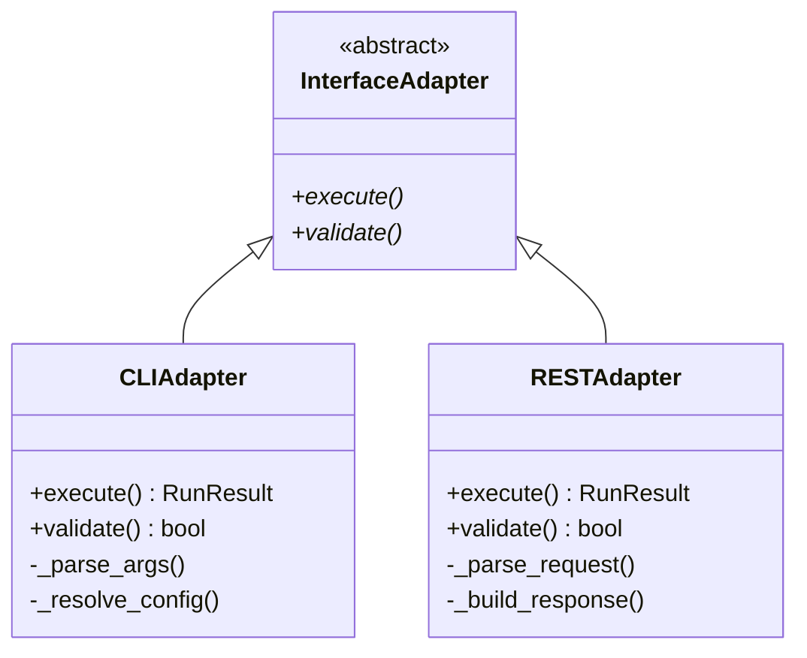
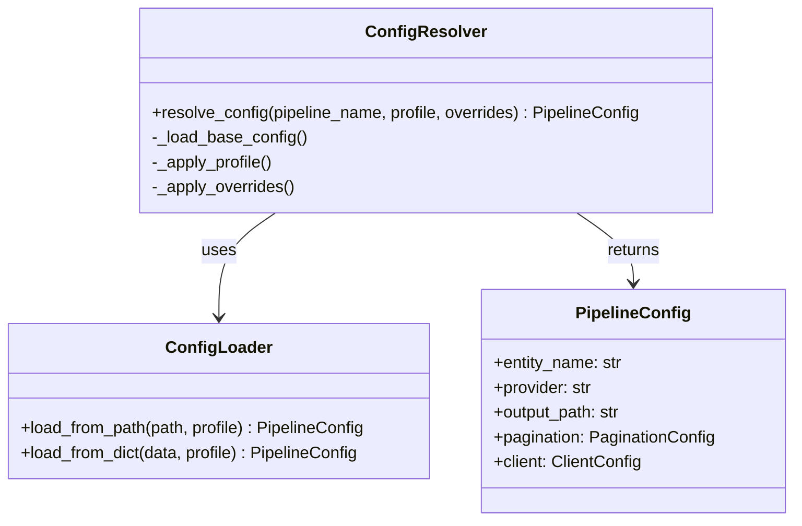
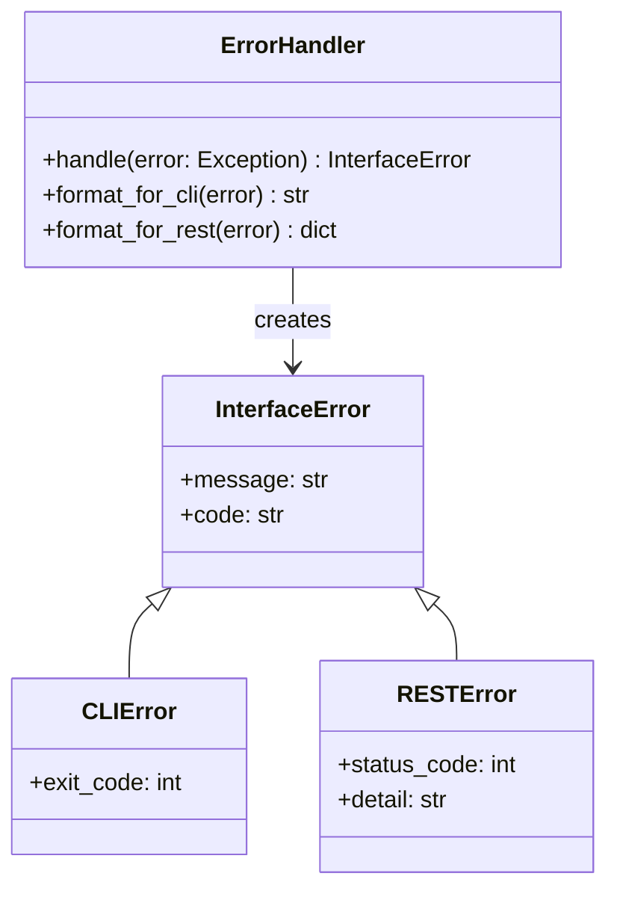
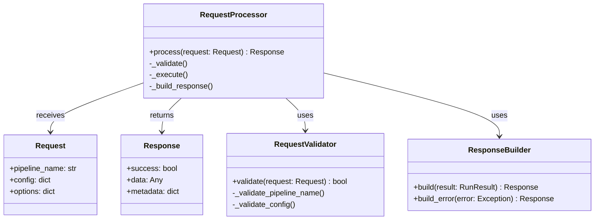
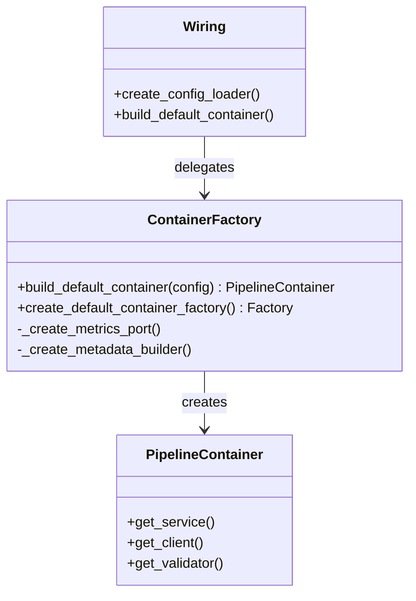

# Class Diagrams Interfaces

Устаревшие inline-диаграммы удалены. Храните актуальные схемы интерфейсного слоя в текстовых файлах `docs/architecture/diagrams/class/` по политике `docs/architecture/diagrams/00-diagramming-policy.md`.
# Class Diagrams - Interfaces Layer

Диаграммы классов для слоя Interfaces (bioetl.interfaces).

## 1. CLI Application Structure

```mermaid
classDiagram
    class CLIApp {
        +list_pipelines()
        +validate_config(config_path)
        +run(pipeline_name, profile, output, dry_run, config_path, limit, input_path, input_mode, csv_delimiter, csv_header, background)
        +smoke_run(pipeline_name)
    }

    class CLICommandABC {
        <<abstract>>
        +execute()*
    }

    class PipelineOrchestrator {
        +build_pipeline(limit)
        +run_pipeline(dry_run, limit)
        +run_in_background(dry_run, limit, executor)
    }

    CLIApp --> PipelineOrchestrator : uses
    CLIApp ..> CLICommandABC : may use
```

## 2. REST API Structure

```mermaid
---
id: 4ad0763a-3323-4d48-be3f-d28239a5bd09
---
classDiagram
    class FastAPI {
        +app
        +post("/pipelines/run")
        +get("/pipelines/status")
    }

    class PipelineRunRequest {
        +pipeline_name: str
        +profile: str
        +dry_run: bool
        +limit: int | None
    }

    class PipelineRunResponse {
        +success: bool
        +row_count: int
        +duration_sec: float
    }

    class PipelineOrchestrator {
        +run_pipeline(dry_run, limit)
    }

    FastAPI --> PipelineRunRequest : receives
    FastAPI --> PipelineRunResponse : returns
    FastAPI --> PipelineOrchestrator : uses
```

## 3. CLI Contracts

```mermaid
---
id: 61e132ca-a2c4-4eff-a676-4556e0800563
---
classDiagram
    class CLICommandABC {
        <<abstract>>
        +execute()* RunResult
        +validate()* bool
    }

    class RunCommand {
        +execute() RunResult
        +validate() bool
    }

    class ListCommand {
        +execute() RunResult
        +validate() bool
    }

    class ValidateCommand {
        +execute() RunResult
        +validate() bool
    }

    CLICommandABC <|-- RunCommand
    CLICommandABC <|-- ListCommand
    CLICommandABC <|-- ValidateCommand
```

## 4. REST API Models

```mermaid
---
id: ec54c376-58fb-4220-b59d-3fd21a9aeedd
---
classDiagram
    class BaseModel {
        +model_dump()
        +model_validate()
    }

    class PipelineRunRequest {
        +pipeline_name: str
        +profile: str
        +dry_run: bool
        +limit: int | None
        +output_path: str | None
    }

    class PipelineRunResponse {
        +success: bool
        +row_count: int
        +duration_sec: float
        +error: str | None
    }

    class PipelineStatusResponse {
        +pipeline_name: str
        +status: str
        +progress: float
    }

    BaseModel <|-- PipelineRunRequest
    BaseModel <|-- PipelineRunResponse
    BaseModel <|-- PipelineStatusResponse
```

## 5. Interface Adapters

```mermaid
classDiagram
    class InterfaceAdapter {
        <<abstract>>
        +execute()*
        +validate()*
    }

    class CLIAdapter {
        +execute() RunResult
        +validate() bool
        -_parse_args()
        -_resolve_config()
    }

    class RESTAdapter {
        +execute() RunResult
        +validate() bool
        -_parse_request()
        -_build_response()
    }

    InterfaceAdapter <|-- CLIAdapter
    InterfaceAdapter <|-- RESTAdapter
```

## 6. Configuration Resolution

```mermaid
classDiagram
    class ConfigResolver {
        +resolve_config(pipeline_name, profile, overrides) PipelineConfig
        -_load_base_config()
        -_apply_profile()
        -_apply_overrides()
    }

    class PipelineConfig {
        +entity_name: str
        +provider: str
        +output_path: str
        +pagination: PaginationConfig
        +client: ClientConfig
    }

    class ConfigLoader {
        +load_from_path(path, profile) PipelineConfig
        +load_from_dict(data, profile) PipelineConfig
    }

    ConfigResolver --> ConfigLoader : uses
    ConfigResolver --> PipelineConfig : returns
```

## 7. Error Handling in Interfaces

```mermaid
classDiagram
    class InterfaceError {
        +message: str
        +code: str
    }

    class CLIError {
        +exit_code: int
    }

    class RESTError {
        +status_code: int
        +detail: str
    }

    class ErrorHandler {
        +handle(error: Exception) InterfaceError
        +format_for_cli(error) str
        +format_for_rest(error) dict
    }

    InterfaceError <|-- CLIError
    InterfaceError <|-- RESTError
    ErrorHandler --> InterfaceError : creates
```

## 8. Request/Response Flow

```mermaid
classDiagram
    class Request {
        +pipeline_name: str
        +config: dict
        +options: dict
    }

    class Response {
        +success: bool
        +data: Any
        +metadata: dict
    }

    class RequestValidator {
        +validate(request: Request) bool
        -_validate_pipeline_name()
        -_validate_config()
    }

    class ResponseBuilder {
        +build(result: RunResult) Response
        +build_error(error: Exception) Response
    }

    class RequestProcessor {
        +process(request: Request) Response
        -_validate()
        -_execute()
        -_build_response()
    }

    RequestProcessor --> Request : receives
    RequestProcessor --> Response : returns
    RequestProcessor --> RequestValidator : uses
    RequestProcessor --> ResponseBuilder : uses
```

## 9. Dependency Injection & Wiring

```mermaid
classDiagram
    class ContainerFactory {
        +build_default_container(config) PipelineContainer
        +create_default_container_factory() Factory
        -_create_metrics_port()
        -_create_metadata_builder()
    }

    class PipelineContainer {
        +get_service()
        +get_client()
        +get_validator()
    }

    class Wiring {
        +create_config_loader()
        +build_default_container()
    }

    Wiring --> ContainerFactory : delegates
    ContainerFactory --> PipelineContainer : creates
```

## 10. Planned Features

The following features are planned for future releases:

- **Message Queue (MQ) Integration**: Support for asynchronous job processing via message queues (RabbitMQ, Redis, etc.). The `bioetl.interfaces.mq` module is reserved for this implementation.
