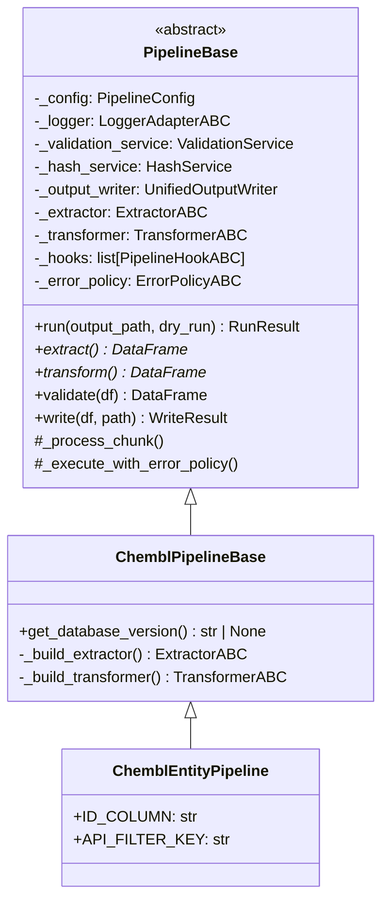
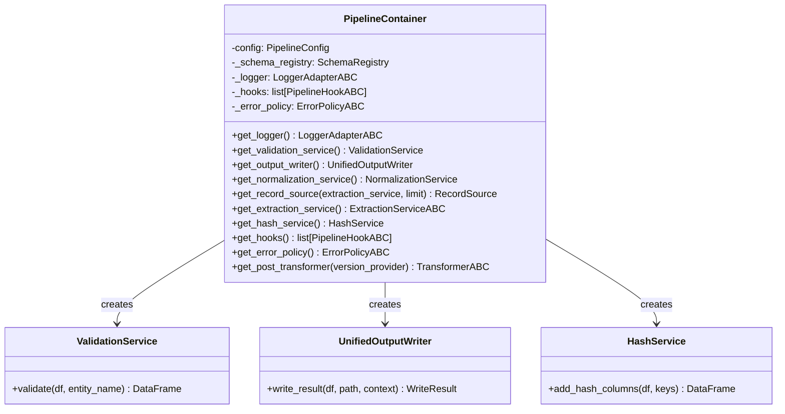
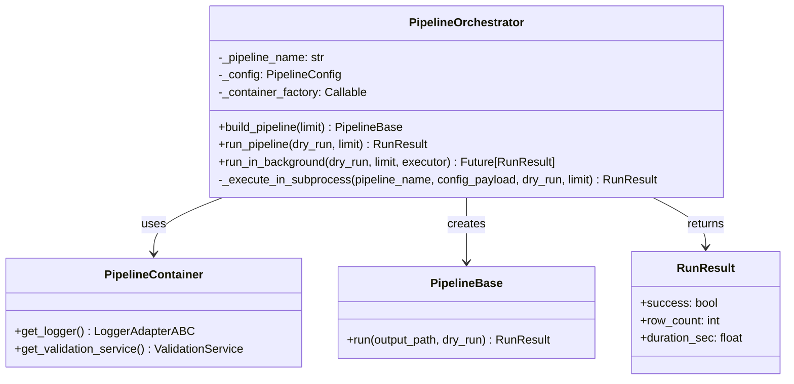
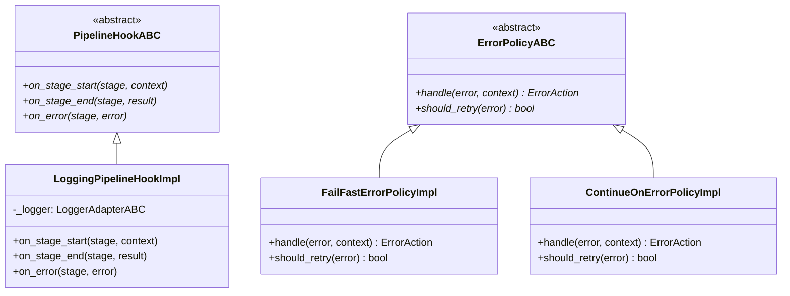
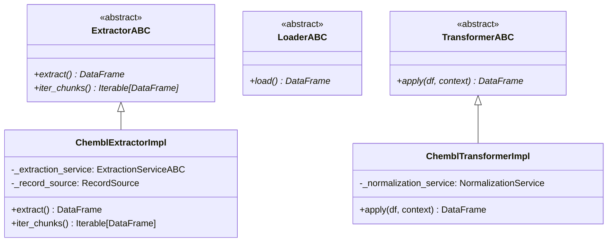
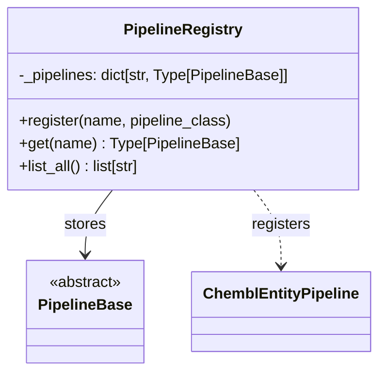
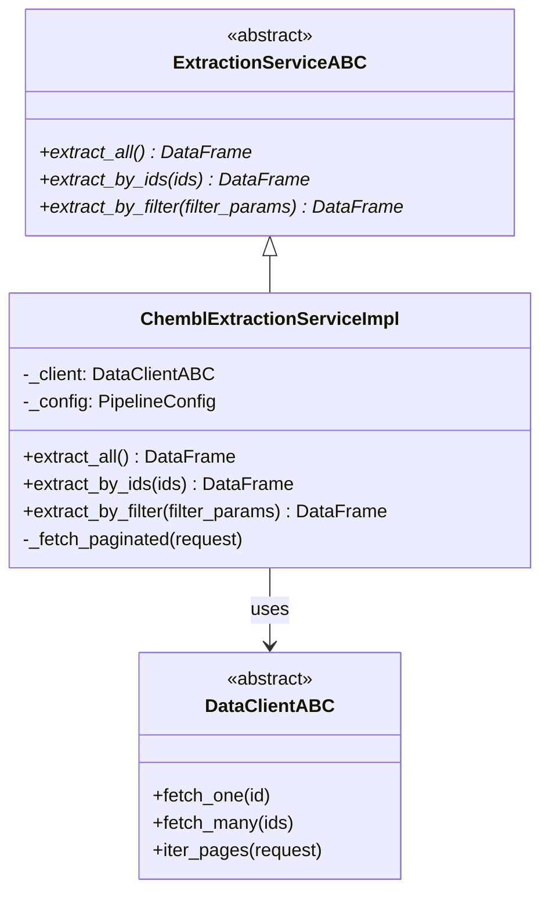
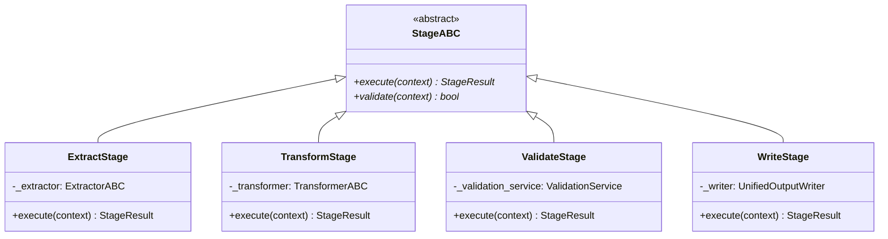
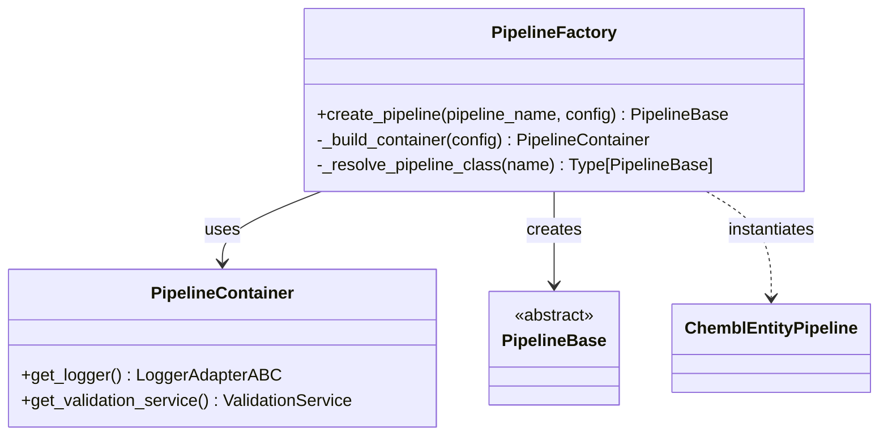
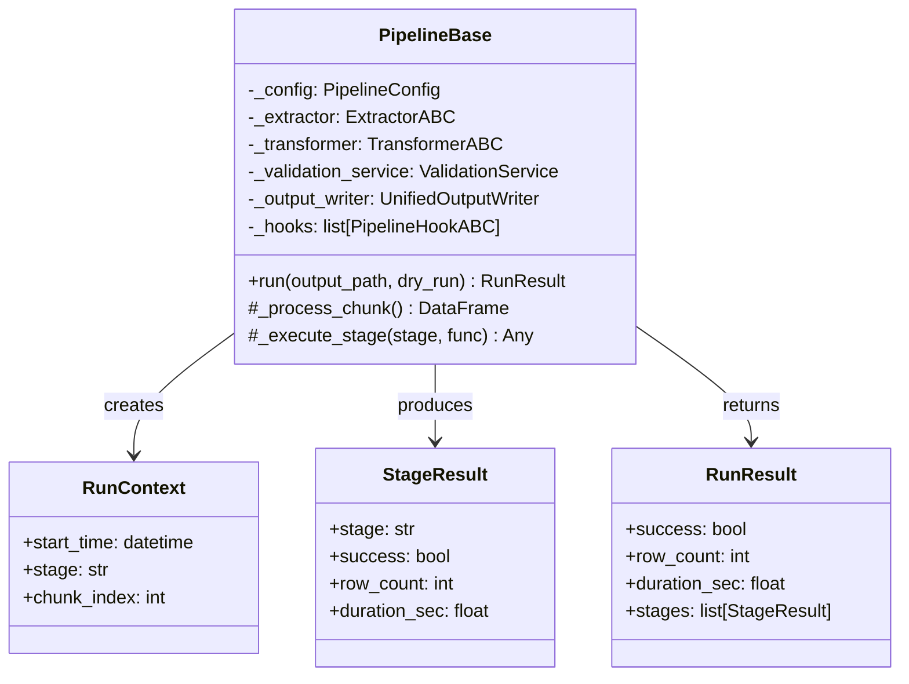

# Class Diagrams — Application Layer

Устаревшие inline-диаграммы удалены. Храните актуальные схемы application-слоя в `docs/architecture/diagrams/class/` (текстовые Mermaid/PlantUML по политике `docs/architecture/diagrams/00-diagramming-policy.md`).
# Class Diagrams - Application Layer

Диаграммы классов для слоя Application (bioetl.application).

## 1. Pipeline Base Hierarchy

## 2. Pipeline Container

## 3. Pipeline Orchestrator

## 4. Pipeline Hooks

## 5. Pipeline Contracts

## 6. Pipeline Registry

## 7. Extraction Service

## 8. Pipeline Stages

## 9. Pipeline Factory

## 10. Pipeline Execution Flow

