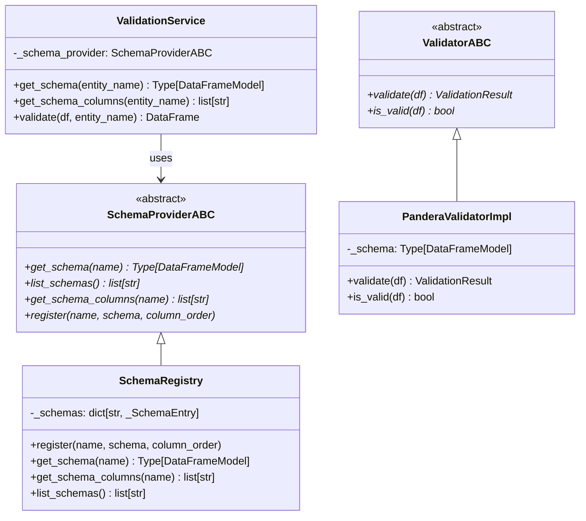
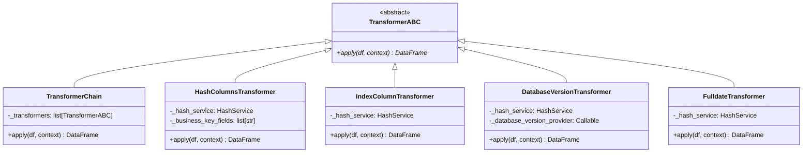
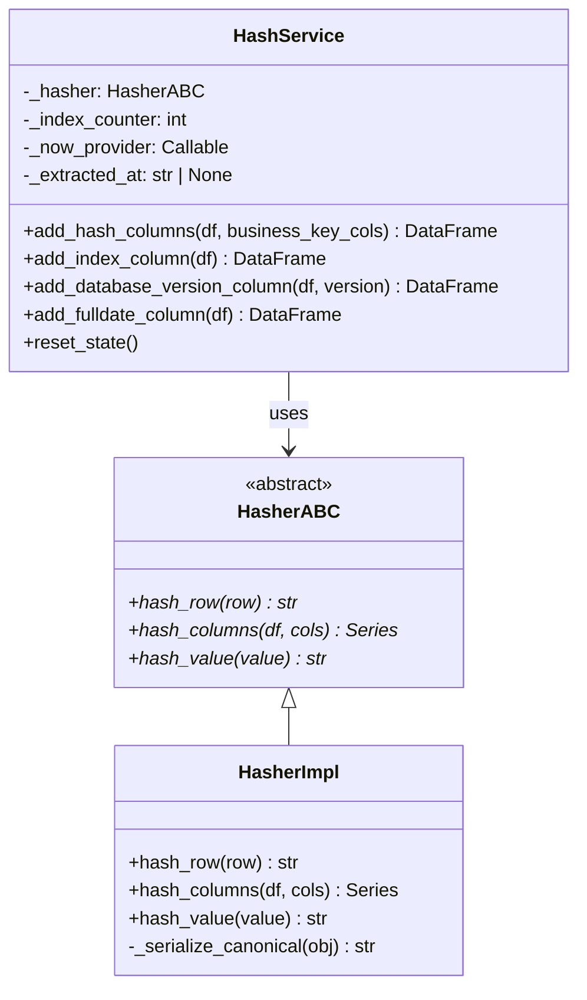
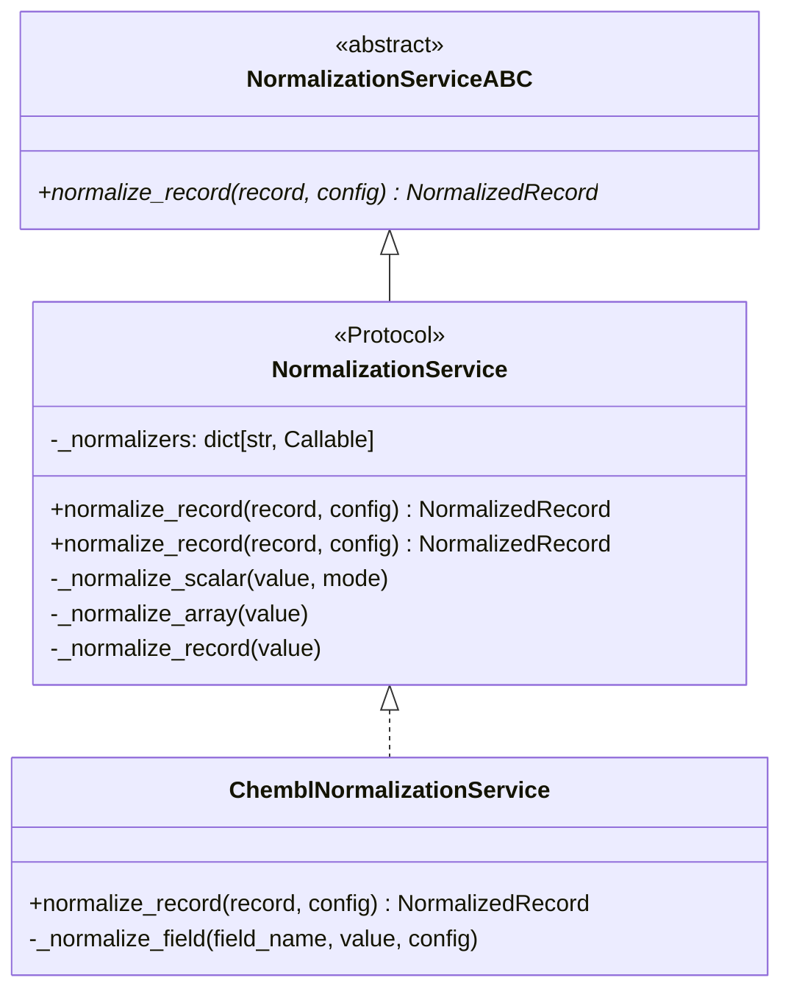
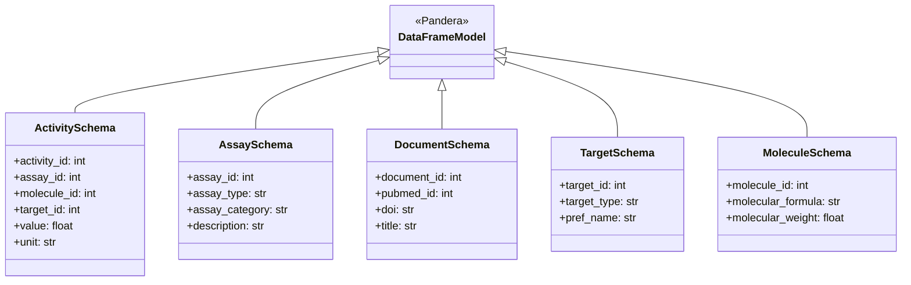
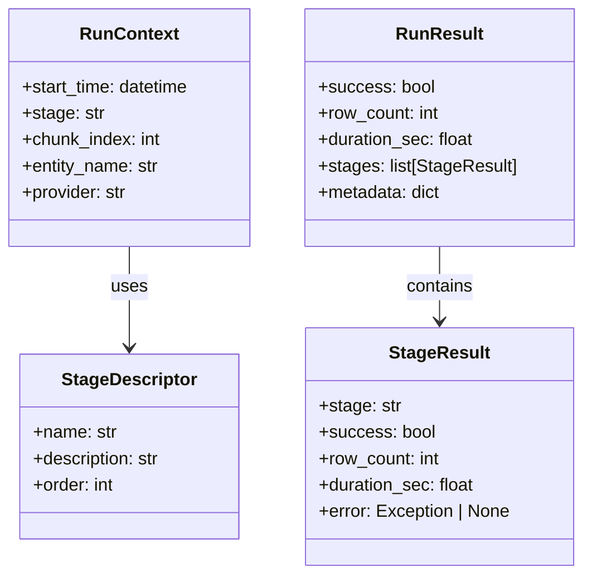
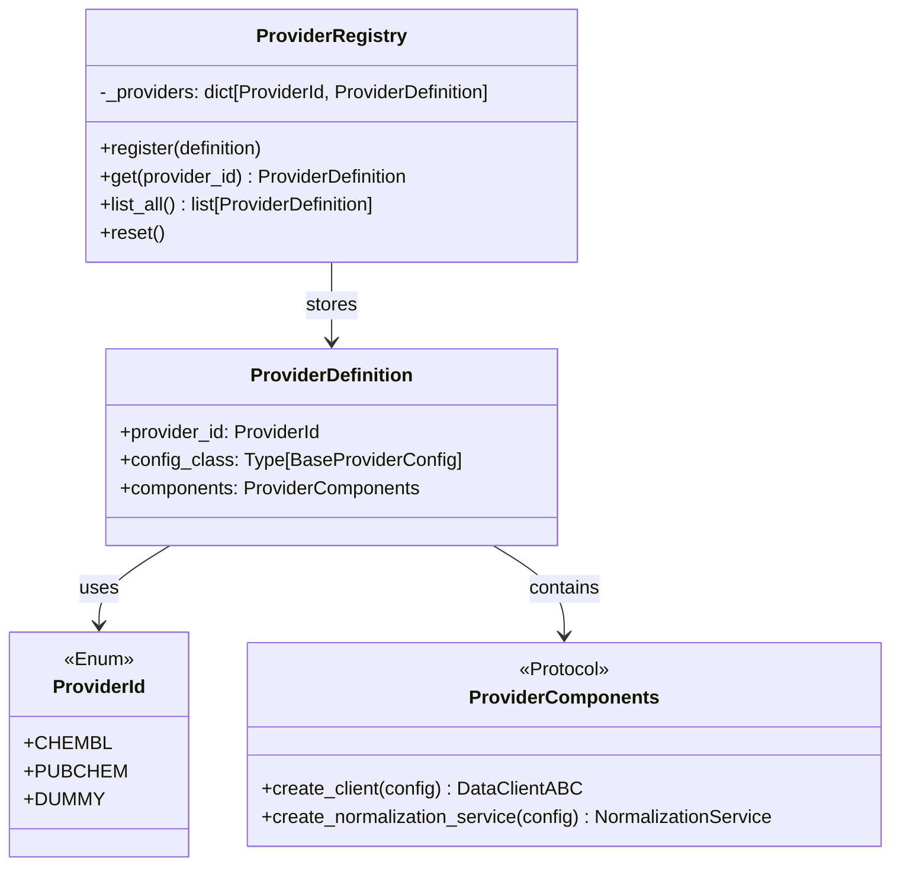
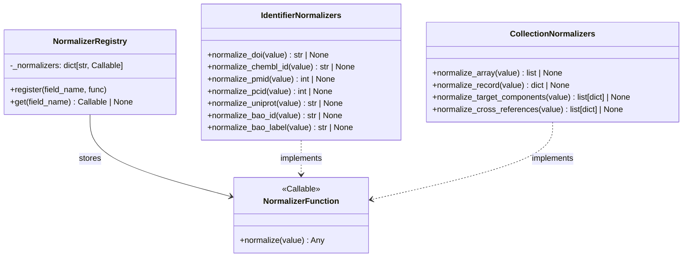
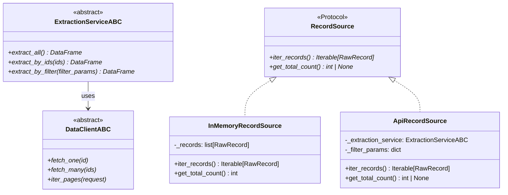
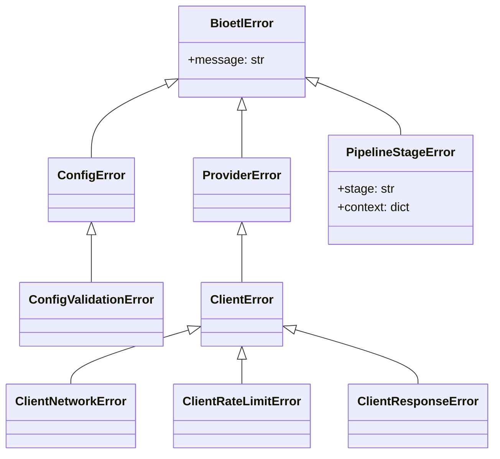

# Class Diagrams - Domain Layer

Диаграммы классов для слоя Domain (bioetl.domain).

## 1. Validation Service Structure

## 2. Transform Services

## 3. Hash Service

## 4. Normalization Service

## 5. Schema Models

## 6. Domain Models

## 7. Provider Registry

## 8. Normalizers

## 9. Domain Contracts

## 10. Domain Errors

