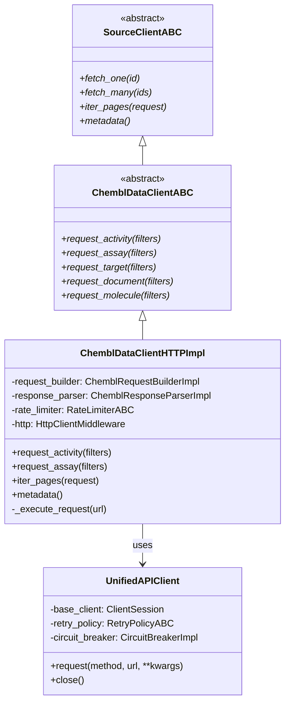
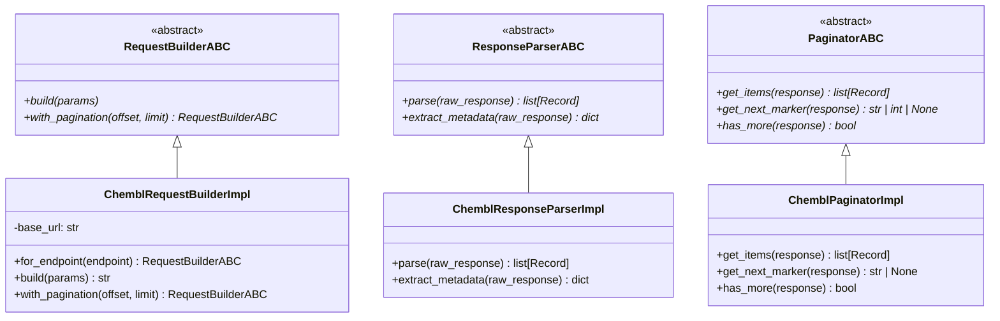
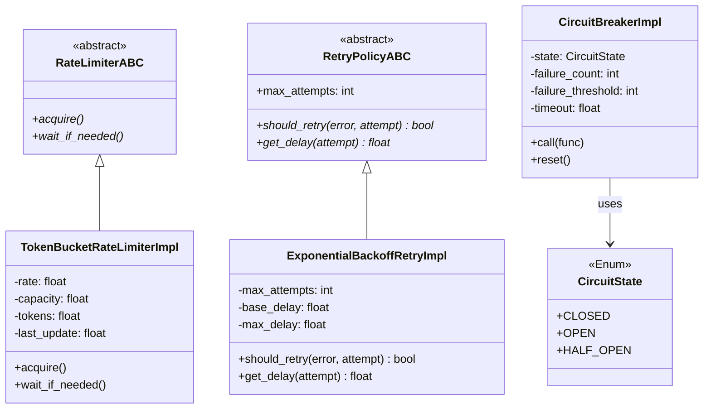
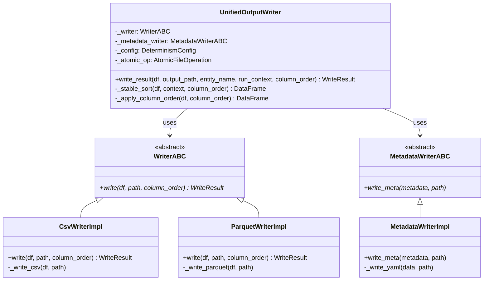
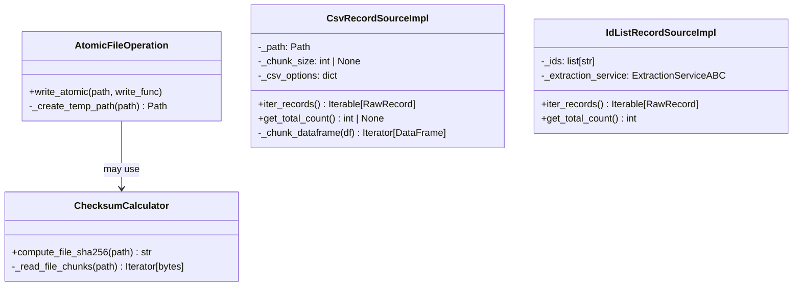
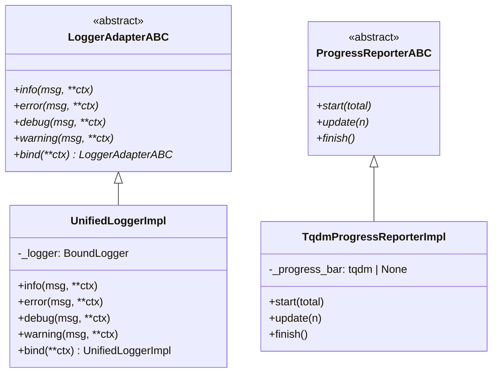
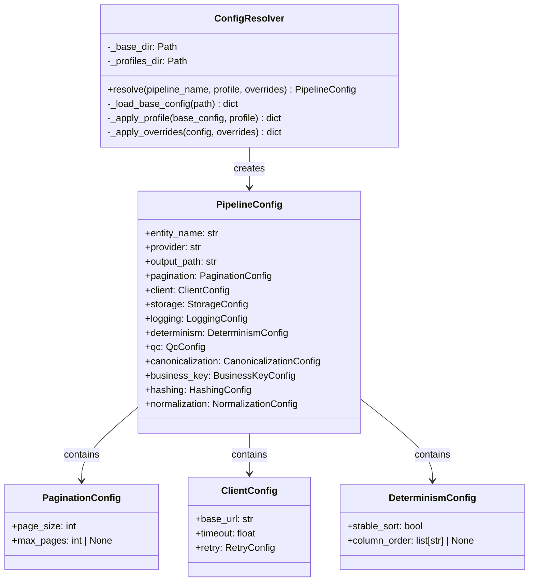
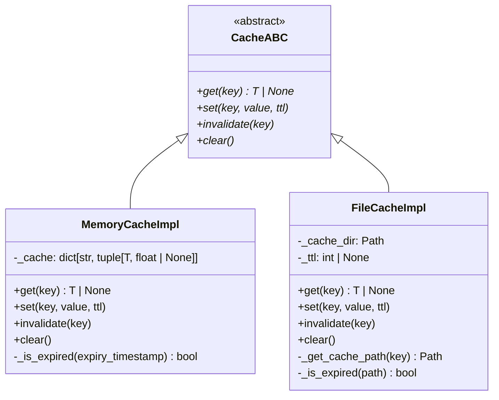
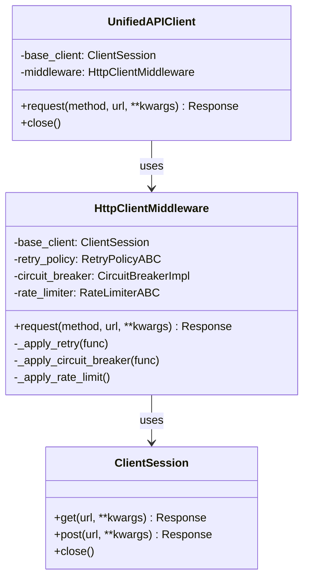
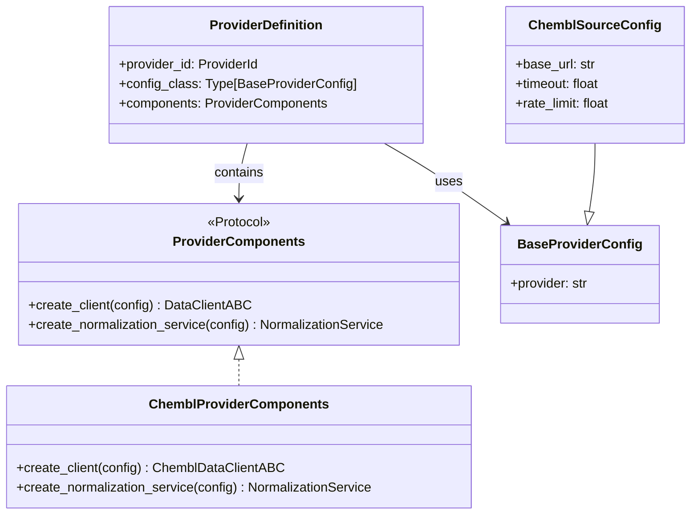

# Class Diagrams - Infrastructure Layer

Диаграммы классов для слоя Infrastructure (bioetl.infrastructure).

## 1. Client Architecture

## 2. Request/Response Processing

## 3. Rate Limiting and Retry

## 4. Output Writers

## 5. File Operations

## 6. Logging Infrastructure

## 7. Configuration Management

## 8. Cache Implementation

## 9. HTTP Middleware

## 10. Provider Components

