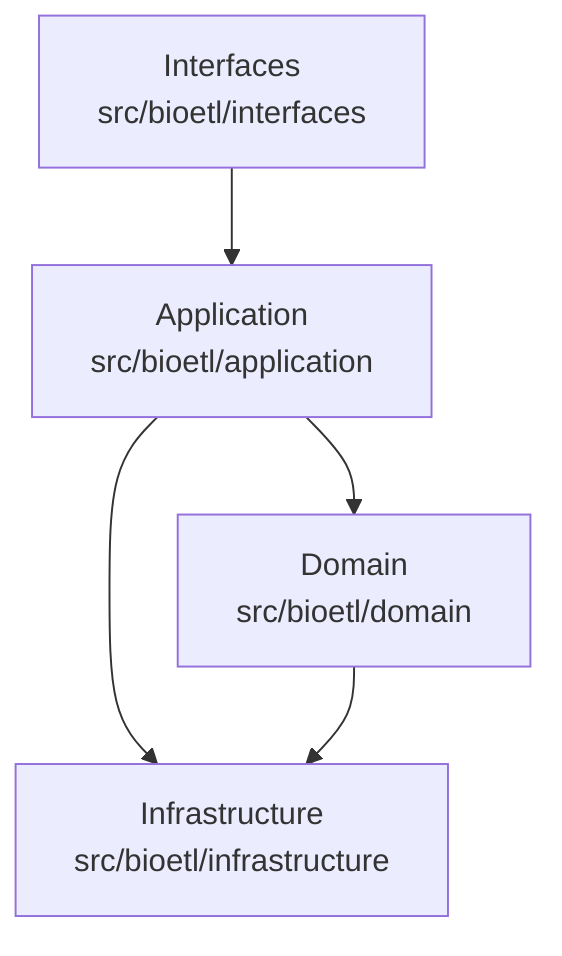
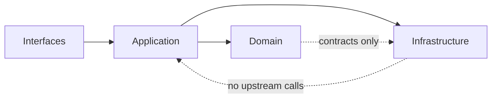
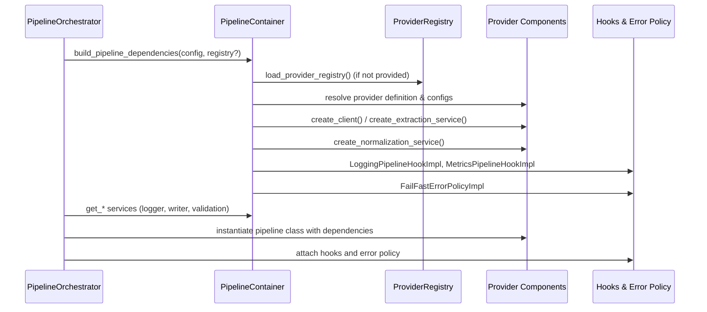

# 17 Pipeline Layer Architecture Guide

## Purpose
This guide clarifies how the four core layers map to the codebase, how dependencies flow between them, and how manual dependency injection (DI) assembles a runnable pipeline. It complements the existing ETL and system-design overviews and keeps terminology aligned with the naming and documentation standards in the styleguide ([naming](../00-styleguide/00-naming-conventions.md), [documentation rules](../00-styleguide/10-documentation-standards.md)).

## Layer Responsibilities
The project uses four layers that align with the physical layout described in [05 Physical Layout](05-physical-layout.md):

- **Interfaces** (`src/bioetl/interfaces`): User-facing entry points such as CLI commands that translate external input into pipeline requests.
- **Application** (`src/bioetl/application`): Orchestrates use cases, wires dependencies, and coordinates pipelines (for example, `PipelineOrchestrator` and `PipelineContainer`).
- **Domain** (`src/bioetl/domain`): Pure business logic, schemas, and contracts (for example, Pandera schema registry, hash service, transformer contracts).
- **Infrastructure** (`src/bioetl/infrastructure`): Adapters to external systems (HTTP clients, file writers, logging) that satisfy domain/application contracts.

## Dependency Flow
Dependencies follow a unidirectional flow to preserve isolation and testability. Application code depends on both domain contracts and infrastructure adapters but the reverse is prohibited.

- Interfaces call the application layer but never bypass it.
- Application coordinates domain services (schemas, normalization) and selects infrastructure adapters (clients, output, logging).
- Domain declares contracts consumed by application and implemented in infrastructure (for example, `ErrorPolicyABC`, `PipelineHookABC`, `NormalizationServiceABC`).
- Infrastructure implements those contracts without depending on application code.

## Manual DI Assembly Path
The pipeline bootstrapping path is intentionally explicit to keep assemblies deterministic and to stay compatible with the provider registry.

### Assembly Steps
1. **Orchestrator entry**: `PipelineOrchestrator.build_pipeline` resolves the pipeline class and delegates dependency creation to `build_pipeline_dependencies` (or a custom factory).
2. **Container creation**: `PipelineContainer` receives the `PipelineConfig` and an optional `ProviderRegistryABC` instance; if absent it calls `load_provider_registry()`.
3. **Provider resolution**: The container reads the provider definition and component factories (client, extraction service, normalization service) via the provider registry (`src/bioetl/domain/provider_registry.py`).
4. **Record sources**: `PipelineContainer.get_record_source` selects `ApiRecordSource`, `CsvRecordSourceImpl`, or `IdListRecordSourceImpl` based on `input_mode` and injects the extraction service and primary-key filters when needed.
5. **Post-transform chain**: `PipelineContainer.get_post_transformer` builds the default chain from `default_post_transformer`, using `HashService` and pipeline `hashing` settings.
6. **Hooks and error policy**: By default the container assembles `LoggingPipelineHookImpl`, `MetricsPipelineHookImpl`, and `FailFastErrorPolicyImpl`, which the orchestrator adds to the pipeline instance.
7. **Final wiring**: The orchestrator passes logger, validation service, output writer, extraction service, record source, normalization service, post-transformer, hooks, and error policy into the pipeline constructor to produce a runnable pipeline instance.

## Consistency Rules
- Follow the documentation naming rules (kebab-case with two-digit prefixes) and ensure titles mirror filenames ([naming conventions](../00-styleguide/00-naming-conventions.md)).
- Keep architecture descriptions synchronized with the concrete components shown above; update diagrams when changing the container, registry, hooks, or provider factories.
- When extending providers or hooks, follow the ABC/Default/Impl policy in the styleguide to keep registry mappings deterministic ([new entity implementation policy](../00-styleguide/01-new-entity-implementation-policy.md)).
