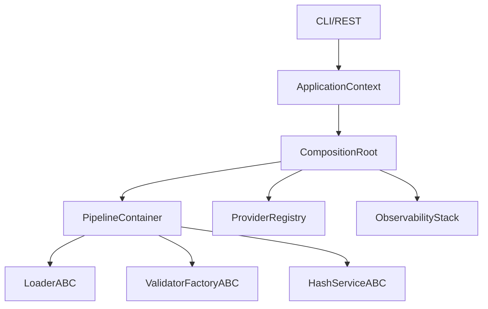

# План рефакторинга BioactivityDataAcquisition к принципам Hexagonal Architecture и DDD

## Обзор текущего состояния

### Что уже реализовано

| Компонент | Статус | Местоположение |
|-----------|--------|----------------|
| Слоёная архитектура | ✅ Реализовано | `.importlinter`, `tests/architecture/` |
| Composition Root | ✅ Реализовано | `interfaces/composition_root.py` |
| DI Container | ✅ Реализовано | `application/container.py` |
| ApplicationContext | ✅ Реализовано | `interfaces/application_context.py` |
| Provider Registry Port | ✅ Реализовано | `domain/provider_registry.py` |
| Observability Ports | ✅ Реализовано | `domain/observability/contracts.py` |
| Value Objects | ✅ Реализовано | `domain/value_objects/` |
| Pandera Schemas | ✅ Реализовано | `infrastructure/validation/schemas/` |
| Архитектурные тесты | ✅ Реализовано | `tests/architecture/`, `tests/project_rules/` |

### Выявленные проблемы

| Проблема | Критичность | Task |
|----------|-------------|------|
| Pydantic в Domain слое | Высокая | Task 7 |
| Нет scoped DI lifecycle | Средняя | Task 4 |
| Pandera schemas только в коде | Низкая | Task 6 |
| Fallback логика размазана | Средняя | Task 9 |
| Import-linter не в CI | Средняя | Task 1, 10 |

---

## Task 1. Enforce Layered Architecture and Import Rules

### Текущее состояние
- ✅ Файл `.importlinter` настроен с 6 контрактами
- ✅ Архитектурные тесты в `tests/architecture/test_architecture_rules.py`
- ⚠️ Import-linter не запускается в CI автоматически

### Рекомендация: **Вариант 1 — Строгая проверка через import-linter**

### План действий

#### Фаза 1.1: Интеграция import-linter в CI
```yaml
# .github/workflows/architecture.yml
name: Architecture Checks
on: [push, pull_request]
jobs:
  import-linter:
    runs-on: ubuntu-latest
    steps:
      - uses: actions/checkout@v4
      - uses: actions/setup-python@v5
        with:
          python-version: '3.11'
      - run: pip install import-linter
      - run: lint-imports
```

#### Фаза 1.2: Расширение контрактов
```ini
# .importlinter (дополнения)

[contract:domain_no_pydantic_basemodel]
name = Domain should not use Pydantic BaseModel directly in core entities
type = forbidden
source_modules =
    bioetl.domain.models
    bioetl.domain.value_objects
forbidden_modules =
    pydantic

[contract:application_no_pandas_runtime]
name = Application layer must use TabularData protocol, not pandas directly
type = forbidden
source_modules =
    bioetl.application
forbidden_modules =
    pandas
ignore_imports =
    # Temporary exceptions for migration
    bioetl.application.pipelines.base
    bioetl.application.transform.pandas_batch_adapter
```

#### Файлы для изменения
- `.github/workflows/architecture.yml` — создать
- `.importlinter` — расширить контракты
- `pyproject.toml` — добавить `import-linter` в dev dependencies

---

## Task 2. Establish Composition Root (ApplicationContext)

### Текущее состояние
- ✅ `CompositionRoot` в `interfaces/composition_root.py`
- ✅ `ApplicationContext` в `interfaces/application_context.py`
- ⚠️ Есть legacy convenience functions (`build_default_container`, etc.)

### Рекомендация: **Вариант 1 — Единая точка сборки**

### План действий

#### Фаза 2.1: Консолидация точки входа
Убрать дублирование module-level функций, направить всё через `ApplicationContext`:

```python
# interfaces/composition_root.py
# DEPRECATED: удалить в v3.0
def build_default_container(...) -> PipelineContainerABC:
    """Deprecated: Use get_application_context().composition_root.create_pipeline_container()"""
    import warnings
    warnings.warn(
        "build_default_container is deprecated. "
        "Use get_application_context().composition_root.create_pipeline_container()",
        DeprecationWarning,
        stacklevel=2,
    )
    return get_composition_root().create_pipeline_container(...)
```

#### Фаза 2.2: Документация DI-графа
Создать диаграмму зависимостей:

```
docs/architecture/dependency_graph.md
```



#### Файлы для изменения
- `interfaces/composition_root.py` — добавить deprecation warnings
- `docs/architecture/dependency_graph.md` — создать
- `CHANGELOG.md` — задокументировать

---

## Task 3. Pipeline Orchestration vs. Factory Pattern

### Текущее состояние
- ✅ `PipelineFactory` pattern в `application/pipelines/registry.py`
- ✅ `PipelineOrchestrator` в `application/orchestrator.py`
- ✅ Template Method в `PipelineBase`

### Рекомендация: **Вариант 1 — Factory подход** (уже реализован)

### План действий

#### Фаза 3.1: Документация паттернов
```markdown
# docs/architecture/pipeline_patterns.md

## Factory Pattern
- Используется для создания pipeline instances
- `ChemblPipelineFactory` создаёт `ChemblPipelineBase`

## Template Method Pattern
- `PipelineBase.run()` определяет skeleton
- Subclasses override: `extract()`, `transform()`, `validate()`

## Когда использовать оркестратор
- Для batch-режима с несколькими pipelines
- Для параллельного выполнения
- Для retry/circuit-breaker логики
```

#### Фаза 3.2: Формализация контракта PipelineFactoryABC

```python
# domain/pipelines/contracts.py (дополнение)
class PipelineFactoryProtocol(Protocol):
    """Protocol for pipeline factory implementations."""

    def create(
        self,
        config: PipelineConfig,
        container: PipelineContainerABC,
    ) -> PipelineBase:
        """Create a pipeline instance with injected dependencies."""
        ...
```

#### Файлы для изменения
- `docs/architecture/pipeline_patterns.md` — создать
- `domain/pipelines/contracts.py` — добавить `PipelineFactoryProtocol`

---

## Task 4. Manage DI Lifecycle and Reset

### Текущее состояние
- ✅ `reset_application_context()` в `application_context.py`
- ✅ `reset_composition_root()` в `composition_root.py`
- ⚠️ Нет scoped container для batch-режима

### Рекомендация: **Вариант 1 — Кратковременные контейнеры**

### План действий

#### Фаза 4.1: Scoped Container Context Manager

```python
# interfaces/scoped_context.py
from contextlib import contextmanager
from typing import Iterator

@contextmanager
def scoped_pipeline_context(
    config: PipelineConfig,
) -> Iterator[PipelineContainerABC]:
    """Create isolated container for a single pipeline run.

    Usage:
        with scoped_pipeline_context(config) as container:
            pipeline = factory.create(config, container)
            result = pipeline.run()
        # Container is cleaned up automatically
    """
    root = CompositionRoot()  # Fresh instance
    container = root.create_pipeline_container(config)
    try:
        yield container
    finally:
        # Cleanup any stateful resources
        pass  # Container will be garbage collected
```

#### Фаза 4.2: Batch Runner с изолированными контекстами

```python
# application/batch_runner.py
class BatchPipelineRunner:
    """Run multiple pipelines with isolated DI contexts."""

    def run_batch(
        self,
        configs: list[PipelineConfig],
    ) -> list[RunResult]:
        results = []
        for config in configs:
            with scoped_pipeline_context(config) as container:
                result = self._run_single(config, container)
                results.append(result)
        return results
```

#### Файлы для изменения
- `interfaces/scoped_context.py` — создать
- `application/batch_runner.py` — создать или расширить
- `tests/integration/test_scoped_context.py` — тесты

---

## Task 5. Define Registry Port and Implementations

### Текущее состояние
- ✅ `ProviderRegistryABC` в `domain/provider_registry.py`
- ✅ `InMemoryProviderRegistry` в `infrastructure/provider_registry.py`
- ✅ DI через `CompositionRoot.get_provider_registry()`

### Рекомендация: **Уже реализовано** — поддерживать текущий подход

### План действий (улучшения)

#### Фаза 5.1: Добавить SchemaRegistryABC в domain

```python
# domain/schemas/registry.py (рефакторинг)
from abc import ABC, abstractmethod

class SchemaRegistryABC(ABC):
    """Domain port for schema registry."""

    @abstractmethod
    def register(self, name: str, schema: type, column_order: list[str]) -> None:
        """Register a schema by name."""

    @abstractmethod
    def get_schema(self, name: str) -> type:
        """Get schema by name."""

    @abstractmethod
    def get_schema_columns(self, name: str) -> list[str]:
        """Get column order for schema."""
```

#### Файлы для изменения
- `domain/schemas/registry.py` — выделить ABC
- `infrastructure/validation/schema_registry_impl.py` — реализация

---

## Task 6. Pandera/YAML Schema Generation

### Текущее состояние
- ✅ Pandera schemas в Python коде (`infrastructure/validation/schemas/chembl/`)
- ⚠️ Нет YAML representation для non-technical review

### Рекомендация: **Гибридный подход** — код + генерация YAML для документации

### План действий

#### Фаза 6.1: Генератор YAML из Pandera schemas

```python
# scripts/generate_schema_yaml.py
"""Generate YAML documentation from Pandera schemas."""
import yaml
from pathlib import Path

def schema_to_yaml(schema_class: type) -> dict:
    """Convert Pandera SchemaModel to YAML-serializable dict."""
    fields = {}
    for name, field in schema_class.to_schema().columns.items():
        fields[name] = {
            "type": str(field.dtype),
            "nullable": field.nullable,
            "description": field.description or "",
        }
        if field.checks:
            fields[name]["checks"] = [str(c) for c in field.checks]
    return {"columns": fields}

def generate_all_schemas():
    from bioetl.infrastructure.validation.schemas.chembl import (
        ActivityTableSchema,
        AssayTableSchema,
        # ...
    )

    output_dir = Path("docs/schemas/generated")
    output_dir.mkdir(parents=True, exist_ok=True)

    for schema_cls in [ActivityTableSchema, AssayTableSchema]:
        yaml_data = schema_to_yaml(schema_cls)
        output_path = output_dir / f"{schema_cls.__name__}.yaml"
        output_path.write_text(yaml.dump(yaml_data, sort_keys=False))
```

#### Фаза 6.2: Pre-commit hook для синхронизации

```yaml
# .pre-commit-config.yaml (дополнение)
- repo: local
  hooks:
    - id: generate-schema-docs
      name: Generate schema YAML docs
      entry: python scripts/generate_schema_yaml.py
      language: python
      files: 'infrastructure/validation/schemas/.*\.py$'
```

#### Файлы для изменения
- `scripts/generate_schema_yaml.py` — создать
- `docs/schemas/generated/` — генерируемые файлы
- `.pre-commit-config.yaml` — добавить hook

---

## Task 7. Domain Value Objects and Static Typing

### Текущее состояние
- ✅ Value Objects в `domain/value_objects/` (RunId, EntityName, etc.)
- ⚠️ Value Objects используют Pydantic для сериализации (`__get_pydantic_core_schema__`)
- ⚠️ Domain configs (`domain/configs/`) используют `pydantic.BaseModel`

### Рекомендация: **Вариант 2 — Plain dataclasses для domain core**

### План действий

#### Фаза 7.1: Миграция Value Objects на чистые классы

Текущий код использует Pydantic hooks для сериализации:
```python
# Текущее состояние (domain/value_objects/identifiers.py)
class RunId:
    @classmethod
    def __get_pydantic_core_schema__(cls, ...):
        ...  # Pydantic integration
```

Целевое состояние:
```python
# domain/value_objects/identifiers.py (после рефакторинга)
from dataclasses import dataclass

@dataclass(frozen=True, slots=True)
class RunId:
    """Value Object for pipeline run identifier (UUID v4)."""
    _value: str

    def __post_init__(self) -> None:
        normalized = self._value.lower()
        if not self._pattern.match(normalized):
            raise ValueError(f"Invalid RunId format: {self._value}")
        object.__setattr__(self, "_value", normalized)

    @property
    def value(self) -> str:
        return self._value
```

Pydantic интеграция перенести в infrastructure:
```python
# infrastructure/adapters/pydantic_adapters.py
from pydantic import GetCoreSchemaHandler
from pydantic_core import CoreSchema, core_schema
from bioetl.domain.value_objects import RunId

def run_id_pydantic_schema(
    source_type: type, handler: GetCoreSchemaHandler
) -> CoreSchema:
    return core_schema.no_info_after_validator_function(
        RunId,
        core_schema.str_schema(),
        serialization=core_schema.plain_serializer_function_ser_schema(str),
    )
```

#### Фаза 7.2: Domain Configs — переход на DTO-паттерн

**Проблема:** `domain/configs/pipeline.py` использует `pydantic.BaseModel`

**Решение:** Разделить на:
1. **Domain models** (чистые dataclasses) — бизнес-логика
2. **DTOs** (Pydantic) — сериализация/валидация на границе

```
domain/configs/
├── models.py          # Pure dataclasses (no Pydantic)
│   └── PipelineIdentity, DataFlow, etc.
└── types.py           # Type definitions

infrastructure/config/
├── dto/
│   └── pipeline_dto.py  # Pydantic models for YAML parsing
└── mappers/
    └── config_mapper.py # DTO -> Domain model conversion
```

```python
# domain/configs/models.py
from dataclasses import dataclass

@dataclass(frozen=True)
class PipelineIdentity:
    """Domain model for pipeline identity."""
    pipeline_id: str
    provider: str
    entity: str
    primary_key: str | None = None

# infrastructure/config/dto/pipeline_dto.py
from pydantic import BaseModel

class PipelineIdentityDTO(BaseModel):
    """DTO for parsing YAML config."""
    pipeline_id: str
    provider: str
    entity: str
    primary_key: str | None = None

    def to_domain(self) -> PipelineIdentity:
        return PipelineIdentity(
            pipeline_id=self.pipeline_id,
            provider=self.provider,
            entity=self.entity,
            primary_key=self.primary_key,
        )
```

#### Файлы для изменения
- `domain/value_objects/*.py` — убрать Pydantic hooks
- `infrastructure/adapters/pydantic_adapters.py` — создать
- `domain/configs/models.py` — чистые dataclasses
- `infrastructure/config/dto/` — Pydantic DTOs
- `.importlinter` — добавить контракт запрета Pydantic в domain

---

## Task 8. LoggingPort and MetricsPort Abstractions

### Текущее состояние
- ✅ `LoggingPortABC` в `domain/observability/contracts.py`
- ✅ `MetricsPortABC` в `domain/observability/contracts.py`
- ✅ `TracingPortABC` (экспериментальный)
- ✅ Реализации в `infrastructure/observability/`

### Рекомендация: **Уже реализовано** — расширить

### План действий (улучшения)

#### Фаза 8.1: Унифицированный ObservabilityPort

```python
# domain/observability/contracts.py (дополнение)
from dataclasses import dataclass

@dataclass(frozen=True)
class ObservabilityPorts:
    """Aggregate of all observability ports."""
    logger: LoggingPortABC
    metrics: MetricsPortABC
    tracing: TracingPortABC | None = None

    def with_context(self, **ctx: Any) -> "ObservabilityPorts":
        """Create new ports with bound context."""
        return ObservabilityPorts(
            logger=self.logger.apply_bind(**ctx),
            metrics=self.metrics,
            tracing=self.tracing,
        )
```

#### Фаза 8.2: Структурированные события

```python
# domain/observability/events.py
from dataclasses import dataclass
from enum import Enum

class EventSeverity(Enum):
    DEBUG = "debug"
    INFO = "info"
    WARNING = "warning"
    ERROR = "error"

@dataclass(frozen=True)
class PipelineEvent:
    """Structured pipeline event for observability."""
    event_type: str
    severity: EventSeverity
    pipeline_id: str
    stage: str | None = None
    message: str = ""
    context: dict[str, Any] = field(default_factory=dict)
```

#### Файлы для изменения
- `domain/observability/contracts.py` — добавить `ObservabilityPorts`
- `domain/observability/events.py` — создать
- `application/pipelines/base.py` — использовать structured events

---

## Task 9. Pipeline Contract Fallback: Config vs Domain

### Текущее состояние
- ⚠️ Fallback логика разбросана между:
  - `configs/defaults/*.yaml`
  - `domain/configs/pipeline.py` (default_factory)
  - `application/services/` (runtime defaults)

### Рекомендация: **Гибридный подход** — бизнес-fallbacks в domain, env-specific в config

### План действий

#### Фаза 9.1: Явное разделение fallback-политик

```python
# domain/configs/defaults.py
"""Domain-level default values (business rules)."""

class DomainDefaults:
    """Centralized domain defaults."""

    # Business rule: default batch size for API calls
    BATCH_SIZE: int = 25

    # Business rule: maximum retries before failure
    MAX_RETRIES: int = 3

    # Business rule: default hash algorithm
    HASH_ALGORITHM: str = "blake2b"

# configs/defaults/chembl.yaml
# Environment-specific defaults (can vary by deployment)
http:
  timeout_sec: ${CHEMBL_TIMEOUT:-30.0}
  rate_limit_per_sec: ${CHEMBL_RATE_LIMIT:-2.5}
```

#### Фаза 9.2: Документация fallback-цепочки

```markdown
# docs/architecture/fallback_policy.md

## Fallback Resolution Order

1. **Explicit config value** — значение из YAML
2. **Environment variable** — ${VAR:-default}
3. **Domain default** — DomainDefaults.*
4. **Hard-coded sentinel** — None (error if required)

## Examples

### Batch Size
1. `config.provider_config.batch_size` (YAML)
2. `CHEMBL_BATCH_SIZE` env var
3. `DomainDefaults.BATCH_SIZE` (25)

### Timeout
1. `config.provider_config.http.timeout_sec` (YAML)
2. `CHEMBL_TIMEOUT` env var
3. `DomainDefaults.HTTP_TIMEOUT` (30.0)
```

#### Файлы для изменения
- `domain/configs/defaults.py` — создать
- `docs/architecture/fallback_policy.md` — создать
- `infrastructure/config/loader.py` — использовать DomainDefaults

---

## Task 10. Validation and Architectural Test Controls

### Текущее состояние
- ✅ Тесты в `tests/architecture/test_architecture_rules.py`
- ✅ Тесты в `tests/project_rules/test_layer_architecture.py`
- ⚠️ Нет интеграции с CI для блокировки merge

### Рекомендация: **Вариант 1 — Автоматизированные архитектурные тесты**

### План действий

#### Фаза 10.1: CI Pipeline с блокировкой

```yaml
# .github/workflows/architecture.yml
name: Architecture Validation

on:
  pull_request:
    paths:
      - 'src/bioetl/**'
      - '.importlinter'

jobs:
  architecture-tests:
    runs-on: ubuntu-latest
    steps:
      - uses: actions/checkout@v4

      - name: Set up Python
        uses: actions/setup-python@v5
        with:
          python-version: '3.11'

      - name: Install dependencies
        run: |
          pip install -e ".[dev]"
          pip install import-linter

      - name: Run import-linter
        run: lint-imports

      - name: Run architecture tests
        run: pytest tests/architecture/ tests/project_rules/ -v

      - name: Check for new layer violations
        run: |
          python scripts/check_layer_violations.py --strict
```

#### Фаза 10.2: Pre-commit hooks

```yaml
# .pre-commit-config.yaml (дополнение)
repos:
  - repo: local
    hooks:
      - id: import-linter
        name: Check import rules
        entry: lint-imports
        language: python
        types: [python]
        pass_filenames: false

      - id: architecture-quick
        name: Quick architecture check
        entry: pytest tests/architecture/test_architecture_rules.py -x -q
        language: python
        types: [python]
        pass_filenames: false
```

#### Фаза 10.3: Метрики архитектурного здоровья

```python
# scripts/architecture_metrics.py
"""Generate architecture health metrics."""

def calculate_metrics():
    return {
        "layer_violations": count_import_violations(),
        "domain_purity": calculate_domain_purity(),
        "port_coverage": calculate_port_coverage(),
        "test_coverage_arch": get_arch_test_coverage(),
    }
```

#### Файлы для изменения
- `.github/workflows/architecture.yml` — создать
- `.pre-commit-config.yaml` — расширить
- `scripts/check_layer_violations.py` — создать
- `scripts/architecture_metrics.py` — создать

---

## Приоритеты и дорожная карта

### Фаза 1: Критические улучшения (Sprint 1-2)

| Task | Приоритет | Усилия | Влияние |
|------|-----------|--------|---------|
| Task 1: CI для import-linter | Высокий | Низкие | Высокое |
| Task 10: Архитектурные тесты в CI | Высокий | Низкие | Высокое |
| Task 4: Scoped DI lifecycle | Высокий | Средние | Высокое |

### Фаза 2: Улучшение чистоты домена (Sprint 3-4)

| Task | Приоритет | Усилия | Влияние |
|------|-----------|--------|---------|
| Task 7 (Value Objects): Убрать Pydantic | Средний | Высокие | Среднее |
| Task 9: Centralized fallbacks | Средний | Средние | Среднее |
| Task 5: Schema Registry ABC | Низкий | Низкие | Низкое |

### Фаза 3: Документация и tooling (Sprint 5-6)

| Task | Приоритет | Усилия | Влияние |
|------|-----------|--------|---------|
| Task 2: DI graph docs | Низкий | Низкие | Среднее |
| Task 3: Pipeline patterns docs | Низкий | Низкие | Среднее |
| Task 6: YAML schema generation | Низкий | Средние | Низкое |
| Task 8: Structured events | Низкий | Средние | Среднее |

### Фаза 4: Глубокий рефакторинг (Sprint 7+)

| Task | Приоритет | Усилия | Влияние |
|------|-----------|--------|---------|
| Task 7 (Configs): DTO separation | Низкий | Очень высокие | Высокое |

---

## Критерии успеха

### Метрики качества архитектуры

1. **Import-linter violations: 0**
   - Все контракты проходят
   - CI блокирует merge при нарушениях

2. **Domain purity: 100%**
   - Никаких runtime зависимостей на infrastructure
   - Только TYPE_CHECKING imports для type hints

3. **Port coverage: >90%**
   - Все внешние зависимости доступны через ports
   - Тестируемость через mock implementations

4. **Architectural test coverage: >80%**
   - Все критические правила покрыты тестами
   - Regression detection < 1 hour

### Definition of Done для каждого Task

- [ ] Код реализован и протестирован
- [ ] Архитектурные тесты проходят
- [ ] Import-linter контракты обновлены
- [ ] Документация обновлена
- [ ] Code review проведён
- [ ] CI pipeline зелёный

---

## Ссылки

- [Hexagonal Architecture - AWS](https://docs.aws.amazon.com/prescriptive-guidance/latest/cloud-design-patterns/hexagonal-architecture.html)
- [Import Linter](https://roman.pt/posts/python-architecture-linter/)
- [Composition Root](https://stackoverflow.com/questions/6277771/what-is-a-composition-root-in-the-context-of-dependency-injection)
- [Value Objects in Python](https://blog.szymonmiks.pl/p/value-objects-with-python/)
- [Keep Pydantic out of Domain](https://news.ycombinator.com/item?id=44656419)
- [Pandera Schema Inference](https://pandera.readthedocs.io/en/latest/schema_inference.html)
