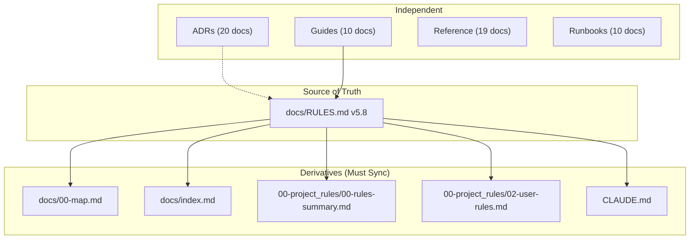

# Documentation Audit Report

**Version:** 1.0
**Date:** 2025-12-29
**Target RULES.md Version:** 5.8

---

## Executive Summary

This audit identified significant duplication and version inconsistencies in the BioETL documentation. Key findings:

- **14 duplicate/overlapping documents** requiring consolidation
- **9 documents** with outdated version references
- **3 orphan/stub documents** that can be deleted
- Diagrams are already in good shape (6 Mermaid, 2 PlantUML)

---

## Part 1: Document Inventory

### 1.1 Version Inconsistencies (Must Fix)

| Document | Current Version | Expected | Action |
|----------|----------------|----------|--------|
| `docs/RULES.md` | v5.8 | v5.8 | **SOURCE OF TRUTH** |
| `docs/00-map.md` | v5.7 | v5.8 | UPDATE |
| `docs/index.md` | v5.6.0 | v5.8 | UPDATE |
| `docs/00-project_rules/00-rules-summary.md` | v5.7 | v5.8 | UPDATE |
| `docs/00-project_rules/01-project-rules.md` | v5.6 | v5.8 | UPDATE |
| `docs/00-project_rules/02-user-rules.md` | v5.6 | v5.8 | UPDATE |
| `docs/02-architecture/diagrams/00-diagramming-policy.md` | v5.6 | v5.8 | UPDATE |
| `CLAUDE.md` | v5.8 | v5.8 | OK |
| `AGENT.md` | - | v5.8 | CHECK |

### 1.2 Duplicate Documents (Must Consolidate)

#### Refactoring Plans (4 files → 1 file)

| Document | Lines | Version | Status | Action |
|----------|-------|---------|--------|--------|
| `docs/refactoring-plan.md` | 1166 | v5.9 | MAIN | **KEEP** |
| `docs/consolidated-refactoring-plan.md` | 264 | v1.3 | DUPLICATE | DELETE |
| `docs/consolidated-refactoring-plan-v2.md` | 270 | v1.0 | DUPLICATE | DELETE |
| `docs/consolidated-refactoring-analysis.md` | 403 | v3.0 | DUPLICATE | DELETE |
| `docs/refactoring-plan-bronze-validation.md` | 909 | v1.0 | OUTDATED | ARCHIVE |

**Recommendation:** Keep only `refactoring-plan.md` as the canonical source. Delete others.

#### Architecture Audits (5 files → 1 file)

| Document | Lines | Date | Status | Action |
|----------|-------|------|--------|--------|
| `docs/09-architecture-audit-2025-12-29.md` | 610 | 2025-12-29 | LATEST | **KEEP** (rename) |
| `docs/08-architecture-audit-2025-12-28.md` | 418 | 2025-12-28 | OUTDATED | DELETE |
| `docs/07-consolidated-architecture-audit-2025-12.md` | 242 | 2025-12-28 | OUTDATED | DELETE |
| `docs/consolidated-architecture-audit.md` | 462 | 2025-12-27 | OUTDATED | DELETE |
| `docs/archived-audit-report.md` | 93 | - | ARCHIVED | DELETE |

**Recommendation:** Keep `09-architecture-audit-2025-12-29.md`, rename to `architecture-audit.md`. Delete others.

#### Reports Directory (duplicate of docs)

| Document | Status | Action |
|----------|--------|--------|
| `reports/architecture-audit-2025-02.md` | DUPLICATE | DELETE entire reports/ |
| `reports/consolidated-refactoring-analysis.md` | DUPLICATE | DELETE |
| `reports/consolidated-refactoring-plan-2025-12-29.md` | DUPLICATE | DELETE |
| `reports/naming_audit_20251228.md` | OUTDATED | DELETE |

**Recommendation:** Delete entire `reports/` directory - duplicates content from `docs/`.

### 1.3 Orphan/Stub Documents (Can Delete)

| Document | Lines | Purpose | Action |
|----------|-------|---------|--------|
| `docs/01-governance/rules.md` | 25 | Stub pointing to RULES.md | DELETE |
| `docs/00-project_rules/01-project-rules.md` | 30 | Stub pointing to RULES.md | DELETE |
| `docs/mermaid-test.md` | 48 | Test file | DELETE |
| `docs/00-project_rules/AUDIT-REPORT.md` | 5 | Empty stub | DELETE |

### 1.4 Documents to Update (Content + Version)

| Document | Lines | Status | Action |
|----------|-------|--------|--------|
| `docs/00-project_rules/00-rules-summary.md` | 281 | OUTDATED | UPDATE version + sync with RULES.md |
| `docs/00-project_rules/02-user-rules.md` | 249 | OUTDATED | UPDATE version |
| `docs/00-project_rules/03-file-policy.md` | 219 | CURRENT | UPDATE version only |
| `docs/00-project_rules/04-extending-bioetl.md` | 434 | CURRENT | UPDATE version only |
| `docs/00-project_rules/05-cleanup-policy.md` | 286 | CURRENT | UPDATE version only |

### 1.5 Documents in Good Shape (Keep As-Is)

| Category | Count | Notes |
|----------|-------|-------|
| ADRs (`02-architecture/decisions/`) | 20 | Well maintained |
| Guides (`03-guides/`) | 10 | Good coverage |
| Reference (`04-reference/`) | 19 | API docs complete |
| Runbooks (`05-operations/runbooks/`) | 10 | Good structure |
| Provider docs (`providers/`) | 9 | Schema docs |
| Contracts (`contracts/`) | 1+ | JSON schemas |
| Diagrams (`02-architecture/diagrams/`) | 9 | Already Mermaid |

---

## Part 2: Diagrams Inventory

### 2.1 Current State

| File | Format | Lines | Status |
|------|--------|-------|--------|
| `01-high-level.mermaid` | Mermaid | 892 | OK |
| `02-medallion.mermaid` | Mermaid | 704 | OK |
| `03-pipeline-sequence.puml` | PlantUML | 969 | CONVERT to Mermaid |
| `04-error-flow.mermaid` | Mermaid | 293 | OK |
| `05-layers-interaction.mermaid` | Mermaid | 1734 | OK |
| `05-locking.puml` | PlantUML | 1357 | CONVERT to Mermaid |
| `06-pipeline-execution.mermaid` | Mermaid | 2086 | OK |
| `07-medallion-flow.mermaid` | Mermaid | 1677 | OK |

**Note:** 2 PlantUML files can optionally be converted to Mermaid for consistency.

### 2.2 Inline Diagrams in `diagrams.md`

The file `docs/02-architecture/diagrams.md` contains 6 inline Mermaid diagrams:
1. High-Level Architecture
2. Medallion Architecture
3. Class Diagram
4. Layer Interaction
5. Pipeline Execution Sequence
6. Medallion Data Flow

These overlap with separate `.mermaid` files but serve as a rendered reference.

---

## Part 3: Action Plan

### Phase 1: Delete Duplicates (Immediate)

```bash
# Delete duplicate refactoring plans
rm docs/consolidated-refactoring-plan.md
rm docs/consolidated-refactoring-plan-v2.md
rm docs/consolidated-refactoring-analysis.md

# Delete outdated architecture audits
rm docs/07-consolidated-architecture-audit-2025-12.md
rm docs/08-architecture-audit-2025-12-28.md
rm docs/consolidated-architecture-audit.md
rm docs/archived-audit-report.md

# Delete orphan/stub files
rm docs/01-governance/rules.md
rm docs/00-project_rules/01-project-rules.md
rm docs/00-project_rules/AUDIT-REPORT.md
rm docs/mermaid-test.md

# Delete reports directory (duplicate of docs/)
rm -rf reports/
```

### Phase 2: Rename/Reorganize

```bash
# Rename latest audit to canonical name
mv docs/09-architecture-audit-2025-12-29.md docs/architecture-audit.md

# Archive bronze validation plan (has historical value)
mkdir -p docs/archived
mv docs/refactoring-plan-bronze-validation.md docs/archived/
```

### Phase 3: Update Versions

Update version references in the following files to v5.8:
- `docs/00-map.md`
- `docs/index.md`
- `docs/00-project_rules/00-rules-summary.md`
- `docs/00-project_rules/02-user-rules.md`
- `docs/00-project_rules/03-file-policy.md`
- `docs/00-project_rules/04-extending-bioetl.md`
- `docs/00-project_rules/05-cleanup-policy.md`
- `docs/02-architecture/diagrams/00-diagramming-policy.md`

### Phase 4: Convert PlantUML to Mermaid

Converted for consistency:
- `03-pipeline-sequence.puml` → `03-pipeline-sequence.mermaid` ✅
- `05-locking.puml` → `05-locking.mermaid` ✅

---

## Part 4: Metrics

### Before Audit

| Metric | Value |
|--------|-------|
| Total documents in docs/ | 95+ |
| Duplicate documents | 14 |
| Outdated version refs | 9 |
| Orphan/stub documents | 4 |
| PlantUML diagrams | 2 |

### After Audit (Actual)

| Metric | Value | Status |
|--------|-------|--------|
| Total documents in docs/ | ~80 | ✅ Reduced |
| Duplicate documents | 0 | ✅ Consolidated |
| Outdated version refs | 0 | ✅ Updated to v5.8 |
| Orphan/stub documents | 0 | ✅ Deleted |
| Mermaid diagrams | 9 | ✅ All unified |
| PlantUML diagrams | 0 | ✅ Converted |

### Files Deleted

```
docs/consolidated-refactoring-plan.md
docs/consolidated-refactoring-plan-v2.md
docs/consolidated-refactoring-analysis.md
docs/07-consolidated-architecture-audit-2025-12.md
docs/08-architecture-audit-2025-12-28.md
docs/consolidated-architecture-audit.md
docs/archived-audit-report.md
docs/01-governance/rules.md
docs/00-project_rules/01-project-rules.md
docs/00-project_rules/AUDIT-REPORT.md
docs/mermaid-test.md
reports/ (entire directory)
docs/02-architecture/diagrams/03-pipeline-sequence.puml
docs/02-architecture/diagrams/05-locking.puml
```

### Files Renamed/Moved

```
docs/09-architecture-audit-2025-12-29.md → docs/architecture-audit.md
docs/refactoring-plan-bronze-validation.md → docs/archived/refactoring-plan-bronze-validation.md
```

### Files Updated (version sync to v5.8)

```
docs/00-map.md
docs/index.md
docs/00-project_rules/00-rules-summary.md
docs/00-project_rules/02-user-rules.md
docs/02-architecture/diagrams/00-diagramming-policy.md
```

---

## Part 5: Dependency Graph



---

*End of Audit Report*
