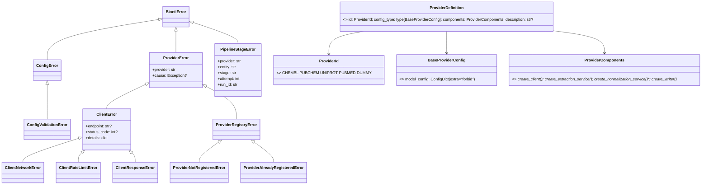
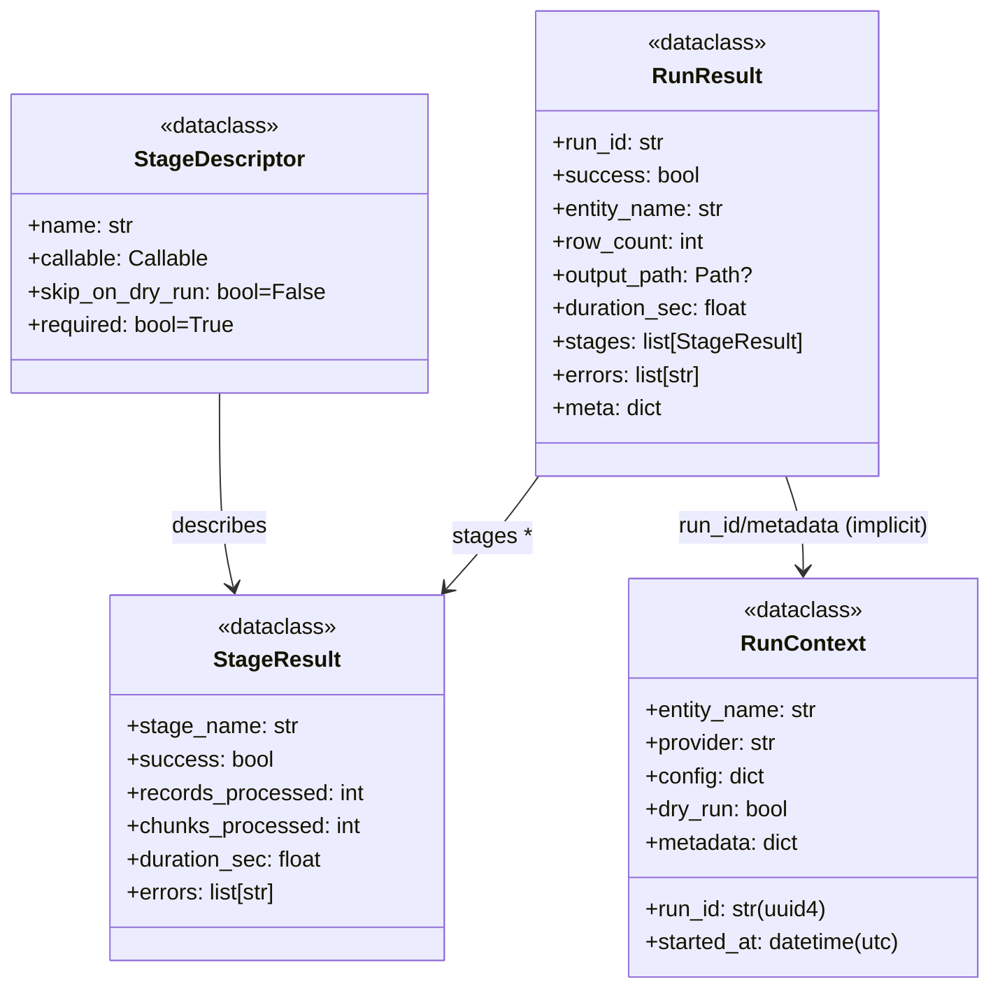
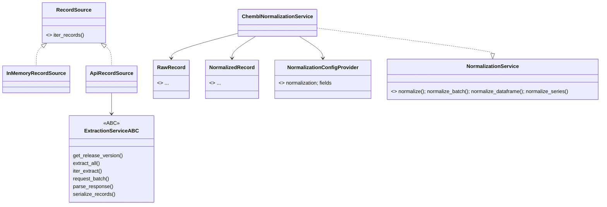
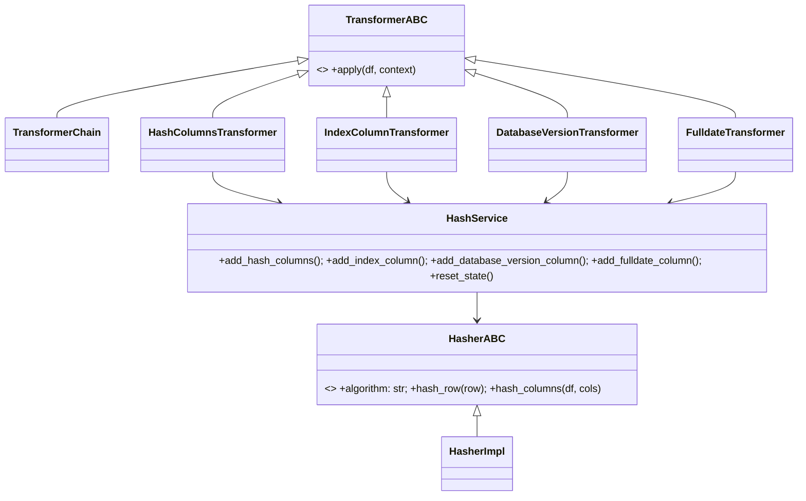
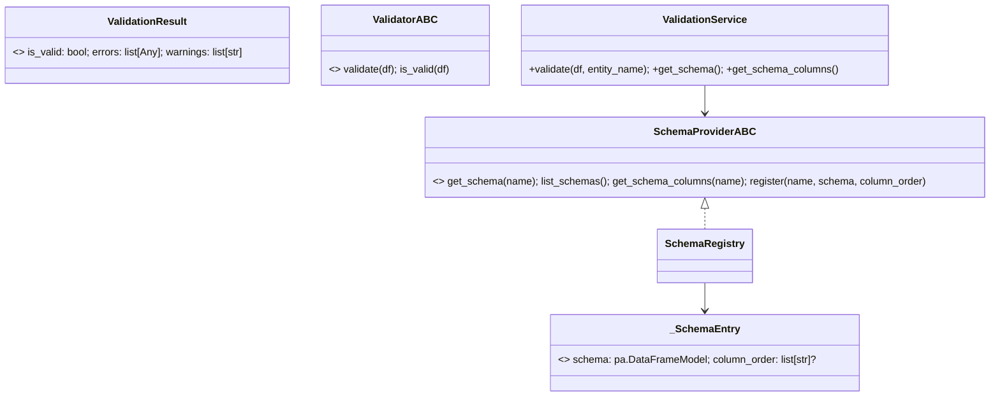
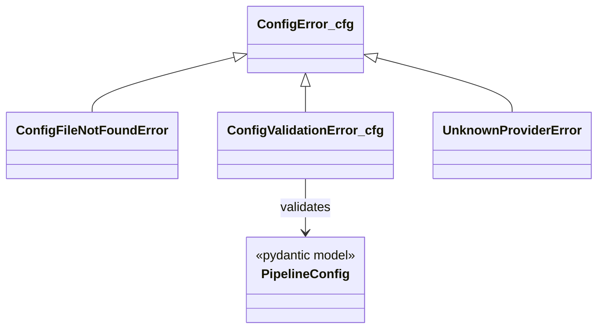

# BioETL Domain Class Diagrams

## Errors and Providers

```mermaid
classDiagram
    class BioetlError
    class ConfigError
    class ConfigValidationError
    class ProviderError {
        +provider: str
        +cause: Exception?
    }
    class ClientError {
        +endpoint: str?
        +status_code: int?
        +details: dict
    }
    class ClientNetworkError
    class ClientRateLimitError
    class ClientResponseError
    class PipelineStageError {
        +provider: str
        +entity: str
        +stage: str
        +attempt: int
        +run_id: str
    }

    class ProviderRegistryError
    class ProviderNotRegisteredError
    class ProviderAlreadyRegisteredError
    class ProviderId { <<enum>> CHEMBL PUBCHEM UNIPROT PUBMED DUMMY }
    class BaseProviderConfig { <<pydantic.BaseModel>> model_config: ConfigDict(extra="forbid") }
    class ProviderComponents { <<protocol>> create_client(); create_extraction_service(); create_normalization_service()*; create_writer()* }
    class ProviderDefinition { <<dataclass frozen>> id: ProviderId; config_type: type[BaseProviderConfig]; components: ProviderComponents; description: str? }

    BioetlError <|-- ConfigError
    ConfigError <|-- ConfigValidationError
    BioetlError <|-- ProviderError
    ProviderError <|-- ClientError
    ClientError <|-- ClientNetworkError
    ClientError <|-- ClientRateLimitError
    ClientError <|-- ClientResponseError
    BioetlError <|-- PipelineStageError

    ProviderError <|-- ProviderRegistryError
    ProviderRegistryError <|-- ProviderNotRegisteredError
    ProviderRegistryError <|-- ProviderAlreadyRegisteredError
    ProviderDefinition --> ProviderId
    ProviderDefinition --> BaseProviderConfig
    ProviderDefinition --> ProviderComponents
```

## ETL Execution

```mermaid
classDiagram
    class StageResult {
        <<dataclass>>
        +stage_name: str
        +success: bool
        +records_processed: int
        +chunks_processed: int
        +duration_sec: float
        +errors: list[str]
    }
    class RunContext {
        <<dataclass>>
        +run_id: str (uuid4)
        +entity_name: str
        +provider: str
        +started_at: datetime(utc)
        +config: dict
        +dry_run: bool
        +metadata: dict
    }
    class StageDescriptor {
        <<dataclass>>
        +name: str
        +callable: Callable
        +skip_on_dry_run: bool=False
        +required: bool=True
    }
    class RunResult {
        <<dataclass>>
        +run_id: str
        +success: bool
        +entity_name: str
        +row_count: int
        +output_path: Path?
        +duration_sec: float
        +stages: list[StageResult]
        +errors: list[str]
        +meta: dict
    }

    RunResult --> StageResult : stages *
    StageDescriptor --> StageResult : describes
    RunResult --> RunContext : run_id/metadata (implicit)
```

## Record Sources and Normalization

```mermaid
classDiagram
    class ExtractionServiceABC {
        <<ABC>>
        get_release_version()
        extract_all()
        iter_extract()
        request_batch()
        parse_response()
        serialize_records()
    }
    class RecordSource { <<protocol>> iter_records() }
    class InMemoryRecordSource
    class ApiRecordSource
    class RawRecord { <<TypedDict>> ... }
    class NormalizedRecord { <<TypedDict>> ... }
    class NormalizationConfigProvider { <<protocol>> normalization; fields }
    class NormalizationService { <<protocol>> normalize(); normalize_batch(); normalize_dataframe(); normalize_series() }
    class ChemblNormalizationService

    RecordSource <|.. InMemoryRecordSource
    RecordSource <|.. ApiRecordSource
    ApiRecordSource --> ExtractionServiceABC
    ChemblNormalizationService ..|> NormalizationService
    ChemblNormalizationService --> NormalizationConfigProvider
    ChemblNormalizationService --> RawRecord
    ChemblNormalizationService --> NormalizedRecord
```

## Transformations and Hashing

```mermaid
classDiagram
    class HasherABC { <<ABC>> +algorithm: str; +hash_row(row); +hash_columns(df, cols) }
    class HasherImpl
    class HashService { +add_hash_columns(); +add_index_column(); +add_database_version_column(); +add_fulldate_column(); +reset_state() }
    class TransformerABC { <<ABC>> +apply(df, context) }
    class TransformerChain
    class HashColumnsTransformer
    class IndexColumnTransformer
    class DatabaseVersionTransformer
    class FulldateTransformer

    HasherABC <|-- HasherImpl
    HashService --> HasherABC
    TransformerABC <|-- TransformerChain
    TransformerABC <|-- HashColumnsTransformer
    TransformerABC <|-- IndexColumnTransformer
    TransformerABC <|-- DatabaseVersionTransformer
    TransformerABC <|-- FulldateTransformer
    HashColumnsTransformer --> HashService
    IndexColumnTransformer --> HashService
    DatabaseVersionTransformer --> HashService
    FulldateTransformer --> HashService
```

## Validation and Schemas

```mermaid
classDiagram
    class ValidationResult { <<dataclass>> is_valid: bool; errors: list[Any]; warnings: list[str] }
    class ValidatorABC { <<ABC>> validate(df); is_valid(df) }
    class SchemaProviderABC { <<ABC>> get_schema(name); list_schemas(); get_schema_columns(name); register(name, schema, column_order) }
    class ValidationService { +validate(df, entity_name); +get_schema(); +get_schema_columns() }
    class _SchemaEntry { <<dataclass>> schema: pa.DataFrameModel; column_order: list[str]? }
    class SchemaRegistry

    SchemaProviderABC <|.. SchemaRegistry
    SchemaRegistry --> _SchemaEntry
    ValidationService --> SchemaProviderABC
```

## Config Loader

```mermaid
classDiagram
    class ConfigError_cfg
    class ConfigFileNotFoundError
    class ConfigValidationError_cfg
    class UnknownProviderError
    class PipelineConfig { <<pydantic model>> }

    ConfigError_cfg <|-- ConfigFileNotFoundError
    ConfigError_cfg <|-- ConfigValidationError_cfg
    ConfigError_cfg <|-- UnknownProviderError
    ConfigValidationError_cfg --> PipelineConfig : validates
```
