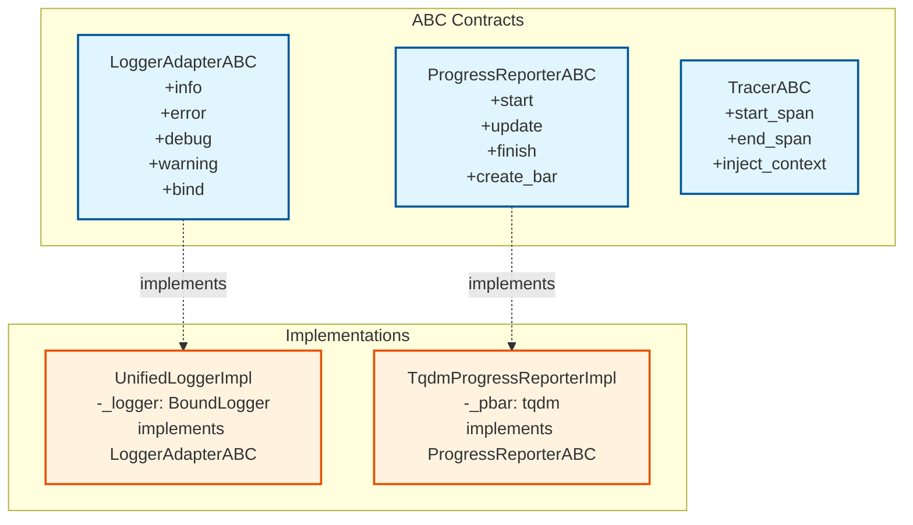
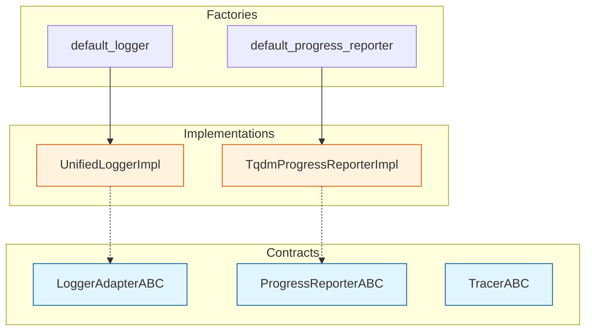

# Logging Module Diagram

## Class Diagram



## Module Structure



## File Structure

```text
src/bioetl/infrastructure/logging/
├── contracts.py          # ABC interfaces
├── factories.py         # Default factory functions
└── impl/
    ├── unified_logger.py        # LoggerAdapterABC implementation
    └── progress_reporter.py     # ProgressReporterABC implementation
```

## Как просмотреть диаграмму

### В Cursor

**Важно**: Cursor может не поддерживать все типы диаграмм Mermaid. Если диаграммы не отображаются:

1. **Markdown Preview**:
   - Откройте файл
   - Нажмите `Ctrl+Shift+V` (Windows/Linux) или `Cmd+Shift+V` (Mac)
   - Или используйте команду "Markdown: Open Preview" из палитры команд (`Ctrl+Shift+P`)

2. **Проверка расширений**:
   - Убедитесь, что установлено расширение "Markdown Preview Mermaid Support" или "Markdown Preview Enhanced"
   - Перезапустите Cursor после установки расширения

3. **Альтернатива**: Используйте онлайн-редактор Mermaid (см. ниже)

### Альтернативные способы

- **Mermaid Live Editor**: [mermaid.live](https://mermaid.live/) — скопируйте код из блока `mermaid` и вставьте в редактор
- **GitHub/GitLab**: Диаграммы автоматически рендерятся в markdown файлах на GitHub/GitLab
- **VS Code**: Расширение "Markdown Preview Mermaid Support"
- **Obsidian**: Встроенная поддержка Mermaid диаграмм
