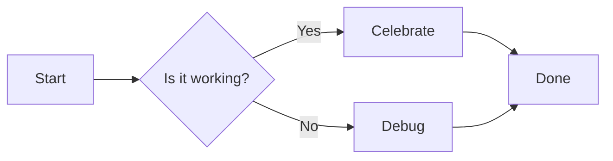

# Mermaid test

A simple flowchart to verify Mermaid rendering and theme sync.

```mermaid
graph LR
  A[Start] --> B{Is it working?}
  B -- Yes --> C[Celebrate]
  B -- No --> D[Debug]
  C --> E[Done]
  D --> E
```

