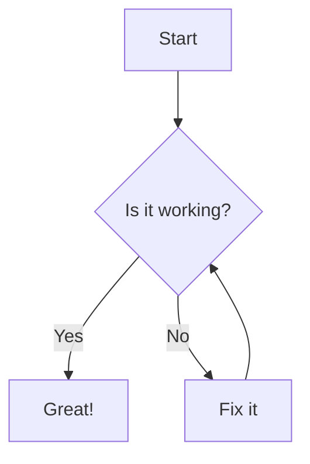
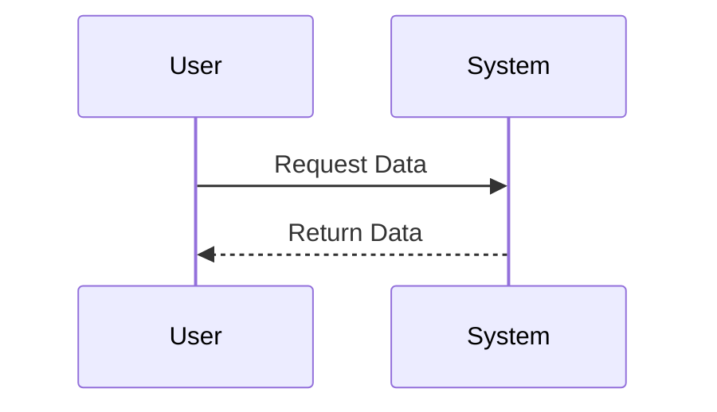
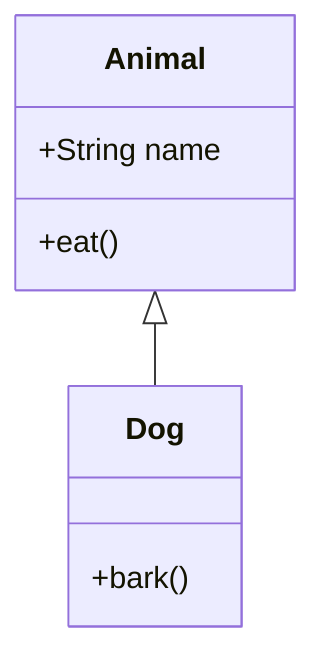
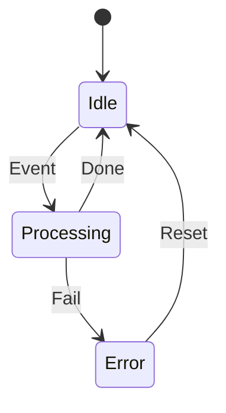

# Mermaid Diagram Test

This page tests the rendering of Mermaid diagrams in the documentation.

## Flowchart

```mermaid
graph TD
    A[Start] --> B{Is it working?}
    B -- Yes --> C[Great!]
    B -- No --> D[Fix it]
    D --> B
```

## Sequence Diagram

```mermaid
sequenceDiagram
    participant User
    participant System
    User->>System: Request Data
    System-->>User: Return Data
```

## Class Diagram

```mermaid
classDiagram
    class Animal {
        +String name
        +eat()
    }
    class Dog {
        +bark()
    }
    Animal <|-- Dog
```

## State Diagram

```mermaid
stateDiagram-v2
    [*] --> Idle
    Idle --> Processing : Event
    Processing --> Idle : Done
    Processing --> Error : Fail
    Error --> Idle : Reset
```
