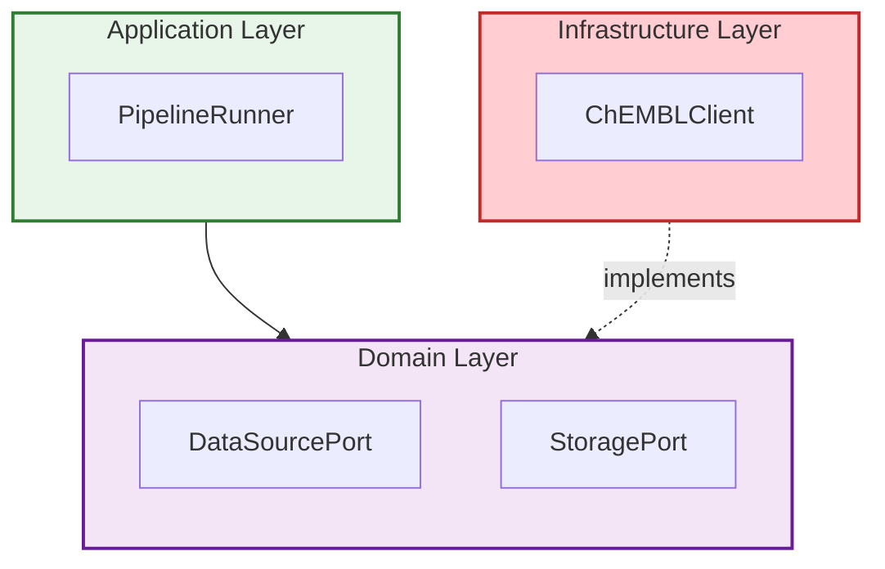
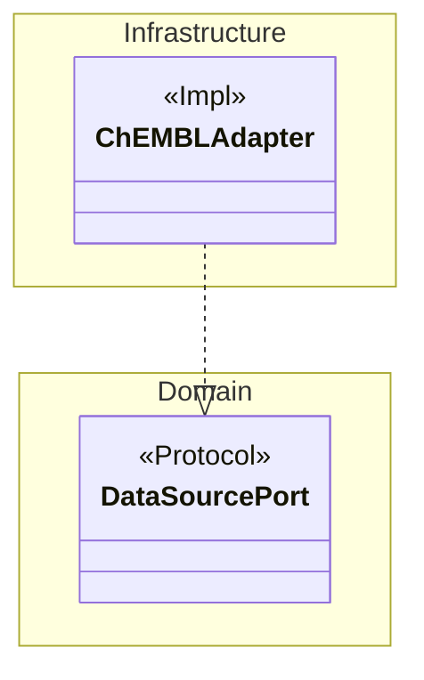
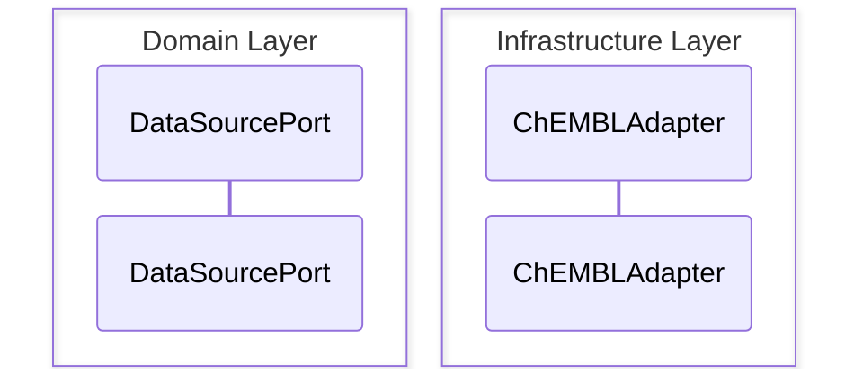
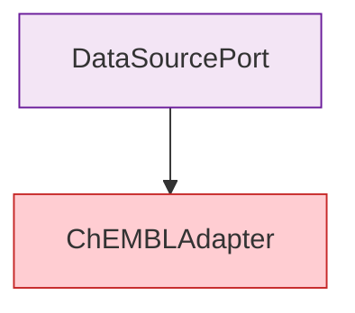
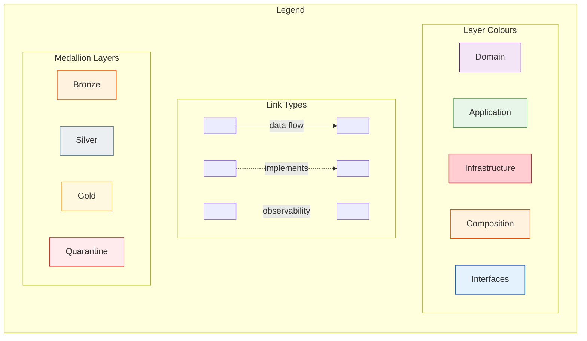

# BioETL: Промты для оптимизации архитектурных диаграмм v2.0

**Версия:** 2.0 | **Дата:** 2026-02-25
**Контекст:** Пересмотренный план на основе аудита реального состояния репозитория
**Отличия от v1.0:** Исправлены пути, расширения, цветовая схема, устранено дублирование с существующей инфраструктурой

---

## Текущее состояние (результат аудита)

### Файловая структура

```
docs/02-architecture/mmd-diagrams/     ← КАНОНИЧЕСКОЕ расположение
  architecture/   (18 .mmd файлов)     ← Архитектурные диаграммы
  class-diagrams/ (16 .mmd файлов)     ← Диаграммы классов
  foundation/     (50 .mmd файлов)     ← Исторические/базовые
  theme/
    mermaid-config.json                ← Уже существует, 131 строка
    custom.css                         ← Уже существует, 152 строки, layer colours
  render.sh                            ← Уже существует, SVG+PNG pipeline
  README.md                            ← Индекс с цветовой схемой
```

**Итого: 84 файла `.mmd`** (не 34 как в v1.0).

### Существующая инфраструктура (НЕ дублировать)

| Артефакт | Путь | Статус |
|----------|------|--------|
| Тема Mermaid | `theme/mermaid-config.json` | Полная, 131 строка |
| CSS стили + layer colours | `theme/custom.css` | Полный, 152 строки |
| Render pipeline | `mmd-diagrams/render.sh` | Работает (SVG + PNG, параллельный) |
| Линтер диаграмм | `scripts/lint_diagrams.py` | Работает, но для `.mermaid` (legacy) |
| Pre-commit | `.pre-commit-config.yaml` | 12 хуков, **без** diagram validation |
| Diagram policy | `06-diagram-polisy.md` | Существует (POL-LLM-DIAGRAMS-001) |
| README + colour scheme | `mmd-diagrams/README.md` | Полный каталог + рендеринг |
| `%%{init:}` блоки | 55 из 84 файлов | foundation/ — есть (`theme: neutral`), architecture/ — нет |
| `@version/@date/@type/@level` | 18 файлов | architecture/ — все 18, остальные — нет |
| `subgraph` использование | 30 из 84 файлов | architecture/ — все 17, foundation — 13 |
| `%% @view` метаданные | 0 файлов | Отсутствуют (вводятся этим планом) |

### Утверждённая цветовая схема (из README.md + custom.css)

| Слой | Fill | Border |
|------|------|--------|
| Domain | `#f3e5f5` | `#6a1b9a` |
| Application | `#e8f5e9` | `#2e7d32` |
| Infrastructure | `#ffcdd2` | `#c62828` |
| Interfaces | `#e3f2fd` | `#1565c0` |
| Composition | `#fff3e0` | `#e65100` |
| External | `#eceff1` | `#455a64` |

**Medallion:**

| Слой | Fill | Border |
|------|------|--------|
| Bronze | `#fff3e0` | `#e65100` |
| Silver | `#eceff1` | `#607d8b` |
| Gold | `#fff8e1` | `#f9a825` |
| Quarantine | `#ffebee` | `#d32f2f` |

### Инвентаризация перегруженных диаграмм

| Файл | Тип | Узлов | Связей | Статус |
|------|-----|-------|--------|--------|
| `architecture/13-port-protocol-contracts.mmd` | flowchart | **68** | 38 | CRITICAL |
| `foundation/01-full-system-component.mmd` | flowchart | **59** | 37 | CRITICAL |
| `foundation/30-port-adapter-mapping.mmd` | flowchart | **54** | 30 | CRITICAL |
| `foundation/50-exception-hierarchy.mmd` | flowchart | **48** | 49 | CRITICAL |
| `foundation/26-hexagonal-ports-adapters.mmd` | flowchart | **48** | 23 | CRITICAL |
| `architecture/01-high-level-hexagonal.mmd` | flowchart | **39** | 35 | CRITICAL |
| `architecture/12-bootstrap-di-container.mmd` | flowchart | 29 | 38 | OVERLOADED |
| `foundation/28-composition-root-di-graph.mmd` | flowchart | 28 | 29 | OVERLOADED |
| `architecture/05-provider-adapter-hierarchy.mmd` | flowchart | 27 | 24 | OVERLOADED |

**Class-diagrams:** Все ≤20 узлов — декомпозиция НЕ требуется.

### Последний ADR: ADR-039 → следующий: **ADR-040**

---

## Промт 1: Декомпозиция CRITICAL-диаграмм по Views

**Приоритет:** CRITICAL — устраняет основные проблемы layout
**Scope:** 6 CRITICAL файлов (≥35 узлов)

```
Режим: DOC → CODE

## Контекст
В BioETL каталог `.mmd` диаграмм: `docs/02-architecture/mmd-diagrams/`.
Расширение: `.mmd` (НЕ `.mermaid`).
Существующая цветовая схема: `theme/mermaid-config.json` + `theme/custom.css`.
Индекс: `mmd-diagrams/README.md`.

Проблема: 6 диаграмм имеют ≥35 узлов, что превышает возможности Dagre.

## Целевые файлы (CRITICAL — ≥35 узлов)

| # | Файл | Узлов | Связей |
|---|------|-------|--------|
| 1 | `architecture/13-port-protocol-contracts.mmd` | 68 | 38 |
| 2 | `foundation/01-full-system-component.mmd` | 59 | 37 |
| 3 | `foundation/30-port-adapter-mapping.mmd` | 54 | 30 |
| 4 | `foundation/50-exception-hierarchy.mmd` | 48 | 49 |
| 5 | `foundation/26-hexagonal-ports-adapters.mmd` | 48 | 23 |
| 6 | `architecture/01-high-level-hexagonal.mmd` | 39 | 35 |

## Шаг 1: План декомпозиции по файлам

### 13-port-protocol-contracts (68 узлов)
Разбить на 4 файла по группам портов:
- `13a-port-contracts-data-sources.mmd` — DataSourcePort, FilterableDataSourcePort → 7 адаптеров (≤15 узлов)
- `13b-port-contracts-storage.mmd` — StoragePort, DeltaReaderPort, MetadataWriterPort → writers (≤12 узлов)
- `13c-port-contracts-observability.mmd` — LoggerPort, MetricsPort, TracingPort, CircuitBreakerPort, RateLimiterPort → impls (≤15 узлов)
- `13d-port-contracts-services.mmd` — остальные: LockPort, CheckpointPort, QuarantinePort, AuditPort, PiiHasherPort, InputFilterPort, DQMonitorPort, etc. (≤20 узлов)
Оригинал → `13-port-protocol-contracts.mmd` оставить как есть (reference, не для рендеринга)

### 01-full-system-component / foundation (59 узлов)
Уже существует пара: `01-full-system-component.mmd` (59) + `01-high-level.mmd` (28).
`01-high-level.mmd` — это overview view, НО тоже OVERLOADED.
Создать:
- `01a-system-overview.mmd` — только 5 layers + external systems (≤12 узлов)
- `01b-system-data-pipeline.mmd` — ETL pipeline detail: adapters → transformers → storage (≤18 узлов)
- `01c-system-cross-cutting.mmd` — DI, config, observability, resilience (≤15 узлов)
`01-full-system-component.mmd` — оставить как reference

### 30-port-adapter-mapping (54 узла)
Уже дублирует `13-port-protocol-contracts`. После декомпозиции 13-го файла,
этот становится избыточным. Пометить `%% Status: superseded-by 13a/13b/13c/13d`.

### 50-exception-hierarchy (48 узлов, 49 связей)
Разбить по severity:
- `50a-exceptions-critical.mmd` — BioETLError → CriticalError tree (≤15 узлов)
- `50b-exceptions-recoverable.mmd` — RecoverableError tree + retry/abort actions (≤18 узлов)
- `50c-exceptions-data-quality.mmd` — DataQualityError tree + quarantine flow (≤15 узлов)
Оригинал — оставить как reference

### 26-hexagonal-ports-adapters (48 узлов)
Дублирует 13-port-protocol-contracts (foundation copy).
Пометить `%% Status: superseded-by architecture/13a-13d`.

### architecture/01-high-level-hexagonal (39 узлов)
Разбить:
- `01a-hexagonal-overview.mmd` — 5 layers, direction of dependencies, external APIs (≤15 узлов)
- `01b-hexagonal-domain-application.mmd` — Domain ports + Application services detail (≤18 узлов)
- `01c-hexagonal-infra-composition.mmd` — Infrastructure adapters + Composition factories (≤18 узлов)
Оригинал — оставить как reference

## Шаг 2: Формат новых файлов

Каждый новый `.mmd` файл MUST содержать мета-комментарии
в формате, совместимом с architecture/ (используют `@` prefix):
```
%% <Title — one-line description>
%% <Covers — what aspect>

%% @version 1.0.0
%% @date    2026-02-25
%% @type    <flowchart|classDiagram|...>
%% @level   <System / Component|Class|...>
%% @view    <overview|data-sources|storage|observability|services|data-pipeline|cross-cutting|critical|recoverable|dq>
%% @parent  <original-filename.mmd>
%% @nodes   <count>
```

## Шаг 3: Стиль

НЕ добавлять `%%{init:}` блок — стили берутся из `theme/mermaid-config.json`
через `mmdc -c theme/mermaid-config.json --cssFile theme/custom.css`.

Subgraph стили — использовать СУЩЕСТВУЮЩУЮ цветовую схему из `custom.css`:
```
style Domain fill:#f3e5f5,stroke:#6a1b9a,stroke-width:2px
style Application fill:#e8f5e9,stroke:#2e7d32,stroke-width:2px
style Infrastructure fill:#ffcdd2,stroke:#c62828,stroke-width:2px
style Composition fill:#fff3e0,stroke:#e65100,stroke-width:2px
style Interfaces fill:#e3f2fd,stroke:#1565c0,stroke-width:2px
style External fill:#eceff1,stroke:#455a64,stroke-width:2px
```

## Шаг 4: Обновление индекса

В `mmd-diagrams/README.md`:
1. Добавить секцию "Decomposed Views" после основных таблиц
2. Пометить superseded файлы в foundation/ таблице
3. Указать рекомендуемый порядок просмотра для онбординга:
   `01a-hexagonal-overview → 01b-hexagonal-domain-application → 13a-port-contracts-data-sources → ...`

## Ограничения
- Максимум узлов на файл: 20 (жёсткий лимит)
- Рекомендуемый максимум: 15
- Имена узлов — строго из `src/bioetl/` (проверить grep-ом)
- НЕ трогать class-diagrams/ (все ≤20 узлов)
- НЕ трогать foundation/ файлы с ≤25 узлов
- Подписи на английском

## Выходные артефакты
1. ~14 новых `.mmd` файлов (architecture/ и foundation/)
2. 2 superseded-маркера на foundation/ файлах
3. Обновлённый `mmd-diagrams/README.md`
4. Оригиналы НЕ удалять, оставить как reference
```

---

## Промт 2: Усиление subgraph-группировки в architecture/

**Приоритет:** HIGH — визуальное разделение слоёв
**Scope:** 18 файлов architecture/ + 14 новых из Промта 1

```
Режим: CODE

## Контекст
Файлы `docs/02-architecture/mmd-diagrams/architecture/*.mmd` уже используют
`subgraph` (17 из 18 файлов). Задача: стандартизировать группировку по слоям
и убедиться, что стили subgraph соответствуют утверждённой цветовой схеме.

## Утверждённая цветовая схема (из README.md + custom.css)

| Слой | Fill | Border | Формат style |
|------|------|--------|-------------|
| Domain | `#f3e5f5` | `#6a1b9a` | `style Domain fill:#f3e5f5,stroke:#6a1b9a,stroke-width:2px` |
| Application | `#e8f5e9` | `#2e7d32` | `style Application fill:#e8f5e9,stroke:#2e7d32,stroke-width:2px` |
| Infrastructure | `#ffcdd2` | `#c62828` | `style Infrastructure fill:#ffcdd2,stroke:#c62828,stroke-width:2px` |
| Composition | `#fff3e0` | `#e65100` | `style Composition fill:#fff3e0,stroke:#e65100,stroke-width:2px` |
| Interfaces | `#e3f2fd` | `#1565c0` | `style Interfaces fill:#e3f2fd,stroke:#1565c0,stroke-width:2px` |
| External | `#eceff1` | `#455a64` | `style External fill:#eceff1,stroke:#455a64,stroke-width:2px` |

Medallion layers:

| Слой | Fill | Border |
|------|------|--------|
| Bronze | `#fff3e0` | `#e65100` |
| Silver | `#eceff1` | `#607d8b` |
| Gold | `#fff8e1` | `#f9a825` |
| Quarantine | `#ffebee` | `#d32f2f` |

ВАЖНО: Не менять эти цвета! Они уже закреплены в `custom.css` строки 140-151.

## Задача

### Для flowchart диаграмм
Стандартизировать имена subgraph по слоям:



### Для classDiagram диаграмм (class-diagrams/)
Использовать `namespace` (проверить `mmdc --version` ≥10.4):



Если mmdc версия <10.4, использовать `%% Namespace: Domain` комментарий
вместо встроенного `namespace`.

### Для sequenceDiagram
Subgraph недоступен. Использовать `box` (Mermaid ≥10.7):


Если mmdc <10.7, использовать `rect` + `note` как fallback.

## Проверки
1. Каждый subgraph имеет `style` строку с УТВЕРЖДЁННОЙ цветовой схемой
2. Имена subgraph — строго из списка: Domain, Application, Infrastructure,
   Composition, Interfaces, External, Bronze, Silver, Gold, Quarantine
3. `direction LR` или `direction TB` указан внутри каждого subgraph
4. Рендер: `bash mmd-diagrams/render.sh --filter "01-*"`

## Scope
- architecture/*.mmd — все 18 файлов (стандартизация)
- Новые файлы из Промта 1 — все ~14 файлов (уже создавать с subgraph)
- class-diagrams/*.mmd — только если mmdc ≥10.4 (namespace support)
- foundation/*.mmd — НЕ трогать (historical, слишком много файлов)

## Ограничения
- Не менять содержимое узлов — только оборачивать в subgraph/namespace
- Если диаграмма содержит элементы только одного слоя — subgraph не нужен
- Не менять цветовую схему

## Выходные артефакты
1. Обновлённые `architecture/*.mmd` файлы с стандартизированными subgraph
2. Обновлённые новые файлы из Промта 1
```

---

## Промт 3: Визуальный вес связей и легенда

**Приоритет:** MEDIUM — улучшает читаемость
**Scope:** architecture/ + новые файлы из Промта 1

```
Режим: CODE

## Контекст
Диаграммы BioETL декомпозированы по Views (Промт 1) и сгруппированы
по слоям (Промт 2). Теперь нужно визуально выделить главные потоки.

## Задача A: Визуальный вес связей

### Классификация связей
| Тип | Стиль Mermaid | Назначение |
|-----|--------------|-----------|
| Основной поток данных | `-->` + `linkStyle N stroke:#1E293B,stroke-width:3px` | E→T→L, Bronze→Silver→Gold |
| Зависимость (DI) | `-.->` + `linkStyle N stroke:#6a1b9a,stroke-width:1.5px,stroke-dasharray:5` | implements, injects |
| Наблюдаемость | `-->` + `linkStyle N stroke:#94A3B8,stroke-width:1px` | logging, metrics, tracing |
| Ошибка/quarantine | `-->` + `linkStyle N stroke:#c62828,stroke-width:2px,stroke-dasharray:4` | error flow |

### ПРЕДУПРЕЖДЕНИЕ о linkStyle
`linkStyle` использует 0-based индексы связей (в порядке объявления в файле).
При добавлении/удалении связей индексы СБИВАЮТСЯ.

Для минимизации риска:
1. Объявлять ВСЕ связи одного типа подряд (сначала data flow, потом DI, потом obs)
2. В комментарии перед `linkStyle` указать: `%% linkStyle: data-flow 0-4, DI 5-8, obs 9-11`
3. При изменении файла — ВСЕГДА пересчитывать индексы

### Альтернатива linkStyle (предпочтительнее для ≤15 узлов)
Использовать classDef + `:::` синтаксис для узлов (НЕ для связей):


## Задача B: Короткие метки + легенда

### Правила
1. Метки на связях — максимум 15 символов
2. Если метка длиннее — сократить или убрать (информация в узлах)

### Формат легенды
Создать `docs/02-architecture/mmd-diagrams/00-legend.mmd`:


В каждом файле с linkStyle добавить комментарий:
```
%% Legend: see 00-legend.mmd
```

## Scope
- `architecture/*.mmd` — визуальный вес для ≥3 типов связей
- Новые файлы из Промта 1 — изначально с правильным весом
- `00-legend.mmd` — создать
- class-diagrams/ — НЕ трогать (связи classDiagram стилизуются иначе)
- foundation/ — НЕ трогать

## Проверка
1. Ни одна метка на связи не превышает 15 символов
2. Основной поток данных визуально доминирует (толще)
3. `00-legend.mmd` рендерится корректно

## Выходные артефакты
1. `00-legend.mmd`
2. Обновлённые `architecture/*.mmd` с linkStyle/classDef
3. Обновлённые новые файлы
```

---

## Промт 4: Расширение lint_diagrams.py для .mmd + pre-commit hook

**Приоритет:** MEDIUM — CI-валидация
**Scope:** `scripts/lint_diagrams.py` + `.pre-commit-config.yaml`

```
Режим: CODE

## Контекст
Существующий `scripts/lint_diagrams.py` (387 строк) работает только
с `docs/02-architecture/diagrams/*.mermaid` (legacy).
Каноническое расположение теперь: `docs/02-architecture/mmd-diagrams/**/*.mmd`.

Текущие проверки lint_diagrams.py:
- META-001: Required headers (Title, Covers, Updated, Components)
- NAME-001: Naming convention (NN-topic.mermaid)
- CONTENT-001: Placeholder markers
- CONTENT-002: Minimum 3 non-comment lines
- STALE-001/002: Staleness detection
- EXT-001: .mmd extension found (ОШИБКА — помечает .mmd как legacy!)

## Задача
Модифицировать `scripts/lint_diagrams.py` для поддержки обоих форматов.

### Изменения

#### 1. Добавить поддержку каталога `.mmd`

```python
# Заменить:
DIAGRAM_DIR = Path("docs/02-architecture/diagrams")

# На:
DIAGRAM_DIRS = [
    Path("docs/02-architecture/mmd-diagrams"),
    Path("docs/02-architecture/diagrams"),  # legacy
]
```

#### 2. Расширить glob для .mmd файлов

```python
# В lint_directory():
# Заменить:
mermaid_files = sorted(diagram_dir.glob("*.mermaid"))

# На:
mermaid_files = sorted(
    list(diagram_dir.rglob("*.mmd")) +
    list(diagram_dir.rglob("*.mermaid"))
)
```

#### 3. Убрать EXT-001 (legacy .mmd warning)

Удалить функцию `check_extension_consistency()` целиком —
`.mmd` теперь каноническое расширение.

#### 4. Обновить NAMING_PATTERN для .mmd

```python
NAMING_PATTERN = re.compile(
    r"^\d{2}[a-z]?-[a-z0-9]+(?:-[a-z0-9]+)*\.(?:mmd|mermaid)$"
)
```

#### 5. Добавить новые проверки

```python
def check_view_metadata(path: Path, lines: list[str]) -> list[Issue]:
    """Check for View/Parent metadata in decomposed diagrams."""
    issues: list[Issue] = []
    fname = str(path)

    # Only check files with letter suffix (e.g., 13a-, 01b-)
    if not re.match(r"^\d{2}[a-z]-", path.name):
        return issues

    has_view = any(
        line.startswith("%% View:") or line.startswith("%% @view")
        for line in lines
    )
    has_parent = any(
        line.startswith("%% Parent:") or line.startswith("%% @parent")
        for line in lines
    )

    if not has_view:
        issues.append(Issue(
            file=fname, severity="WARNING", rule="VIEW-001",
            message="Decomposed diagram missing %% View: metadata"
        ))
    if not has_parent:
        issues.append(Issue(
            file=fname, severity="WARNING", rule="VIEW-002",
            message="Decomposed diagram missing %% Parent: metadata"
        ))
    return issues


def check_node_count(path: Path, lines: list[str]) -> list[Issue]:
    """Warn if diagram exceeds node limits."""
    issues: list[Issue] = []
    fname = str(path)

    # Count node-like patterns (rough heuristic)
    node_patterns = [
        r'\w+\[',        # flowchart: NodeId[
        r'\w+\(',        # flowchart: NodeId(
        r'\w+\{',        # flowchart: NodeId{
        r'class\s+\w+',  # classDiagram: class Name
        r'participant\s', # sequenceDiagram: participant
        r'state\s+\w+',  # stateDiagram: state Name
    ]
    content = "\n".join(lines)
    node_count = 0
    for pattern in node_patterns:
        node_count += len(re.findall(pattern, content))

    if node_count > 35:
        issues.append(Issue(
            file=fname, severity="ERROR", rule="SIZE-001",
            message=f"Estimated {node_count} nodes (>35 CRITICAL limit). Decompose into Views."
        ))
    elif node_count > 20:
        issues.append(Issue(
            file=fname, severity="WARNING", rule="SIZE-002",
            message=f"Estimated {node_count} nodes (>20 soft limit). Consider decomposition."
        ))
    return issues


def check_subgraph_colours(path: Path, lines: list[str]) -> list[Issue]:
    """Check that subgraph styles use approved colour scheme."""
    issues: list[Issue] = []
    fname = str(path)

    APPROVED_FILLS = {
        "#f3e5f5", "#e8f5e9", "#ffcdd2", "#fff3e0",
        "#e3f2fd", "#eceff1", "#fff8e1", "#ffebee",
    }

    for i, line in enumerate(lines):
        if line.strip().startswith("style ") and "fill:" in line:
            fill_match = re.search(r"fill:(#[0-9a-fA-F]{6})", line)
            if fill_match and fill_match.group(1).lower() not in APPROVED_FILLS:
                issues.append(Issue(
                    file=fname, severity="WARNING", rule="COLOUR-001",
                    message=f"Line {i+1}: Unapproved fill colour {fill_match.group(1)}. See README.md colour scheme."
                ))
    return issues
```

#### 6. Интегрировать новые проверки в lint_file()

```python
def lint_file(path: Path, stale_days: int) -> list[Issue]:
    # ... existing checks ...
    issues.extend(check_view_metadata(path, lines))
    issues.extend(check_node_count(path, lines))
    issues.extend(check_subgraph_colours(path, lines))
    return issues
```

### Добавить pre-commit hook

В `.pre-commit-config.yaml`, секция `- repo: local`, добавить:

```yaml
      - id: lint-diagrams
        name: Lint Mermaid diagram files
        entry: python scripts/lint_diagrams.py
        language: python
        pass_filenames: false
        files: '\.mmd$|\.mermaid$'
```

## Ограничения
- НЕ создавать отдельный bash-скрипт `validate_diagrams.sh`
- НЕ дублировать существующий render.sh
- Обратная совместимость с legacy `.mermaid` файлами
- Node count — эвристика, допускается ±20% погрешность

## Выходные артефакты
1. Обновлённый `scripts/lint_diagrams.py`
2. Обновлённый `.pre-commit-config.yaml`
3. Тесты для новых проверок (опционально)
```

---

## Промт 5: Мета-комментарии _template.mmd + стандартизация заголовков

**Приоритет:** MEDIUM — стандартизация без дублирования %%init%%
**Scope:** Шаблон + architecture/ + новые файлы

```
Режим: CODE

## Контекст
55 из 84 `.mmd` файлов (все foundation/) уже содержат `%%{init:}` блоки.
18 файлов architecture/ — НЕ содержат `%%{init:}`.
Стили применяются через `mmdc -c theme/mermaid-config.json --cssFile theme/custom.css`
при рендеринге. Встраивать `%%{init:}` в каждый файл НЕ НУЖНО.

## Задача

### Шаг 1: Создать шаблон
Создать `docs/02-architecture/mmd-diagrams/_template.mmd`.

Architecture/ файлы уже используют формат `%% @version`, `%% @date`, `%% @type`, `%% @level`.
Шаблон MUST быть совместим с этим форматом, добавляя View/Parent поля:

```
%% <TITLE — one-line description>
%% <COVERS — what architectural aspect>

%% @version 1.0.0
%% @date    <YYYY-MM-DD>
%% @type    <flowchart|classDiagram|sequenceDiagram|stateDiagram|erDiagram|mindmap>
%% @level   <System / Component | Class | Sequence | State>
%% @view    <overview|detail|full> (если декомпозирован)
%% @parent  <original-file.mmd> (если декомпозирован)
%% @nodes   <approximate count>
%% @adr     <related ADR numbers>
%%
%% NOTE: Styles applied via theme/mermaid-config.json + theme/custom.css
%% Do NOT add %%{init:} blocks — use render.sh for consistent theming.
%% Colour scheme: see README.md § Colour Scheme

flowchart TD
    %% === NODES ===

    %% === LINKS ===

    %% === SUBGRAPH STYLES ===
```

### Шаг 2: Расширить мета-комментарии в architecture/ файлах
Файлы `architecture/*.mmd` уже содержат `@version`, `@date`, `@type`, `@level`.
Для каждого из 18 файлов:
1. Добавить ПОСЛЕ существующих `@level` строк:
   ```
   %% @nodes   <count>
   ```
2. НЕ менять существующие `@version`, `@date`, `@type`, `@level`
3. НЕ добавлять `%%{init:}`

### Шаг 3: Добавить мета-комментарии к новым файлам из Промта 1
Все новые файлы уже должны содержать полные мета-комментарии (View, Parent).

### Шаг 4: Foundation файлы — НЕ трогать
Foundation файлы уже имеют `%%{init:}`. Это не конфликт —
при рендеринге через `mmdc -c config.json` внешний config имеет приоритет.
Не тратить время на удаление `%%{init:}` из 55 файлов.

## Ограничения
- НЕ создавать `.mermaidrc.json` (уже есть `theme/mermaid-config.json`)
- НЕ добавлять `%%{init:}` блоки в файлы
- НЕ создавать `scripts/validate_diagrams.sh` (используется `lint_diagrams.py`)

## Выходные артефакты
1. `_template.mmd`
2. Обновлённые 18 файлов `architecture/*.mmd` с мета-комментариями
```

---

## Промт 6: Тактические layout-хаки (точечно)

**Приоритет:** LOW — применять только после визуальной проверки Промтов 1–5
**Scope:** Файлы, где Dagre не справился после декомпозиции

```
Режим: CODE

## Контекст
После декомпозиции (Промт 1), группировки (Промт 2) и стилизации (Промт 3)
некоторые диаграммы могут всё ещё иметь проблемы с layout.

## Применять ТОЛЬКО при визуально подтверждённых проблемах

### Техника A: Невидимые связи
```mermaid
A ~~~ C  %% LAYOUT-HACK: force same rank
```
Требует Mermaid ≥10.6. Проверить: `mmdc --version`.
Если <10.6:
```mermaid
A --- C
linkStyle N display:none  %% LAYOUT-HACK: invisible link
```

### Техника B: Направление subgraph
```mermaid
subgraph Ports["Domain Ports"]
    direction LR  %% горизонтальное расположение
    P1[ActivityPort]
    P2[TargetPort]
    P3[MoleculePort]
end
```

### Техника C: Порядок объявления узлов
Dagre размещает узлы в порядке первого упоминания.
1. Объявить узлы верхнего ряда первыми
2. Затем связи сверху вниз
3. Затем связи между слоями

### Техника D: Длина связей (ОСТОРОЖНО)
```mermaid
A --> B       %% short
C ----> D     %% longer
```
Использовать ТОЛЬКО когда ≤12 узлов. Результат непредсказуем при >15.

## Критерии перехода на PlantUML/D2
Если после всех техник A–D диаграмма неудовлетворительна:

| Условие | Инструмент |
|---------|-----------|
| ≤20 узлов | Mermaid (текущий) |
| 20–40 узлов, complex layout | PlantUML (GraphViz layout) |
| >40 узлов | D2 (ELK layout) |
| Sequence >8 участников | PlantUML |

При миграции:
1. Сохранить `.mmd` файл (НЕ удалять)
2. Создать `.puml` или `.d2` файл с тем же именем
3. Обновить README.md индекс
4. Обновить render.sh для нового формата

## Правила
- Каждый хак — комментарий `%% LAYOUT-HACK: <reason>`
- Максимум 3 невидимых связи на файл
- Если хаков >5 → вернуться к Промту 1 (декомпозиция недостаточна)
- lint_diagrams.py может проверять количество LAYOUT-HACK комментариев

## Выходные артефакты
1. Исправленные `.mmd` файлы
2. PNG до/после (через `render.sh --filter <name>`)
```

---

## Промт 7: ADR-040 Diagram Governance and Layout Policy

**Приоритет:** GOVERNANCE — фиксация принятых решений
**Scope:** `docs/02-architecture/decisions/ADR-040-diagram-governance.md`

```
Режим: DOC

## Контекст
Оптимизации диаграмм BioETL (Промты 1–6) вводят новые соглашения.
Эти решения должны быть зафиксированы в ADR.

## Задача
Создать `docs/02-architecture/decisions/ADR-040-diagram-governance.md`.

### Содержание ADR

# ADR-040: Diagram Governance and Layout Policy

## Status
Accepted

## Date
2026-02-25

## Context
BioETL содержит 84 Mermaid-диаграммы (`.mmd`) в `docs/02-architecture/mmd-diagrams/`.
9 диаграмм имеют >25 узлов (6 из них >35 — CRITICAL). Dagre (движок layout
в Mermaid) не справляется с оптимальным размещением при >20 узлах, создавая
пересечения связей и нечитаемую компоновку.

Существующая инфраструктура:
- Тема: `theme/mermaid-config.json` + `theme/custom.css` (утверждённая цветовая схема)
- Рендеринг: `render.sh` (SVG + PNG, параллельный)
- Линтинг: `scripts/lint_diagrams.py` (расширен для `.mmd`)
- Политика: `06-diagram-polisy.md` (POL-LLM-DIAGRAMS-001)

## Decision

### D1: View-based Decomposition
Диаграммы с >20 узлами декомпозируются на Views:
- Файлы с суффиксами `a`, `b`, `c`, `d` (например `13a-port-contracts-data-sources.mmd`)
- Мета-комментарии `%% View:` и `%% Parent:` обязательны
- Оригинальный файл сохраняется как reference (не рендерится в CI)
- Жёсткий лимит: 20 узлов на файл

### D2: Colour Scheme (unchanged)
Цветовая схема слоёв зафиксирована в `theme/custom.css` строки 140-151.
Все subgraph styles MUST использовать утверждённые цвета.
Domain=purple, Application=green, Infrastructure=red, Composition=orange,
Interfaces=blue, External=gray.

### D3: Theming via External Config (no %%init%%)
Стили применяются через `mmdc -c theme/mermaid-config.json --cssFile theme/custom.css`.
`%%{init:}` блоки в файлах допускаются (legacy), но НЕ рекомендуются для новых файлов.
Приоритет внешнего config выше встроенного `%%{init:}`.

### D4: CI Validation via lint_diagrams.py
`scripts/lint_diagrams.py` расширен проверками:
- SIZE-001/002: лимиты узлов (>35 ERROR, >20 WARNING)
- VIEW-001/002: мета-комментарии для decomposed файлов
- COLOUR-001: утверждённая цветовая схема
Pre-commit hook: `lint-diagrams`.

### D5: Tool Selection Criteria
| Условие | Инструмент |
|---------|-----------|
| ≤20 узлов | Mermaid |
| 20–40 узлов, complex layout | PlantUML |
| >40 узлов | D2 (ELK layout) |
| Sequence >8 участников | PlantUML |

### D6: Canonical Location and Extension
- Каноническое расположение: `docs/02-architecture/mmd-diagrams/`
- Каноническое расширение: `.mmd`
- Legacy `docs/02-architecture/diagrams/*.mermaid` — read-only historical

## Consequences

### Positive
- Диаграммы читаемы при любом количестве компонентов
- Единая цветовая схема без дублирования (theme/ → single source of truth)
- CI предотвращает деградацию (lint_diagrams.py + pre-commit)
- Чёткие критерии перехода на PlantUML/D2
- Совместимость с существующей инфраструктурой (render.sh, custom.css)

### Negative
- Увеличение количества файлов (~×2 для CRITICAL диаграмм, +14 файлов)
- Необходимость синхронизации между Views при изменении архитектуры

### Risks
- linkStyle индексы хрупкие — сбиваются при добавлении связей
- Эвристика подсчёта узлов в lint_diagrams.py — ±20% погрешность

## Related ADRs
- ADR-005 (Layered Architecture)
- ADR-020 (Composition Layer)
- ADR-035 (JSON Field Typing Policy)

---

### Также обновить
1. `mmd-diagrams/README.md` — ссылка на ADR-040 в начале файла
2. `06-diagram-polisy.md` — ссылка на ADR-040, пометить как расширение

## Выходные артефакты
1. `docs/02-architecture/decisions/ADR-040-diagram-governance.md`
2. Обновлённый `mmd-diagrams/README.md`
3. Обновлённый `06-diagram-polisy.md`
```

---

## Порядок выполнения

```
Промт 1 ──→ Промт 2 ──→ Промт 3 ──→ Промт 5 ──→ Промт 4 ──→ Промт 6 ──→ Промт 7
(Views)     (subgraph)   (стили)     (шаблон)     (lint+CI)    (хаки)      (ADR)
CRITICAL    HIGH         MEDIUM      MEDIUM       MEDIUM       LOW         GOVERNANCE
~14 files   ~32 files    ~32 files   ~19 files    2 files      точечно     3 files
```

### Зависимости
- Промт 2 зависит от Промта 1 (новые файлы нужно создать сначала)
- Промт 3 зависит от Промта 2 (subgraph нужны для корректного linkStyle)
- Промты 4 и 5 — независимы друг от друга, можно параллельно
- Промт 6 — только после визуальной проверки рендеров из Промтов 1–5
- Промт 7 — после стабилизации всех решений (но можно начать draft раньше)

### Общий объём изменений
| Категория | Файлов |
|-----------|--------|
| Новые .mmd (декомпозиция) | ~14 |
| Обновлённые .mmd (subgraph+стили) | ~32 |
| Superseded маркеры | 2 |
| Новые файлы (legend, template) | 2 |
| Обновлённые скрипты | 1 (lint_diagrams.py) |
| Обновлённый pre-commit | 1 |
| Новый ADR | 1 |
| Обновлённая документация | 3 (README, polisy, ADR index) |
| **Итого** | **~56 файлов** |
