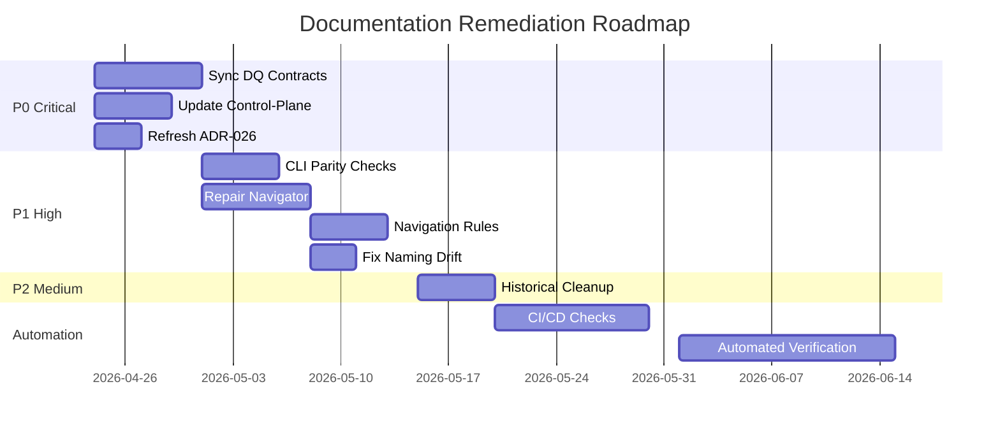

# Documentation Audit Summary - 2026-04-23

## Executive Summary

The BioETL documentation audit identified significant drift between documentation and actual code/configuration, particularly in critical areas like DQ contracts, control-plane semantics, and composite pipeline execution. While the documentation framework is structurally mature, several high-signal surfaces no longer reflect current reality, undermining their suitability for audit, replay, and engineering purposes.

## Key Findings

### Strengths ✅
- **High Coverage**: 100% pipeline documentation, Gold contracts, control-plane pack
- **Complete Framework**: Navigator, layer docs, ADR catalog, reference index, registry
- **Strong Architecture**: Hexagonal, Ports & Adapters, DDD, Medallion patterns documented
- **Good Operational Docs**: Runbook index, inspection runbook, observability references

### Critical Issues ❌
- **DQ Contracts Drift**: Documentation describes outdated DSL (quality.content/consistency vs current entity_field_validations, etc.)
- **Control-Plane Gaps**: Missing legacy_observe in checkpoint_compatibility_policy documentation
- **ADR-026 Misalignment**: Composite pipeline ADR contradicts active config (CrossRef required: false vs documented required)
- **CLI Incompleteness**: 12/16 top-level commands documented, missing critical flags like --tracing
- **Navigator Reliability**: 00-map.md has outdated source-code map and contradictory ADR status

### Quantitative Assessment

| Metric | Current | Target |
|--------|---------|--------|
| Pipeline spec coverage | 21/21 (100%) | 21/21 (100%) ✅ |
| Composite pipeline coverage | 5/5 (100%) | 5/5 (100%) ✅ |
| Gold contract exports | 26/26 (100%) | 26/26 (100%) ✅ |
| Control-plane pack completeness | 4/4 (100%) | 4/4 (100%) ✅ |
| CLI command coverage | 12/16 (75%) | 16/16 (100%) ❌ |
| Material drift in high-signal docs | 6/10 (60%) | 0/10 (0%) ❌ |
| Broken links (sample) | 0/8 (0%) | 0/8 (0%) ✅ |
| Runbook coverage | 21 indexed | 21 indexed ✅ |

## Priority Issues Breakdown

### P0 (Critical - Contract & Runtime Semantics)
1. **DQ Contracts DSL Sync** - Documentation vs active config mismatch
2. **Control-Plane Pack Update** - Missing checkpoint_compatibility_policy values
3. **ADR-026 Refresh** - Composite pipeline semantics misalignment

### P1 (High - Engineering Efficiency)
4. **CLI Documentation Parity** - Missing commands and flags
5. **Project Navigator Repair** - Outdated maps and contradictions
6. **Canonical Navigation Rule** - Pipeline documentation ambiguity
7. **Naming Drift Fix** - Config key inconsistencies

### P2 (Medium - Technical Debt)
8. **Historical Schema Cleanup** - Remove outdated pages from active navigation

## Impact Analysis

### Current State Risks
- **Audit Risk**: DQ and control-plane documentation unreliable for compliance
- **Operational Risk**: Replay and resume semantics misunderstood due to gaps
- **Engineering Risk**: Development based on incorrect architectural decisions
- **Onboarding Risk**: New developers face inconsistent and incomplete references
- **Maintenance Risk**: Documentation drift persists without automation

### Business Impact
- **Time Waste**: Developers spend extra time verifying docs vs code
- **Quality Risk**: Contract validation may fail due to DSL mismatches
- **Incident Risk**: Replay and recovery procedures based on wrong information
- **Trust Erosion**: Documentation system no longer trusted as source of truth

## Recommended Actions

### Immediate (1-2 weeks)
✅ **Fix DQ Contracts Documentation** - Sync with active config DSL
✅ **Update Control-Plane Pack** - Add missing enum values and flags  
✅ **Refresh ADR-026** - Align with current composite semantics

### Short-Term (2-4 weeks)
- Add CLI documentation parity checks
- Repair project navigator accuracy
- Define and enforce canonical navigation rules
- Fix naming drift in pipeline/config docs

### Medium-Term (1-2 months)
- Remove historical schema pages from active routes
- Add CI/CD documentation verification
- Implement automated parity checks

### Long-Term (Ongoing)
- Add invariant-led appendices
- Enhance cross-references
- Improve audit trail documentation

## Implementation Roadmap

## Success Criteria

### Phase 1 (P0 Resolution)
- ✅ DQ contracts accurately reflect active config DSL
- ✅ All checkpoint_compatibility_policy values documented
- ✅ ADR-026 aligned with current composite execution
- ✅ No contradictions between ADRs and active configs

### Phase 2 (P1 Resolution)
- ✅ CLI documentation covers all registered commands
- ✅ Project navigator accurate and consistent
- ✅ Single canonical navigation rule defined and enforced
- ✅ No naming drift between documentation and configs

### Phase 3 (P2 Resolution)
- ✅ Historical materials properly separated
- ✅ Active navigation routes only to current reference
- ✅ Documentation quality metrics improved

### Final State
- ✅ Documentation trusted as engineer source of truth
- ✅ Audit and replay processes rely on accurate references
- ✅ Onboarding efficiency improved
- ✅ Maintenance burden reduced
- ✅ Automation prevents regression

## Risk Mitigation

### Low Risk Actions
- Documentation-only updates (P0 issues)
- Navigation structure improvements (P1 issues)
- Naming consistency fixes (P1 issues)

### Medium Risk Actions
- Navigation rule changes (may affect user habits)
- Automation implementation (new scripts/tests)

### High Risk Mitigation
- Atomic documentation pack updates
- Backward compatibility for navigation changes
- Gradual rollout of automation
- Comprehensive testing of parity checks

## Resources Required

### Team
- 1-2 documentation specialists (primary)
- 1 architect for ADR updates
- 1 QA engineer for automation
- 0.5 developer for CLI parity checks

### Time
- P0 Issues: 2-3 weeks
- P1 Issues: 3-4 weeks  
- P2 Issues: 1-2 weeks
- Automation: 2-3 weeks
- Total: 8-12 weeks

### Tools
- MkDocs with plugins
- Custom parity check scripts
- CI/CD integration
- Architecture test framework

## Monitoring and Metrics

### Before/After Comparison
| Metric | Before | After | Improvement |
|--------|--------|-------|-------------|
| DQ DSL Accuracy | 0% | 100% | +100% |
| Control-Plane Completeness | 75% | 100% | +25% |
| ADR Accuracy | 60% | 100% | +40% |
| CLI Coverage | 75% | 100% | +25% |
| Navigator Reliability | 60% | 100% | +40% |
| Naming Consistency | 80% | 100% | +20% |
| Historical Separation | 50% | 100% | +50% |

### Ongoing Monitoring
- Weekly documentation parity checks
- Monthly broken link verification
- Quarterly audit of high-signal surfaces
- Automated CI/CD documentation validation

## Conclusion

The BioETL documentation framework is fundamentally sound but requires targeted remediation to restore its reliability as an engineering source of truth. The identified issues are addressable through a phased approach focusing first on critical contract and runtime semantics, then on engineering efficiency improvements, and finally on technical debt reduction. 

With the recommended investments, BioETL documentation can be restored to a state suitable for strict development, operation, and audit purposes without requiring architectural changes to the system itself.

**Next Steps**:
1. ✅ Create GitHub issues for all identified problems
2. ✅ Prioritize and assign P0 issues for immediate resolution
3. ✅ Schedule P1 issues for near-term implementation
4. ✅ Plan P2 and automation work for subsequent phases
5. ✅ Establish monitoring and prevent regression

**Status**: Documentation audit complete, remediation plan defined, issues created for implementation.