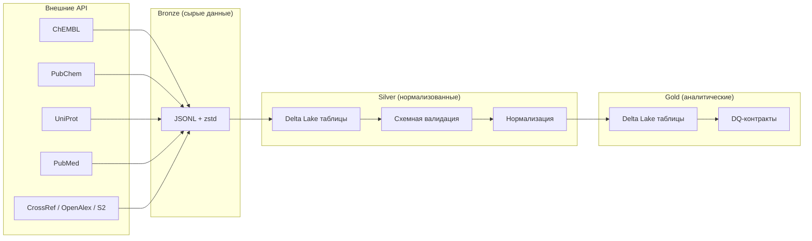

# Medallion-архитектура данных

BioETL использует **медальонную архитектуру** (Medallion Architecture) — трёхуровневый подход к организации потока данных, обеспечивающий поэтапное повышение качества и готовности данных к анализу.

---

## Три уровня данных

### Bronze (Бронза) — сырые данные

- **Формат:** JSONL + zstd-сжатие
- **Источник:** ответы от внешних API (ChEMBL, PubChem, UniProt и др.)
- **Характеристики:**
  - Данные сохраняются «как есть», без преобразований
  - Каждая запись содержит метаданные: timestamp, run_id, источник
  - Служит архивом для воспроизводимости и аудита
  - Поддержка инкрементальных и полных загрузок

### Silver (Серебро) — нормализованные данные

- **Формат:** Delta Lake таблицы
- **Характеристики:**
  - Схемная валидация через Pandera DataFrameModel
  - Нормализация данных через профили (даты, авторы, страницы и др.)
  - Дедупликация по content hash (хеш содержимого)
  - SCD Type 2 (Slowly Changing Dimensions) для отслеживания исторических изменений
  - ACID-транзакции при записи

### Gold (Золото) — аналитические данные

- **Формат:** Delta Lake таблицы
- **Характеристики:**
  - Строгая валидация по DQ-контрактам (Data Quality — контроль качества данных)
  - Пороговые проверки: soft threshold (предупреждение) и hard threshold (отказ батча)
  - Версионированные контракты качества
  - Данные готовы для анализа и downstream-потребителей

---

## Диаграмма потока данных

---

## Механизмы качества данных

| Этап | Механизм | Описание |
|------|----------|----------|
| Bronze → Silver | Схемная валидация | Проверка структуры данных через Pandera DataFrameModel |
| Bronze → Silver | Нормализация | Приведение дат, авторов, страниц к каноническому формату |
| Bronze → Silver | Дедупликация | Content hash для обнаружения дубликатов |
| Silver → Gold | DQ-контракты | Пороговые проверки качества (soft/hard threshold) |
| Silver → Gold | Строгая валидация | Gold-схемы с дополнительными ограничениями |
| Все этапы | Карантин | Dead-Letter Queue для записей, не прошедших валидацию |

---

## Связанные страницы

- [[Провайдеры-данных]] — источники данных
- [[Конфигурация]] — настройки пайплайнов и DQ-порогов
- [[ADR-реестр]] — ADR-002 (Medallion Architecture), ADR-018 (Строгая валидация Gold-схем), ADR-045 (DQ Contract System)
