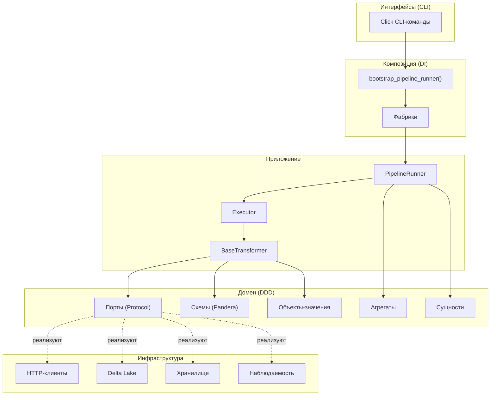

# Архитектура

BioETL построен на основе **гексагональной архитектуры** (Hexagonal Architecture), также известной как Ports & Adapters, в сочетании с паттернами **DDD** (Domain-Driven Design — предметно-ориентированное проектирование).

Такой подход обеспечивает чёткое разделение бизнес-логики и инфраструктурных зависимостей, позволяя заменять адаптеры (HTTP-клиенты, хранилища, системы мониторинга) без изменения доменного кода.

---

## Пять слоёв системы

### 1. Interfaces (Интерфейсы)

**Модуль:** `bioetl.interfaces.cli`

Слой точек входа в систему. Содержит CLI-команды на базе Click для запуска пайплайнов, инспекции карантина, управления чекпоинтами и других операций.

### 2. Composition (Композиция)

**Модуль:** `bioetl.composition`

Корень внедрения зависимостей (Dependency Injection Root). Отвечает за сборку системы: создание фабрик, связывание портов с адаптерами, bootstrap пайплайнов. Содержит точки входа (`entrypoints.py`), API-фасады (`execution_api.py`, `services_api.py`, `resources_api.py`) и построители рантайма.

### 3. Application (Приложение)

**Модуль:** `bioetl.application`

Слой оркестрации. Содержит `PipelineRunner`, исполнители батчей, трансформеры и сервисы жизненного цикла. Управляет последовательностью этапов пайплайна: предварительная проверка (preflight), извлечение данных, трансформация, запись и постобработка.

### 4. Domain (Домен)

**Модуль:** `bioetl.domain`

Чистая бизнес-логика без зависимостей от I/O. Содержит DDD-компоненты: порты (Protocol-интерфейсы), агрегаты, объекты-значения, сущности, схемы валидации (Pandera). Подробнее — на странице [[Доменный-слой]].

### 5. Infrastructure (Инфраструктура)

**Модуль:** `bioetl.infrastructure`

Конкретные реализации портов — адаптеры. Включает HTTP-клиенты для внешних API (ChEMBL, PubChem, UniProt и др.), хранилища (Bronze/Silver/Gold), систему блокировок (MemoryLock) и адаптеры наблюдаемости (метрики, трассировка, логирование).

---

## Диаграмма взаимодействия слоёв

---

## Правила зависимостей

Зависимости направлены строго **внутрь** — от внешних слоёв к внутренним:

- **Interfaces** → Composition → Application → Domain
- **Infrastructure** → реализует порты из Domain
- **Domain** не зависит ни от одного другого слоя (чистая логика)

Инфраструктурные адаптеры знают о доменных портах, но домен не знает о конкретных реализациях — это обеспечивается через Protocol-интерфейсы и Dependency Injection.

---

## Связанные страницы

- [[Доменный-слой]] — подробнее о DDD-паттернах
- [[Medallion-архитектура-данных]] — поток данных через слои Bronze/Silver/Gold
- [[ADR-реестр]] — архитектурные решения
